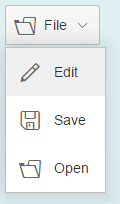
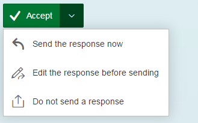
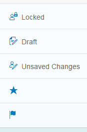
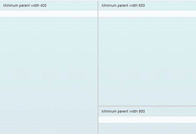
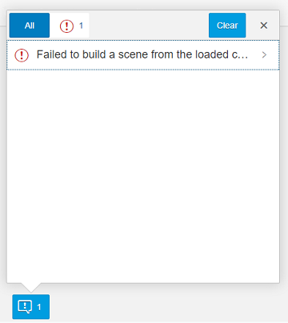
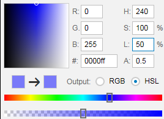
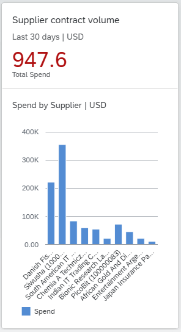
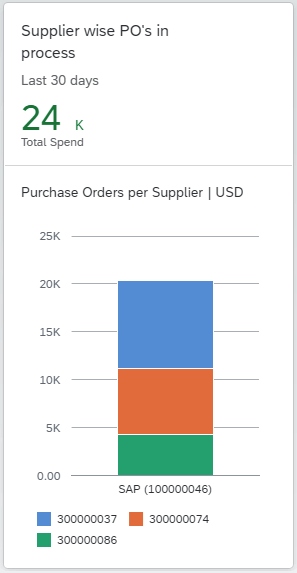
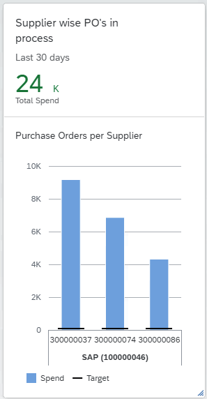

<!-- loiof218918b20e54cadb23e5e0b5bd9f9bb -->

# What's New in SAPUI5 1.38

With this release SAPUI5 is upgraded from version 1.36 to 1.38.

****

<table>
<tr>
<th valign="top">

Version

</th>
<th valign="top">

Type

</th>
<th valign="top">

Category

</th>
<th valign="top">

Title

</th>
<th valign="top">

Description

</th>
<th valign="top">

Action

</th>
<th valign="top">

Available as of

</th>
</tr>
<tr>
<td valign="top">

1.38 

</td>
<td valign="top">

Changed 

</td>
<td valign="top">

User Documentation 

</td>
<td valign="top">

**Improved Documentation** 

</td>
<td valign="top">

**Improved Documentation**

Thanks a lot to all of you who have used the Demo Kit feedback function! We have received lots of comments, many of which regarding our tutorials, and are continuously improving the documentation based on your findings.

Please carry on giving us your feedback: even though we cannot update the documentation straight away, your feedback will be considered in the next version!

New or reworked documentation chapters that are not mentioned in the following sections:

-   Chapter [Routing and Navigation](../04_Essentials/routing-and-navigation-3d18f20.md) is now updated and reworked.

Changed•User Documentation•Info Only•1.38

</td>
<td valign="top">

Info Only

</td>
<td valign="top">

2016-06-29

</td>
</tr>
<tr>
<td valign="top">

1.38 

</td>
<td valign="top">

Deprecated 

</td>
<td valign="top">

Feature 

</td>
<td valign="top">

**Deprecated Themes and Libraries** 

</td>
<td valign="top">

**Deprecated Themes and Libraries**

The following libraries are deprecated as of this version:

-   `sap.ui.commons`

-   `sap.ui.ux3`

-   `sap.makit`

The following themes are also deprecated as of this version:

-   `sap_ux`

-   `sap_platinum`

-   `sap_goldreflection`

For more information, see [Deprecated Themes and Libraries](../02_Read-Me-First/deprecated-themes-and-libraries-a87ca84.md).

Deprecated•Feature•Info Only•1.38

</td>
<td valign="top">

Info Only 

</td>
<td valign="top">

2016-06-29

</td>
</tr>
<tr>
<td valign="top">

1.38 

</td>
<td valign="top">

Changed 

</td>
<td valign="top">

Announcement 

</td>
<td valign="top">

**jQuery Upgraded to Version 2.2.3** 

</td>
<td valign="top">

**jQuery Upgraded to Version 2.2.3**

jQuery has been upgraded to version 2.2.3. This upgrade may have an impact on apps developed with SAPUI5.

Changed•Announcement•Info Only•1.38

</td>
<td valign="top">

Info Only 

</td>
<td valign="top">

2016-06-29

</td>
</tr>
<tr>
<td valign="top">

1.38 

</td>
<td valign="top">

New 

</td>
<td valign="top">

Feature 

</td>
<td valign="top">

**Icon Explorer** 

</td>
<td valign="top">

**Icon Explorer**

We have 46 new icons, and some existing icons have been redesigned - check the [Icon Explorer](https://ui5.sap.com/test-resources/sap/m/demokit/iconExplorer/webapp/index.html) in the Demo Kit for details.

New•Feature•Info Only•1.38

</td>
<td valign="top">

Info Only 

</td>
<td valign="top">

2016-06-29

</td>
</tr>
<tr>
<td valign="top">

1.38 

</td>
<td valign="top">

New 

</td>
<td valign="top">

Feature 

</td>
<td valign="top">

**Multiple preprocessors for XML views** 

</td>
<td valign="top">

**Multiple preprocessors for XML views**

We have enhanced the XML view so that it is now capable of running more than one preprocessor per hook. Additionally, the new hook `viewxml` has been introduced. For more information, see [Preprocessing XML Views](../04_Essentials/preprocessing-xml-views-48b81b9.md).

New•Feature•Info Only•1.38

</td>
<td valign="top">

Info Only 

</td>
<td valign="top">

2016-06-29

</td>
</tr>
<tr>
<td valign="top">

1.38 

</td>
<td valign="top">

New 

</td>
<td valign="top">

Feature 

</td>
<td valign="top">

**SAPUI5 OData V4 model** 

</td>
<td valign="top">

**SAPUI5 OData V4 model**

We are providing an initial version of the SAPUI5 OData V4 Model. This model supports the following:

-   Read access

-   Updating properties of OData entities via two-way-binding

-   Operation \(function and action\) execution

-   Grouping data requests in a batch request

-   Server-side sorting and filtering

> ### Restriction:  
> This is the first version of the SAPUI5 OData V4 model. Due to its limited feature scope, we recommend you do not use this release to develop applications that are to be used in production systems. Please look at the detailed documentation of the features, as certain parts of a feature may be missing which you might expect as given. While our intention was to be compatible with existing controls, existing controls might not work due to small incompatibilities compared to `sap.ui.model.odata.(v2.)ODataModel`, or due to missing features in the model. Up to now, only limited tests with controls have been done with the SAPUI5 OData V4 model. The interface for applications has been changed to make usage of the model easier and more efficient. A summary of these changes is documented in the section [Changes Compared to OData V2 Model](../04_Essentials/changes-compared-to-odata-v2-model-abd4d7c.md).

For more information, see [OData V4 Model](../04_Essentials/odata-v4-model-5de13cf.md), the [API Reference](https://ui5.sap.com/#/api/sap.ui.model.odata.v4), and the [Samples](https://ui5.sap.com/#/entity/sap.ui.model.odata.v4.ODataModel).

New•Feature•Info Only•1.38

</td>
<td valign="top">

Info Only 

</td>
<td valign="top">

2016-06-29

</td>
</tr>
<tr>
<td valign="top">

1.38 

</td>
<td valign="top">

New 

</td>
<td valign="top">

Feature 

</td>
<td valign="top">

**Smart Controls** 

</td>
<td valign="top">

**Smart Controls**

The **annotations** that are used by smart controls are now shown in the API Reference and are also explained in more detail. For more information, see the documentation for the relevant controls in the API Reference for [API Reference: `sap.ui.comp`.](https://ui5.sap.com/#/api/sap.ui.comp)

New•Feature•Info Only•1.38

</td>
<td valign="top">

Info Only 

</td>
<td valign="top">

2016-06-29

</td>
</tr>
<tr>
<td valign="top">

1.38 

</td>
<td valign="top">

New 

</td>
<td valign="top">

Control 

</td>
<td valign="top">

**`sap.m.FormattedText`** 

</td>
<td valign="top">

**`sap.m.FormattedText`**

You can use this control to display formatted texts in HTML format.

For more information, see the [API Reference](https://ui5.sap.com/#/api/sap.m.FormattedText) and the [Samples](https://ui5.sap.com/#/entity/sap.m.FormattedText).

New•Control•Info Only•1.38

</td>
<td valign="top">

Info Only 

</td>
<td valign="top">

2016-06-29

</td>
</tr>
<tr>
<td valign="top">

1.38 

</td>
<td valign="top">

New 

</td>
<td valign="top">

Control 

</td>
<td valign="top">

**`sap.m.MenuButton`** 

</td>
<td valign="top">

**`sap.m.MenuButton`**

The control opens a hierarchical menu and enables quick triggering of the last action of the menu item selected. In `Regular` mode it always opens the menu, whereas in `Split` mode it can be also used directly as a button to trigger the currently displayed menu item’s action. In `Split` mode it can display either the default menu item or the last selected one.

-   Regular Mode

    

-   Split Mode

    

For more information, see the [API Reference](https://ui5.sap.com/#/api/sap.m.MenuButton) and the [Sample](https://ui5.sap.com/#/entity/sap.m.MenuButton/sample/sap.m.sample.MenuButton).

New•Control•Info Only•1.38

</td>
<td valign="top">

Info Only 

</td>
<td valign="top">

2016-06-29

</td>
</tr>
<tr>
<td valign="top">

1.38 

</td>
<td valign="top">

New 

</td>
<td valign="top">

Control 

</td>
<td valign="top">

**`sap.m.ObjectMarker`** 

</td>
<td valign="top">

**`sap.m.ObjectMarker`**

The `ObjectMarker` control represents the status of an object with icon and/or text. It can be interactive \(as a link\) or non-interactive. It has the following predefined types:

-   `Flagged`

-   `Favorite`

-   `Draft`

-   `Locked`

-   `Unsaved`

An object might have multiple `ObjectMarker`s at the same time but the editing states \(`Locked`, `Draft`, and `Unsaved`\) are mutually exclusive.

For more information, see the [API Reference](https://ui5.sap.com/#/api/sap.m.ObjectMarker) and the [Samples](https://ui5.sap.com/#/entity/sap.m.ObjectMarker).

New•Control•Info Only•1.38

</td>
<td valign="top">

Info Only 

</td>
<td valign="top">

2016-06-29

</td>
</tr>
<tr>
<td valign="top">

1.38 

</td>
<td valign="top">

New 

</td>
<td valign="top">

Control 

</td>
<td valign="top">

**`sap.m.RangeSlider`** 

</td>
<td valign="top">

**`sap.m.RangeSlider`**

**`sap.m.RangeSlider`** is a new input control that is used to select a range of values. The `RangeSlider` has two slider handles that can be moved along a predefined numerical range scale. This control extends the `sap.m.Slider` and introduces additional functionality.

New•Control•Info Only•1.38

</td>
<td valign="top">

Info Only 

</td>
<td valign="top">

2016-06-29

</td>
</tr>
<tr>
<td valign="top">

1.38 

</td>
<td valign="top">

New 

</td>
<td valign="top">

Control 

</td>
<td valign="top">

**`sap.m.StepInput`** 

</td>
<td valign="top">

**`sap.m.StepInput`**

The `StepInput` control allows the user to change the input value with a predefined step. The value can be changed using the increment/decrement buttons or keys on the keyboard. On the desktop, when using the keyboard [PgUp\] and [PgDn\] keys, the value increases/decreases two steps at a time.

For more information, see the [API Reference](https://ui5.sap.com/#/api/sap.m.StepInput) and the [Samples](https://ui5.sap.com/#/entity/sap.m.StepInput).

New•Control•Info Only•1.38

</td>
<td valign="top">

Info Only 

</td>
<td valign="top">

2016-06-29

</td>
</tr>
<tr>
<td valign="top">

1.38 

</td>
<td valign="top">

New 

</td>
<td valign="top">

Control 

</td>
<td valign="top">

**`sap.ui.comp.smartmicrohart.SmartMicroChart`** 

</td>
<td valign="top">

**`sap.ui.comp.smartmicrohart.SmartMicroChart`**

This control is used to create different types of micro charts based on OData metadata. With this control, you can define annotations once for different micro chart types. The `SmartMicroChart` control contains a wrapper that interprets the chart type of the `Chart` annotation and delegates this information to the corresponding smart micro charts, `SmartAreaMicroChart` or `SmartBulletMicroChart` control.

For more information, see the [API Reference](https://ui5.sap.com/#/api/sap.ui.comp.smartmicrochart) and the [Samples](https://ui5.sap.com/#/entity/sap.ui.comp.smartmicrochart.SmartMicroChart).

New•Control•Info Only•1.38

</td>
<td valign="top">

Info Only 

</td>
<td valign="top">

2016-06-29

</td>
</tr>
<tr>
<td valign="top">

1.38 

</td>
<td valign="top">

New 

</td>
<td valign="top">

Control 

</td>
<td valign="top">

**`sap.ui.comp.smartmicrochart.SmartBulletMicroChart`** 

</td>
<td valign="top">

**`sap.ui.comp.smartmicrochart.SmartBulletMicroChart`**

The `SmartBulletMicroChart` control creates a `sap.suite.ui.microchart.BulletMicroChart` based on OData metadata and the user-specific implementation.

For more information, see the [API Reference](https://ui5.sap.com/#/api/sap.ui.comp.smartmicrochart.SmartBulletMicroChart) and the [Samples](https://ui5.sap.com/#/entity/sap.ui.comp.smartmicrochart.SmartBulletMicroChart).

New•Control•Info Only•1.38

</td>
<td valign="top">

Info Only 

</td>
<td valign="top">

2016-06-29

</td>
</tr>
<tr>
<td valign="top">

1.38 

</td>
<td valign="top">

New 

</td>
<td valign="top">

Control 

</td>
<td valign="top">

**`sap.ui.comp.SmartMicroChart.SmartAreaMicroChart`** 

</td>
<td valign="top">

**`sap.ui.comp.SmartMicroChart.SmartAreaMicroChart`**

The `SmartAreaMicroChart` control creates a `sap.suite.ui.microchart.AreaMicroChart` based on OData metadata annotations and the user-specific configuration.

For more information, see the [API Reference](https://ui5.sap.com//#/api/sap.ui.comp.smartmicrochart.SmartAreaMicroChart) and the [Samples](https://ui5.sap.com/#/entity/sap.ui.comp.smartmicrochart.SmartBulletMicroChart).

New•Control•Info Only•1.38

</td>
<td valign="top">

Info Only 

</td>
<td valign="top">

2016-06-29

</td>
</tr>
<tr>
<td valign="top">

1.38 

</td>
<td valign="top">

New 

</td>
<td valign="top">

Control 

</td>
<td valign="top">

**`sap.ui.layout.ResponsiveSplitter`** 

</td>
<td valign="top">

**`sap.ui.layout.ResponsiveSplitter`**

**`sap.ui.layout.ResponsiveSplitter`** is a layout control that is used to visually divide the content of its parent. The control is responsive and can adjust its contents to any screen size. On smaller screens, pagination is used to allow navigation to all splitter panes.

For more information, see the [API Reference](https://ui5.sap.com/#/api/sap.ui.layout.ResponsiveSplitter) and the [Samples](https://ui5.sap.com/#/entity/sap.ui.layout.ResponsiveSplitter).

New•Control•Info Only•1.38

</td>
<td valign="top">

Info Only 

</td>
<td valign="top">

2016-06-29

</td>
</tr>
<tr>
<td valign="top">

1.38 

</td>
<td valign="top">

New 

</td>
<td valign="top">

Control 

</td>
<td valign="top">

**Visual Interaction toolkit \(`sap.ui.vk` library** 

</td>
<td valign="top">

**Visual Interaction toolkit \(`sap.ui.vk` library**

The following controls have been added:

-   **`sap.ui.vk.LayerProxy`**: The `LayerProxy` control allows you to create a proxy object for a layer, so that you can work with that layer in the scene. For more information, see the [API Reference](https://ui5.sap.com/#/api/sap.ui.vk.LayerProxy).

-   **`sap.ui.vk.ProgressIndicator`**: The `ProgressIndicator` control allows you to add a progress bar that indicates the download and rendering progress of a file. For more information, see the [API Reference](https://ui5.sap.com/#/api/sap.ui.vk.ProgressIndicator).

    

-   **`sap.ui.vk.Notifications`**: The `Notifications` control allows you to add an icon in your application that displays the number of errors and warnings that may have resulted from loading a 2D image or 3D file. The icon can be clicked to display more information about the errors and warnings. For more information, see the [API Reference](https://ui5.sap.com/#/api/sap.ui.vk.Notifications).

    

New•Control•Info Only•1.38

</td>
<td valign="top">

Info Only 

</td>
<td valign="top">

2016-06-29

</td>
</tr>
<tr>
<td valign="top">

1.38 

</td>
<td valign="top">

Changed 

</td>
<td valign="top">

Feature 

</td>
<td valign="top">

**One page acceptance test \(OPA\)** 

</td>
<td valign="top">

**One page acceptance test \(OPA\)**

The `Press` and `EnterText` actions now support a larger number of controls and can now be executed on embedded controls by specifying the control suffix. For more information, see the API Reference for [`Press`](https://ui5.sap.com/#/api/sap.ui.test.actions.Press) and [`EnterText`](https://ui5.sap.com/#/api/sap.ui.test.actions.EnterText) and the [Sample](https://ui5.sap.com/#/entity/sap.ui.test.Opa5/sample/sap.ui.core.sample.OpaAction).

Changed•Feature•Info Only•1.38

</td>
<td valign="top">

Info Only 

</td>
<td valign="top">

2016-06-29

</td>
</tr>
<tr>
<td valign="top">

1.38 

</td>
<td valign="top">

Changed 

</td>
<td valign="top">

Feature 

</td>
<td valign="top">

**SAPUI5 application index** 

</td>
<td valign="top">

**SAPUI5 application index**

The index is now based on the layered repository and is updated automatically in most cases. For the other cases we recommend that you schedule the update report every 30 minutes using the default mode \(expiration period of 24 hours\). For more information, see [SAPUI5 Application Index](../05_Developing_Apps/sapui5-application-index-c5e7098.md).

Changed•Feature•Info Only•1.38

</td>
<td valign="top">

Info Only 

</td>
<td valign="top">

2016-06-29

</td>
</tr>
<tr>
<td valign="top">

1.38 

</td>
<td valign="top">

Changed 

</td>
<td valign="top">

Control 

</td>
<td valign="top">

**`sap.m.ComboBox`** 

</td>
<td valign="top">

**`sap.m.ComboBox`**

-   Is now supported on mobile phones. The list of available values will open as a full-screen dialog on small devices.

-   The new `loadItem` event makes it possible to defer initialization of items in the `ComboBox` dropdown list control to a point in time when the items are required. This helps to improve performance.

    For more information, see the [Samples](https://ui5.sap.com/#/entity/sap.m.ComboBox).

Changed•Control•Info Only•1.38

</td>
<td valign="top">

Info Only 

</td>
<td valign="top">

2016-06-29

</td>
</tr>
<tr>
<td valign="top">

1.38 

</td>
<td valign="top">

Changed 

</td>
<td valign="top">

Control 

</td>
<td valign="top">

**`sap.m.DatePicker / sap.m.DateTimePicker / sap.m.PlanningCalendar / sap.ui.unified.Calendar`** 

</td>
<td valign="top">

**`sap.m.DatePicker / sap.m.DateTimePicker / sap.m.PlanningCalendar / sap.ui.unified.Calendar`**

You can now set minimum and maximum dates to limit the range of available dates.

For more information, see the API Reference for [`sap.m.DatePicker`](https://ui5.sap.com/#/api/sap.m.DatePicker), [`sap.m.DateTimePicker`](https://ui5.sap.com/#/api/sap.m.DateTimePicker), [`sap.m.PlanningCalendar`](https://ui5.sap.com/#/api/sap.m.PlanningCalendar), and [`sap.ui.unified.Calendar`](https://ui5.sap.com/#/api/sap.ui.unified.Calendar), and the samples for [`sap.m.DatePicker`](https://ui5.sap.com/#/entity/sap.m.DatePicker/sample/sap.m.sample.DatePicker), [`sap.m.PlanningCalendar`](https://ui5.sap.com/#/entity/sap.m.PlanningCalendar/sample/sap.m.sample.PlanningCalendarMinMax), and [`sap.ui.unified.Calendar`](https://ui5.sap.com/#/entity/sap.ui.unified.Calendar/sample/sap.ui.unified.sample.CalendarMinMax).

Changed•Control•Info Only•1.38

</td>
<td valign="top">

Info Only 

</td>
<td valign="top">

2016-06-29

</td>
</tr>
<tr>
<td valign="top">

1.38 

</td>
<td valign="top">

Changed 

</td>
<td valign="top">

Control 

</td>
<td valign="top">

**`sap.m.GenericTile`** 

</td>
<td valign="top">

**`sap.m.GenericTile`** 

The `GenericTile` control has a new responsive design that significantly improves the user experience, it has also been optimized for larger smartphones. The `GenericTile` adjusts its size to fit all the different display sizes of the current devices supported by SAPUI5 \(see [Browser and Platform Support](../02_Read-Me-First/browser-and-platform-support-74b59ef.md)\). The main changes are the tile size, font size, padding, the new `ImageContent` control, and new samples showing the variety of use cases for the `GenericTile`.

The `sap.m.ImageContent` control can be used to include images in a tile. It can be embedded in the content area of the `GenericTile` control.

For more information, see [Generic Tile](../10_More_About_Controls/generic-tile-a1998ec.md), the API Reference for [`sap.m.GenericTile`](https://ui5.sap.com/#/api/sap.m.GenericTile) and [`sap.m.ImageContent`](https://ui5.sap.com/#/api/sap.m.ImageContent), and the samples for [`GenericTile`](https://ui5.sap.com/#/entity/sap.m.GenericTile) and [`ImageContent`](https://ui5.sap.com/#/entity/sap.m.ImageContent).

Changed•Control•Info Only•1.38

</td>
<td valign="top">

Info Only 

</td>
<td valign="top">

2016-06-29

</td>
</tr>
<tr>
<td valign="top">

1.38 

</td>
<td valign="top">

Changed 

</td>
<td valign="top">

Control 

</td>
<td valign="top">

**`sap.m.List / sap.m.Table`** 

</td>
<td valign="top">

**`sap.m.List / sap.m.Table`**

The new `keyboardMode` property for the `List` and `Table` controls determines the keyboard handling for these controls. The `Navigation` value of the property enables a mode that allows you to navigate within a large number of items, for example, table cells, using the tab key, whereas the `Edit` mode can be used to edit a limited number of items.

Changed•Control•Info Only•1.38

</td>
<td valign="top">

Info Only 

</td>
<td valign="top">

2016-06-29

</td>
</tr>
<tr>
<td valign="top">

1.38 

</td>
<td valign="top">

Changed 

</td>
<td valign="top">

Control 

</td>
<td valign="top">

**`sap.m.MaskInput`** 

</td>
<td valign="top">

**`sap.m.MaskInput`**

You can now use escape characters in the `MaskInput` definition to be able to use the predefined rule characters as immutable ones.

Changed•Control•Info Only•1.38

</td>
<td valign="top">

Info Only 

</td>
<td valign="top">

2016-06-29

</td>
</tr>
<tr>
<td valign="top">

1.38 

</td>
<td valign="top">

Changed 

</td>
<td valign="top">

Control 

</td>
<td valign="top">

**`sap.m.MessagePopover`** 

</td>
<td valign="top">

**`sap.m.MessagePopover`**

**`sap.m.MessagePopover`** has been improved and can now be resized. Resizing is only possible when the `MessagePopover` is opened from the footer on a desktop.

Changed•Control•Info Only•1.38

</td>
<td valign="top">

Info Only 

</td>
<td valign="top">

2016-06-29

</td>
</tr>
<tr>
<td valign="top">

1.38 

</td>
<td valign="top">

Changed 

</td>
<td valign="top">

Control 

</td>
<td valign="top">

**`sap.m.NotificationListItem`** 

</td>
<td valign="top">

**`sap.m.NotificationListItem`**

The control has two improvements:

-   The control responsiveness is updated for better usability on large screens \(more than 640 pixels width\) – the buttons are now located on the right side of the text.

-   The *Show More* button for toggling expand/collapse mode can now be hidden with the use of the new property `hideShowMoreButton`.

For more information, see the [API Reference](https://ui5.sap.com/#/api/sap.m.NotificationListItem) and the [Samples](https://ui5.sap.com/#/entity/sap.m.NotificationListItem).

Changed•Control•Info Only•1.38

</td>
<td valign="top">

Info Only 

</td>
<td valign="top">

2016-06-29

</td>
</tr>
<tr>
<td valign="top">

1.38 

</td>
<td valign="top">

Changed 

</td>
<td valign="top">

Control 

</td>
<td valign="top">

**`sap.m.Popover`** 

</td>
<td valign="top">

**`sap.m.Popover`**

**`sap.m.Popover`** has four new values for its `PlacementType`:

-   `PreferredBottomOrFlip`

-   `PreferredLeftOrFlip`

-   `PreferredRightOrFlip`

-   `PreferredTopOrFlip`

They determine the preferred position of the `Popover` and how it behaves when there is insufficient space for it on the screen. These properties allow the `Popover` to flip over and cover some of the content below it.

For more information, see the [API Reference](https://ui5.sap.com/#/api/sap.m.PlacementType) and the [Samples](https://ui5.sap.com/#/entity/sap.m.PlacementType).

Changed•Control•Info Only•1.38

</td>
<td valign="top">

Info Only 

</td>
<td valign="top">

2016-06-29

</td>
</tr>
<tr>
<td valign="top">

1.38 

</td>
<td valign="top">

Changed 

</td>
<td valign="top">

Control 

</td>
<td valign="top">

**`sap.m.TextArea`** 

</td>
<td valign="top">

**`sap.m.TextArea`**

**`sap.m.TextArea`** can now grow and shrink to adapt to the entered text.

For more information, see the [API Reference](https://ui5.sap.com/#/api/sap.m.TextArea) and the [Sample](https://ui5.sap.com/#/entity/sap.m.TextArea/sample/sap.m.sample.TextAreaGrowing).

Changed•Control•Info Only•1.38

</td>
<td valign="top">

Info Only 

</td>
<td valign="top">

2016-06-29

</td>
</tr>
<tr>
<td valign="top">

1.38 

</td>
<td valign="top">

Changed 

</td>
<td valign="top">

Control 

</td>
<td valign="top">

**`sap.m.UploadCollection`** 

</td>
<td valign="top">

**`sap.m.UploadCollection`**

To upload a new version of a file to the `UploadCollection` list, the `openFileDialog` method is available. You can provide a pushbutton in the header area and if one entry in the `UploadCollection` list is selected, the API method will be called.

For more information, see the [API Reference](https://ui5.sap.com/#/api/sap.m.UploadCollection) and the [Sample](https://ui5.sap.com/#/entity/sap.m.UploadCollection).

Changed•Control•Info Only•1.38

</td>
<td valign="top">

Info Only 

</td>
<td valign="top">

2016-06-29

</td>
</tr>
<tr>
<td valign="top">

1.38 

</td>
<td valign="top">

Changed 

</td>
<td valign="top">

Control 

</td>
<td valign="top">

**`sap.m.ViewSettingsDialog`** 

</td>
<td valign="top">

**`sap.m.ViewSettingsDialog`**

The `ViewSettingsDialog` control now gives you the opportunity to modify filter detail page items on the fly with the help of the new event `filterDetailPageOpened`. This event is fired each time after the filter detail page is accessed, notifying the outside world that the page is loaded along with the information for which filter the respective details are displayed. This allows a handler to be attached that alters the filter detail items aggregation.

For more information, see the [API Reference](https://ui5.sap.com/#/api/sap.m.ViewSettingsDialog).

Changed•Control•Info Only•1.38

</td>
<td valign="top">

Info Only 

</td>
<td valign="top">

2016-06-29

</td>
</tr>
<tr>
<td valign="top">

1.38 

</td>
<td valign="top">

Changed 

</td>
<td valign="top">

Control 

</td>
<td valign="top">

**`sap.suite.ui.microchart`** 

</td>
<td valign="top">

**`sap.suite.ui.microchart`**

The controls now have a responsive design and can adapt their appearance and functions either to the devices they are used on or to the available space provided by the parent control.

For more information, see the [API Reference](https://ui5.sap.com/#/api/sap.suite.ui.microchart).

Changed•Control•Info Only•1.38

</td>
<td valign="top">

Info Only 

</td>
<td valign="top">

2016-06-29

</td>
</tr>
<tr>
<td valign="top">

1.38 

</td>
<td valign="top">

Changed 

</td>
<td valign="top">

Control 

</td>
<td valign="top">

**`sap.tnt.SideNavigation`** 

</td>
<td valign="top">

**`sap.tnt.SideNavigation`**

Root items with no children can now be opened with a single click when the `SideNavigation` control is in collapsed mode.

Changed•Control•Info Only•1.38

</td>
<td valign="top">

Info Only 

</td>
<td valign="top">

2016-06-29

</td>
</tr>
<tr>
<td valign="top">

1.38 

</td>
<td valign="top">

Changed 

</td>
<td valign="top">

Control 

</td>
<td valign="top">

**`sap.tnt.ToolPage`** 

</td>
<td valign="top">

**`sap.tnt.ToolPage`**

Animation is now added when expanding and collapsing the `SideNavigation` control within the `ToolPage`.

For more information, see the [Sample](https://ui5.sap.com/#/entity/sap.tnt.ToolPage/sample/sap.tnt.sample.ToolPage).

Changed•Control•Info Only•1.38

</td>
<td valign="top">

Info Only 

</td>
<td valign="top">

2016-06-29

</td>
</tr>
<tr>
<td valign="top">

1.38 

</td>
<td valign="top">

Changed 

</td>
<td valign="top">

Control 

</td>
<td valign="top">

**`sap.ui.commons.ColorPicker`** 

</td>
<td valign="top">

**`sap.ui.commons.ColorPicker`**

**`sap.ui.commons.ColorPicker`** supports HSL \(Hue Saturation and Lightness\) mode. This mode works better with modern browsers and it does not require intermediate conversion back to RGB. Additionally, there is a new input field for the `alpha` \(transparency\) value for more precise color definition.

Changed•Control•Info Only•1.38

</td>
<td valign="top">

Info Only 

</td>
<td valign="top">

2016-06-29

</td>
</tr>
<tr>
<td valign="top">

1.38 

</td>
<td valign="top">

Changed 

</td>
<td valign="top">

Control 

</td>
<td valign="top">

**`sap.ui.comp` \(Smart Controls\)** 

</td>
<td valign="top">

**`sap.ui.comp` \(Smart Controls\)**

-   **`sap.ui.comp.smartchart.SmartChart`**:The `SmartChart` control now offers two additional features that you can switch on if you want to use them. The control now provides the breadcrumb trail of a drilldown and also lets you drill upwards within that path.

    The control also provides a changed drilldown function: When you select one or more data points, the *Drill Down* button becomes a *Details* button. When you click this button, you will see more details related to the selected data. From here, you can also navigate to semantic objects, for example, to related apps.

    The usability of the chart type selection has been improved.

    For more information about this control, see the [API Reference](https://ui5.sap.com/#/api/sap.ui.comp.smartchart.SmartChart).

-   **`sap.ui.comp.smartform.SmartForm`**: You can now set an XL breakpoint for the `SmartForm` control as you could previously only with the `sap.m.Form`. `sap.ui.comp.smartform.Layout` now offers the properties `labelSpan` and `emptySpan` as well as columns and a breakpoint also for screens of extra-large sizes.

-   **`sap.ui.comp.smarttable.SmartTable`**:

    -   If you use the `SmartTable` control with a responsive table \(`sap.m.Table`\), and the columns contain a property annotated with `Criticality` that returns the `CriticalityType` annotation, an `ObjectStatus` control is used to display the status. The application using this control can control whether an icon is displayed by using the `CriticalityRepresentationType` annotation.

    -   If you use the `SmartTable` control with a responsive table \(`sap.m.Table`\), and the cells contain the URL of an image, the image will automatically be displayed in a default size of 3 rem using the `IsImageUrl` annotation.

    -   If you use the SmartTable control with a responsive table \(`sap.m.Table`\), and the columns contain a property annotated with the `SemanticKey` annotation, they will automatically be displayed as `sap.m.ObjectIdentifier`. The `TextArrangement` annotation controls whether the ID and the description are displayed as the title of the `ObjectIdentifier` control and in which order. In addition, if there is a link to `SemanticObject`, the `ObjectIdentifier` title will be clickable and display or navigate to the `SmartLink` targets.

    -   A new property `showFullScreenButton` allows you to expand the table to full screen mode using the respective toolbar button.

    -   The `SmartTable` control now allows you to show and follow `navigationProperty` fields for `EntityType` and automatically performs a `$expand` operation for these fields.

    -   If you group columns in the personalization of analytical tables, the grouping is now automatically added as a separate column \(*Show Field as Column* checkbox\). This allows you to see the grouped values for each row of the table.

    -   For measure columns within an analytical table, the total sum of a column is now persisted in the variant of a table.

    -   You can now create an additional title for the `SmartTable` control.

    For more information about this control, see the API Reference for [`sap.ui.comp.smarttable.SmartTable`](https://ui5.sap.com/#/api/sap.ui.comp.smarttable.SmartTable) and the samples for [`sap.ui.comp.smarttable.SmartTable`](https://ui5.sap.com/#/entity/sap.ui.comp.smarttable.SmartTable) and [`sap.m.P13nDialog`](https://ui5.sap.com/#/entity/sap.m.P13nDialog).

-   **`sap.ui.comp.filterbar.FilterBar`**:

    -   If you add new filters from the fields listed, they will now be automatically visible on the expanded filter bar. You no longer have to select the *Add to Filter Bar* checkbox.

    -   You can now create an additional title for the `FilterBar` control.

    For more information about this control, see the [API Reference](https://ui5.sap.com/#/api/sap.ui.comp.filterbar.FilterBar) and the [Samples](https://ui5.sap.com/#/entity/sap.ui.comp.filterbar.FilterBar).

-   **`sap.ui.comp.navpopover.SmartLink`**: If a `SmartLink` control has only one target, it will directly take you to the target of a link. In this case, the popover will not be displayed.

    For more information about this control, see the [API Reference](https://ui5.sap.com/#/api/sap.ui.comp.navpopover.SmartLink) and the [Samples](https://ui5.sap.com/#/entity/sap.ui.comp.navpopover.SmartLink).

-   **`sap.ui.comp.variants.VariantManagement`**:

    -   You can now change the behavior of the SAP-delivered standard variant and select *Execute on Select* in the *Manage Variants* dialog. This will fire the query automatically.

    -   A page variant of the `VariantManagement` control is now available that can handle the persistency of multiple smart controls and provides the variant management in a central place.

    For more information about this control, see the [API Reference](https://ui5.sap.com/#/api/sap.ui.comp.variants.VariantManagement) and the [Samples](https://ui5.sap.com/#/entity/sap.ui.comp.variants.VariantManagement).

For more information about smart controls, see [sap.ui.comp](../10_More_About_Controls/sap-ui-comp-0cbbeba.md).

Changed•Control•Info Only•1.38

</td>
<td valign="top">

Info Only 

</td>
<td valign="top">

2016-06-29

</td>
</tr>
<tr>
<td valign="top">

1.38 

</td>
<td valign="top">

Changed 

</td>
<td valign="top">

Control 

</td>
<td valign="top">

**`sap.ui.layout.Form / sap.ui.layout.SimpleForm`** 

</td>
<td valign="top">

**`sap.ui.layout.Form / sap.ui.layout.SimpleForm`**

You can now add a toolbar to a form container or the form itself.

For more information, see the [Sample](https://ui5.sap.com/#/entity/sap.ui.layout.form.Form/sample/sap.ui.layout.sample.FormToolbar).

Changed•Control•Info Only•1.38

</td>
<td valign="top">

Info Only 

</td>
<td valign="top">

2016-06-29

</td>
</tr>
<tr>
<td valign="top">

1.38 

</td>
<td valign="top">

Deleted 

</td>
<td valign="top">

Control 

</td>
<td valign="top">

**`sap.ui.table.DataTable`** 

</td>
<td valign="top">

**`sap.ui.table.DataTable`**

**`sap.ui.table.DataTable`** has been deleted.

Deleted•Control•Info Only•1.38

</td>
<td valign="top">

Info Only 

</td>
<td valign="top">

2016-06-29

</td>
</tr>
<tr>
<td valign="top">

1.38 

</td>
<td valign="top">

Changed 

</td>
<td valign="top">

Control 

</td>
<td valign="top">

**`sap.ui.table.TreeTable`** 

</td>
<td valign="top">

**`sap.ui.table.TreeTable`**

**`sap.ui.table.TreeTable`** now supports `AutoExpand` paging if it is bound to an OData model.

By setting `numberOfExpandedLevels` as a binding parameter \(e.g. in the `bindRows` call of the `TreeTable`\), you now can specify the initial expansion depth. This feature is only available for OData services exposing a property marked with the annotation `hierarchy-node-descendant-count-for`. This also means the service has to respect a `$filter` statement on the annotated `Level` property, and returns the entries sorted. You can find the specification for this and all other hierarchy annotations in the SAP Community Network under [SAP Annotations for OData Version 2.0](http://scn.sap.com/docs/DOC-44986).

Changed•Control•Info Only•1.38

</td>
<td valign="top">

Info Only 

</td>
<td valign="top">

2016-06-29

</td>
</tr>
<tr>
<td valign="top">

1.38 

</td>
<td valign="top">

Changed 

</td>
<td valign="top">

Control 

</td>
<td valign="top">

**`sap.ui.unified.Menu`** 

</td>
<td valign="top">

**`sap.ui.unified.Menu`**

To significantly increase the usability of `sap.ui.unified.Menu`, a delay has been added to the closing of submenus.

For more information, see the [Sample](https://ui5.sap.com/#/entity/sap.ui.unified.Menu/sample/sap.ui.unified.sample.MenuItemEventing).

Changed•Control•Info Only•1.38

</td>
<td valign="top">

Info Only 

</td>
<td valign="top">

2016-06-29

</td>
</tr>
<tr>
<td valign="top">

1.38 

</td>
<td valign="top">

Changed 

</td>
<td valign="top">

Control 

</td>
<td valign="top">

**`sap.ui.vk.NodeHierarchy`** 

</td>
<td valign="top">

**`sap.ui.vk.NodeHierarchy`**

The `NodeHierarchy` control now has a new method called `findNodesById`, which allows you to search for specific nodes in a 3D scene using the VE ID data in nodes as the search parameter. For more information, see the [API Reference](https://ui5.sap.com/#/api/sap.ui.vk.NodeHierarchy).

Changed•Control•Info Only•1.38

</td>
<td valign="top">

Info Only 

</td>
<td valign="top">

2016-06-29

</td>
</tr>
<tr>
<td valign="top">

1.38 

</td>
<td valign="top">

Changed 

</td>
<td valign="top">

Control 

</td>
<td valign="top">

**`sap.uxap.ObjectPageHeader`** 

</td>
<td valign="top">

**`sap.uxap.ObjectPageHeader`**

`ObjectPageHeader` can be integrated with the `SideContent` scenario. A new `sideContentButton` aggregation has been added. This aggregation has a new button, which appears after the actions buttons and triggers opening the side content for additional information.

For more information, see the [Sample](https://ui5.sap.com/#/entity/sap.uxap.ObjectPageHeader/sample/sap.uxap.sample.ObjectPageDynamicSideContentBtn).

Changed•Control•Info Only•1.38

</td>
<td valign="top">

Info Only 

</td>
<td valign="top">

2016-06-29

</td>
</tr>
<tr>
<td valign="top">

1.38 

</td>
<td valign="top">

Changed 

</td>
<td valign="top">

Control 

</td>
<td valign="top">

**`sap.uxap.ObjectPageLayout`** 

</td>
<td valign="top">

**`sap.uxap.ObjectPageLayout`**

-   It supports scrolling to a particular section, based on its ID. This allows easier access to all parts of the application and consistent navigation back to a previous position within the `ObjectPage`.

    For more information, see the [Sample](https://ui5.sap.com/#/entity/sap.uxap.ObjectPageLayout/sample/sap.uxap.sample.ObjectPageLazyLoadingWithoutBlocks).

-   Performance is improved for the use case with no `Blocks`. The `ObjectPage` now supports lazy loading with the stashed property of the `ObjectPageLazyLoader`. As a result, you avoid the additional creation of XML views for each `Block`.

    For more information, see [Object Page Scrolling](../10_More_About_Controls/object-page-scrolling-bc410e9.md) and the [Sample](https://ui5.sap.com/#/entity/sap.uxap.ObjectPageLayout/sample/sap.uxap.sample.ObjectPageState).

Changed•Control•Info Only•1.38

</td>
<td valign="top">

Info Only 

</td>
<td valign="top">

2016-06-29

</td>
</tr>
<tr>
<td valign="top">

1.38 

</td>
<td valign="top">

Changed 

</td>
<td valign="top">

SAP Fiori Elements 

</td>
<td valign="top">

**Smart Templates** 

</td>
<td valign="top">

**Smart Templates**

General Features:

-   Actions for line items in tables

    You can now enable certain types of actions within a line item column in a table in both the list report and object page views. Actions you can enable at the line item level include those that trigger a back-end call through the OData service, for example, approve or unblock, or those that trigger navigation, for example, to a different application.

-   Rating indicator in tables

    You can now include a read-only rating indicator in the list report or in a table in the object page view. This allows you to visually represent the value of a field with the corresponding number of stars \(configurable\). This field can indicate, for example, a rating or classification for a specific object or item.

-   Progress indicator in tables

    You can now include a progress indicator in the list report or in a table in the object page view. This allows users to visualize the level of completion of, for example, a project or a goal. Optionally, you can set up the following:

    -   Whether a single color is used in the progress bar \(default: blue\), or multiple colors are used to indicate criticality \(example: red to indicate that stock levels are very low\)

    -   The value used to calculate the percentage value displayed

-   External navigation

    You can now enable navigation from line items in a table to a different app using intent-based navigation. This feature is available for the list report and tables in the object page view.

List Report View:

-   Deletion of one or more items

    Users can now select and delete one or more items directly from the list report view.

-   Images in tables

    You can now display images in table columns.

-   Harmonized variant management option

    Variants created by the user for the smart filter bar and smart table can now be saved together using the variant for the smart filter bar.

-   Disabling editing status filter

    You can disable the editing status filter for the list report.

Object Page View:

-   Image expansion

    End users of your app can now click an image within the object page to see an expanded view of the image.

-   Plain text facet in object page header

    You can now add a plain text facet to the header area of an object page. The plain text facet allows you to add a single field or block of text to the header.

-   Smart chart in object page

    You can now add a smart chart control to a facet in an object page. You specify the type of smart chart and, if desired, other chart data to be rendered in your app through annotations in your service.

-   Editable header

    You can now make fields in the object page header editable in edit mode by setting a parameter in the app descriptor.

-   Subsections: *See more* and *See less*

    You can now hide subsections in facets and provide a *See more* / *See less* link for the facet.

Overview Pages have been enhanced with the following features:

-   **Selection fields**: With the `UI.SelectionFields` configuration in the annotations file, you can define the filter you want to add to the filter bar by default.

-   **Data points**: Now, you can display as many data points as are present in the backend, in card charts. To limit the number of records, adjust the value of the `UI.PresentationVariant.MaxItems` property in the annotion file \(donut charts use all records, so this limitation isn't needed\).

-   You can now create the following cards:

    -   Column Chart

        Data, such as total product sales over a period of years, can be displayed in a column chart. The number of columns is equal to the number of measures in the annotation file.

        

    -   Stacked Column Chart

        A stacked column chart is similar to the column chart; however, it visualizes multiple measures or dimensions by stacking the data on top of each other in a column.

        

    -   Vertical Bullet Chart

        With a vertical bullet chart, you can visualize a single measure and compare it to a defined reference value, such as a target unit of measure. This target is displayed a solid black line.

        

    For more information on these charts, see [Analytical Cards](../06_SAP_Fiori_Elements/analytical-cards-d7b0b42.md).

To improve your user experience with overview pages, we've also made several improvements:

-   **Axis titles**: The x- and y-axis of analytic chart cards won't be shown \(except with a bubble chart\) if you use a header for your card. If your header contains a good description of the card, then the x- and y-axis descriptions are superfluous. Of course, you'll see both the x- and y-axis if you choose to omit the header.

-   **Quick view cards**:
    -   Interaction buttons in the footer area are now part of `sap.m.OverflowToolbar`. With this, the quick view cards can now display action buttons based on the width of the card. If more actions are necessary, they will be shown on the overflow toolbar.

    -   Since the height of each quick view card is aligned with the content of the card, this means cards can have different sizes. If there is more content than can be shown in the card then you'll be able to scroll vertically, but only within the content area itself. The headers and footers stay fixed.

Changed•SAP Fiori Elements•Info Only•1.38

</td>
<td valign="top">

Info Only 

</td>
<td valign="top">

2016-06-29

</td>
</tr>
<tr>
<td valign="top">

1.38 

</td>
<td valign="top">

Changed 

</td>
<td valign="top">

Analysis Path Framework \(APF\) 

</td>
<td valign="top">

**Analysis Path Framework \(APF\)** 

</td>
<td valign="top">

**Analysis Path Framework \(APF\)**

**Smart Filter Bar \(New\)**

You now have two options to configure global filters for an APF-based application. Up until now, each filter had to be configured individually and the filters were rendered using the `FacetFilter` control. In addition to this option, you can now also use the `SmartFilterBar` control.

The `SmartFilterBar` control uses the OData metadata of an entity type to create a filter bar. If you use an entity type that provides all of the properties that you want to offer as filters, you can simply enter this entity type to configure the smart filter bar. As a result, all properties coming from this entity type are available as filters in the filter bar. This saves you the effort of configuring each filter individually.

Compared to the facet filters, the smart filter bar offers further advanced options:

-   Rule-based filtering using operators such as “contains”, “between”, or “greater than”

-   Use of the `DatePicker` control

-   Paging for value lists, which can avoid performance issues in the case of very large lists.

For more information, see [Smart Filter Bar](../07_APF/smart-filter-bar-594f111.md).

**In-App Help for APF Configuration Modeler \(New\)**

The APF Configuration Modeler now offers in-app help. If your SAP Web Dispatcher is configured accordingly, you can display the in-app help to get context-sensitive user assistance for individual fields on the UI.

Changed•Analysis Path Framework \(APF\)•Info Only•1.38

</td>
<td valign="top">

Info Only 

</td>
<td valign="top">

2016-06-29

</td>
</tr>
</table>

**Related Information**  

[What's New in SAPUI5 1.118](what-s-new-in-sapui5-1-118-3eecbde.md "With this release SAPUI5 is upgraded from version 1.117 to 1.118.")

[What's New in SAPUI5 1.117](what-s-new-in-sapui5-1-117-029d3b4.md "With this release SAPUI5 is upgraded from version 1.116 to 1.117.")

[What's New in SAPUI5 1.116](what-s-new-in-sapui5-1-116-ebd6f34.md "With this release SAPUI5 is upgraded from version 1.115 to 1.116.")

[What's New in SAPUI5 1.115](what-s-new-in-sapui5-1-115-409fde8.md "With this release SAPUI5 is upgraded from version 1.114 to 1.115.")

[What's New in SAPUI5 1.114](what-s-new-in-sapui5-1-114-890fce1.md "With this release SAPUI5 is upgraded from version 1.113 to 1.114.")

[What's New in SAPUI5 1.113](what-s-new-in-sapui5-1-113-a9553fe.md "With this release SAPUI5 is upgraded from version 1.112 to 1.113.")

[What's New in SAPUI5 1.112](what-s-new-in-sapui5-1-112-34afc69.md "With this release SAPUI5 is upgraded from version 1.111 to 1.112.")

[What's New in SAPUI5 1.111](what-s-new-in-sapui5-1-111-7a67837.md "With this release SAPUI5 is upgraded from version 1.110 to 1.111.")

[What's New in SAPUI5 1.110](what-s-new-in-sapui5-1-110-71a855c.md "With this release SAPUI5 is upgraded from version 1.109 to 1.110.")

[What's New in SAPUI5 1.109](what-s-new-in-sapui5-1-109-3264bd2.md "With this release SAPUI5 is upgraded from version 1.108 to 1.109.")

[What's New in SAPUI5 1.108](what-s-new-in-sapui5-1-108-66e33f0.md "With this release SAPUI5 is upgraded from version 1.107 to 1.108.")

[What's New in SAPUI5 1.107](what-s-new-in-sapui5-1-107-d4ff916.md "With this release SAPUI5 is upgraded from version 1.106 to 1.107.")

[What's New in SAPUI5 1.106](what-s-new-in-sapui5-1-106-5b497b0.md "With this release SAPUI5 is upgraded from version 1.105 to 1.106.")

[What's New in SAPUI5 1.105](what-s-new-in-sapui5-1-105-4d6c00e.md "With this release SAPUI5 is upgraded from version 1.104 to 1.105.")

[What's New in SAPUI5 1.104](what-s-new-in-sapui5-1-104-69e567c.md "With this release SAPUI5 is upgraded from version 1.103 to 1.104.")

[What's New in SAPUI5 1.103](what-s-new-in-sapui5-1-103-0e98c76.md "With this release SAPUI5 is upgraded from version 1.102 to 1.103.")

[What's New in SAPUI5 1.102](what-s-new-in-sapui5-1-102-f038c99.md "With this release SAPUI5 is upgraded from version 1.101 to 1.102.")

[What's New in SAPUI5 1.101](what-s-new-in-sapui5-1-101-7733b00.md "With this release SAPUI5 is upgraded from version 1.100 to 1.101.")

[What's New in SAPUI5 1.100](what-s-new-in-sapui5-1-100-27dec1d.md "With this release SAPUI5 is upgraded from version 1.99 to 1.100.")

[What's New in SAPUI5 1.99](what-s-new-in-sapui5-1-99-4f35848.md "With this release SAPUI5 is upgraded from version 1.98 to 1.99.")

[What's New in SAPUI5 1.98](what-s-new-in-sapui5-1-98-d9f16f2.md "With this release SAPUI5 is upgraded from version 1.97 to 1.98.")

[What's New in SAPUI5 1.97](what-s-new-in-sapui5-1-97-fa0e282.md "With this release SAPUI5 is upgraded from version 1.96 to 1.97.")

[What's New in SAPUI5 1.96](what-s-new-in-sapui5-1-96-7a9269f.md "With this release SAPUI5 is upgraded from version 1.95 to 1.96.")

[What's New in SAPUI5 1.95](what-s-new-in-sapui5-1-95-a1aea67.md "With this release SAPUI5 is upgraded from version 1.94 to 1.95.")

[What's New in SAPUI5 1.94](what-s-new-in-sapui5-1-94-c40f1e6.md "With this release SAPUI5 is upgraded from version 1.93 to 1.94.")

[What's New in SAPUI5 1.93](what-s-new-in-sapui5-1-93-f273340.md "With this release SAPUI5 is upgraded from version 1.92 to 1.93.")

[What's New in SAPUI5 1.92](what-s-new-in-sapui5-1-92-1ef345d.md "With this release SAPUI5 is upgraded from version 1.91 to 1.92.")

[What's New in SAPUI5 1.91](what-s-new-in-sapui5-1-91-0a2bd79.md "With this release SAPUI5 is upgraded from version 1.90 to 1.91.")

[What's New in SAPUI5 1.90](what-s-new-in-sapui5-1-90-91c10c2.md "With this release SAPUI5 is upgraded from version 1.89 to 1.90.")

[What's New in SAPUI5 1.89](what-s-new-in-sapui5-1-89-e56cddc.md "With this release SAPUI5 is upgraded from version 1.88 to 1.89.")

[What's New in SAPUI5 1.88](what-s-new-in-sapui5-1-88-e15a206.md "With this release SAPUI5 is upgraded from version 1.87 to 1.88.")

[What's New in SAPUI5 1.87](what-s-new-in-sapui5-1-87-b506da7.md "With this release SAPUI5 is upgraded from version 1.86 to 1.87.")

[What's New in SAPUI5 1.86](what-s-new-in-sapui5-1-86-4c1c959.md "With this release SAPUI5 is upgraded from version 1.85 to 1.86.")

[What's New in SAPUI5 1.85](what-s-new-in-sapui5-1-85-1d18eb5.md "With this release SAPUI5 is upgraded from version 1.84 to 1.85.")

[What's New in SAPUI5 1.84](what-s-new-in-sapui5-1-84-dc76640.md "With this release SAPUI5 is upgraded from version 1.82 to 1.84.")

[What's New in SAPUI5 1.82](what-s-new-in-sapui5-1-82-3a8dd13.md "With this release SAPUI5 is upgraded from version 1.81 to 1.82.")

[What's New in SAPUI5 1.81](what-s-new-in-sapui5-1-81-f5e2a21.md "With this release SAPUI5 is upgraded from version 1.80 to 1.81.")

[What's New in SAPUI5 1.80](what-s-new-in-sapui5-1-80-8cee506.md "With this release SAPUI5 is upgraded from version 1.79 to 1.80.")

[What's New in SAPUI5 1.79](what-s-new-in-sapui5-1-79-99c4cdc.md "With this release SAPUI5 is upgraded from version 1.78 to 1.79.")

[What's New in SAPUI5 1.78](what-s-new-in-sapui5-1-78-f09b63e.md "With this release SAPUI5 is upgraded from version 1.77 to 1.78.")

[What's New in SAPUI5 1.77](what-s-new-in-sapui5-1-77-c46b439.md "With this release SAPUI5 is upgraded from version 1.76 to 1.77.")

[What's New in SAPUI5 1.76](what-s-new-in-sapui5-1-76-aad03b5.md "With this release SAPUI5 is upgraded from version 1.75 to 1.76.")

[What's New in SAPUI5 1.75](what-s-new-in-sapui5-1-75-5cbb62d.md "With this release SAPUI5 is upgraded from version 1.74 to 1.75.")

[What's New in SAPUI5 1.74](what-s-new-in-sapui5-1-74-c22208a.md "With this release SAPUI5 is upgraded from version 1.73 to 1.74.")

[What's New in SAPUI5 1.73](what-s-new-in-sapui5-1-73-231dd13.md "With this release SAPUI5 is upgraded from version 1.72 to 1.73.")

[What's New in SAPUI5 1.72](what-s-new-in-sapui5-1-72-521cad9.md "With this release SAPUI5 is upgraded from version 1.71 to 1.72.")

[What's New in SAPUI5 1.71](what-s-new-in-sapui5-1-71-a93a6a3.md "With this release SAPUI5 is upgraded from version 1.70 to 1.71.")

[What's New in SAPUI5 1.70](what-s-new-in-sapui5-1-70-f073d69.md "With this release SAPUI5 is upgraded from version 1.69 to 1.70.")

[What's New in SAPUI5 1.69](what-s-new-in-sapui5-1-69-89a18bd.md "With this release SAPUI5 is upgraded from version 1.68 to 1.69.")

[What's New in SAPUI5 1.68](what-s-new-in-sapui5-1-68-f94bf93.md "With this release SAPUI5 is upgraded from version 1.67 to 1.68.")

[What's New in SAPUI5 1.67](what-s-new-in-sapui5-1-67-a6b1472.md "With this release SAPUI5 is upgraded from version 1.66 to 1.67.")

[What's New in SAPUI5 1.66](what-s-new-in-sapui5-1-66-c9896e9.md "With this release SAPUI5 is upgraded from version 1.65 to 1.66.")

[What's New in SAPUI5 1.65](what-s-new-in-sapui5-1-65-0f5acfd.md "With this release SAPUI5 is upgraded from version 1.64 to 1.65.")

[What's New in SAPUI5 1.64](what-s-new-in-sapui5-1-64-0e30822.md "With this release SAPUI5 is upgraded from version 1.63 to 1.64.")

[What's New in SAPUI5 1.63](what-s-new-in-sapui5-1-63-e8d9da7.md "With this release SAPUI5 is upgraded from version 1.62 to 1.63.")

[What's New in SAPUI5 1.62](what-s-new-in-sapui5-1-62-771f4d5.md "With this release SAPUI5 is upgraded from version 1.61 to 1.62.")

[What's New in SAPUI5 1.61](what-s-new-in-sapui5-1-61-d991552.md "With this release SAPUI5 is upgraded from version 1.60 to 1.61.")

[What's New in SAPUI5 1.60](what-s-new-in-sapui5-1-60-5a0e1f7.md "With this release SAPUI5 is upgraded from version 1.58 to 1.60.")

[What's New in SAPUI5 1.58](what-s-new-in-sapui5-1-58-7c927aa.md "With this release SAPUI5 is upgraded from version 1.56 to 1.58.")

[What's New in SAPUI5 1.56](what-s-new-in-sapui5-1-56-108b7fd.md "With this release SAPUI5 is upgraded from version 1.54 to 1.56.")

[What's New in SAPUI5 1.54](what-s-new-in-sapui5-1-54-c838330.md "With this release SAPUI5 is upgraded from version 1.52 to 1.54.")

[What's New in SAPUI5 1.52](what-s-new-in-sapui5-1-52-849e1b6.md "With this release SAPUI5 is upgraded from version 1.50 to 1.52.")

[What's New in SAPUI5 1.50](what-s-new-in-sapui5-1-50-759e9f3.md "With this release SAPUI5 is upgraded from version 1.48 to 1.50.")

[What's New in SAPUI5 1.48](what-s-new-in-sapui5-1-48-fa1efac.md "With this release SAPUI5 is upgraded from version 1.46 to 1.48.")

[What's New in SAPUI5 1.46](what-s-new-in-sapui5-1-46-6307539.md "With this release SAPUI5 is upgraded from version 1.44 to 1.46.")

[What's New in SAPUI5 1.44](what-s-new-in-sapui5-1-44-a0cb7a0.md "With this release SAPUI5 is upgraded from version 1.42 to 1.44.")

[What's New in SAPUI5 1.42](what-s-new-in-sapui5-1-42-468b05d.md "With this release SAPUI5 is upgraded from version 1.40 to 1.42.")

[What's New in SAPUI5 1.40](what-s-new-in-sapui5-1-40-fbab50e.md "With this release SAPUI5 is upgraded from version 1.38 to 1.40.")

