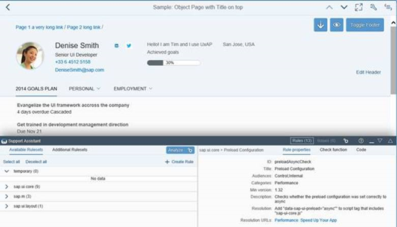
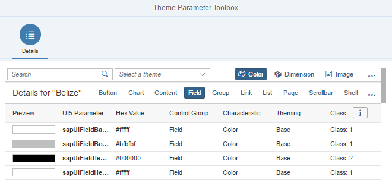
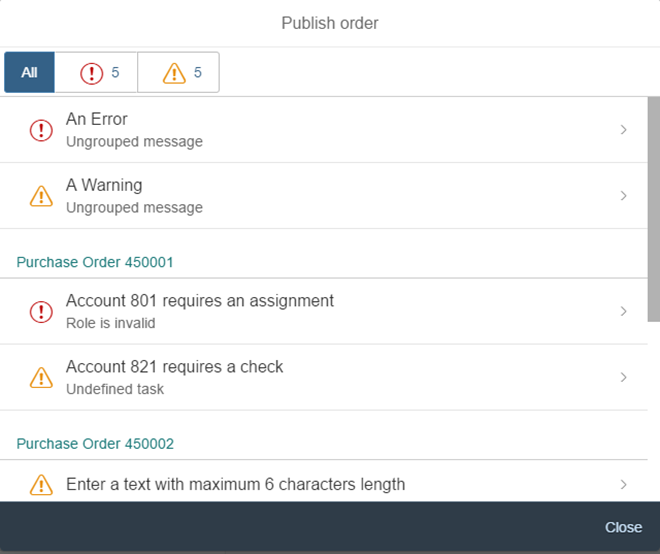
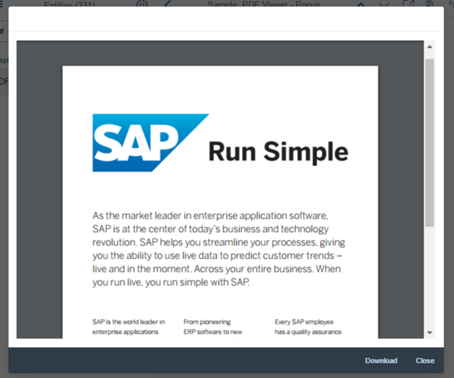
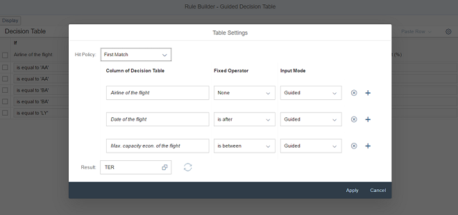
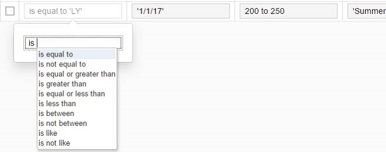
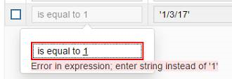
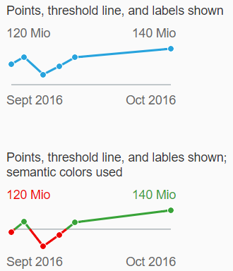

<!-- loiofa1efaca7d674995a0dc3a95ba0a4d08 -->

# What's New in SAPUI5 1.48

With this release SAPUI5 is upgraded from version 1.46 to 1.48.

****


<table>
<tr>
<th valign="top">

Version


</th>
<th valign="top">

Type


</th>
<th valign="top">

Category


</th>
<th valign="top">

Title


</th>
<th valign="top">

Description


</th>
<th valign="top">

Action


</th>
<th valign="top">

Available as of


</th>
</tr>
<tr>
<td valign="top">

1.48 


</td>
<td valign="top">

Changed 


</td>
<td valign="top">

Announcement 


</td>
<td valign="top">

**Third-Party Library Upgrades** 


</td>
<td valign="top">

**Third-Party Library Upgrades**

-   The `Handlebars.js` library has been upgraded from version 3.0.3 to 4.0.5. If you access the parent contexts in your Handlebars templates, make sure that you pass the `compat` flag when compiling:

    ```
    Handlebars.compile(source, {
    	compat: true
    });
    
    ```

    This change has also been applied to the SAPUI5 versions that are still in maintenance \(1.28, 1.38., 1.44\).

-   **QUnit** version 2.3.2 has been added \(module `sap.ui.thirdparty.qunit-2`, resources `sap/ui/thirdparty/qunit-2.js`\).


<sub>Changed•Announcement•Info Only•1.48</sub>


</td>
<td valign="top">

Info Only


</td>
<td valign="top">

2017-08-02


</td>
</tr>
<tr>
<td valign="top">

1.48 


</td>
<td valign="top">

New 


</td>
<td valign="top">

Feature 


</td>
<td valign="top">

**Support Assistant and Other Support Tools** 


</td>
<td valign="top">

**Support Assistant and Other Support Tools**

The new Support Assistant tool enables application developers to check whether they have built their applications in accordance with the best practices for building SAPUI5 apps. The tool uses a set of predefined rules to check all aspects of an application, for example, accessibility, performance, data-binding, and more. Support Assistant is integrated into One Page Acceptance Tests \(OPA5\) and can be used as part of OPA tests.

The main features of the tool are:

-   Creation and management of support rules

-   Application analysis

-   Results reporting




For more information, see [Support Assistant](../04_Essentials/support-assistant-57ccd7d.md).

We have also redesigned the other support tools, *Technical Information Dialog* and *Diagnostics*, reworked the [Troubleshooting](../04_Essentials/troubleshooting-615d9e4.md) documentation section under *Essentials*, and created a [Troubleshooting Tutorial](../03_Get-Started/troubleshooting-tutorial-5661952.md) tutorial.

<sub>New•Feature•Info Only•1.48</sub>


</td>
<td valign="top">

Info Only 


</td>
<td valign="top">

2017-08-02


</td>
</tr>
<tr>
<td valign="top">

1.48 


</td>
<td valign="top">

New 


</td>
<td valign="top">

Feature 


</td>
<td valign="top">

**Reuse Components** 


</td>
<td valign="top">

**Reuse Components**

You now declare reuse components in the descriptor for applications \(`manifest.json`\). A new factory function has been introduced for creating reuse component instances within the context of the current component. You can extend apps easily on the component level by replacing the usage of a reuse component with a variant that modifies the `manifest.json` values for the reuse component.

Another benefit is that the application index can index the declared reuse components. It can then optimize the determination of dependencies that should be preloaded during the component load. This is especially helpful for components that are packaged in libraries, since up to now the application could not identify and avoid a separate preload for these components \(which ended in a 404 error\).

You don't have to migrate old applications to the new logic to keep them working. But if you want to benefit from further improvements with regards to component loading and performance, as well as component extensibility \(replace reuse component\), you should consider updating the component usage accordingly.

For more information, see [Using and Nesting Components](../04_Essentials/using-and-nesting-components-346599f.md) and [Descriptor for Applications, Components, and Libraries \(manifest.json\)](../04_Essentials/descriptor-for-applications-components-and-libraries-manifest-json-be0cf40.md).

<sub>New•Feature•Info Only•1.48</sub>


</td>
<td valign="top">

Info Only 


</td>
<td valign="top">

2017-08-02


</td>
</tr>
<tr>
<td valign="top">

1.48 


</td>
<td valign="top">

New 


</td>
<td valign="top">

Feature 


</td>
<td valign="top">

**Object Page Personalization \(experimental\)** 


</td>
<td valign="top">

**Object Page Personalization \(experimental\)**

SAPUI5 flexibility services now support personalization of the object page. Activate this experimental feature and try it out!

For more information, search for *Personalizing Apps* in the documentation for your SAP NetWeaver version on the SAP Help Portal at [https://help.sap.com/viewer/p/SAP\_NETWEAVER](https://help.sap.com/viewer/p/SAP_NETWEAVER).

<sub>New•Feature•Info Only•1.48</sub>


</td>
<td valign="top">

Info Only 


</td>
<td valign="top">

2017-08-02


</td>
</tr>
<tr>
<td valign="top">

1.48 


</td>
<td valign="top">

New 


</td>
<td valign="top">

Feature 


</td>
<td valign="top">

**Theme Parameter Tool** 


</td>
<td valign="top">

**Theme Parameter Tool**

There is a new theme parameter tool for finding the best-fitting semantic LESS parameter for a new control. With this tool you can easily search, filter, and preview theme parameters.

With the tool, you can also preview all supported SAP themes and find information about the semantic parameter structure.



To find the tool, see [Demo Apps](https://ui5.sap.com/#/demoapps).

<sub>New•Feature•Info Only•1.48</sub>


</td>
<td valign="top">

Info Only 


</td>
<td valign="top">

2017-08-02


</td>
</tr>
<tr>
<td valign="top">

1.48 


</td>
<td valign="top">

New 


</td>
<td valign="top">

Control 


</td>
<td valign="top">

**`sap.m.MessageView`** 


</td>
<td valign="top">

**`sap.m.MessageView`**

Displays a summarized list of different types of messages. The `MessageView` is used to show the contents of `sap.m.MessagePopover`, but it can also be used in other container controls like `sap.m.Dialog`.

`sap.m.MessageView` also allows grouping of messages by setting the property `groupItems` and defining a `groupName` for each item. For more information, see the [API Reference](https://ui5.sap.com/#/api/sap.m.MessageView) and the [samples](https://ui5.sap.com/#/sample/sap.m.sample.MessageViewWithGrouping/preview).



<sub>New•Control•Info Only•1.48</sub>


</td>
<td valign="top">

Info Only 


</td>
<td valign="top">

2017-08-02


</td>
</tr>
<tr>
<td valign="top">

1.48 


</td>
<td valign="top">

New 


</td>
<td valign="top">

Control 


</td>
<td valign="top">

**`sap.m.CustomTreeItem`** 


</td>
<td valign="top">

**`sap.m.CustomTreeItem`**

Similar to `sap.m.CustomListItem` for the `sap.m.List` control, the `sap.m.CustomTreeItem` control allows you to define custom item content for `sap.m.Tree`. For more information, see the [API Reference](https://ui5.sap.com/#/api/sap.m.CustomTreeItem) and the [sample](https://ui5.sap.com/#/sample/sap.m.sample.CustomTreeItem/preview).

<sub>New•Control•Info Only•1.48</sub>


</td>
<td valign="top">

Info Only 


</td>
<td valign="top">

2017-08-02


</td>
</tr>
<tr>
<td valign="top">

1.48 


</td>
<td valign="top">

New 


</td>
<td valign="top">

Control 


</td>
<td valign="top">

**`sap.m.PDFViewer`** 


</td>
<td valign="top">

**`sap.m.PDFViewer`**

**`sap.m.PDFViewer`** enables SAP Fiori developers to display PDF files in a consistent way across all browsers and devices. It encapsulates browser-specific PDF viewer plugins and provides a simple API to embed a PDF file into a page or to open it in a dialog box. For more information, see [PDF Viewer](../10_More_About_Controls/pdf-viewer-cd80a8b.md), the [API Reference](https://ui5.sap.com/#/api/sap.m.PDFViewer), and the [sample](https://ui5.sap.com/#/entity/sap.m.PDFViewer). 



<sub>New•Control•Info Only•1.48</sub>


</td>
<td valign="top">

Info Only 


</td>
<td valign="top">

2017-08-02


</td>
</tr>
<tr>
<td valign="top">

1.48 


</td>
<td valign="top">

New 


</td>
<td valign="top">

Control 


</td>
<td valign="top">

**`sap.rules.ui.RuleBuilder`** 


</td>
<td valign="top">

**`sap.rules.ui.RuleBuilder`**

**`sap.rules.ui.RuleBuilder`** enables business users to create, edit, and view a decision table in an application. A decision table is a tabular visualization of a business rule. The Rule Builder control supports the following:

-   Setting the decision table’s hit policy \(first match or all match\).

-   Defining the condition columns \(`if` statements\) of the decision table.

-   Choosing the results set \(`then` statements\) of the decision table.

    

-   Setting each column’s input mode:

    -   **Guided input mode** \(default\) guides the user through the process of entering values for conditions in decision table cells.

        

    -   **Text input mode** allows the user to enter text directly into conditions in decision table cells, and provides support via auto-suggest and validation services.

        


-   In both input modes, the client-side parser provides auto-suggestion and validation of values from the business vocabulary and business language relevant to the specific decision table. Errors are highlighted and messages provide alternative suggestions.

    

-   Performing copy, cut, paste, insert after, and insert before actions on a row of a decision table.

    


For more information, see [Rule Builder Control Tutorial](../03_Get-Started/rule-builder-control-tutorial-67fcb30.md), the [API Reference](https://ui5.sap.com/#/api/sap.rules.ui.RuleBuilder), and the [sample](https://ui5.sap.com/#/entity/sap.rules.ui.RuleBuilder). 

<sub>New•Control•Info Only•1.48</sub>


</td>
<td valign="top">

Info Only 


</td>
<td valign="top">

2017-08-02


</td>
</tr>
<tr>
<td valign="top">

1.48 


</td>
<td valign="top">

New 


</td>
<td valign="top">

Control 


</td>
<td valign="top">

**`sap.suite.ui.microchart.LineMicroChart`** 


</td>
<td valign="top">

**`sap.suite.ui.microchart.LineMicroChart`**

`LineMicroChart` is used primarily for embedded analytics applications and is designed to display a set of ordered points. These points are connected via lines that showcase a data progression for a specific data range. To display additional details, up to four labels can be added to provide, for example, key values or dimensions.

`LineMicroChart` provides regular points or emphasized points with or without semantic colors. It offers a standard line diagram with an automatically determined or predefined scale \(with optional threshold\).



For more information, see the [API Reference](https://ui5.sap.com/#/api/sap.suite.ui.microchart.LineMicroChart) and the [samples](https://ui5.sap.com/#/entity/sap.suite.ui.microchart.LineMicroChart).

<sub>New•Control•Info Only•1.48</sub>


</td>
<td valign="top">

Info Only 


</td>
<td valign="top">

2017-08-02


</td>
</tr>
<tr>
<td valign="top">

1.48 


</td>
<td valign="top">

Changed 


</td>
<td valign="top">

Feature 


</td>
<td valign="top">

**Improved Script Loading** 


</td>
<td valign="top">

**Improved Script Loading**

If loading a resource fails, a second retry is done.

<sub>Changed•Feature•Info Only•1.48</sub>


</td>
<td valign="top">

Info Only 


</td>
<td valign="top">

2017-08-02


</td>
</tr>
<tr>
<td valign="top">

1.48 


</td>
<td valign="top">

Changed 


</td>
<td valign="top">

Feature 


</td>
<td valign="top">

**Date Intervals** 


</td>
<td valign="top">

**Date Intervals**

The `DateFormat` can format two dates as an interval. For more information, see [Date Format](../04_Essentials/date-format-91f2eba.md).

<sub>Changed•Feature•Info Only•1.48</sub>


</td>
<td valign="top">

Info Only 


</td>
<td valign="top">

2017-08-02


</td>
</tr>
<tr>
<td valign="top">

1.48 


</td>
<td valign="top">

Changed 


</td>
<td valign="top">

Feature 


</td>
<td valign="top">

**SAPUI5 OData V4 Model** 


</td>
<td valign="top">

**SAPUI5 OData V4 Model**

The new version of the SAPUI5 OData V4 model introduces the following features:

-   Automatic determination of `$select` and `$expand` parameters for OData V4 requests by setting `autoExpandSelect` in the model settings to `true`.

-   Automatic loading of "cross-service references" \(a service that references metadata from other documents\) by the OData V4 model when metadata from the referenced document is needed.

-   Support of the V4-specific `lambda` operators `any` and `all` on collections with new filter operators `FilterOperator.All` and `FilterOperator.Any` and it is possible to create entities on relative bindings


> ### Caution:  
> **Incompatibility Due to Bug Fix**
> 
> The following bug has been reported: If you call the [sap.ui.model.odata.v4.Context\#getObject\(\)](https://ui5.sap.com/#/api/sap.ui.model.odata.v4.Context/methods/getObject) or the [sap.ui.model.odata.v4.Context\#requestObject\(\)](https://ui5.sap.com/#/api/sap.ui.model.odata.v4.Context/methods/requestObject) methods without a parameter, the expected and documented behavior is that the same result is returned as if the parameter `sPath=""` had been specified. Due to the bug, however, the return value wraps the expected output that can then only be accessed via `.value[0]`, for example `oContext.getObject().value[0]`.
> 
> **If you have used this workaround, your application will break starting with SAPUI5 version 1.44.7.**
> 
> **Solution**: If your application needs to run with both the fixed and unfixed versions of SAPUI5, specify the `sPath=""` parameter, for `sPath` parameter. In both cases, you **must not** use the workaround with `.value[0]`.

> ### Restriction:  
> Due to the limited feature scope of this version of the SAPUI5 OData V4 model, check that all required features are in place before developing applications. Check the detailed documentation of the features, as certain parts of a feature may be missing. While we aim to be compatible with existing controls, some controls might not work due to small incompatibilities compared to `sap.ui.model.odata.(v2.)ODataModel`, or due to missing features in the model \(such as tree binding\). This also applies to Smart Controls \(`sap.ui.comp` library\) and SAP Fiori Elements that do not support the SAPUI5 OData V4 model, as well as controls such as `TreeTable` and `AnalyticalTable`, which are not supported together with the SAPUI5 OData V4 model. The interface for applications has been changed for easier and more efficient use of the model. For a summary of these changes, see [Changes Compared to OData V2 Model](../04_Essentials/changes-compared-to-odata-v2-model-abd4d7c.md).

For more information, see [OData V4 Model](../04_Essentials/odata-v4-model-5de13cf.md), the [API Reference](https://ui5.sap.com/#/api/sap.ui.model.odata.v4), and the [sample](https://ui5.sap.com/#/entity/sap.ui.model.odata.v4.ODataModel) in the Demo Kit.

<sub>Changed•Feature•Info Only•1.48</sub>


</td>
<td valign="top">

Info Only 


</td>
<td valign="top">

2017-08-02


</td>
</tr>
<tr>
<td valign="top">

1.48 


</td>
<td valign="top">

Changed 


</td>
<td valign="top">

Feature 


</td>
<td valign="top">

**One Page Acceptance Tests \(OPA5\)** 


</td>
<td valign="top">

**One Page Acceptance Tests \(OPA5\)**

-   You can now provide OPA test and application parameters in the URL. This allows you to override the default values for individual test executions. For more information, see [Cookbook for OPA5](../04_Essentials/cookbook-for-opa5-ce4b180.md) and the API Reference for [sap.ui.test.Opa.extendConfig](https://ui5.sap.com/#/api/sap.ui.test.Opa/methods/extendConfig) and [sap.ui.test.Opa5.extendConfig](https://ui5.sap.com/#/api/sap.ui.test.Opa5/methods/sap.ui.test.Opa5.extendConfig). 

-   You can now extend the testing capabilities of OPA with your own extensions. For more information, see [Extensions for OPA5](../04_Essentials/extensions-for-opa5-9c22d2a.md) and the [API Reference](https://ui5.sap.com/#/api/sap.ui.test.OpaExtension). 


<sub>Changed•Feature•Info Only•1.48</sub>


</td>
<td valign="top">

Info Only 


</td>
<td valign="top">

2017-08-02


</td>
</tr>
<tr>
<td valign="top">

1.48 


</td>
<td valign="top">

Changed 


</td>
<td valign="top">

Feature 


</td>
<td valign="top">

**UI Adaptation at Runtime** 


</td>
<td valign="top">

**UI Adaptation at Runtime**

-   UI adaptation at runtime now supports many additional SAPUI5 controls. Find out how to develop apps supporting it \(also whether your app supports it already\) and how to enable apps for it. For more information, see [SAPUI5 Flexibility: Enable Your App for UI Adaptation](../05_Developing_Apps/sapui5-flexibility-enable-your-app-for-ui-adaptation-f1430c0.md).

-   As stable IDs are an important prerequisite for SAPUI5 flexibility services, and thus for UI adaptation at runtime, we revamped the documentation. Find out why stable IDs are needed and how to use and name them. For more information, see [Stable IDs: All You Need to Know](../05_Developing_Apps/stable-ids-all-you-need-to-know-f51dbb7.md).

-   Key users can now also edit UI elements, which are not directly on the UI but are triggered by an action or must be navigated to, such as dialog boxes and popups.

    For more information, search for *Adapting SAP Fiori UIs at Runtime* in the documentation for your [https://help.sap.com/viewer/p/SAP\_NETWEAVER](https://help.sap.com/viewer/p/SAP_NETWEAVER) version on the SAP Help Portal.


<sub>Changed•Feature•Info Only•1.48</sub>


</td>
<td valign="top">

Info Only 


</td>
<td valign="top">

2017-08-02


</td>
</tr>
<tr>
<td valign="top">

1.48 


</td>
<td valign="top">

Changed 


</td>
<td valign="top">

Control 


</td>
<td valign="top">

**`sap.f.Avatar`** 


</td>
<td valign="top">

**`sap.f.Avatar`**

With the use of the new `detailBox` aggregation, you can automatically open a `sap.m.LightBox` instance on user interaction with the `sap.f.Avatar`.

<sub>Changed•Control•Info Only•1.48</sub>


</td>
<td valign="top">

Info Only 


</td>
<td valign="top">

2017-08-02


</td>
</tr>
<tr>
<td valign="top">

1.48 


</td>
<td valign="top">

Changed 


</td>
<td valign="top">

Control 


</td>
<td valign="top">

**`sap.f.DynamicPage`** 


</td>
<td valign="top">

**`sap.f.DynamicPage`**

It is now possible to initialize the control with collapsed header. To enable the feature, set property `headerExpanded` to false.

<sub>Changed•Control•Info Only•1.48</sub>


</td>
<td valign="top">

Info Only 


</td>
<td valign="top">

2017-08-02


</td>
</tr>
<tr>
<td valign="top">

1.48 


</td>
<td valign="top">

Changed 


</td>
<td valign="top">

Control 


</td>
<td valign="top">

**`sap.gantt`** 


</td>
<td valign="top">

**`sap.gantt`**

-   **Time period zooming**: You can press button *Z* to activate the time period zooming mode. In this mode, you are able to fill the full chart area with a selected period of time. To indicate the start and end of the time period, move the mouse along the timeline with the left button pressed.

-   **Additional vertical lines**: You can use the `AdhocLine` class to draw additional vertical lines at specific time points in the chart area. These vertical lines help you mark milestones, such as the start of a project, and special events, such as holidays.


For more information, see the [API Reference](https://ui5.sap.com/#/api/sap.gantt.AdhocLine) and the [samples](https://ui5.sap.com/#/sample/sap.gantt.sample.BasicGanttChart/preview). 

<sub>Changed•Control•Info Only•1.48</sub>


</td>
<td valign="top">

Info Only 


</td>
<td valign="top">

2017-08-02


</td>
</tr>
<tr>
<td valign="top">

1.48 


</td>
<td valign="top">

Changed 


</td>
<td valign="top">

Control 


</td>
<td valign="top">

**`sap.m.ComboBox`** 


</td>
<td valign="top">

**`sap.m.ComboBox`**

**`sap.m.ComboBox`** now highlights matching characters in the dropdown list. This behaviour is now aligned with all select controls.

<sub>Changed•Control•Info Only•1.48</sub>


</td>
<td valign="top">

Info Only 


</td>
<td valign="top">

2017-08-02


</td>
</tr>
<tr>
<td valign="top">

1.48 


</td>
<td valign="top">

Changed 


</td>
<td valign="top">

Control 


</td>
<td valign="top">

**`sap.m.DatePicker`** 


</td>
<td valign="top">

**`sap.m.DatePicker`**

You can now set specific date or date ranges as non-working days by using the new type of the `sap.ui.unified.DateTypeRange` class, `sap.ui.unified.CalendarDayType.NonWorking`.

For more information, see the [sample](https://ui5.sap.com/#/sample/sap.m.sample.DatePicker/preview).

<sub>Changed•Control•Info Only•1.48</sub>


</td>
<td valign="top">

Info Only 


</td>
<td valign="top">

2017-08-02


</td>
</tr>
<tr>
<td valign="top">

1.48 


</td>
<td valign="top">

Changed 


</td>
<td valign="top">

Control 


</td>
<td valign="top">

**`sap.m.GenericTile`** 


</td>
<td valign="top">

**`sap.m.GenericTile`**

With a new overflow concept that allows more flexibility in the layout of the tile designs, generic tiles are displayed in `LineMode` like list items when the screen width is less than 450px. With a screen width greater than 450px, the tiles are no longer truncated and the complete text is shown in a wrapped in-line design.

`Compact` and `Cozy` content densities are available for small \(< 450px\) and large \(\> 450px\) screens. For more information, see the [API Reference](https://ui5.sap.com/#/api/sap.m.GenericTile) and the [samples](https://ui5.sap.com/#/entity/sap.m.GenericTile). 

<sub>Changed•Control•Info Only•1.48</sub>


</td>
<td valign="top">

Info Only 


</td>
<td valign="top">

2017-08-02


</td>
</tr>
<tr>
<td valign="top">

1.48 


</td>
<td valign="top">

Changed 


</td>
<td valign="top">

Control 


</td>
<td valign="top">

**`sap.m.PlanningCalendar`** 


</td>
<td valign="top">

**`sap.m.PlanningCalendar`**

-   You can now set specific date or date ranges as non-working days by using the new type of the `sap.ui.unified.DateTypeRange` class, `sap.ui.unified.CalendarDayType.NonWorking`.

-   You can now expand the grouping of overlapping appointments in the months view of the `sap.m.PlanningCalendar`. You can do this by setting the new property `groupAppointmentsMode` to `sap.ui.unified.GroupAppointmentsMode.Expanded`.

    For more information, see the [API Reference](https://ui5.sap.com/#/api/sap.m.PlanningCalendar/methods/getGroupAppointmentsMode) and the [samples](https://ui5.sap.com/#/sample/sap.m.sample.PlanningCalendarViews/preview).


<sub>Changed•Control•Info Only•1.48</sub>


</td>
<td valign="top">

Info Only 


</td>
<td valign="top">

2017-08-02


</td>
</tr>
<tr>
<td valign="top">

1.48 


</td>
<td valign="top">

Changed 


</td>
<td valign="top">

Control 


</td>
<td valign="top">

**`sap.m.TextArea`** 


</td>
<td valign="top">

**`sap.m.TextArea`**

**`sap.m.TextArea`** controls with a limited text length can determine how to handle text that exceeds that length. By setting `showExceededText=true`, you can decide if those characters are visible or cut. The text area changes its value state and shows a counter of the extra characters when the threshold is reached. For more information, see the [API Reference](https://ui5.sap.com/#/api/sap.m.TextArea/methods/setShowExceededText) and the [sample](https://ui5.sap.com/#/sample/sap.m.sample.TextAreaMaxLength/preview).

<sub>Changed•Control•Info Only•1.48</sub>


</td>
<td valign="top">

Info Only 


</td>
<td valign="top">

2017-08-02


</td>
</tr>
<tr>
<td valign="top">

1.48 


</td>
<td valign="top">

Changed 


</td>
<td valign="top">

Control 


</td>
<td valign="top">

**`sap.m.UploadCollection`** 


</td>
<td valign="top">

**`sap.m.UploadCollection`**

When grouping of `UploadCollectionItems` you can now provide the grouping feature for `UploadCollection`. After you have selected the grouping criteria, the grouping information is displayed as group header in the upload collection list. For more information, see the [API Reference](https://ui5.sap.com/#/api/sap.m.UploadCollectionItem) and the [samples](https://ui5.sap.com/#/sample/sap.m.sample.UploadCollectionSortingFiltering/preview).

<sub>Changed•Control•Info Only•1.48</sub>


</td>
<td valign="top">

Info Only 


</td>
<td valign="top">

2017-08-02


</td>
</tr>
<tr>
<td valign="top">

1.48 


</td>
<td valign="top">

Changed 


</td>
<td valign="top">

Control 


</td>
<td valign="top">

**`sap.m.Wizard`** 


</td>
<td valign="top">

**`sap.m.Wizard`**

**`sap.m.Wizard`** now allows editing of any step in the sequence. By using the association `currentStep` and the method `setCurrentStep`, you can programmatically reach and then edit any step in the sequence. For more information, see the [API Reference](https://ui5.sap.com/#/api/sap.m.Wizard/methods/setCurrentStep) and the [samples](https://ui5.sap.com/#/sample/sap.m.sample.WizardCurrentStep/preview).

<sub>Changed•Control•Info Only•1.48</sub>


</td>
<td valign="top">

Info Only 


</td>
<td valign="top">

2017-08-02


</td>
</tr>
<tr>
<td valign="top">

1.48 


</td>
<td valign="top">

Changed 


</td>
<td valign="top">

Control 


</td>
<td valign="top">

**`sap.suite.ui.commons.ChartContainer`** 


</td>
<td valign="top">

**`sap.suite.ui.commons.ChartContainer`**

There is a new *Selection Details**Selection Details* button, set the `ChartContainer`’s `showSelectionDetails` property to `true`. The button is set inside the main toolbar of the chart container next to the controlling buttons that are added automatically.

For more information, see the [API Reference](https://ui5.sap.com/#/api/sap.m.SelectionDetails) and the [samples](https://ui5.sap.com/#/sample/sap.suite.ui.commons.sample.ChartContainerActions/preview). 

<sub>Changed•Control•Info Only•1.48</sub>


</td>
<td valign="top">

Info Only 


</td>
<td valign="top">

2017-08-02


</td>
</tr>
<tr>
<td valign="top">

1.48 


</td>
<td valign="top">

Changed 


</td>
<td valign="top">

Control 


</td>
<td valign="top">

**`sap.suite.ui.microchart.InteractiveBarChart`** 


</td>
<td valign="top">

**`sap.suite.ui.microchart.InteractiveBarChart`**

The `InteractiveBarChart` provides optional button in the chart container toolbar. When you choose this button, a popover opens with all the data that was selected in the currently visible chart. On mobile devices, a dialog box covering the entire screen area is used instead of a popover. To show the new `min` and `max` properties with which to control the scale of displayed bars. If these properties are not provided by the consumer, the chart uses a scale derived from the values of the displayed bars. For more information, see the [API Reference](https://ui5.sap.com/#/api/sap.suite.ui.microchart.InteractiveBarChart) and the [samples](https://ui5.sap.com/#/entity/sap.suite.ui.microchart.InteractiveBarChart). 

<sub>Changed•Control•Info Only•1.48</sub>


</td>
<td valign="top">

Info Only 


</td>
<td valign="top">

2017-08-02


</td>
</tr>
<tr>
<td valign="top">

1.48 


</td>
<td valign="top">

Changed 


</td>
<td valign="top">

Control 


</td>
<td valign="top">

**`sap.suite.ui.microchart`** 


</td>
<td valign="top">

**`sap.suite.ui.microchart`**

A default tooltip was added to `InteractiveBarChart`, `InteractiveLineChart`, and `InteractiveDonutChart`. When the user hovers over the interaction area in an interactive chart, a tooltip with the nontruncated version of the label and a non-abbreviated version of the measure appears. In interactive mode, the tooltip is generated separately for each interaction area. In non-interactive mode, only an aggregated tooltip is shown. You can customize or even suppress this at chart level or at interaction area level.

<sub>Changed•Control•Info Only•1.48</sub>


</td>
<td valign="top">

Info Only 


</td>
<td valign="top">

2017-08-02


</td>
</tr>
<tr>
<td valign="top">

1.48 


</td>
<td valign="top">

Changed 


</td>
<td valign="top">

Control 


</td>
<td valign="top">

**`sap.ui.layout.BlockLayout`** 


</td>
<td valign="top">

**`sap.ui.layout.BlockLayout`**

-   New options for coloring individual cells have been added. For each `BlockLayoutCell`, you can set `backgroundColorSet` and `backgroundColorShade`. There are 11 predefined color sets, each with 4 color shades. The sets and shades can be easily customized in UI theme designer. You can also set an image as the background of a cell.

-   An additional breaking point for M-sized displays has been added.


For more information, see the [API Reference](https://ui5.sap.com/#/api/sap.ui.layout.BlockLayoutCell) and the [samples](https://ui5.sap.com/#/sample/sap.ui.layout.sample.BlockLayoutCustomBackground/preview).


<sub>Changed•Control•Info Only•1.48</sub>


</td>
<td valign="top">

Info Only 


</td>
<td valign="top">

2017-08-02


</td>
</tr>
<tr>
<td valign="top">

1.48 


</td>
<td valign="top">

Changed 


</td>
<td valign="top">

Control 


</td>
<td valign="top">

**`sap.tnt.ToolPage`** 


</td>
<td valign="top">

**`sap.tnt.ToolPage`**

`IconTabBar` can now be used in `sap.tnt.ToolPage` button in the chart container. The `ToolHeader` is enhanced to allow `IconTabBar` elements. When inside the `ToolHeader`, the `IconTabBar` can use only labels and no icons.

-   You can now have no tab selected by setting the `selectedKey` property to a non-existing key value.

-   When `IconTabHeader` is used on smartphones and tablets, only completely visible tabs are displayed \(no truncation\). The rest of the tabs will overflow.


For more information, see the [sample](https://ui5.sap.com/#/sample/sap.tnt.sample.ToolHeaderIconTabHeader/preview). 

<sub>Changed•Control•Info Only•1.48</sub>


</td>
<td valign="top">

Info Only 


</td>
<td valign="top">

2017-08-02


</td>
</tr>
<tr>
<td valign="top">

1.48 


</td>
<td valign="top">

Changed 


</td>
<td valign="top">

Control 


</td>
<td valign="top">

**`sap.ui.table`** 


</td>
<td valign="top">

**`sap.ui.table`**

You can now highlight items in the tables of the `sap.ui.table` library \(`sap.ui.table.Table`, `sap.ui.table.TreeTable`, `sap.ui.table.AnalyticalTable`\), for example to indicate an error. For more information, see the API Reference for [sap.ui.table.RowSettings](https://ui5.sap.com/#/api/sap.ui.table.RowSettings) and [sap.ui.table.Table.setRowSettingsTemplate](https://ui5.sap.com/#/api/sap.ui.table.Table/methods/setRowSettingsTemplate), and the [sample](https://ui5.sap.com/#/sample/sap.ui.table.sample.RowHighlights/preview).

<sub>Changed•Control•Info Only•1.48</sub>


</td>
<td valign="top">

Info Only 


</td>
<td valign="top">

2017-08-02


</td>
</tr>
<tr>
<td valign="top">

1.48 


</td>
<td valign="top">

Changed 


</td>
<td valign="top">

Control 


</td>
<td valign="top">

**`sap.ui.unified.Calendar`** 


</td>
<td valign="top">

**`sap.ui.unified.Calendar`**

-   You can now show and hide week numbers with the use of a new property `showWeekNumbers`. This feature is disabled for the Islamic calendar.

    For more information, see the [API Reference](https://ui5.sap.com/#/api/sap.ui.unified.Calendar/methods/setShowWeekNumbers) and the [samples](https://ui5.sap.com/#/sample/sap.ui.unified.sample.CalendarMinMax/preview).

-   You can now set specific dates or date ranges to be displayed as non-working by using the `specialDates` aggregation and `sap.ui.unified.CalendarDayType.NonWorking` enumeration type.

    For more information, see the [sample](https://ui5.sap.com/#/sample/sap.ui.unified.sample.CalendarSpecialDaysLegend/preview).


<sub>Changed•Control•Info Only•1.48</sub>


</td>
<td valign="top">

Info Only 


</td>
<td valign="top">

2017-08-02


</td>
</tr>
<tr>
<td valign="top">

1.48 


</td>
<td valign="top">

Changed 


</td>
<td valign="top">

Control 


</td>
<td valign="top">

**`sap.ui.unified.ColorPicker`** 


</td>
<td valign="top">

**`sap.ui.unified.ColorPicker`**

A responsive variant of the color picker control is now available in the `sap.ui.unified` library that is compatible for use with controls from the other responsive SAPUI5 libraries.

For more information, see the [API Reference](https://ui5.sap.com/#/api/sap.ui.unified.ColorPicker) and the [samples](https://ui5.sap.com/#/sample/sap.ui.unified.sample.ColorPicker/preview).

<sub>Changed•Control•Info Only•1.48</sub>


</td>
<td valign="top">

Info Only 


</td>
<td valign="top">

2017-08-02


</td>
</tr>
<tr>
<td valign="top">

1.48 


</td>
<td valign="top">

Changed 


</td>
<td valign="top">

Control 


</td>
<td valign="top">

**`sap.ui.comp.smartfilterbar.SmartFilterBar`** 


</td>
<td valign="top">

**`sap.ui.comp.smartfilterbar.SmartFilterBar`**

-   The selection variants that are listed in the OData metadata and annotation files can now be displayed like variants defined on the UI of the variant management in the `SmartFilterBar` control.

    For more information, see the [API Reference](https://ui5.sap.com/#/api/sap.ui.comp.smartfilterbar.SmartFilterBar/methods/getConsiderSelectionVariants) and [Smart Filter Bar](../10_More_About_Controls/smart-filter-bar-7bcdffc.md).

-   The `SmartFilterBar` control now supports a new annotation, `com.sap.vocabularies.UI.v1.FilterFacets`. With this annotation, you can group filter fields.

<sub>Changed•Control•Info Only•1.48</sub>


</td>
<td valign="top">

Info Only 


</td>
<td valign="top">

2017-08-02


</td>
</tr>
<tr>
<td valign="top">

1.48 


</td>
<td valign="top">

Changed 


</td>
<td valign="top">

Control 


</td>
<td valign="top">

**`sap.ui.comp.smartchart.SmartChart`** 


</td>
<td valign="top">

**`sap.ui.comp.smartchart.SmartChart`**

-   There is a new experimental API that lets you read and write the current UI state of a `SmartChart` control. The scope of information that is included in this API is identical with the scope within an OData-based `PresentationVariant`.

    For more information, see the [API Reference](https://ui5.sap.com/#/api/sap.ui.comp.smartchart.SmartChart).

-   Based on the `com.sap.vocabularies.UI.v1.DataPoint` annotation, you can define semantic patterns and coloring for the `SmartChart` control.

    For more information, see the [API Reference](https://ui5.sap.com/#/api/sap.ui.comp.smartchart.SmartChart/annotations/DataPoint).


<sub>Changed•Control•Info Only•1.48</sub>


</td>
<td valign="top">

Info Only 


</td>
<td valign="top">

2017-08-02


</td>
</tr>
<tr>
<td valign="top">

1.48 


</td>
<td valign="top">

Changed 


</td>
<td valign="top">

Control 


</td>
<td valign="top">

**`sap.ui.comp.navpopover.SmartLink`** 


</td>
<td valign="top">

**`sap.ui.comp.navpopover.SmartLink`**

The `SmartLink` control supports a new annotation, `SemanticObjectMapping`. You can use it to map local properties to the parameters in a `SemanticObject` action.

<sub>Changed•Control•Info Only•1.48</sub>


</td>
<td valign="top">

Info Only 


</td>
<td valign="top">

2017-08-02


</td>
</tr>
<tr>
<td valign="top">

1.48 


</td>
<td valign="top">

Changed 


</td>
<td valign="top">

SAP Fiori Elements 


</td>
<td valign="top">

**SAP Fiori Elements** 


</td>
<td valign="top">

**SAP Fiori Elements**

**List Report and Object Page**

-   General Features

    -   Action-specific messages for confirmation dialog boxes.

        You can create message texts for specific critical actions. They are displayed in the confirmation dialog box for the action.

        For more information, see [Adding Action-Specific Messages to Confirmation Dialog Boxes](../06_SAP_Fiori_Elements/adding-action-specific-messages-to-confirmation-dialog-boxes-f5a04c7.md).

    -   List report and object page now support the use of the *High-Contrast White* theme.

    -   You can configure inbound navigation to a sub-object page of an app, using deep linking.

        For more information, see [Configuring External Navigation](../06_SAP_Fiori_Elements/configuring-external-navigation-1d4a0f9.md).

    -   The edit flow in non-draft apps has been optimized to provide the following features:

        -   *Create* and *Delete* buttons are available in the table toolbar in display mode.

        -   In edit mode, navigation to subobject pages is not possible, and chevrons are hidden.

        -   *Edit* and *Delete* buttons are available in the object page header and on all sub-object pages that follow.


        For more information, see [Non-Draft Apps](../06_SAP_Fiori_Elements/non-draft-apps-a90c558.md).

    -   Transient messages issued by the back end are now grouped by the document they belong to when displayed on the screen.

        For more information, see [Using Messages](../06_SAP_Fiori_Elements/using-messages-239b192.md).

    -   Rating indicators and progress bars can be displayed in all table types \(responsive, grid, and analytical\).


-   List Report View

    -   By default, the list report displays one table. You can define multiple views on a table for the user to switch between the views using an icon tab bar or a segmented button.

        For more information, see [Defining Multiple Views on a List Report Table - Single Table Mode](../06_SAP_Fiori_Elements/defining-multiple-views-on-a-list-report-table-single-table-mode-0d390fe.md).

    -   For simplicity purposes, you can create an app without any variant management. In this case, just the title of the app is displayed. You can create a custom title, if required.

        For more information, see [Creating a List Report without Variant Management](../06_SAP_Fiori_Elements/creating-a-list-report-without-variant-management-094fe8c.md).

    -   If you have not added a semantic key to the line items, the editing status is displayed in the *Title* or *Description* column, depending on the available information.

        For more information, see [Settings for List Report Tables](../06_SAP_Fiori_Elements/settings-for-list-report-tables-4c2d17a.md).

    -   Users can navigate from a tree table to the object page, at row level. The *Show Detail* button is not displayed in the tree table.

    -   When deleting a document in the list report, an existing draft and the active version are deleted in a single step.

    -   If users have set *Execute on Select* for their default variant, the content of the list report is displayed immediately upon launching the app, and the smart filter bar is collapsed.

        For more information, see [List Report Elements](../06_SAP_Fiori_Elements/list-report-elements-1cf5c7f.md).


-   Object Page View

    -   You can enable the simple header facet that handles simple data points without wasting vertical space.

        For more information, see [Enabling Simple Header Facets](../06_SAP_Fiori_Elements/enabling-simple-header-facets-9422074.md).

    -   In responsive, grid, and analytical tables, if the entity is searchable, a search field is displayed. Users can search on any of the table column values if they are search-enabled.

        For more information, see [Tables](../06_SAP_Fiori_Elements/tables-c0f6592.md).


**Overview Pages \(OVP\)**

Overview pages have been enhanced with the following features:

-   *High-Contrast White* theme

-   Automatic refresh of cards for a given interval

-   Sharing of page variant with other users

-   The `annotationPath` property is replaced with `path` property for the `SelectionPresentationVariant` annotation properties `SelectionVariant` and `PresentationVariant`

    For more information see [Annotations Used in Overview Pages](../06_SAP_Fiori_Elements/annotations-used-in-overview-pages-65731e6.md).

-   The filter area includes:

    -   Additional date formats \(UTC and medium\)

    -   Default filter values in the filter area

    -   Auto-hiding of the filter bar on the initial loading of an application


-   Placeholder card of the object stream lets you include custom text along with the existing message

    For more information, see [Stack Cards](../06_SAP_Fiori_Elements/stack-cards-756c49c.md).

-   Counter information in cards has been moved from the footer to the header area

    For more information, see [Types of Cards](../06_SAP_Fiori_Elements/types-of-cards-8ed3f76.md).

-   Quick view card displays error messages as received from the back-end services

-   Support of an extension for cards that lets you develop custom card types

    For more information, see [Custom Cards](../06_SAP_Fiori_Elements/custom-cards-6d260f7.md).

-   Spline interpolation in Line Charts to view the line smoothly

    For more information, see [Chart Cards Used in Overview Pages](../06_SAP_Fiori_Elements/chart-cards-used-in-overview-pages-68e62ad.md).

-   Scatter chart now lets you define the size of the data point

    For more information, see [Chart Cards Used in Overview Pages](../06_SAP_Fiori_Elements/chart-cards-used-in-overview-pages-68e62ad.md).


**Analytical List Page \(ALP\)**

Analytical List Page \(ALP\) is a new SAP Fiori Elements template for performing detailed analytics on aggregated or transactional data. It provides different view types and an interplay between aggregate data \(chart view\) and transactional data \(table data\). You can also filter a data set by choosing the dimensions \(for example, country\) based on the measure values \(for example, net sales\).

ALP lets you:

-   Personalize filter, chart, or table controls

-   Manage variants

-   Use context-based navigation

-   Define related Key Performance Indicators \(KPIs\) and extensions for custom filters, custom actions, or custom columns


For more information, see [Analytical List Page](../06_SAP_Fiori_Elements/analytical-list-page-3d33684.md) and the [API Reference](https://ui5.sap.com/#/api/sap.suite.ui.generic.template.AnalyticalListPage).

<sub>Changed•SAP Fiori Elements•Info Only•1.48</sub>


</td>
<td valign="top">

Info Only 


</td>
<td valign="top">

2017-08-02


</td>
</tr>
<tr>
<td valign="top">

1.48 


</td>
<td valign="top">

Changed 


</td>
<td valign="top">

Analysis Path Framework \(APF\) 


</td>
<td valign="top">

**Analysis Path Framework \(APF\)** 


</td>
<td valign="top">

**Analysis Path Framework \(APF\)**

APF has been enhanced with the following features:

-   You can now create hierarchical steps in which the data is depicted in a tree table. At runtime, the data is structured in rows and columns and grouped into nodes. It is also possible to select data in the tree table and hand over the selection as a filter to the subsequent analysis steps.

    For more information, see [Creating Hierarchical Steps](../07_APF/creating-hierarchical-steps-694956f.md).

-   For navigation targets, you can configure parameters and values that are added to the URL of the navigation target at runtime. This is relevant when the navigation target requires mandatory parameters to run.

    For more information, see [Creating Navigation Targets](../07_APF/creating-navigation-targets-d5762bc.md).

-   The integration of the smart filter bar into APF has been changed in a way that you can now make dynamic time selections for time filters that support date range selections. For example, you can select *Last X Days* and define the number of days.

    For more information, see [Smart Filter Bar](../07_APF/smart-filter-bar-594f111.md).


<sub>Changed•Analysis Path Framework \(APF\)•Info Only•1.48</sub>


</td>
<td valign="top">

Info Only 


</td>
<td valign="top">

2017-08-02


</td>
</tr>
<tr>
<td valign="top">

1.48 


</td>
<td valign="top">

Changed 


</td>
<td valign="top">

User Documentation 


</td>
<td valign="top">

**Documentation Updates** 


</td>
<td valign="top">

**Documentation Updates**

In addition to the documentation for new features, the following changes have been applied to the documentation:

-   New tutorial: [Troubleshooting Tutorial](../03_Get-Started/troubleshooting-tutorial-5661952.md)

-   Reworked [Troubleshooting](../04_Essentials/troubleshooting-615d9e4.md) section


<sub>Changed•User Documentation•Info Only•1.48</sub>


</td>
<td valign="top">

Info Only 


</td>
<td valign="top">

2017-08-02


</td>
</tr>
</table>

**Related Information**  


[What's New in SAPUI5 1.116](what-s-new-in-sapui5-1-116-ebd6f34.md "With this release SAPUI5 is upgraded from version 1.115 to 1.116.")

[What's New in SAPUI5 1.115](what-s-new-in-sapui5-1-115-409fde8.md "With this release SAPUI5 is upgraded from version 1.114 to 1.115.")

[What's New in SAPUI5 1.114](what-s-new-in-sapui5-1-114-890fce1.md "With this release SAPUI5 is upgraded from version 1.113 to 1.114.")

[What's New in SAPUI5 1.113](what-s-new-in-sapui5-1-113-a9553fe.md "With this release SAPUI5 is upgraded from version 1.112 to 1.113.")

[What's New in SAPUI5 1.112](what-s-new-in-sapui5-1-112-34afc69.md "With this release SAPUI5 is upgraded from version 1.111 to 1.112.")

[What's New in SAPUI5 1.111](what-s-new-in-sapui5-1-111-7a67837.md "With this release SAPUI5 is upgraded from version 1.110 to 1.111.")

[What's New in SAPUI5 1.110](what-s-new-in-sapui5-1-110-71a855c.md "With this release SAPUI5 is upgraded from version 1.109 to 1.110.")

[What's New in SAPUI5 1.109](what-s-new-in-sapui5-1-109-3264bd2.md "With this release SAPUI5 is upgraded from version 1.108 to 1.109.")

[What's New in SAPUI5 1.108](what-s-new-in-sapui5-1-108-66e33f0.md "With this release SAPUI5 is upgraded from version 1.107 to 1.108.")

[What's New in SAPUI5 1.107](what-s-new-in-sapui5-1-107-d4ff916.md "With this release SAPUI5 is upgraded from version 1.106 to 1.107.")

[What's New in SAPUI5 1.106](what-s-new-in-sapui5-1-106-5b497b0.md "With this release SAPUI5 is upgraded from version 1.105 to 1.106.")

[What's New in SAPUI5 1.105](what-s-new-in-sapui5-1-105-4d6c00e.md "With this release SAPUI5 is upgraded from version 1.104 to 1.105.")

[What's New in SAPUI5 1.104](what-s-new-in-sapui5-1-104-69e567c.md "With this release SAPUI5 is upgraded from version 1.103 to 1.104.")

[What's New in SAPUI5 1.103](what-s-new-in-sapui5-1-103-0e98c76.md "With this release SAPUI5 is upgraded from version 1.102 to 1.103.")

[What's New in SAPUI5 1.102](what-s-new-in-sapui5-1-102-f038c99.md "With this release SAPUI5 is upgraded from version 1.101 to 1.102.")

[What's New in SAPUI5 1.101](what-s-new-in-sapui5-1-101-7733b00.md "With this release SAPUI5 is upgraded from version 1.100 to 1.101.")

[What's New in SAPUI5 1.100](what-s-new-in-sapui5-1-100-27dec1d.md "With this release SAPUI5 is upgraded from version 1.99 to 1.100.")

[What's New in SAPUI5 1.99](what-s-new-in-sapui5-1-99-4f35848.md "With this release SAPUI5 is upgraded from version 1.98 to 1.99.")

[What's New in SAPUI5 1.98](what-s-new-in-sapui5-1-98-d9f16f2.md "With this release SAPUI5 is upgraded from version 1.97 to 1.98.")

[What's New in SAPUI5 1.97](what-s-new-in-sapui5-1-97-fa0e282.md "With this release SAPUI5 is upgraded from version 1.96 to 1.97.")

[What's New in SAPUI5 1.96](what-s-new-in-sapui5-1-96-7a9269f.md "With this release SAPUI5 is upgraded from version 1.95 to 1.96.")

[What's New in SAPUI5 1.95](what-s-new-in-sapui5-1-95-a1aea67.md "With this release SAPUI5 is upgraded from version 1.94 to 1.95.")

[What's New in SAPUI5 1.94](what-s-new-in-sapui5-1-94-c40f1e6.md "With this release SAPUI5 is upgraded from version 1.93 to 1.94.")

[What's New in SAPUI5 1.93](what-s-new-in-sapui5-1-93-f273340.md "With this release SAPUI5 is upgraded from version 1.92 to 1.93.")

[What's New in SAPUI5 1.92](what-s-new-in-sapui5-1-92-1ef345d.md "With this release SAPUI5 is upgraded from version 1.91 to 1.92.")

[What's New in SAPUI5 1.91](what-s-new-in-sapui5-1-91-0a2bd79.md "With this release SAPUI5 is upgraded from version 1.90 to 1.91.")

[What's New in SAPUI5 1.90](what-s-new-in-sapui5-1-90-91c10c2.md "With this release SAPUI5 is upgraded from version 1.89 to 1.90.")

[What's New in SAPUI5 1.89](what-s-new-in-sapui5-1-89-e56cddc.md "With this release SAPUI5 is upgraded from version 1.88 to 1.89.")

[What's New in SAPUI5 1.88](what-s-new-in-sapui5-1-88-e15a206.md "With this release SAPUI5 is upgraded from version 1.87 to 1.88.")

[What's New in SAPUI5 1.87](what-s-new-in-sapui5-1-87-b506da7.md "With this release SAPUI5 is upgraded from version 1.86 to 1.87.")

[What's New in SAPUI5 1.86](what-s-new-in-sapui5-1-86-4c1c959.md "With this release SAPUI5 is upgraded from version 1.85 to 1.86.")

[What's New in SAPUI5 1.85](what-s-new-in-sapui5-1-85-1d18eb5.md "With this release SAPUI5 is upgraded from version 1.84 to 1.85.")

[What's New in SAPUI5 1.84](what-s-new-in-sapui5-1-84-dc76640.md "With this release SAPUI5 is upgraded from version 1.82 to 1.84.")

[What's New in SAPUI5 1.82](what-s-new-in-sapui5-1-82-3a8dd13.md "With this release SAPUI5 is upgraded from version 1.81 to 1.82.")

[What's New in SAPUI5 1.81](what-s-new-in-sapui5-1-81-f5e2a21.md "With this release SAPUI5 is upgraded from version 1.80 to 1.81.")

[What's New in SAPUI5 1.80](what-s-new-in-sapui5-1-80-8cee506.md "With this release SAPUI5 is upgraded from version 1.79 to 1.80.")

[What's New in SAPUI5 1.79](what-s-new-in-sapui5-1-79-99c4cdc.md "With this release SAPUI5 is upgraded from version 1.78 to 1.79.")

[What's New in SAPUI5 1.78](what-s-new-in-sapui5-1-78-f09b63e.md "With this release SAPUI5 is upgraded from version 1.77 to 1.78.")

[What's New in SAPUI5 1.77](what-s-new-in-sapui5-1-77-c46b439.md "With this release SAPUI5 is upgraded from version 1.76 to 1.77.")

[What's New in SAPUI5 1.76](what-s-new-in-sapui5-1-76-aad03b5.md "With this release SAPUI5 is upgraded from version 1.75 to 1.76.")

[What's New in SAPUI5 1.75](what-s-new-in-sapui5-1-75-5cbb62d.md "With this release SAPUI5 is upgraded from version 1.74 to 1.75.")

[What's New in SAPUI5 1.74](what-s-new-in-sapui5-1-74-c22208a.md "With this release SAPUI5 is upgraded from version 1.73 to 1.74.")

[What's New in SAPUI5 1.73](what-s-new-in-sapui5-1-73-231dd13.md "With this release SAPUI5 is upgraded from version 1.72 to 1.73.")

[What's New in SAPUI5 1.72](what-s-new-in-sapui5-1-72-521cad9.md "With this release SAPUI5 is upgraded from version 1.71 to 1.72.")

[What's New in SAPUI5 1.71](what-s-new-in-sapui5-1-71-a93a6a3.md "With this release SAPUI5 is upgraded from version 1.70 to 1.71.")

[What's New in SAPUI5 1.70](what-s-new-in-sapui5-1-70-f073d69.md "With this release SAPUI5 is upgraded from version 1.69 to 1.70.")

[What's New in SAPUI5 1.69](what-s-new-in-sapui5-1-69-89a18bd.md "With this release SAPUI5 is upgraded from version 1.68 to 1.69.")

[What's New in SAPUI5 1.68](what-s-new-in-sapui5-1-68-f94bf93.md "With this release SAPUI5 is upgraded from version 1.67 to 1.68.")

[What's New in SAPUI5 1.67](what-s-new-in-sapui5-1-67-a6b1472.md "With this release SAPUI5 is upgraded from version 1.66 to 1.67.")

[What's New in SAPUI5 1.66](what-s-new-in-sapui5-1-66-c9896e9.md "With this release SAPUI5 is upgraded from version 1.65 to 1.66.")

[What's New in SAPUI5 1.65](what-s-new-in-sapui5-1-65-0f5acfd.md "With this release SAPUI5 is upgraded from version 1.64 to 1.65.")

[What's New in SAPUI5 1.64](what-s-new-in-sapui5-1-64-0e30822.md "With this release SAPUI5 is upgraded from version 1.63 to 1.64.")

[What's New in SAPUI5 1.63](what-s-new-in-sapui5-1-63-e8d9da7.md "With this release SAPUI5 is upgraded from version 1.62 to 1.63.")

[What's New in SAPUI5 1.62](what-s-new-in-sapui5-1-62-771f4d5.md "With this release SAPUI5 is upgraded from version 1.61 to 1.62.")

[What's New in SAPUI5 1.61](what-s-new-in-sapui5-1-61-d991552.md "With this release SAPUI5 is upgraded from version 1.60 to 1.61.")

[What's New in SAPUI5 1.60](what-s-new-in-sapui5-1-60-5a0e1f7.md "With this release SAPUI5 is upgraded from version 1.58 to 1.60.")

[What's New in SAPUI5 1.58](what-s-new-in-sapui5-1-58-7c927aa.md "With this release SAPUI5 is upgraded from version 1.56 to 1.58.")

[What's New in SAPUI5 1.56](what-s-new-in-sapui5-1-56-108b7fd.md "With this release SAPUI5 is upgraded from version 1.54 to 1.56.")

[What's New in SAPUI5 1.54](what-s-new-in-sapui5-1-54-c838330.md "With this release SAPUI5 is upgraded from version 1.52 to 1.54.")

[What's New in SAPUI5 1.52](what-s-new-in-sapui5-1-52-849e1b6.md "With this release SAPUI5 is upgraded from version 1.50 to 1.52.")

[What's New in SAPUI5 1.50](what-s-new-in-sapui5-1-50-759e9f3.md "With this release SAPUI5 is upgraded from version 1.48 to 1.50.")

[What's New in SAPUI5 1.46](what-s-new-in-sapui5-1-46-6307539.md "With this release SAPUI5 is upgraded from version 1.44 to 1.46.")

[What's New in SAPUI5 1.44](what-s-new-in-sapui5-1-44-a0cb7a0.md "With this release SAPUI5 is upgraded from version 1.42 to 1.44.")

[What's New in SAPUI5 1.42](what-s-new-in-sapui5-1-42-468b05d.md "With this release SAPUI5 is upgraded from version 1.40 to 1.42.")

[What's New in SAPUI5 1.40](what-s-new-in-sapui5-1-40-fbab50e.md "With this release SAPUI5 is upgraded from version 1.38 to 1.40.")

[What's New in SAPUI5 1.38](what-s-new-in-sapui5-1-38-f218918.md "With this release SAPUI5 is upgraded from version 1.36 to 1.38.")

