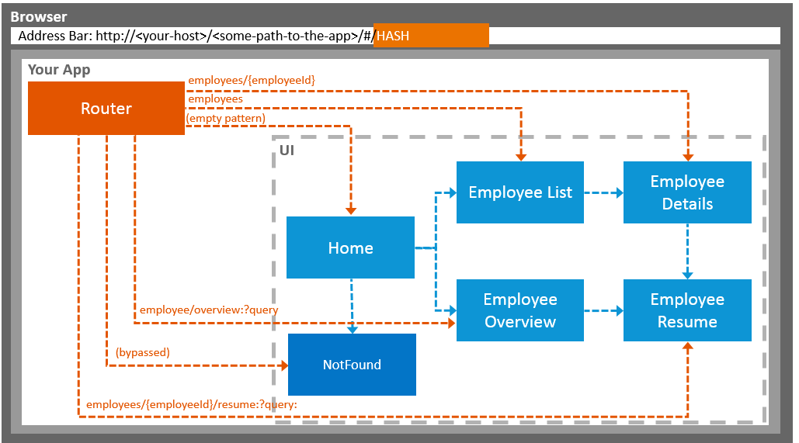

<!-- loio1b6dcd39a6a74f528b27ddb22f15af0d -->

# Navigation and Routing

SAPUI5 comes with a powerful routing API that helps you control the state of your application efficiently. This tutorial will illustrate all major features and APIs related to navigation and routing in SAPUI5 apps by creating a simple and easy to understand mobile app. It represents a set of best practices for applying the navigation and routing features of SAPUI5 to your applications.

In classical Web applications, the server determines which resource is requested based on the URL pattern of the request and serves it accordingly. The server-side logic controls how the requested resource or page is displayed in an appropriate way.

In single-page applications, only one page is initially requested from the server and additional resources are dynamically loaded using client-side logic. The user only navigates within this page. The navigation is persisted in the hash instead of the server path or URL parameters.

For example, a classical Web application might display the employee’s resume page when URL `http://<your-host>/<some-path-to-the-app>/employees/resume.html?id=3` or `http://<your-host>/<some-path-to-the-app>/employees/3/resume` is called. A single-page application instead would do the same thing by using a hash-based URL like `http://<your-host>/<some-path-to-the-app>/#/employees/3/resume`.

The information in the hash, namely everything that is following the `#` character, is interpreted by the router.

> ### Note:  
> This tutorial does not handle cross-app navigation with the SAP Fiori launchpad. However, the concepts described in this tutorial are also fundamental for navigation and routing between apps in the SAP Fiori launchpad.

We will create a simple app displaying the data of a company’s employees to show typical navigation patterns and routing features. The complete flow of the application can be seen in the figure below. We'll start with the home page which lets users do the following:

-   Display a *Not Found* page

-   Navigate to a list of employees and drill further down to see a *Details* page for each employee

-   Show an *Employee Overview* that they can search and sort

   
  
**Page flow of the final app**

  

Throughout this tutorial we will add features for navigating to pages and bookmarking them. We will add backward and forward navigation with common transition animations \(slide, show, flip, etc.\). We will add more pages to the app and navigate between them to show typical use cases. We will even learn how to implement features for bookmarking a specific search, table sorting via filters, and dialogs.

> ### Tip:  
> You don't have to do all tutorial steps sequentially, you can also jump directly to any step you want. Just download the code from the previous step, and start there.
> 
> You can view and download the files for all steps in the Demo Kit at [Navigation and Routing](https://ui5.sap.com/#/entity/sap.ui.core.tutorial.navigation). Copy the code to your workspace and make sure that the application runs by calling the `webapp/index.html` file. Depending on your development environment you might have to adjust resource paths and configuration entries.
> 
> For more information check the following sections of the tutorials overview page \(see [Get Started: Setup, Tutorials, and Demo Apps](get-started-setup-tutorials-and-demo-apps-8b49fc1.md)\):
> 
> -   [Downloading Code for a Tutorial Step](get-started-setup-tutorials-and-demo-apps-8b49fc1.md#loio8b49fc198bf04b2d9800fc37fecbb218__tutorials_download)
> 
> -   [Adapting Code to Your Development Environment](get-started-setup-tutorials-and-demo-apps-8b49fc1.md#loio8b49fc198bf04b2d9800fc37fecbb218__tutorials_adaptation)

