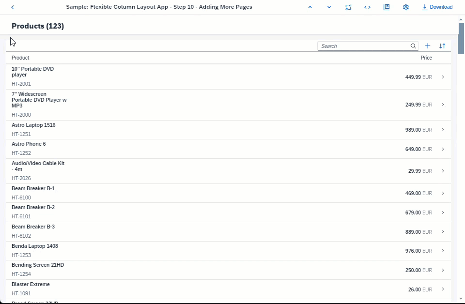

<!-- loioa59b3de038874f879cf20bfc3287bd7c -->

# Step 10: Adding More Pages

In this step, we create an additional page that is displayed in a separate fullscreen column.


<a name="loioa59b3de038874f879cf20bfc3287bd7c__section_yfh_d31_12b"/>

## Preview

   
  
<a name="loioa59b3de038874f879cf20bfc3287bd7c__fig_zfh_d31_12b"/>Additional page displayed in a separate fullscreen column

  


<a name="loioa59b3de038874f879cf20bfc3287bd7c__section_fd2_4dd_lbb"/>

## Coding

You can view and download all files at [Flexible Column Layout App - Step 10](https://ui5.sap.com/#/sample/sap.f.tutorial.fiori2.10/preview).


<a name="loioa59b3de038874f879cf20bfc3287bd7c__section_wql_2pj_l4b"/>

## webapp/view/AboutPage.view.xml \[NEW\]

```xml
<mvc:View
	xmlns="sap.m"
	xmlns:f="sap.f"
	xmlns:mvc="sap.ui.core.mvc">
	<f:DynamicPage toggleHeaderOnTitleClick="false">
		<!-- DynamicPage Title -->
		<f:title>
			<f:DynamicPageTitle>
				<f:heading>
					<Title text="About supplier"/>
				</f:heading>
			</f:DynamicPageTitle>
		</f:title>
	</f:DynamicPage>
</mvc:View>
```

We create a simple additional page view.


<a name="loioa59b3de038874f879cf20bfc3287bd7c__section_cbl_dpj_l4b"/>

## webapp/manifest.json \[MODIFY\]

```json
			...
			"routes": [
				{
					"pattern": "page2",
					"name": "page2",
					"target": "page2",
					"layout": "EndColumnFullScreen"
				},
				{
					"pattern": ":layout:",
					"name": "master",
					"target": [
						"master",
						"detail"
					]
				},
				{
					"pattern": "detail/{product}/{layout}",
					"name": "detail",
					"target": [
						"master",
						"detail"
					]
				},
				{
					"pattern": "detail/{product}/detailDetail/{supplier}/{layout}",
					"name": "detailDetail",
					"target": [
						"master",
						"detail",
						"detailDetail"
					]
				}
			],
			"targets": {
				"master": {
					"name": "Master",
					"controlAggregation": "beginColumnPages"
				},
				"detail": {
					"name": "Detail",
					"controlAggregation": "midColumnPages"
				},
				"detailDetail": {
					"name": "DetailDetail",
					"controlAggregation": "endColumnPages"
				},
				"page2": {
					"name": "AboutPage",
					"controlAggregation": "endColumnPages"
				}
			}
		}
	}
}
```

Similar to the previous step, we add the additional page view to our existing routes in the `manifest.json`.


<a name="loioa59b3de038874f879cf20bfc3287bd7c__section_o45_cpj_l4b"/>

## webapp/view/DetailDetail.view.xml \[MODIFY\]

```xml
<mvc:View
	controllerName="sap.ui.demo.fiori2.controller.DetailDetail"
	xmlns="sap.f"
	xmlns:m="sap.m"
	xmlns:mvc="sap.ui.core.mvc">
	<DynamicPage toggleHeaderOnTitleClick="false">
		<title>
			<DynamicPageTitle>
				<heading>
					<m:FlexBox wrap="Wrap" fitContainer="true" alignItems="Center">
						<m:Title text="{products>text}" wrapping="true" class="sapUiTinyMarginEnd"/>
					</m:FlexBox>
				</heading>
			</DynamicPageTitle>
		</title>
		<content>
			<m:Link text="Navigate to next page…" press=".handleAboutPress"/>
		</content>
	</DynamicPage>
</mvc:View>
```

We add a link in the detail-detail page with a `press` event handler.


<a name="loioa59b3de038874f879cf20bfc3287bd7c__section_z3c_cpj_l4b"/>

## webapp/controller/DetailDetail.controller.js \[MODIFY\]

```js
sap.ui.define([
	"sap/ui/model/json/JSONModel",
	"sap/ui/core/mvc/Controller",
	'sap/f/library'
], function (JSONModel, Controller, fioriLibrary) {
	"use strict";

	return Controller.extend("sap.ui.demo.fiori2.controller.DetailDetail", {
		onInit: function () {
			var oOwnerComponent = this.getOwnerComponent();

			this.oRouter = oOwnerComponent.getRouter();
			this.oModel = oOwnerComponent.getModel();

			this.oRouter.getRoute("detailDetail").attachPatternMatched(this._onPatternMatch, this);
		},

		handleAboutPress: function () {
			this.oRouter.navTo("page2", {layout: fioriLibrary.LayoutType.EndColumnFullScreen});
		},

		_onPatternMatch: function (oEvent) {
		...
```

Finally, we add a `handleAboutPress` function in the detail-detail page controller to navigate to the additional page without passing any data this time.

