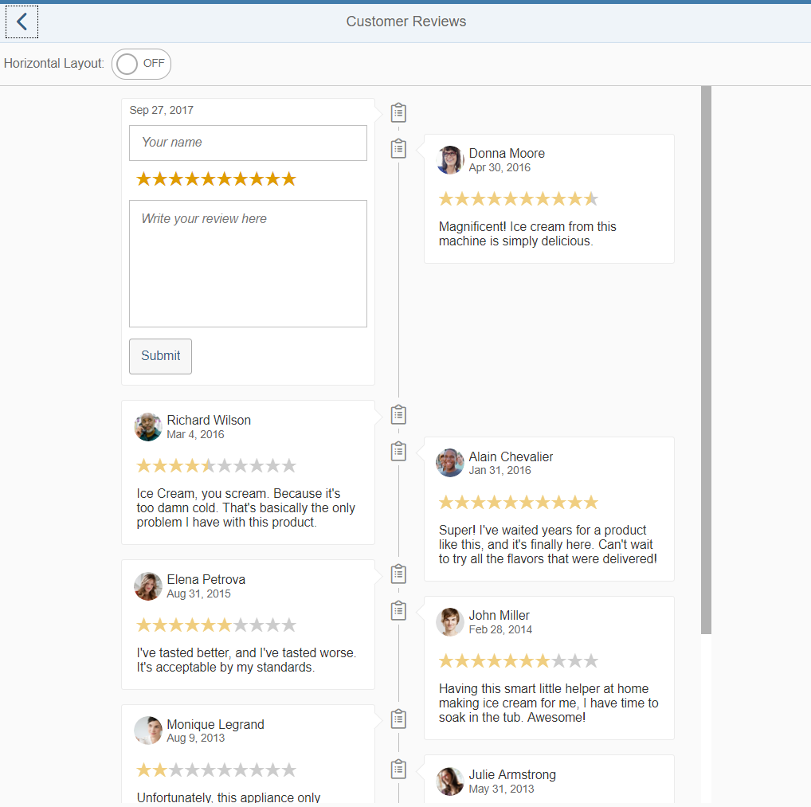

<!-- loio4f36786913774ad98fe471e61ae723c2 -->

# Step 12: Timeline

Use this step to learn how to set up a page where your customers can post their reviews of the ice cream machine.

In this step, we will use the `Timeline` control that allows the users to write and submit reviews. The reviews are arranged in chronological order along the timeline axis.

You can view and download this step in the Demo Kit at [Ice Cream Machine - Step 12 - Timeline](https://ui5.sap.com/#/entity/sap.suite.ui.commons.tutorial.icecream/sample/sap.suite.ui.commons.tutorial.icecream.12).


<a name="loio4f36786913774ad98fe471e61ae723c2__section_ssy_4fs_n1b"/>

## Preview




<a name="loio4f36786913774ad98fe471e61ae723c2__section_idf_qfs_n1b"/>

## Setting Up a Reviews Page with a Timeline

To perform this step, you need one of the views you created in step 5, `Reviews.view.xml`, as well as the controller you defined for this view, `Reviews.controller.js`.


### Reviews.view.xml

In the `Reviews.view.xml` view, add a `Timeline` element that will display a timeline with customer reviews.

You may also need to add a `page` and a `toolbar` if the view does not include them yet.

```xml
<mvc:View
	xmlns="sap.m"
	xmlns:mvc="sap.ui.core.mvc"
	xmlns:suite="sap.suite.ui.commons"
	controllerName="sap.suite.ui.commons.demokit.tutorial.icecream.12.controller.Reviews">
	<Page
		title="{i18n>timelineTitle}"
		showNavButton="true"
		navButtonPress=".onNavButtonPressed"
		backgroundDesign="Solid">
		<Toolbar>
			<Label text="{i18n>layoutSwitchLabel}"/>
			<Switch change=".onHorizontalSwitchChange"/>
		</Toolbar>
		<suite:Timeline
			id="timeline"
			enableDoubleSided="true"
			growing="false"
			groupBy="dateTime"
			lazyLoading="true"
			content="{reviews>/UserReviews}"
			textHeight="automatic"
			showHeaderBar="false">
			<suite:TimelineItem
				dateTime="{
					path: 'reviews>date',
					formatter: '.formatDateTime'
				}"
				userPicture="{=!${reviews>template} ? ${reviews>userPic} : null}"
				title="{=!${reviews>template} ? ${reviews>user} : null}"
				text="{=!${reviews>template} ? ${reviews>quote} : null}"
				filterValue="{=!${reviews>template} ? ${reviews>rating} : null}">
				<suite:embeddedControl>
					<VBox>
						<Input
							value="{reviews>user}"
							visible="{reviews>template}"
							placeholder="{i18n>newReviewUserNameHint}"/>
						<RatingIndicator
							enabled="{reviews>template}"
							value="{reviews>rating}"
							maxValue="10"
							iconSize="1rem"
							class="sapUiTinyMargin"/>
						<Text
							text="{reviews>quote}"
							visible="{=!${reviews>template}}"
							class="sapUiTinyMargin"/>
						<TextArea
							value="{reviews>quote}"
							growing="false"
							height="150px"
							width="100%"
							visible="{reviews>template}"
							placeholder="{i18n>newReviewUserCommentHint}"
							valueLiveUpdate="true"/>
						<Button
							visible="{reviews>template}"
							text="{i18n>newReviewButtonText}"
							press=".addReview"/>
					</VBox>
				</suite:embeddedControl>
			</suite:TimelineItem>
		</suite:Timeline>
	</Page>
</mvc:View>
```


### Reviews.controller.js

In the reviews controller, define a function for adding a review, `addReview`, along with the functions for adjusting date and time format, `formatDateTime`, dynamically updating the rating, `onRatingChange`, layout switching, `onHorizontalSwitchChange`, and navigating back to the start page, `onNavButtonPressed`.

```js
sap.ui.define([
	"sap/ui/core/mvc/Controller",
	"sap/ui/core/format/DateFormat"
], function(Controller, DateFormat) {
	"use strict";
	return Controller.extend("sap.suite.ui.commons.demokit.tutorial.icecream.12.controller.Reviews", {
		onInit: function() {
			this.oTimeline = this.byId("timeline");
		},
		addReview: function() {
			var oModel = this.getView().getModel("reviews"),
				oData = oModel.getData(),
				oTemplateEntry = oData.UserReviews[0];
			oTemplateEntry.template = false;
			// Add new template entry to the beginning
			oData.UserReviews.unshift({
				"user": "",
				"userPic": "",
				"rating": 10,
				"quote": "",
				"dateTime": "now",
				"template": true
			});
			oModel.setData(oData);
		},
		formatDateTime: function(dateTime) {
			var oDateInstance = DateFormat.getDateInstance();
			return oDateInstance.format(oDateInstance.parse(dateTime));
		},
		onNavButtonPressed: function() {
			var oRouter = this.getOwnerComponent().getRouter();
			oRouter.navTo("home");
		},
		onHorizontalSwitchChange: function(event) {
			if (event.getParameter("state")) {
				this.oTimeline.setAxisOrientation("Horizontal");
			} else {
				this.oTimeline.setAxisOrientation("Vertical");
			}
		}
	});
});
```

The initial reviews data is pulled from the model data in the */model/data/Reviews.json* file that is included in the download materials for this tutorial.

**Parent topic:** [Ice Cream Machine](ice-cream-machine-e5b7f8a.md "In this tutorial, we will show you how to use SAPUI5 controls like Generic Tiles, Micro Charts, and Process Flow.")

**Next:** [Step 11: Process Flow](step-11-process-flow-452ff8c.md "In this step, we will create the ProcessFlow on the Production Process page.")

**Previous:** [Step 13: Optimizing the Process Flow Layout](step-13-optimizing-the-process-flow-layout-b6ed1f8.md "In the last step, we will optimize the ProcessFlow layout.")

