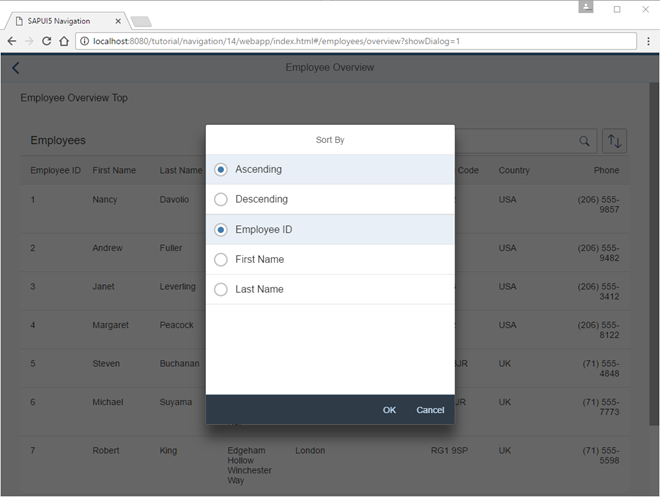

<!-- loio5cc3147afc8d4854b5d3c5fc20923f77 -->

# Step 14: Make Dialogs Bookmarkable

In this step, we want to allow bookmarking of the dialog box that is opened when the user clicks the *Sort* button. The dialog should automatically open when the URL contains the query parameter `showDialog`.


## Preview

   
  
**Bookmark for a dialog**

  


## Coding

You can view and download all files in the *Samples* in the Demo Kit at [Routing and Navigation - Step 14](https://ui5.sap.com/#/entity/sap.ui.core.tutorial.navigation/sample/sap.ui.core.tutorial.navigation.14).


## /controller/employee/overview/EmployeeOverviewContent.controller.js

```js
sap.ui.define([
	"sap/ui/demo/nav/controller/BaseController",
	"sap/ui/model/Filter",
	"sap/ui/model/FilterOperator",
	"sap/ui/model/Sorter",
	"sap/m/ViewSettingsDialog",
	"sap/m/ViewSettingsItem"
], function(
	BaseController,
	Filter,
	FilterOperator,
	Sorter,
	ViewSettingsDialog,
	ViewSettingsItem
) {
	"use strict";
	return BaseController.extend("sap.ui.demo.nav.controller.employee.overview.EmployeeOverviewContent", {
		onInit: function () {
			...
		},
		_onRouteMatched: function (oEvent) {
			// save the current query state
			this._oRouterArgs = oEvent.getParameter("arguments");
			this._oRouterArgs["?query"] = this._oRouterArgs["?query"] || {};
			var oQueryParameter = this._oRouterArgs["?query"];

			// search/filter via URL hash
			this._applySearchFilter(oQueryParameter.search);

			// sorting via URL hash
			this._applySorter(oQueryParameter.sortField, oQueryParameter.sortDescending);

			// show dialog via URL hash
			if (oQueryParameter.showDialog) {
				this._oVSD.open();
			}
			
		},
		onSortButtonPressed: function (oEvent) {
			var oRouter = this.getRouter();
			this._oRouterArgs["?query"].showDialog = 1;
			oRouter.navTo("employeeOverview", this._oRouterArgs);

		},
		...
		_initViewSettingsDialog: function () {
			var oRouter = this.getRouter();
			this._oVSD = new ViewSettingsDialog("vsd", {
				confirm: function (oEvent) {
					var oSortItem = oEvent.getParameter("sortItem");
					this._oRouterArgs["?query"].sortField = oSortItem.getKey();
					this._oRouterArgs["?query"].sortDescending = oEvent.getParameter("sortDescending");
					delete this._oRouterArgs["?query"].showDialog;
					oRouter.navTo("employeeOverview", this._oRouterArgs, true /*without history*/);
				}.bind(this),
				cancel: function (oEvent){
					delete this._oRouterArgs["?query"].showDialog;
					oRouter.navTo("employeeOverview", this._oRouterArgs, true /*without history*/);
				}.bind(this)
			});
			...
		},
		...
	});
});
```

Once again we will update the `EmployeeOverviewContent` controller to add support for the bookmarking of our sorting dialog. We decide to choose a query parameter `showDialog` that controls if the dialog is opened directly when we navigate to the page with a deep link. Therefore, we extend the matched event handler for the `employeeOverview` route. If the query parameter `showDialog` is set to `1`, we open the dialog.

Next we change the `press` handler of the sort button. In the `onSortButtonPressed` function we set `this._oRouterArgs["?query"].showDialog = 1` and call `navTo()` to let the router do the job instead of directly opening the dialog. Finally, we delete `this._oRouterArgs["?query"].showDialog` before calling `navTo()` in the `confirm` and `cancel` event handlers of the `ViewSettingsDialog`. This is important to make sure that the dialog does not open again by the matched handler.

We are now done with this step. Try to access the following pages:

-   `webapp/index.html#/employees/overview?showDialog=1`

-   `webapp/index.html#/employees/overview?search=an&sortField=EmployeeID&sortDescending=true&showDialog=1`


As you can see, the dialog opens automatically if the parameter `showDialog=1` is added to the URL. That’s exactly what we wanted.

