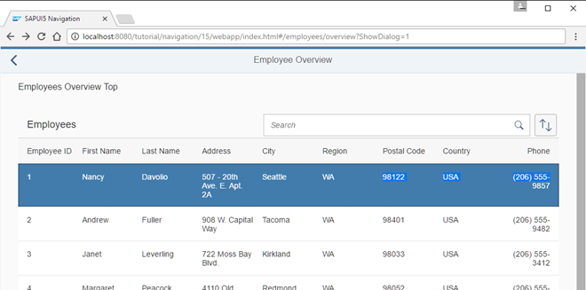

<!-- loio877d57e3b5654b19a2d2e5190dc43b0d -->

# Step 15: Reuse an Existing Route

The *Employees* table displays employee data. However, the resumes of the employees are not accessible from this view yet. We could create a new route and a new view to visualize the resume again, but we could also simply reuse an existing route to cross-link the resume of a certain employee. In this step, we will add a feature that allows users to directly navigate to the resume of a certain employee. We will reuse the *Resume* page that we have created in an earlier step. This example illustrates that there can be multiple navigation paths that direct to the same page.


## Preview

   
  
**Navigation to an existing route from a table item**

  


## Coding

You can view and download all files in the *Samples* in the Demo Kit at [Routing and Navigation - Step 15](https://ui5.sap.com/#/entity/sap.ui.core.tutorial.navigation/sample/sap.ui.core.tutorial.navigation.15).


## webapp/view/employee/overview/EmployeeOverviewContent.view.xml

```xml
<mvc:View
	controllerName="sap.ui.demo.nav.controller.employee.overview.EmployeeOverviewContent"
	xmlns="sap.m"
	xmlns:mvc="sap.ui.core.mvc">
	<Table id="employeesTable"
		items="{/Employees}"
			itemPress=".onItemPressed">
		<headerToolbar>
			...
		</headerToolbar>
		<columns>
			...
		</columns>
		<items>
			<ColumnListItem type="Active">
				<cells>
					...
				</cells>
			</ColumnListItem>
		</items>
	</Table>
</mvc:View>
```

In the `EmployeeOverviewContent` view we register an event handler for the `itemPress` event and set the type attribute of the `ColumnListItem` to `Active` so that we can choose an item and trigger the navigation.


## webapp/controller/employee/overview/EmployeeOverviewContent.controller.js

```js
sap.ui.define([
	"sap/ui/demo/nav/controller/BaseController",
	"sap/ui/model/Filter",
	"sap/ui/model/FilterOperator",
	"sap/ui/model/Sorter",
	"sap/m/ViewSettingsDialog",
	"sap/m/ViewSettingsItem"
], function(
	BaseController,
	Filter,
	FilterOperator,
	Sorter,
	ViewSettingsDialog,
	ViewSettingsItem
) {
	"use strict";
	return BaseController.extend("sap.ui.demo.nav.controller.employee.overview.EmployeeOverviewContent", {
		...
		_syncViewSettingsDialogSorter: function (sSortField, bSortDescending) {
			// the possible keys are: "EmployeeID" | "FirstName" | "LastName"
			// Note: no input validation is implemented here
			this._oVSD.setSelectedSortItem(sSortField);
			this._oVSD.setSortDescending(bSortDescending);
		},
		onItemPressed: function (oEvent) {
			var oItem, oCtx, oRouter;
			oItem = oEvent.getParameter("listItem");
			oCtx = oItem.getBindingContext();
			this.getRouter().navTo("employeeResume",{
				employeeId : oCtx.getProperty("EmployeeID"),
				"?query": {
					tab: "Info"
				}
			});
		}
	});
});
```

Next we add the `itemPress` handler `.onItemPressed` to the `EmployeeOverviewContent` controller. It reads from the binding context which item has been chosen and navigates to the `employeeResume` route. We have already added this route and the corresponding target in a previous step and can now reuse it. From now on it is possible to navigate to the `employeeResume` route from our employee table as well as from the employee detail page created in an earlier step \(the route name is `employee`\).

