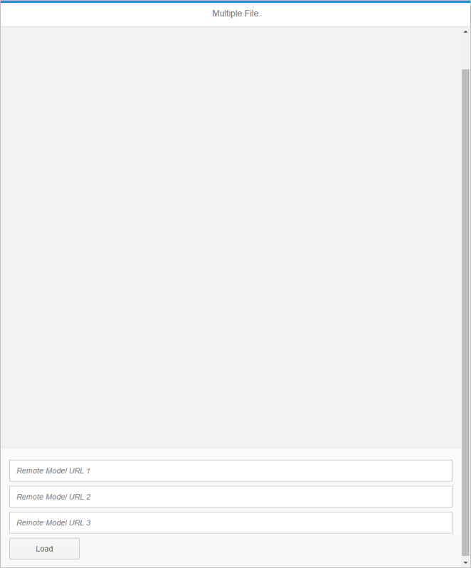
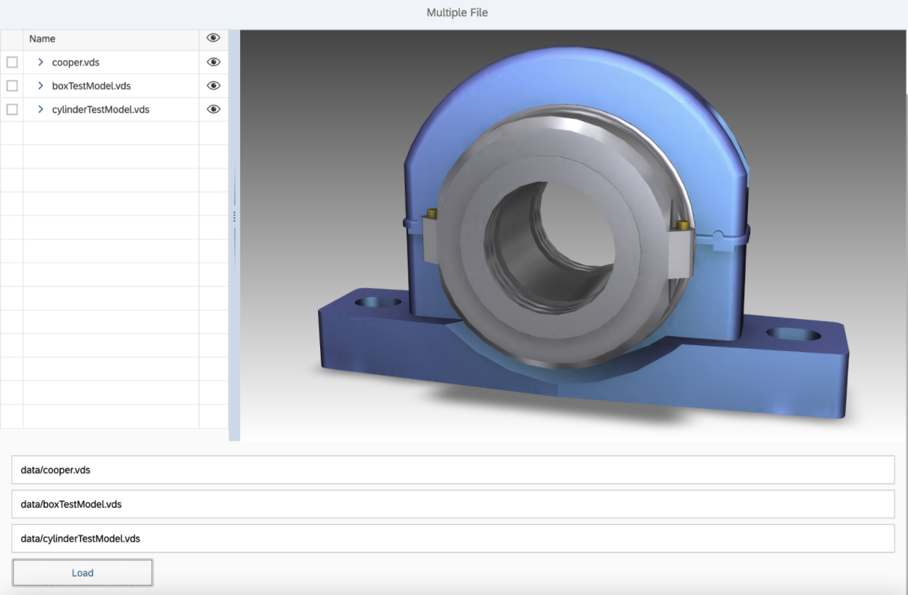

<!-- loio80b0b57480e54a50a08daf468453aa33 -->

# Step 2: 3D Viewer With Multiple File Loading

In this step, you will be creating a Viewer application that allows a user to load multiple 3D resources stored locally.

The content in this tutorial step references [Step 1: 3D Viewer With Single File Loading](step-1-3d-viewer-with-single-file-loading-0e21912.md) for comparative purposes.


## Preview

   
  
**Viewer application with multiple file loading capability**

  


## Coding

You can view and download all files at [3D Viewer - Step 2 - 3D Viewer With Multiple File Loading](https://ui5.sap.com/#/entity/sap.ui.vk.tutorial.VIT/sample/sap.ui.vk.tutorial.VIT.02) .


### index.html

Update the `index.html` file to reference the `multipleFiles` namespace, which will be the namespace we'll use for the sample application in this step.

```html
<!DOCTYPE HTML>
<html>
  <head> 
      <meta http-equiv="Content-Type" content="text/html;charset=UTF-8" /> 
        <script  
          id="sap-ui-bootstrap" 
          src="https://ui5.sap.com/resources/sap-ui-core.js"  
          data-sap-ui-libs="sap.ui.vk, sap.m" 
          data-sap-ui-theme="sap_belize"  
          data-sap-ui-bindingSyntax="complex"  
          data-sap-ui-resourceroots='{ 
                  "multipleFiles": "./"  
            }'> 
      </script> 
      <script> 
          sap.ui.getCore().attachInit(function () { 
              new sap.m.Shell({ 
                  app: new sap.ui.core.ComponentContainer({ 
                      name: "multipleFiles" 
                  }) 
              }).placeAt("content"); 
          }); 
      </script> 
  </head> 
  <body id="content" class="sapUiBody"> 
  </body> 
</html>
```


### Component.js

Update the `Component.js` file to reference the namespace specified for this application.

```js
sap.ui.define([
    "sap/ui/core/UIComponent" 
], function (UIComponent) { 
    "use strict"; 
    return UIComponent.extend("multipleFiles.Component", { 
        metadata: { 
            manifest: "json" 
        }, 

        init: function () { 
            // call the init function of the parent  
            UIComponent.prototype.init.apply(this, arguments); 
        } 
    }); 
});
```


### i18n.properties

In the `i18n.properties` file, we have labels for the toolbar, the page title, the three input fields, the *Load* button, and the error message that is displayed when the user attempts to load a model without specifying one to load.

```ini

# App Descriptor
appTitle=App title 
appDescription=This is a description coming from the i18n as specified in manifest.json   

# Viewer Descriptor  
viewerToolbarTitle=Upload multiple files   

# Page Descriptor  
pageTitle=Multiple File   

# Form Descriptor  
formRemoteURL1=Remote Model URL 1  
formRemoteURL2=Remote Model URL 2  
formRemoteURL3=Remote Model URL 3  
buttonLoadModel=Load   

# Message Toast   
missingUrl=Please specify at least one URL   
```


### manifest.json

Update the `manifest.json` file so that it references the correct files.

```js
{ 
    "_version": "1.8.0", 
    "sap.app": { 
        "id": "multipleFiles", 
        "type": "application", 
        "i18n": "i18n/i18n.properties", 
        "title": "{{appTitle}}", 
        "description": "{{appDescription}}", 
        "applicationVersion": { 
            "version": "1.0.0" 
        } 
    }, 
    "sap.ui": { 
        "technology": "UI5", 
        "deviceTypes": { 
            "desktop": true, 
            "tablet": true, 
            "phone": true 
        } 
    }, 
    "sap.ui5": { 
        "rootView": "multipleFiles.view.App", 
        "dependencies": { 
            "minUI5Version": "1.30", 
            "libs": { 
                "sap.m": {} 
            } 
        }, 
        "models": { 
            "i18n": { 
                "type": "sap.ui.model.resource.ResourceModel", 
                "settings": { 
                    "bundleName": "multipleFiles.i18n.i18n" 
                } 
            } 
        } 
    } 
} 

 
```


### App.view.xml

This file specifies how the page in the application will be laid out. We only have one `formElement` in the form container, which contains the fields for loading 3D resources that are stored locally. In the element, we have specified three input text fields and one button for loading. The labels to use for each of the fields are specified in the text attributes.

```xml
<mvc:View 
   controllerName="multipleFiles.controller.App" 
   xmlns="sap.m" 
   xmlns:mvc="sap.ui.core.mvc" 
   xmlns:vk="sap.ui.vk" 
   xmlns:l="sap.ui.layout" 
   xmlns:f="sap.ui.layout.form" 
   xmlns:u="sap.ui.unified" 
   displayBlock="true"> 
    <App id="multipleFiles"> 
        <Page 
            title="{i18n>pageTitle}"> 
            <vk:Viewer 
                id="viewer" 
                toolbarTitle="{i18n>viewerToolbarTitle}" 
                width="100%" 
                height="85%" 
                       /> 
            <f:Form editable="true"> 
                <f:layout> 
                    <f:ResponsiveGridLayout/> 
                </f:layout> 
                <f:formContainers> 
                    <f:FormContainer> 
                        <f:formElements> 
                            <f:FormElement>        
                                <f:fields> 
                                    <Input 
                                           value="{source>/url1}" 
                                           valueLiveUpdate="true" 
                                           placeholder="{i18n>formRemoteURL1}"> 
                                        <layoutData> 
                                            <l:GridData span="L12 M12 S12" /> 
                                        </layoutData> 
                                    </Input> 
                                    <Input 
                                           value="{source>/url2}" 
                                           valueLiveUpdate="true" 
                                           placeholder="{i18n>formRemoteURL2}"> 
                                        <layoutData> 
                                            <l:GridData span="L12 M12 S12" /> 
                                        </layoutData> 
                                    </Input> 
                                    <Input 
                                           value="{source>/url3}" 
                                           valueLiveUpdate="true" 
                                           placeholder="{i18n>formRemoteURL3}"> 
                                        <layoutData> 
                                            <l:GridData span="L12 M12 S12" /> 
                                        </layoutData> 
                                    </Input> 
                                    <Button 
                                            text="{i18n>buttonLoadModel}" 
                                            press="onPressLoadRemoteModels"> 
                                        <layoutData> 
                                            <l:GridData span="L2 M2 S2" /> 
                                        </layoutData> 
                                    </Button> 
                                </f:fields> 
                            </f:FormElement> 
                        </f:formElements> 
                    </f:FormContainer> 
                </f:formContainers> 
            </f:Form> 
        </Page> 
    </App> 
</mvc:View> 
```


### App.controller.js

Since we now have a different layout for the Viewer application compared to the sample Viewer application in [Step 1: 3D Viewer With Single File Loading](step-1-3d-viewer-with-single-file-loading-0e21912.md), we will need to change the logic for the application to accommodate for multiple file loading.

Add the `checkIfAllInputsEmpty` function to check whether the user has entered text into any of the input fields in the application. The `checkIfAllInputsEmpty` function returns the value `true` if the user hasn't entered any input at all, and the existing `handleEmptyUrl` function is called to display a message on the screen.

Update the `onInit` function so that we are specifying an empty data structure with three properties \(`url1`, `url2`, and `url3`\).

Replace the `loadModelIntoViewer` and `onPressLoadRemoteModel` functions with the following functions:

-   `loadModelsIntoViewer` - loads the models into Viewer
-   `onPressLoadRemoteModels` - handles the click event on the *Load* button

Remove the following functions:

-   `onPressLoadRemoteImage` \(since we are only loading 3D resources\)
-   `onChangeFileUploader` \(since we are not using the FileUploader control for this application\)

```js
sap.ui.define([
    "sap/ui/core/mvc/Controller",
    "sap/ui/model/json/JSONModel",
    "sap/ui/vk/ContentResource",
    "sap/m/MessageToast"
], function (Controller, JSONModel, ContentResource, MessageToast) {
    "use strict";
     
    //throws a Message Toast alert on the screen
    //when the user tries to load a model but there's no url specified
    var handleEmptyUrl = function (view) {
        var oBundle = view.getModel("i18n").getResourceBundle();
        var msg = oBundle.getText("missingUrl");
        MessageToast.show(msg);
    };
     
    //checks if all URL input fields are empty or not
    var checkIfAllInputsEmpty = function (urls) {
        var allEmpty = true;
        for (var i = 0; i < urls.length; i++) {
            if (urls[i]) {
                allEmpty = false;
                break;
            }
        }
        return allEmpty;
    }
     
    //loads the models from the URLs into the viewer
    var loadModelsIntoViewer = function (viewer, urls, sourceType) {
        //clears all the models currently loaded in the viewer
        viewer.destroyContentResources();
         
        //iterates through all URLs
        //and loads all models into the viewer
        for (var i = 0; i < urls.length; i++) {
            if (urls[i]) {
                var nameParts = urls[i].split("/"); 
                var contentResource = new ContentResource({
                    source: urls[i],
                    sourceType: sourceType,
                    sourceId: "abc",
                   name: nameParts[nameParts.length - 1]
                });
                //add current model to the viewer
                viewer.addContentResource(contentResource);
            }
        }
    };
    return Controller.extend("multipleFiles.controller.App", {
        //when the controller is initialized,
        //we declare an empty structure and
        //we set this as model for the URLs
        onInit: function () {
            var sourceData = {
                url1: "",
                url2: "",
                url3: ""
            };
            var model = new JSONModel();
            model.setData(sourceData);
            this.getView().setModel(model, "source");
        },
         
        //onPressLoadRemoteModels handles the click event on the LOAD button
        onPressLoadRemoteModels: function (event) {
            var view = this.getView();
            //set the source model to a variable
            var sourceData = view.getModel("source").getData();

             
            //get the current viewer control
            var viewer = view.byId("viewer");
             
            //create the list of URLs from the input fields
            var urls = [sourceData.url1, sourceData.url2, sourceData.url3];
             
            //if all URL inputs are empty show an alert on the screen
            //if at least one URL is specified, then take the URL list
            //and load all existing ones into the viewer
            if (checkIfAllInputsEmpty(urls)) {
                handleEmptyUrl(view);
            } else {
                loadModelsIntoViewer(viewer, urls, "vds4");
                        } 
                    } 
                }); 
            }
        }
    });
});
```


### Testing the Application

To test that the application works, we will load three 3D resources into the Viewer application.

Download the following VDS files from the *Samples* in the Demo Kit:

-   `cooper.vds`
-   `boxTestModel.vds`
-   `cylinderTestModel.vds`

Type in the file path of the VDS files into each of the input text fields, and click on the *Load* button to load the 3D models. The content of all three files will overlap with each other, so to see box and cylinder you have to hide cooper. Your screen should look like the following:

   
  
**Viewer application loaded with three VDS files**

  

