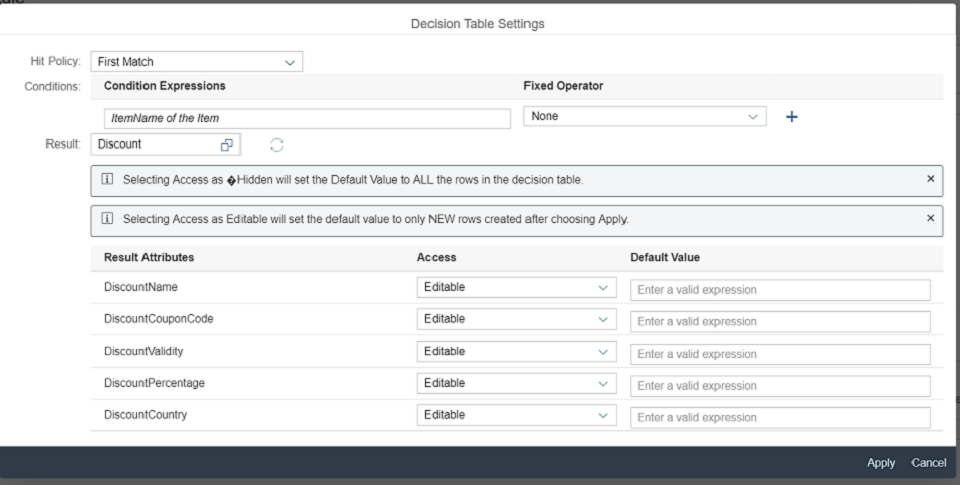

<!-- loio43943208be8846b79bb2a83122d386be -->

# Step 3: Changing the Decision Table Configuration

Decision table has a set of configurations that influence different aspects of its functionality and the actions that business users can perform. The decision table configuration object has default values, which you can change. Part of the configuration of the decision table can be exposed to the end user via the decision table *Settings* dialog box.

If you are using a data object with reference attributes as the result data object, then the attributes of the target data object will also be displayed as result attributes. For more information on reference attributes, see *Attributes* in [Data Objects](https://help.sap.com/viewer/0e4dd38c4e204f47b1ffd09e5684537b/Cloud/en-US/12725c18964e454c859424322c85fc2a.html).


<a name="loio43943208be8846b79bb2a83122d386be__section_qqb_rq3_rz"/>

## Preview

   
  
**Decision Table with Settings Button**

  

   
  
**Decision Table Settings Dialog Box**

  


<a name="loio43943208be8846b79bb2a83122d386be__section_mjx_fn3_rz"/>

## Coding

You can view and download all files at [Rule Builder - Guided Decision Table](https://ui5.sap.com/#/entity/sap.rules.ui.RuleBuilder/sample/sap.rules.ui.sample.GuidedDecisionTable).

> ### Note:  
> The new code described in this step is not included in the download sample files.


<a name="loio43943208be8846b79bb2a83122d386be__section_jhn_5q3_rz"/>

## Page.view.xml

```xml
<mvc:View
        xmlns:mvc="sap.ui.core.mvc"
        displayBlock="true"
        xmlns="sap.m"
        controllerName="sap.rules.ui.sample.GuidedDecisionTable.Page"
        viewName="sap.rules.ui.sample.GuidedDecisionTable.Page.view"
        xmlns:rules="sap.rules.ui">
    <Button id="editButton" press="handleEditButton" text="Edit"/>
    <rules:RuleBuilder id="ruleBuilder" types="DecisionTable" editable="true">
		<rules:decisionTableConfiguration>
		<rules:DecisionTableConfiguration enableSettings="true"/>
		</rules:decisionTableConfiguration>
    </rules:RuleBuilder>
</mvc:View> 

```

This code changes the decision table to display and enable the *Settings* icon \( \), which opens the *Settings* dialog box.

> ### Note:  
> The Cell Format property of the decision table is deprecated from SAPUI5 version 1.52.8. The following is the new property is introduced.
> 
> ```
> decisionTableFormat: {
>                      type: "sap.rules.ui.DecisionTableFormat",
>                      defaultValue: sap.rules.ui.DecisionTableFormat.CellFormat
>                  }
> 
> ```
> 
> The `enum` for type `sap.rules.ui.DecisionTableFormat` is
> 
> ```
> sap.rules.ui.DecisionTableFormat = {
>         CellFormat: "CELLFORMAT",
>         RuleFormat: "RULEFORMAT" 
>             };
> 
> ```

The user has to set the `enum` type to `RuleFormat` for the DecisionTable to be rendered based on rule format.

The value for the rule format is set at the time of rule creation to either basic or advanced mode depending on which the entire rule will be rendered based on basic mode or advanced mode.

