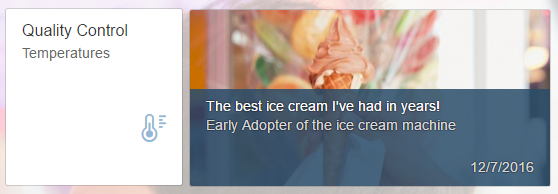

<!-- loioe1fc950b63e94fd8bfadc557c6b62b7c -->

# Step 3: Launch Tile and Slide Tile

In this step, we will create a new Launch Tile `(GenericTile` with `ImageContent)` and a `SlideTile`.


<a name="loioe1fc950b63e94fd8bfadc557c6b62b7c__section_br1_p3v_m1b"/>

## Preview

  


<a name="loioe1fc950b63e94fd8bfadc557c6b62b7c__section_bpn_rhg_j1b"/>

## Initializing the models

To configure the next `GenericTiles`, you need to create models that contain news data. You can find the source code of the model data in */model/data/News.json*.

You can view and download this step in the Demo Kit at [Ice Cream Machine - Step 3 - Launch Tile and Slide Tile](https://ui5.sap.com/#/entity/sap.suite.ui.commons.tutorial.icecream/sample/sap.suite.ui.commons.tutorial.icecream.03).


### Startpage.controller.js

```js
sap.ui.define([
       "sap/ui/core/mvc/Controller",
"sap/ui/model/json/JSONModel",
       "sap/ui/core/format/NumberFormat",
       "sap/base/strings/formatMessage"
], function(jQuery, Controller, JSONModel, NumberFormat) {
       "use strict";

    return Controller.extend("sap.suite.ui.commons.demokit.tutorial.icecream.03.controller.Startpage", {
     onInit: function() {
               var sDataPath = sap.ui.require.toUrl("sap/suite/ui/commons/demokit/tutorial/icecream/03/model/data") + "/News.json";
               var oModel = new JSONModel(sDataPath);
               this.getView().setModel(oModel, "news");
               }
               ...
    });
});
```

You instantiate the models in the *onInit* hook function. They are then available when needed. If you choose a different resource root in your *index.html* file, keep in mind that you have to adapt the module path to the *\*.json* files whenever you load the file into a controller.


<a name="loioe1fc950b63e94fd8bfadc557c6b62b7c__section_yc4_wpm_j1b"/>

## GenericTile with ImageContent

With the *ImageContent* control, you can create the second tile that contains only one image. With that tile, you can also navigate to another view \(we will explain this implementation later\).


### Startpage.view.xml

```xml
<mvc:View
    controllerName="sap.suite.ui.commons.demokit.tutorial.icecream.03.controller.Startpage"
    xmlns:mvc="sap.ui.core.mvc"
    xmlns="sap.m"
    xmlns:layout="sap.ui.layout"
    xmlns:microchart="sap.suite.ui.microchart">
    <Page title="{i18n>title}">
        <layout:VerticalLayout class="sapUiResponsiveMargin">
            <Title
                titleStyle="H2"
                text="{i18n>startpageTilesGroupTitle}"
                class="sapUiTinyMarginBegin" />
            <layout:HorizontalLayout allowWrapping="true">
                ...
            <GenericTile
                    class="sapUiTinyMarginBegin sapUiTinyMarginTop"
                    header="{i18n>startpageTestResultsTileTitle}"
                    subheader="{i18n>startpageTestResultsTileSubTitle}">
                    <tileContent>
                        <TileContent>
                            <content>
                                <ImageContent src="sap-icon://temperature" />
                            </content>
                        </TileContent>
                    </tileContent>
                </GenericTile>
                
            </layout:HorizontalLayout>
        </layout:VerticalLayout>
    </Page>
</mvc:View>
```

Here, the `TileContent` has only one *ImageContent* with an icon set in the *src* property. If you like, you can choose another icon or image.


<a name="loioe1fc950b63e94fd8bfadc557c6b62b7c__section_v3z_rsm_j1b"/>

## SlideTile with Two GenericTiles

With the `SlideTile`, we want to display news about the ice cream machine as well as the user reviews.


### Startpage.view.xml

```xml

<mvc:View
    controllerName="sap.suite.ui.commons.demokit.tutorial.icecream.03.controller.Startpage"
    xmlns:mvc="sap.ui.core.mvc"
    xmlns="sap.m"
    xmlns:layout="sap.ui.layout"
    xmlns:microchart="sap.suite.ui.microchart">
    <Page title="{i18n>title}">
        <layout:VerticalLayout class="sapUiResponsiveMargin">
            <Title
                titleStyle="H2"
                text="{i18n>startpageTilesGroupTitle}"
                class="sapUiTinyMarginBegin" />
            <layout:HorizontalLayout allowWrapping="true">
                ..
         <SlideTile
                    class="sapUiTinyMarginBegin sapUiTinyMarginTop"
                    tiles="{news>/News}">
                    <GenericTile
                        backgroundImage="{news>image}"
                        state="{news>state}"
                        frameType="TwoByOne">
                        <tileContent>
                            <TileContent
                                footer="{
                                    path: 'news>date',
                                    formatter: '.formatJSONDate'
                                }">
                                <content>
                                    <NewsContent
                                        contentText="{news>content}"
                                        subheader="{news>subheader}">
                                    </NewsContent>
                                </content>
                            </TileContent>
                        </tileContent>
                    </GenericTile>
                </SlideTile>
            </layout:HorizontalLayout>
        </layout:VerticalLayout>
    </Page>
</mvc:View>
```

First of all, the `SlideTile` has a wider frame type than the standard `GenericTile`. The default value for the *frameType* property of `GenericTile` is **OneByOne**. This means that it has the standard width and height. The standard frame type of the `SlideTile` is **TwoByOne** which means that the tile is twice as wide as the default one. The data of the **news** model is bound via the **tiles** aggregation and uses the provided `GenericTile` template. All properties in the `GenericTile` are bound to the **news** model. The image you've chosen for the *backgroundImage* property should already have the proper size. As you have all the images you need as part of this tutorial, you only need to refer to the respective image in the model.

With the `NewsContent`, we can put text on top of the background image in the correct layout. In the *NewsContent*, you set the title with the *contentText* property. You set the subtitle using the *subheader* property.

The *date* field in the *news* model is not in a user-friendly format. This is why we are adding a new formatter that converts the date value.


### Startpage.controller.js

```js

sap.ui.define([
    "sap/ui/core/mvc/Controller",
    "sap/ui/model/json/JSONModel",
    "sap/ui/core/format/NumberFormat",
    "sap/base/strings/formatMessage"
], function(Controller, JSONModel, NumberFormat) {
    "use strict";

    return Controller.extend("sap.suite.ui.commons.demokit.tutorial.icecream.03.controller.Startpage", {
        ...          
formatJSONDate: function(date) {
            var oDate = new Date(Date.parse(date));
            return oDate.toLocaleDateString();
        }
        
        ...
    });
});
```

In the controller, we need to add the implementation of the *formatJSONDate* formatter function. Based on the language settings of your browser or local machine, the JSON date string is converted to a string that corresponds to the time and date settings.

**Parent topic:** [Ice Cream Machine](ice-cream-machine-e5b7f8a.md "In this tutorial, we will show you how to use SAPUI5 controls like Generic Tiles, Micro Charts, and Process Flow.")

**Next:** [Step 2: KPI Tile and Chart Tile on the Start Page](step-2-kpi-tile-and-chart-tile-on-the-start-page-3981331.md "In this step, we will create our start page with the KPI Tile (GenericTile with NumericContent) and Chart Tile (GenericTile with MicroChart).")

**Previous:** [Step 4: Generic Tiles in Line Mode](step-4-generic-tiles-in-line-mode-10fa7fd.md "In this step, we will create two GenericTiles in line mode.")

