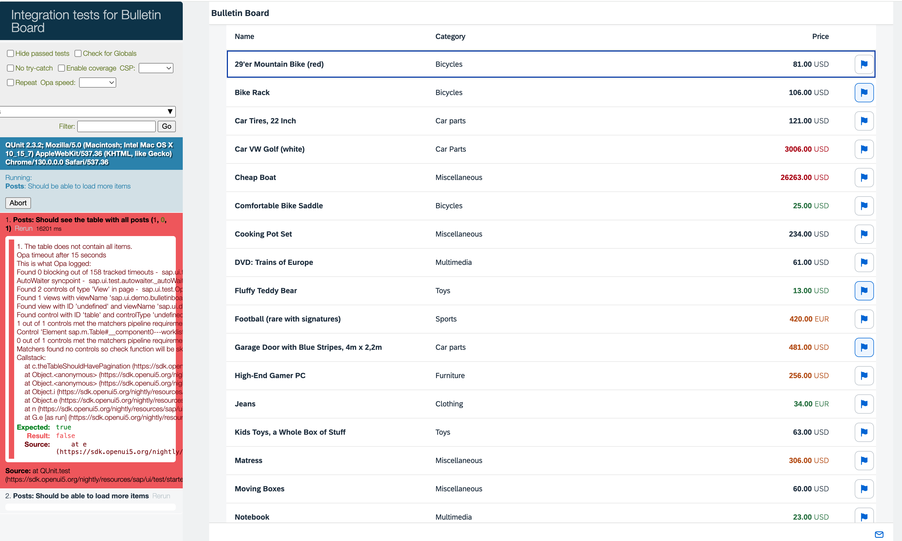
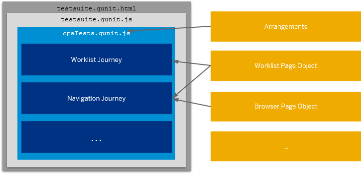

<!-- loio1b47457cbe4941ee926317d827517acb -->

# Step 6: A First OPA Test

A bulletin board may contain many posts. We expect to have a high data load once it is officially released. Then, there might be performance issues and long loading times if we display all entries at the same time. Therefore we will introduce a feature that limits the initial display to 20 items. The user can then click on a more button to view more items. As with the unit test, we start by writing an integration test for this feature and then add the application functionality later.


## Preview

  
  
**The OPA test page is waiting for more items to be loaded**




## Coding

You can view and download all files in the Demo Kit at [Testing - Step 6](https://ui5.sap.com/#/entity/sap.m.tutorial.testing/sample/sap.m.tutorial.testing.06).


## Integration Test Setup

All integration tests are located in the `webapp/test/integration` folder and can be started by opening `webapp/test/testsuite.qunit.html` in your browser and selecting `integration/opaTests`.

We write integration tests with OPA5 – a tool that is integrated and delivered with SAPUI5. It is the short name for One-Page Acceptance tests for SAPUI5. "One-Page" here means that OPA5 is designed for single-page Web applications, i.e. applications that consist only of one HTML file. OPA5 runs in the same browser window as the application to be tested.

> ### Note:  
> There is also a stand-alone version of OPA5 called “OPA” available that can be used for testing any kind of single-page Web application and that does not provide any SAPUI5-specific functionality. In this tutorial, “OPA” always refers to OPA5. It includes functionality for easily finding and matching SAPUI5 controls as well as their properties and aggregations.

  
  
**Integration test infrastructure in the project**



For structuring integration tests with OPA we use “journeys”. A test journey contains all test cases for a specific view or use case, for example the navigation journey simulates user interaction with the app.

The journey uses another structuring element of OPA called “page object” that encapsulates actions and assertions needed to describe the journey. Typically those are related to a view in the app but there can also be stand-alone pages for browsers or common functionality.

> ### Note:  
> When you first start writing tests, you may find it difficult to figure out the correct control locators. The *Test Recorder* tool can suggest a solution in the form of a code snippet. For most controls, it can find a combination of matchers that match a single control. Then, all you need to do is copy the code snippet to your OPA5 page object. For more information, see [Test Recorder](../04_Essentials/test-recorder-2535ef9.md).


## webapp/test/integration/WorklistJourney.js

```js
/*global QUnit*/
sap.ui.define([
	'sap/ui/test/opaQunit',
	'sap/ui/test/Qunit',
	'./pages/Worklist'
], function (opaTest, QUnit, Worklist) {
	"use strict";

	QUnit.module("Posts");

	opaTest("Should see the table with all posts", function (Given, When, Then) {
		// Arrangements
		Given.iStartMyApp();

		// Assertions
		Then.onTheWorklistPage.theTableShouldHavePagination().
			and.theTitleShouldDisplayTheTotalAmountOfItems();
	});

	opaTest("Should be able to load more items", function (Given, When, Then) {
		//Actions
		When.onTheWorklistPage.iPressOnMoreData();

		// Assertions
		Then.onTheWorklistPage.theTableShouldHaveAllEntries();

		// Cleanup
		Then.iTeardownMyApp();
	});
});
```

Let’s add our first new OPA test to the `WorklistJourney.js` file. We describe all test cases related to the worklist logic. We can see that there is already a test `Should see the table with all posts` defined that checks if the table contains the expected number of items. There is a function `opaTest` that initiates a test and receives a test description as the first argument as well as a callback function as the second argument. This format is similar to the unit test function `QUnit.test` except for the three arguments of the callback function that are specific to OPA.

The three objects `Given`, `When`, `Then` are filled by the OPA runtime when the test is executed and contain the `arrangements`, `actions`, and `assertions` for the test. The "Given-When-Then" pattern is a common style for writing tests in a readable format. To describe a test case, you basically write a user story. Test cases in this format are easy to understand, even by non-technical people.

Let’s give it a try with our new feature that only displays 20 posts in the table initially and will load more posts when we press a trigger button or scroll down. Here is our user story "Should see the table with all posts" and its code representation:

-   **Arrangements**

    Define possible initial states, e.g. the app is started, or specific data exists. For performance reasons, starting the app is usually done only in the first test case of a journey. `Given.iStartMyApp();`

-   **Actions**

    Define possible events triggered by a user, e.g. entering some text, clicking a button, navigating to another page. `When.onTheWorklistPage.iPressOnMoreData();`

-   **Assertions**

    Define possible verifications, e.g. do we have the correct amount of items displayed, does a label display the right data, is a list filled. At the end of the test case, the app is destroyed again. This is typically done only once in the last test case of the journey for performance reasons. `Then.onTheWorklistPage.theTableShouldHaveAllEntries ().and.iTeardownMyApp();`


Please also note that you have to move the `and.iTeardownMyApp()` concatenation from the previous `opaTest` function and put it at the end of the last test of a journey, in this case this is our new test. For performance reasons, we only start and destroy the app once per journey, as it takes several seconds to load the app. You can concatenate actions and assertions with the OPA helper object and in an easily readable way. The functions will be executed one after another.

Now you might wonder where all those descriptive functions and the helper object `onTheWorklistPage` are coming from. The answer is simple, the `onTheWorklistPage` object is a structuring element of OPA and inside we will implement the actions and assertions used in this test.


## webapp/test/integration/pages/Worklist.js

```js
sap.ui.define([
	'sap/ui/test/Opa5',
	'sap/ui/test/matchers/AggregationLengthEquals',
	'sap/ui/test/matchers/I18NText',
	'sap/ui/test/actions/Press'
], function (Opa5, AggregationLengthEquals, I18NText, Press) {
	"use strict";

	var sViewName = "Worklist",
	sTableId = "table";

	Opa5.createPageObjects({
		onTheWorklistPage: {
			actions: {
				iPressOnMoreData: function () {
					// Press action hits the "more" trigger on a table
					return this.waitFor({
						id: sTableId,
						viewName: sViewName,
						actions: new Press(),
						errorMessage: "The table does not have a trigger."
					});
				}
			},
			assertions: {
				theTableShouldHavePagination: function () {
					return this.waitFor({
						id: sTableId,
						viewName: sViewName,
						matchers: new AggregationLengthEquals({
							name: "items",
							length: 20
						}),
						success: function () {
							Opa5.assert.ok(true, "The table has 20 items on the first page");
						},
						errorMessage: "The table does not contain all items."
					});
				},

				theTableShouldHaveAllEntries: function () {
					return this.waitFor({
						id: sTableId,
						viewName: sViewName,
						matchers: new AggregationLengthEquals({
							name: "items",
							length: 23
						}),
						success: function () {
							Opa5.assert.ok(true, "The table has 23 items");
						},
						errorMessage: "The table does not contain all items."
					});
				},

				theTitleShouldDisplayTheTotalAmountOfItems: function () {
					return this.waitFor({
						id: "tableHeader",
						viewName: sViewName,
						matchers: new I18NText({
							key: "worklistTableTitleCount",
							propertyName: "text",
							parameters: [23]
						}),
						success: function () {
							Opa5.assert.ok(true, "The table header has 23 items");
						},
						errorMessage: "The table header does not contain the number of items: 23"
					});
				}
			}
		}
	});
});
```

As you can see, the OPA page object is constructed with the call `Opa5.createPageObjects` and a `configuration` object that contains the actions and assertions properties.

For our test case we need to add an action `iPressOnMoreData` and an existing assertion `theTableShouldHaveAllEntries`. OPA tests are running asynchronously, so each action and assertion starts with a `waitFor` statement. The OPA runtime will check and wait for the condition to be fulfilled every 400 ms by polling. If the condition is met, the `success` function of the configuration is called. If the condition is still not fulfilled after a certain amount of time \(by default it is 15 seconds but this can be configured\) the test will fail.

Let’s start with the action `iPressOnMoreData`. We define a `waitFor` statement with the current view and the table. Those IDs are stored as internal variables in the `require` statement above and are available in all tests. OPA will now try to find the table based on IDs. As soon as the table is available on the screen and it can be interacted with \(it is visible, not busy,...\), the `Press` action is invoked, if not, the error message is displayed and the test fails. When executed on a table, the `Press` action will simulate that a users chooses the *More Data* button.

> ### Note:  
> The `Press` action depends on the control that it is triggered on and has a default behavior for most UI controls. If you, for example, execute `Press` on a `sap.m.Page`, this will trigger the *Back* button's `Press` event. This behavior can be overridden by passing an ID as argument to the action. For more information, see the [API Reference: `sap.ui.test.actions.Press`](https://ui5.sap.com/#/api/sap.ui.test.actions.Press). 

The assertion `theTableShouldHaveAllEntries` is structured similarly, but it does not trigger an action. Here, we use the `success` function of `waitFor` to assert if our application is in the expected state. This state is defined by the matchers \(in our case we expect that the list contains 23 items by using the `AggregationLengthEquals`. The `success` function does not execute the additional checks that are needed for triggering an action. The list does not have to be `interactable` to verify that the state of the application is correct.

With this helper object we can simply check the length of the table aggregation `items` to the expected number of items. We have 23 entries in our local mock data that we also use for this integration test. You can see that the number of items is actually hard-coded in the test. So only if the table has exactly 23 items, the matcher is evaluating to `true` and the assertion is passed successfully.

> ### Note:  
> The items in our app are served from the mock server with a slight delay so that we can see how a real service on a backend system would behave. Even if we would have a real backend, we would purposely use the mock server for manual testing and for using them in our test cases as the test data remains stable and unchanged. This creates a more reliable test environment and easier tests. So we can write a test that checks exactly for 23 items here.

Now run the `webapp/test/testsuite.qunit.html` file in your browser and select `integration/opaTests` to observe that the test is failing. When our new test is invoked, OPA will run into a timeout because the trigger area is not found yet. You can see more information, if you open the developer console of your browser and check the messages in the console.


## Conventions

-   Use OPA tests for UI-related integration tests

-   Structure OPA tests with page objects

-   Use the standard matchers provided by OPA5 if possible


**Related Information**  


[Integration Testing with One Page Acceptance Tests \(OPA5\)](../04_Essentials/integration-testing-with-one-page-acceptance-tests-opa5-2696ab5.md "OPA5 is an API for SAPUI5 controls. It hides asynchronicity and eases access to SAPUI5 elements. This makes OPA especially helpful for testing user interactions, integration with SAPUI5, navigation, and data binding.")

[Test Recorder](../04_Essentials/test-recorder-2535ef9.md "The Test Recorder tool supports app developers who write integration and system tests.")

[API Reference: `sap.ui.test.matchers`](https://ui5.sap.com/#/api/sap.ui.test.matchers)

[API Reference: `sap.ui.test.Opa5`](https://ui5.sap.com/#/api/sap.ui.test.Opa5)

[Samples: `sap.ui.test.Opa5`](https://ui5.sap.com/#/entity/sap.ui.test.Opa5)

