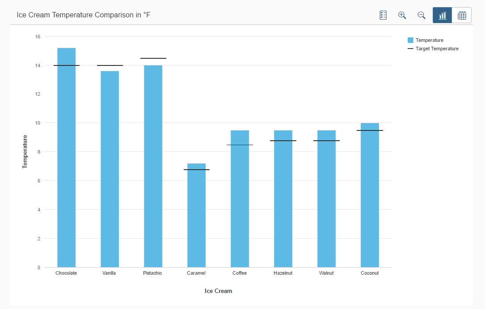
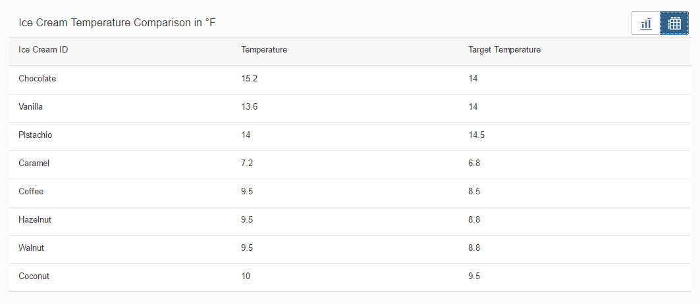

<!-- loio9847648d69b543e2994630ae3e0027fb -->

# Step 6: Chart Container

In this step, we will use the *ChartContainer* control to display information in a detailed view.

In the previous steps, we created a start page with embedded tiles. We prepared the routing configuration for navigation from the *Quality Control* tile to another view.

In the *Quality Control* view, we want to display the temperatures needed for different flavors and the ideal temperature for getting the best ice cream with a smooth consistency. We will use a chart to visualize the data and a table to get a detailed view with the help of the `ChartContainer` control.


<a name="loio9847648d69b543e2994630ae3e0027fb__section_imm_fqb_k1b"/>

## Preview


### Chart Content




### Table Content




<a name="loio9847648d69b543e2994630ae3e0027fb__section_rdh_xsb_k1b"/>

## ChartContainer

The `ChartContainer` control manages various data views in one container. The single controls \(for example, *VizFrame* and *Tables*\) are embedded in the `ChartContainerContent` controls that were added to the *content* aggregation of the `ChartContainer`.


You can view and download this step in the Demo Kit at [Ice Cream Machine - Step 6 - Chart Container](https://ui5.sap.com/#/entity/sap.suite.ui.commons.tutorial.icecream/sample/sap.suite.ui.commons.tutorial.icecream.06).


### ChartContainer.view.xml

```xml
mvc:View
    xmlns:mvc="sap.ui.core.mvc"
    xmlns:suite="sap.suite.ui.commons"
    xmlns:core="sap.ui.core"
    xmlns="sap.m"
    xmlns:l="sap.ui.layout"
    controllerName="sap.suite.ui.commons.demokit.tutorial.icecream.06.controller.ChartContainer">
    <Page
        title="{i18n>chartContainerPageTitle}"
        showNavButton="true"
        navButtonPress=".onNavButtonPressed"
        backgroundDesign="Solid">
        <content>
            <l:Grid defaultSpan="L12 M12 S12" class="sapUiResponsiveMargin" vSpacing="0" hSpacing="0">
               <suite:ChartContainer
                        title="{
                            parts: [
                                'i18n>chartContainerBulletChartTitle',
                                'business>/temperatureUnit'
                            ],
                            formatter: '.formatMessage'
                        }">
                    <suite:ChartContainerContent
                        icon="sap-icon://vertical-bullet-chart"
                        title="{i18n>chartContainerBulletChartContentTitle}">
                        <suite:content>
                            <core:Fragment
                                fragmentName="sap.suite.ui.commons.demokit.tutorial.icecream.06.fragment.VizChart"
                                type="JS" />
                        </suite:content>
                    </suite:ChartContainerContent>
                </suite:ChartContainer> 
            </l:Grid>
        </content>
    </Page>
</mvc:View>
```

In the toolbar, there is a corresponding button for each `ChartContainerContent` from which you can select the content. You can have an icon on the button if you set the *icon* property of the `ChartContainerContent` to the respective SAPUI5 icon URI. The *title* property of the `ChartContainerContent` determines the tooltip text for the button.

Since `VizFrame` is not part of this tutorial, we have provided the `VizChart.fragment.js` JavaScript file in the folder fragment that can be used without modifications.


### ChartContainer.controller.js

```js

sap.ui.define([
     "sap/ui/core/mvc/Controller"
], function(Controller) {
    "use strict";

    return Controller.extend("sap.suite.ui.commons.demokit.tutorial.icecream.06.controller.ChartContainer", {
onNavButtonPressed: function() {
            var oRouter = this.getOwnerComponent().getRouter();
            oRouter.navTo("home");
        }        
    });
});
```

In the `ChartContainer.view.xml`, we will add the backward navigation with the `showNavButton` and `navButtonPress` properties. The function that is referenced by the `navButtonPress` event retrieves the router of the component and navigates to the **home** route as specified in `manifest.json`.


<a name="loio9847648d69b543e2994630ae3e0027fb__section_lxt_yqx_k1b"/>

## Table with details

In the next step, we are going to display detailed information about the data shown in the chart. We will be using a table in which each value is displayed, so that no information is lost.


### ChartContainer.view.xml

```xml

mvc:View
    xmlns:mvc="sap.ui.core.mvc"
    xmlns:suite="sap.suite.ui.commons"
    xmlns:core="sap.ui.core"
    xmlns="sap.m"
    xmlns:l="sap.ui.layout"
    controllerName="sap.suite.ui.commons.demokit.tutorial.icecream.06.controller.ChartContainer">
    <Page
        title="{i18n>chartContainerPageTitle}"
        showNavButton="true"
        navButtonPress=".onNavButtonPressed"
        backgroundDesign="Solid">
        <content>
            <l:Grid defaultSpan="L12 M12 S12" class="sapUiResponsiveMargin" vSpacing="0" hSpacing="0">
                <suite:ChartContainer
                        title="{
                            parts: [
                                'i18n>chartContainerBulletChartTitle',
                                'business>/temperatureUnit'
                            ],
                            formatter: '.formatMessage'
                        }">
                    ...
                   <suite:ChartContainerContent
                        icon="sap-icon://table-chart"
                        title="{i18n>chartContainerTableContentTitle}">
                        <suite:content>
                            <Table items="{/Temperatures}">
                                <columns>
                                    <Column>
                                        <Text text="{i18n>chartContainerIceCreamId}" />
                                    </Column>
                                    <Column>
                                        <Text text="{i18n>chartContainerTemperature}" />
                                    </Column>
                                    <Column>
                                        <Text text="{i18n>chartContainerTargetTemperature}" />
                                    </Column>
                                </columns>
                                <items>
                                    <ColumnListItem>
                                        <cells>
                                            <Text text="{id}" />
                                            <Text text="{temperature}" />
                                            <Text text="{target}" />
                                        </cells>
                                    </ColumnListItem>
                                </items>
                            </Table>
                        </suite:content>
                    </suite:ChartContainerContent> 
                </suite:ChartContainer>
            </l:Grid>
        </content>
    </Page>
</mvc:View>
```

We are going to create another `ChartContainerContent` with a **table**. This table contains three columns that were created with the **Column** element with a **text** that will be shown in the header. The values were created with the `ColumnListItem` that has a *text* control with a bound *text* property for each cell.

