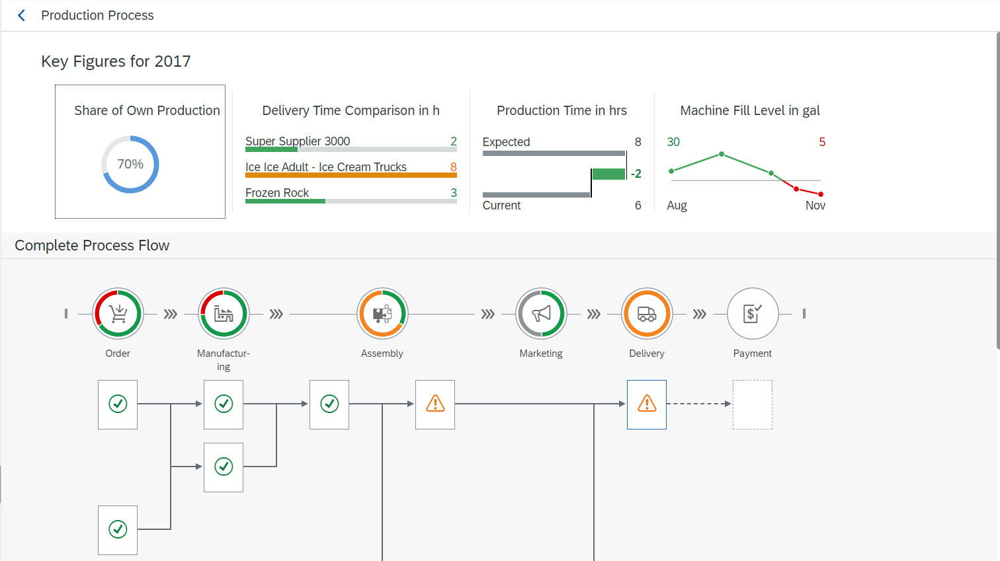

<!-- loio59015909859848f896ebbfa2831470da -->

# Step 7: Header Container and Radial Micro Chart

In this step, we use the `HeaderContainer` and `RadialMicroChart`.

In the last steps, we have implemented the user interaction handling to allow navigation from the **Production Process** tile to the `ProcessFlow` view. With the **Production Process** tile, we only have an aggregated view of the progress of the production process. Therefore, we want to provide a detailed overview of the current production status in this step. We will add the production flow, the states of the manufacturing steps, their dependencies, and critical steps if necessary.

First, we add the `ProcessFlow` control to this view, so that we see the current status of the production process. The production process consists of six steps represented by the following `ProcessFlowLaneHeaders`:

-   Order

-   Manufacturing

-   Assembly

-   Marketing

-   Delivery

-   Payment


The `ProcessFlowLaneHeaders` use icons that stand for the meaning of the lanes. The lane headers aggregate the status of the nodes that are assigned to a particular lane. Each lane consists of `ProcessFlowNodes` that describe an activity in this production step. The structure of the nodes and their relationships for `ProcessFlow` are defined in the *ProcessFlowData.json* file.

The header area of the `ProcessFlow` should contain a `HeaderContainer` with four micro charts that provide the following information:

-   Share of Own Production \(your own production rate\)

-   Delivery Time Comparison in h \(comparison of suppliers' delivery time\)

-   Production Time in h \(comparison of expected and current production times\)

-   Fill Level in lb \(displays the fill level changes over time\)


<a name="loio59015909859848f896ebbfa2831470da__section_jxs_14k_l1b"/>

## Preview of the final ProcessFlow

This is the final view of this page:

  


<a name="loio59015909859848f896ebbfa2831470da__section_mnp_4rk_l1b"/>

## Preview of this step

  


<a name="loio59015909859848f896ebbfa2831470da__section_zkt_nsk_l1b"/>

## HeaderContainer with RadialMicroChart

In the header area, we can display additional values for the business logic of the production process. We can use charts to visualize the information. To distinguish this part from the ProcessFlow, we use the *ObjectHeader* in the header area. We want to add further charts in the following steps and therefore, we create an instance of the *HeaderContainer* that contains our charts.

The first chart contains the share of the parts being produced by us that should be included in the final product. This value is already available in the data model. You can visualize the percentage value by using a `RadialMicroChart`. We first create a `HeaderContainer` with a single `RadialMicroChart`.


### ProcessFlow.view.xml

You can view and download this step in the Demo Kit at [Ice Cream Machine - Step 7 - Header Container and Radial Micro Chart](https://ui5.sap.com/#/entity/sap.suite.ui.commons.tutorial.icecream/sample/sap.suite.ui.commons.tutorial.icecream.07).

```xml
<mvc:View
	xmlns:mvc="sap.ui.core.mvc"
	xmlns="sap.suite.ui.commons"
	xmlns:m="sap.m"
	xmlns:mc="sap.suite.ui.microchart"
	controllerName="sap.suite.ui.commons.demokit.tutorial.icecream.07.controller.ProcessFlow">
	<m:Page
		title="{i18n>processFlowTitle}"
		showNavButton="true"
		navButtonPress=".onNavButtonPressed"
		backgroundDesign="Solid">
		<m:content>
			<m:ObjectHeader
				responsive="true"
				title="{
					parts: [
						'i18n>processFlowChartsTitle',
						'business>/year'
					],
					formatter: '.formatMessage'
				}">
				<m:headerContainer>
					<m:HeaderContainer
						scrollStep="200"
						scrollTime="500"
						showDividers="true"
						class="sapUiSmallMargin">
						<m:FlexBox
							width="12rem"
							height="10rem"
							alignItems="Center"
							justifyContent="Center"
							direction="Column">
							<m:Title
								text="{i18n>processFlowChartsShareOwnProduction}"
								class="sapUiSmallMargin"/>
							<m:FlexBox width="6rem" height="6rem">
								<mc:RadialMicroChart percentage="{business>/shareOwnProduction}"/>
							</m:FlexBox>
						</m:FlexBox>
					</m:HeaderContainer>
				</m:headerContainer>
			</m:ObjectHeader>
		</m:content>
	</m:Page>
</mvc:View>
```

The `HeaderContainer` has *scrollStep* and *scrollTime* properties that will be used to change the scroll step and the animation speed of the `HeaderContainer`. We keep the *showDividers* default value as we want to split each chart in the `HeaderContainer`.

The `FlexBox` is used as a container for the *Title* and the inner *FlexBox* for the `RadialMicroChart` and this leads to the correct sizing. To visualize the share of your own production, the value should be set in the *percentage* property of the `RadialMicroChart`. With the *Size* enumeration, you can use the chart in one of the fixed sizes. If not set, the default *Responsive* size is used and the width and height will adapt to the surrounding container. We set the *width* and *height* of the *FlexBox* instance.


### ProcessFlow.controller.js

```js

sap.ui.define([
	"sap/ui/core/mvc/Controller",
	"sap/base/strings/formatMessage"
], function (Controller, formatMessage) {
	"use strict";

	return Controller.extend("sap.suite.ui.commons.demokit.tutorial.icecream.07.controller.ProcessFlow", {
		formatMessage: formatMessage,

		onNavButtonPressed: function () {
			this.getOwnerComponent().getRouter().navTo("home");
		}
	});
});
```

When the user clicks on the **Back** button, *onNavButtonPressed* is called and this triggers the navigation back to the start page view.

**Parent topic:** [Ice Cream Machine](ice-cream-machine-e5b7f8a.md "In this tutorial, we will show you how to use SAPUI5 controls like Generic Tiles, Micro Charts, and Process Flow.")

**Next:** [Step 6: Chart Container](step-6-chart-container-9847648.md "In this step, we will use the ChartContainer control to display information in a detailed view.")

**Previous:** [Step 8: Comparison Micro Chart](step-8-comparison-micro-chart-3f586aa.md "In this step, we will create the ComparisonMicroChart on the Production Process page.")

