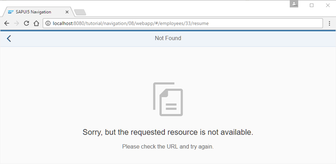
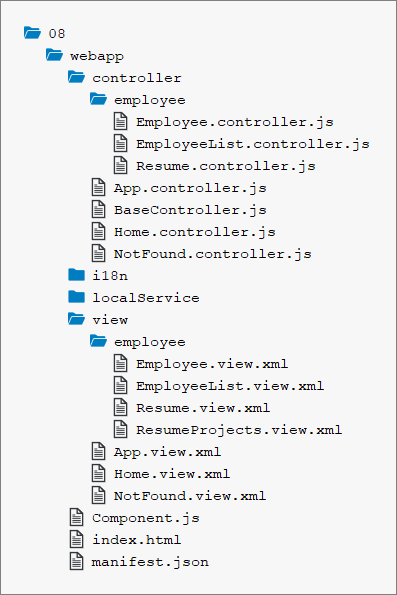

<!-- loio3e5f6f3e163f46ecaef376950258e5e4 -->

# Step 8: Navigate with Flip Transition

In this step, we want to illustrate how to navigate to a page with a custom transition animation. Both forward and backward navigation will use the "flip" transition but with a different direction. We will create a simple link on the *Employee* view that triggers a flip navigation to a page that displays the resume data of a certain employee. Pressing the *Back* button will navigate back to the *Employee* view with a reversed flip transition.


## Preview

  
  
**Employee Details page with Flip to Resume link**


  
  
**Resume page with multiple tabs**


  
  
**Not Found page for resume**




## Coding

You can view and download all files in the *Samples* in the Demo Kit at [Routing and Navigation - Step 8](https://ui5.sap.com/#/entity/sap.ui.core.tutorial.navigation/sample/sap.ui.core.tutorial.navigation.08).

  
  
**Folder structure for this step**




## webapp/view/employee/Employee.view.xml

```xml
<mvc:View
	controllerName="sap.ui.demo.nav.controller.employee.Employee"
	xmlns="sap.m"
	xmlns:mvc="sap.ui.core.mvc"
	xmlns:f="sap.ui.layout.form"
	busyIndicatorDelay="0">
	<Page
		id="employeePage"
		title="{i18n>EmployeeDetailsOf} {FirstName} {LastName}"
		showNavButton="true"
		navButtonPress=".onNavBack"
		class="sapUiResponsiveContentPadding">
		<content>
			<Panel
				id="employeePanel"
				width="auto"
				class="sapUiResponsiveMargin sapUiNoContentPadding">
				<headerToolbar>
					<Toolbar>
						<Title text="{i18n>EmployeeIDColon} {EmployeeID}" level="H2"/>
						<ToolbarSpacer />
						<Link text="{i18n>FlipToResume}" tooltip="{i18n>FlipToResume.tooltip}" press=".onShowResume"/>
					</Toolbar>
				</headerToolbar>
				<content>
					...
				</content>
			</Panel>
		</content>
	</Page>
</mvc:View>
```

First we add the *Flip to Resume* link to the *Employee Details* view to trigger the navigation to the resume of the employee that is currently displayed.


## webapp/controller/employee/Employee.controller.js

```js
sap.ui.define([
	"sap/ui/demo/nav/controller/BaseController"
], function (BaseController) {
	"use strict";
	return BaseController.extend("sap.ui.demo.nav.controller.employee.Employee", {
		...
		_onBindingChange : function (oEvent) {
			// No data for the binding
			if (!this.getView().getBindingContext()) {
				this.getRouter().getTargets().display("notFound");
			}
		}
			...
		},
		onShowResume : function (oEvent) {
			var oCtx = this.getView().getElementBinding().getBoundContext();

			this.getRouter().navTo("employeeResume", {
				employeeId : oCtx.getProperty("EmployeeID")
			});
		}

	});
});
```

Then we change the `Employee.controller.js` file by adding the press handler `onShowResume` for the *Flip to Resume* link. The handler simply navigates to a new route `employeeResume` and fills the mandatory parameter `employeeId` with the property `EmployeeID` from the view's bound context. The route `employeeResume` is not available yet, so we will have to add it to our routing configuration.


## webapp/manifest.json

```js
{
	"_version": "1.12.0",
	"sap.app": {
		...
	},
	"sap.ui": {
		...
	},
	"sap.ui5": {
		...
		"routing": {
			"config": {
				"routerClass": "sap.m.routing.Router",
				"type": "View",
				"viewType": "XML",
				"path": "sap.ui.demo.nav.view",
				"controlId": "app",
				"controlAggregation": "pages",
				"transition": "slide",
				"bypassed": {
					"target": "notFound"
				}
			},
			"routes": [{
				"pattern": "",
				"name": "appHome",
				"target": "home"
			}, {
				"pattern": "employees",
				"name": "employeeList",
				"target": "employees"
			}, {
				"pattern": "employees/{employeeId}",
				"name": "employee",
				"target": "employee"
			}, {
				"pattern": "employees/{employeeId}/resume",
				"name": "employeeResume",
				"target": "employeeResume"
			}],
			"targets": {
				"home": {
					"id": "home",
					"name": "Home",
					"level" : 1
				},
				"notFound": {
					"id": "notFound",
					"name": "NotFound",
					"transition": "show"
				},
				"employees": {
					"id": "employees",
					"path": "sap.ui.demo.nav.view.employee",
					"name": "EmployeeList",
					"level" : 2
				},
				"employee": {
					"id": "employee",
					"name": "employee.Employee",
					"level" : 3
				},
				"employeeResume": {
					"id": "resume",
					"name": "employee.Resume",
					"level" : 4,
					"transition": "flip"
				}
			}
		}
	}
}
```

In the routing configuration, we add a new route `employeeResume` which references a target with the same name. The route's pattern expects an `{employeeId}` as a mandatory parameter and ends with the static string `/resume`.

The target `employeeResume` references the view `employee.Resume` that we are about to create. The target's `level` is `4`; compared to the employee target this is one level lower again. To configure a flip navigation, we simply set the transition of our target to `flip`. Together with the correct `level` configuration this will trigger the correct forward and backward flip navigation whenever the target is displayed.

> ### Note:  
> Possible values for the `transition` parameter are:
> 
> -   `slide` \(default\)
> 
> -   `flip`
> 
> -   `show`
> 
> -   `fade`
> 
> 
> You can also implement your own transitions and add it to a control that extends `sap.m.NavContainer` \(for example, `sap.m.App` or `sap.m.SplitApp`\). For more information, see the [API Reference: `NavContainer`](https://ui5.sap.com/#/api/sap.m.NavContainer). 


## webapp/view/employee/Resume.view.xml \(New\)

```xml
<mvc:View
	controllerName="sap.ui.demo.nav.controller.employee.Resume"
	xmlns="sap.m"
	xmlns:mvc="sap.ui.core.mvc">
	<Page
		title="{i18n>ResumeOf} {FirstName} {LastName}"
		id="employeeResumePage"
		showNavButton="true"
		navButtonPress=".onNavBack">
		<content>
			<IconTabBar
				id="iconTabBar"
				headerBackgroundDesign="Transparent"
				class="sapUiResponsiveContentPadding"
				binding="{Resume}">
				<items>
					<IconTabFilter id="infoTab" text="{i18n>tabInfo}" key="Info">
						<Text text="{Information}"/>
					</IconTabFilter>
					<IconTabFilter id="projectsTab" text="{i18n>tabProjects}" key="Projects">
						<mvc:XMLView viewName="sap.ui.demo.nav.view.employee.ResumeProjects"></mvc:XMLView>
					</IconTabFilter>
					<IconTabFilter id="hobbiesTab" text="{i18n>tabHobbies}" key="Hobbies">
						<Text text="{Hobbies}"/>
					</IconTabFilter>
					<IconTabFilter id="notesTab" text="{i18n>tabNotes}" key="Notes">
						<Text text="{Notes}"/>
					</IconTabFilter>
				</items>
			</IconTabBar>
		</content>
	</Page>
</mvc:View>

```

Create a file `Resume.view.xml` inside the `webapp/view/employee` folder. The view uses an `IconTabBar` to display the resume data. Therefore, its binding attribute is set to `{Resume}`.

In the `IconTabBar` we display four tabs. Three of them simply use a `Text` control to display the data from the service. The *Projects* tab uses a nested XML view to display the projects of the employee. SAPUI5 takes care of loading the XML view automatically when the user navigates to the *Resume* page.


## webapp/controller/employee/Resume.controller.js \(New\)

```js
sap.ui.define([
	"sap/ui/demo/nav/controller/BaseController"
], function (BaseController) {
	"use strict";
	return BaseController.extend("sap.ui.demo.nav.controller.employee.Resume", {
		onInit: function () {
			var oRouter = this.getRouter();
			oRouter.getRoute("employeeResume").attachMatched(this._onRouteMatched, this);
		},
		_onRouteMatched : function (oEvent) {
			var oArgs, oView;
			oArgs = oEvent.getParameter("arguments");
			oView = this.getView();
			oView.bindElement({
				path : "/Employees(" + oArgs.employeeId + ")",
				events : {
					change: this._onBindingChange.bind(this),
					dataRequested: function (oEvent) {
						oView.setBusy(true);
					},
					dataReceived: function (oEvent) {
						oView.setBusy(false);
					}
				}
			});
		},
		_onBindingChange : function (oEvent) {
			// No data for the binding
			if (!this.getView().getBindingContext()) {
				this.getRouter().getTargets().display("notFound");
			}
		}
	});
});
```

Create a file `Resumee.controller.js` in the `webapp/controller/employee` folder. In this controller, we make sure to bind the view to the correct employee whenever the `employeeResume` route has matched. We have already used this approach in the previous step so you should be able to recognize the building blocks in the code above. Again, in case the user cannot be found we display the `notFound` target.


## webapp/view/employee/ResumeProjects.view.xml \(New\)

```xml

<mvc:View xmlns="sap.m" xmlns:mvc="sap.ui.core.mvc">
	<Text text="{Projects}"/>
</mvc:View>
```

Create a file `ResumeProjects.view.xml` in the `webapp/view/employee` folder. This view does not have a controller as we don't need it. It just displays a `Text` control with the projects text of the selected employee. It illustrates that using nested views works just fine in combination with navigation and routing in SAPUI5.

> ### Note:  
> For more complex applications, the performance is significantly increased if parts of the UI are only loaded when the user is actively selecting it. In this example, the view is always loaded even though the user never decided to display the project information. In the next steps, we will extend the UI so that the content is loaded "lazy" by SAPUI5 only when the filter item is clicked. The back-end service will fetch the data only on request and the UI will only have to be updated with the selected data instead of loading all data.


## webapp/i18n/i18n.properties

```ini
...
ResumeOf=Resume of
tabInfo=Info
tabProjects=Projects
tabHobbies=Hobbies
tabNotes=Notes
FlipToResume=Flip to Resume
FlipToResume.tooltip=See the resume of this employee
```

Add the new texts to the `i18n.properties` file.

You can go to `webapp/index.html#/employees/3` and click on the *Flip to Resume* link to be redirected with a nice flip transition to the employee's resume. The back navigation uses a reverse flip navigation to get back to the *Employee Details* page. You can also directly navigate to `webapp/index.html#/employees/3/resume` or `webapp/index.html#/employees/33/resume` to see what happens.

**Related Information**  


[API Reference: `sap.m.NavContainer`](https://ui5.sap.com/#/api/sap.m.NavContainer)

[API Overview and Samples: `sap.m.NavContainer` ](https://ui5.sap.com/#/entity/sap.m.NavContainer)

