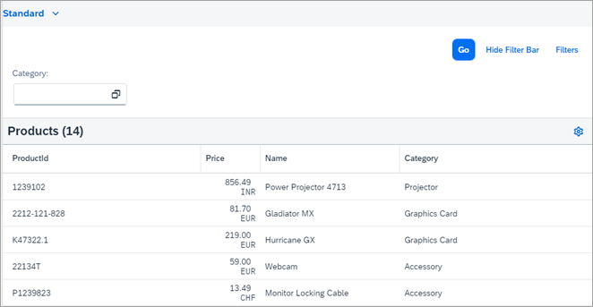
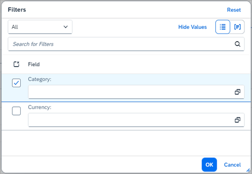

<!-- loiob1d4d261524b4a3da78547ed4283a082 -->

# Step 8: Page Variant Management

In this step, we will look at the page variant of the `VariantManagement` control, an enhanced function of the `SmartVariantManagement` control that can handle multiple smart controls.

Basically, the paged version of the `VariantManagement` control is the same as the \(non-paged\) `VariantManagement` control. The difference is that the page variant is initialized with the `persistencyKey` property and can handle the persistency of multiple smart controls. Each smart control that uses personalization via the page variant has to provide a persistency key. The persistency itself will be stored under the `persistencyKey` of the `VariantManagement` control, and the relevant content for each control will be distributed accordingly based on each individual persistency key.

 `persistencyKey` - `VariantManagement` control

-   `persistencyKey` - `SmartFilterBar` control-relevant content

-   `persistencyKey` `SmartTable` control-relevant content


Therefore, the persistent content of the page variant is the aggregated content of each registered smart control, and the individual persistency keys of the various smart controls are used to distinguish and distribute the relevant content.


## Preview

As a page variant, the view management is now no longer part of the `SmartFilterBar` and `SmartTable` controls, but displayed in a central location instead:

   
  
<a name="loiob1d4d261524b4a3da78547ed4283a082__fig_vkx_wpr_zv"/>Central View Management

  

In addition, the `VariantManagement` control is no longer displayed in the *Filters* dialog of the `SmartFilterBar` control:

   
  
<a name="loiob1d4d261524b4a3da78547ed4283a082__fig_byl_qjx_zv"/>Filter Dialog Without View Management

  

Other than that, the page variant is just the same as the `VariantManagement` control.


## Coding

You can view and download all files in the *Samples* in the Demo Kit at [Smart Controls - Step 8 - Page Variant Management](https://ui5.sap.com/#/entity/sap.ui.comp.tutorial.smartControls/sample/sap.ui.comp.tutorial.smartControls.08) .


## VariantManagement.view.xml

```xml
<mvc:View 
	       xmlns="sap.m"
       xmlns:mvc="sap.ui.core.mvc"
       controllerName="sap.ui.demo.smartControls.VariantManagement"
       xmlns:smartFilterBar="sap.ui.comp.smartfilterbar"
       xmlns:smartTable="sap.ui.comp.smarttable">
       <smartFilterBar:SmartFilterBar 
             id="smartFilterBar"
             entitySet="Products"
             persistencyKey="SmartFilterPKey">
             <smartFilterBar:controlConfiguration>
                    <smartFilterBar:ControlConfiguration
                           key="Category" 
                           visibleInAdvancedArea="true"
                           preventInitialDataFetchInValueHelpDialog="false">
                    </smartFilterBar:ControlConfiguration>
             </smartFilterBar:controlConfiguration>
       </smartFilterBar:SmartFilterBar>
       <smartTable:SmartTable 
             id="smartTable_ResponsiveTable"
             smartFilterId="smartFilterBar" 
             tableType="ResponsiveTable" 
             editable="false"
             entitySet="Products" 
             useVariantManagement="true"
             useTablePersonalisation="true" 
             header="Products" 
             showRowCount="true"
             useExportToExcel="false" 
             enableAutoBinding="true"
             persistencyKey="SmartTablePKey">
       </smartTable:SmartTable>
</mvc:View>
```

The example shows the view management **without** a page variant.


## VariantManagement.view.xml

```xml
<mvc:View 
	       controllerName="sap.ui.demo.smartControls.VariantManagement"
       xmlns="sap.m"
       xmlns:mvc="sap.ui.core.mvc"
       xmlns:html="http://www.w3.org/1999/xhtml"      
       xmlns:smartVariantManagement="sap.ui.comp.smartvariants"    
       xmlns:smartFilterBar="sap.ui.comp.smartfilterbar"     
       xmlns:smartTable="sap.ui.comp.smarttable">

       <HBox class="exPageVariantPadding">                                                
       <smartVariantManagement:SmartVariantManagement        
             id="pageVariantId"
             persistencyKey="PageVariantPKey" />     
       </HBox>             
       <smartFilterBar:SmartFilterBar 
             id="smartFilterBar"
             entitySet="Products"
             smartVariant="pageVariantId"
             persistencyKey="SmartFilterPKey" assignedFiltersChanged="onFiltersChanged">
             <smartFilterBar:controlConfiguration>
                    <smartFilterBar:ControlConfiguration
                           key="Category" 
                           visibleInAdvancedArea="true"
                           preventInitialDataFetchInValueHelpDialog="false">
                    </smartFilterBar:ControlConfiguration>
             </smartFilterBar:controlConfiguration>
       </smartFilterBar:SmartFilterBar>
       <smartTable:SmartTable 
             id="smartTable_ResponsiveTable"
             smartFilterId="smartFilterBar" 
             smartVariant="pageVariantId"            
             tableType="ResponsiveTable" 
             editable="false"
             entitySet="Products" 
             useVariantManagement="true"
             useTablePersonalisation="true" 
             header="Products" 
             showRowCount="true"
             useExportToExcel="false" 
             enableAutoBinding="true"
             persistencyKey="SmartTablePKey">
       </smartTable:SmartTable>
</mvc:View>
```

The example shows the view management **with** a page variant.

**Parent topic:** [Smart Controls](smart-controls-64bde9a.md "In this tutorial you learn how to work with smart controls.")

**Next:** [Step 7: View Management](step-7-view-management-97fc0ea.md "The VariantManagement control allows you to handle views and makes it possible for the user to persist changes carried out on the UI and then later retrieve these changes.")

**Previous:** [Step 9: Smart Chart with Chart Personalization and View Management](step-9-smart-chart-with-chart-personalization-and-view-management-0219b11.md "In this step, we will look at the SmartChart control with the chart personalization and in combination with the VariantManagement control that allow you to use complex graphics along with other smart control features.")

