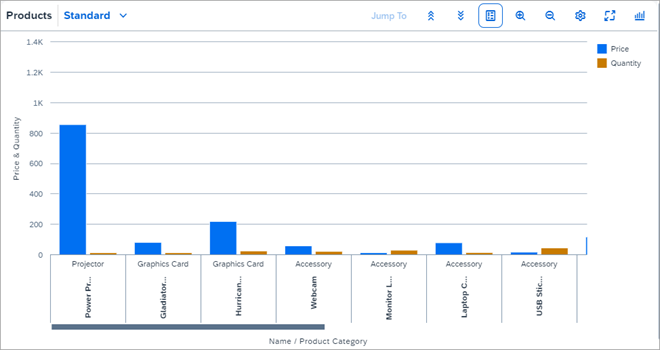
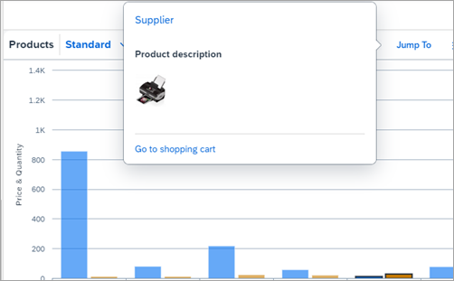
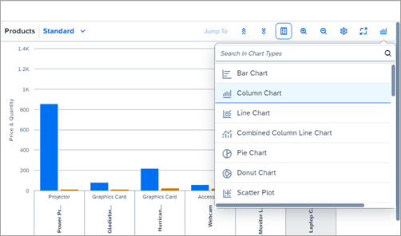
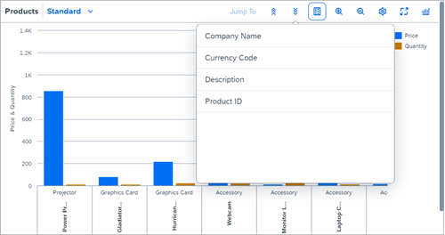
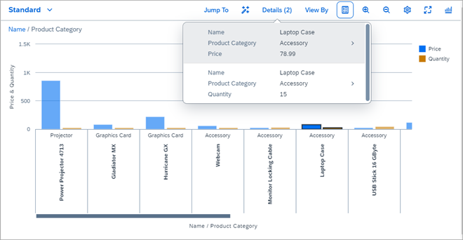
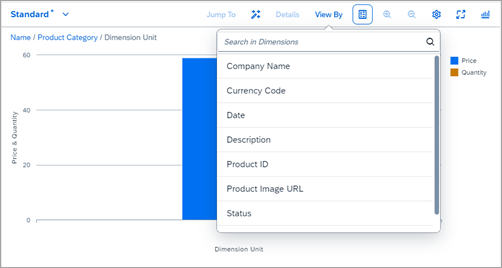
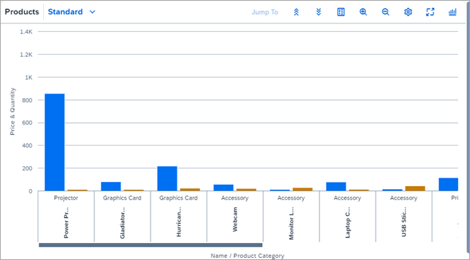
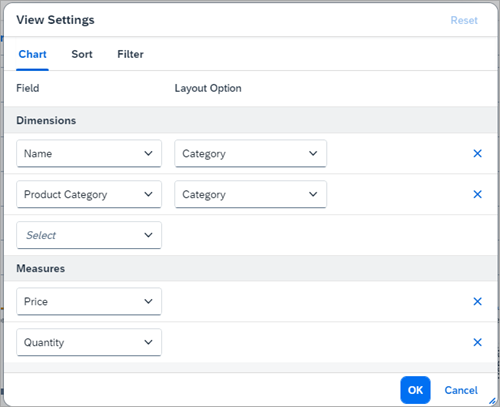

<!-- loio0219b115deda45a9ae46d11fdc7e69eb -->

# Step 9: Smart Chart with Chart Personalization and View Management

In this step, we will look at the `SmartChart` control with the chart personalization and in combination with the `VariantManagement` control that allow you to use complex graphics along with other smart control features.

The `SmartChart` control can be used for visualizing data in a graphical manner. The `SmartChart` control creates a chart based on OData metadata and the configuration data that has been specified. The `entitySet` property must be specified to use the control. This property is used to fetch fields from OData metadata, from which the chart UI is generated.

There are several features that can be enabled in `SmartChart`, but for this tutorial, we will have a look at the following features:

-   Chart personalization

-   View management support

-   Semantic object navigation using `SemanticObjectController`


## Preview

This is what the smart chart looks like initially after firing the query:

  
  
**Initial Look of Smart Chart after Firing Query**



The toolbar of the smart chart contains the header, and next to it is the view management dialog that has been explained in detail in one of the previous steps.

Next to the view management dialog is a button labeled *Jump To*. This button is disabled by default, but once a column has been selected inside the chart, this button gets enabled. When we click this button, a popup appears that contains details of the selected column. You can also navigate to related apps from here. This feature is enabled using `SemanticObjectController`. When we hover the mouse pointer over a column, a popup is displayed to provide additional information.

  
  
**Semantic Navigation Feature**



The button at the right-hand side of the toolbar can be used for selecting the chart type:

  
  
**Selection of Chart Type**



The two buttons next to the *Jump To* button can be used to drill up and drill down into the chart. Using this feature you can display even more detailed information in the chart:

  
  
**Drillup and Drilldown Features**



If we set the `showDetailsButton` and `showDrillBreadcrumbs` properties to `true`, we can also use an alternative drilldown function: A button labeled *Drilldown* is shown. If a column is selected inside the chart, this button changes into a *Details* button. When you click this button, again, a popup appears that contains details of the selected column.

  
  
**Drilldown by Dimensions**



When you drill further down, you can see the breadcrumbs trail for the drilldown path on the left-hand side, which you can also use to drill up within the chart.

  
  
**Further Drilldown**



The next button can be used to toggle legend visibility:

  
  
**Toggle Legend Visibility**



The two buttons next to this in the toolbar are used for zooming in or out. This will help you to get a clearer picture of a particular entity. The next button in the toolbar is the *Settings* icon that opens the personalization dialog for the chart:

  
  
**Dialog for Adding Measures and Dimensions**



The button next to the settings can be used to display a chart in full screen mode. The chart will then take up 100 % width and height of the browser.


## Coding

You can view and download all files in the *Samples* in the Demo Kit at [Smart Controls - Step 9 - Smart Chart](https://ui5.sap.com/#/sample/sap.ui.comp.tutorial.smartControls.09/preview) and at [Samples](https://ui5.sap.com/#/entity/sap.ui.comp.smartchart.SmartChart).


## SmartChart.view.xml

```xml
<mvc:View xmlns="sap.m" xmlns:mvc="sap.ui.core.mvc"
	xmlns:html="http://www.w3.org/1999/xhtml"
	xmlns:app="http://schemas.sap.com/sapui5/extension/sap.ui.core.CustomData/1"
	controllerName="sap.ui.demo.smartControls.SmartChart" xmlns:sl="sap.ui.comp.navpopover"
	xmlns:smartChart="sap.ui.comp.smartchart">
	<smartChart:SmartChart enableAutoBinding="true"
		entitySet="Products" useVariantManagement="true"
		persistencyKey="SmartChart_Explored" useChartPersonalisation="true"
		header="Products">
		<smartChart:semanticObjectController>
			<sl:SemanticObjectController
				navigationTargetsObtained="onNavigationTargetsObtained" navigate="onNavigate" />
		</smartChart:semanticObjectController>
	</smartChart:SmartChart>
</mvc:View>

```

We see that a new control has been added to the `view.xml`. In the `SmartChart` control, we refer to the entity type that we will see later in the `metadata.xml`. With `SemanticObjectController` that is added to the `semanticObjectController` aggregation of `SmartChart`, we can enable the display of linked data for a particular entity. We also set `enableAutoBinding="true"`, which enables automatic execution of the query and thus shows the result as soon as the `SmartChart` control is loaded. We set `useVariantManagement="true"` and `persistencyKey="SmartChart_Explored"` to enable the view management. We also set `useChartPersonalisation="true"`, which enables the chart personalization.


## SmartChart.controller.js

```js
sap.ui.define([
	"sap/ui/core/mvc/Controller",
	"sap/m/MessageBox"
], function(Controller, MessageBox) {
	"use strict";

	return Controller.extend("sap.ui.demo.smartControls.SmartChart", {
		onNavigationTargetsObtained: function(oEvent) {
			var oParameters = oEvent.getParameters();
			var oSemanticAttributes = oParameters.semanticAttributes;

			oParameters.show("Supplier", new sap.ui.comp.navpopover.LinkData({
				text: "Homepage",
				href: "http://www.sap.com",
				target: "_blank"
			}), [
				new sap.ui.comp.navpopover.LinkData({
					text: "Go to shopping cart"
				})
			], new sap.ui.layout.form.SimpleForm({
				maxContainerCols: 1,
				content: [
					new sap.ui.core.Title({
						text: "Product description"
					}), new sap.m.Image({
						src: "img/HT-1052.jpg", //oSemanticAttributes.ProductPicUrl,
						densityAware: false,
						width: "50px",
						height: "50px",
						layoutData: new sap.m.FlexItemData({
							growFactor: 1
						})
					}), new sap.m.Text({
						text: oSemanticAttributes.Description
					})
				]
			}));
		},

		onNavigate: function(oEvent) {
			var oParameters = oEvent.getParameters();
			if (oParameters.text === "Homepage") {
				return;
			}
			MessageBox.show(oParameters.text + " has been pressed", {
				icon: sap.m.MessageBox.Icon.INFORMATION,
				title: "SmartChart demo",
				actions: [
					sap.m.MessageBox.Action.OK
				]
			});
		}
	});

});

```

The following two functions are defined:

-   `onNavigationTargetObtained()`

-   `onNavigate()`


`onNavigationTargetObtained()` is called when a column is selected and you click the *Jump To* button. With the click event the semantic parameters are obtained, and the function renders a navigation popover containing a simple form that presents detailed information of the entity selected as can be seen in figure 2.

`onNavigate()` is called when the links in the navigation popover are clicked. This is done to demonstrate how you add more functionality to the data in the navigation popover. In our example, we are just showing a message box and the navigation to one other link.


## metadata.xml

```xml
<?xml version="1.0" encoding="utf-8"?>
<edmx:Edmx Version="1.0"
	xmlns:edmx="http://schemas.microsoft.com/ado/2007/06/edmx"
	xmlns:m="http://schemas.microsoft.com/ado/2007/08/dataservices/metadata"
	xmlns:sap="http://www.sap.com/Protocols/SAPData">
	<edmx:Reference
		xmlns:edmx="http://docs.oasis-open.org/odata/ns/edmx">
		<edmx:Include Namespace="com.sap.vocabularies.Common.v1"
			Alias="Common" />
	</edmx:Reference>
	<edmx:Reference
		xmlns:edmx="http://docs.oasis-open.org/odata/ns/edmx">
		<edmx:Include Namespace="com.sap.vocabularies.UI.v1"
			Alias="UI" />
	</edmx:Reference>
	<edmx:DataServices m:DataServiceVersion="2.0">
		<Schema Namespace="com.sap.wt08"
			sap:schema-version="0" xmlns="http://schemas.microsoft.com/ado/2008/09/edm">
			<EntityType Name="Product" sap:service-schema-version="1"
				sap:service-version="1" sap:semantics="aggregate"
				sap:content-version="1">
				<Key>
					<PropertyRef Name="ProductId" />
				</Key>
				<Property Name="ProductId" Type="Edm.String" Nullable="false"
					MaxLength="10" sap:aggregation-role="dimension" sap:label="Product ID"
					sap:creatable="false" sap:updatable="false" sap:sortable="true"
					sap:filterable="true" />
				<Property Name="Category" Type="Edm.String" Nullable="false"
					MaxLength="40" sap:aggregation-role="dimension" sap:label="Product Category"
					sap:creatable="false" sap:updatable="false" sap:sortable="true"
					sap:filterable="true" />
				<Property Name="Name" Type="Edm.String" Nullable="false"
					MaxLength="255" sap:aggregation-role="dimension" sap:label="Name"
					sap:creatable="false" sap:updatable="false" sap:sortable="true"
					sap:filterable="true" />
				<Property Name="Description" Type="Edm.String" Nullable="false"
					MaxLength="255" sap:aggregation-role="dimension" sap:label="Description"
					sap:creatable="false" sap:updatable="false" sap:sortable="true"
					sap:filterable="true" />
				<Property Name="SupplierName" Type="Edm.String" Nullable="false"
					MaxLength="80" sap:aggregation-role="dimension" sap:label="Company Name"
					sap:creatable="false" sap:updatable="false" sap:sortable="true"
					sap:filterable="true" />
				<Property Name="Quantity" Type="Edm.Decimal" Nullable="false"
					MaxLength="3" sap:aggregation-role="measure" sap:label="Quantity"
					sap:creatable="false" sap:updatable="false" sap:sortable="true"
					sap:filterable="true" />
				<Property Name="Price" Type="Edm.Decimal" Nullable="false"
					Precision="23" Scale="4" sap:aggregation-role="measure" sap:label="Price"
					sap:creatable="false" sap:updatable="false" sap:sortable="true"
					sap:filterable="true" />
				<Property Name="CurrencyCode" Type="Edm.String" Nullable="false"
					MaxLength="5" sap:aggregation-role="dimension" sap:label="Currency Code"
					sap:creatable="false" sap:updatable="false" sap:sortable="true"
					sap:filterable="true" />
			</EntityType>
			<EntityContainer Name="com.sap.wt08"
				m:IsDefaultEntityContainer="true">
				<EntitySet Name="Products" EntityType="com.sap.wt08.Product"
					sap:creatable="false" sap:updatable="false" sap:deletable="false"
					sap:pageable="false" sap:content-version="1" />
			</EntityContainer>
			<Annotations Target="com.sap.wt08.Product"
				xmlns="http://docs.oasis-open.org/odata/ns/edm">
				<Annotation Term="com.sap.vocabularies.UI.v1.LineItem">
					<Collection>
						<Record Type="com.sap.vocabularies.UI.v1.DataField">
							<PropertyValue Property="Value" Path="Name" />
							<Annotation Term="com.sap.vocabularies.UI.v1.Importance"
								EnumMember="com.sap.vocabularies.UI.v1.ImportanceType/High" />
						</Record>
						<Record Type="com.sap.vocabularies.UI.v1.DataField">
							<PropertyValue Property="Value" Path="Category" />
							<Annotation Term="com.sap.vocabularies.UI.v1.Importance"
								EnumMember="com.sap.vocabularies.UI.v1.ImportanceType/High" />
						</Record>
					</Collection>
				</Annotation>
			</Annotations>
			<Annotations Target="com.sap.wt08.Product"
				xmlns="http://docs.oasis-open.org/odata/ns/edm">
				<Annotation Term="com.sap.vocabularies.UI.v1.Chart">
					<Record>
						<PropertyValue Property="Title" String="Line Items" />
						<PropertyValue Property="ChartType"
							EnumMember="com.sap.vocabularies.UI.v1.ChartType/Column" />
						<PropertyValue Property="Dimensions">
							<Collection>
								<PropertyPath>Name</PropertyPath>
								<PropertyPath>Category</PropertyPath>
							</Collection>
						</PropertyValue>
						<PropertyValue Property="Measures">
							<Collection>
								<PropertyPath>Price</PropertyPath>
								<PropertyPath>Quantity</PropertyPath>
							</Collection>
						</PropertyValue>
					</Record>
				</Annotation>
			</Annotations>
			<Annotations Target="com.sap.wt08.Product/Category"
				xmlns="http://docs.oasis-open.org/odata/ns/edm">
				<Annotation Term="com.sap.vocabularies.Common.v1.SemanticObject"
					String="SemanticObjectCategory" />
			</Annotations>
		</Schema>
	</edmx:DataServices>
</edmx:Edmx>

```

The most important point to keep in mind is that analytical annotations along with chart annotations need to exist in the `metadata.xml`. The most prominent annotations are listed below:

-   `sap:semantics="aggregate"`

    An analytical operation can be performed on the data. This has to be added to `EntityType` \(in our case "Product"\)

-   `sap:aggregation-role="dimension"`

    Defines that a property of `EntityType` is treated as a dimension.

-   `sap:aggregation-role="measure"`

    Defines that a property of `EntityType` is treated as a measure.

-   `Annotation Term="com.sap.vocabularies.UI.v1.Chart`

    Defines the UI annotation for rendering a chart.

-   `EnumMember="com.sap.vocabularies.UI.v1.ChartType/Column"`

    Defines the default chart type.

-   `Annotation Term="com.sap.vocabularies.Common.v1.SemanticObject"`

    Defines the `SemanticObject` annotation for `EntityType` \(in our case the product category\).


## Products.json

```js
[
  {
	"ProductId": "1239102",
	"Name": "Power Projector 4713",
	"Category": "Projector",
	"SupplierName": "Titanium",
	"Description": "A very powerful projector with special features for Internet usability, USB",
	"WeightMeasure": 1467,
	"WeightUnit": "g",
	"Price": 856.49,
	"CurrencyCode": "EUR",
	"Status": "Available",
	"Quantity": 3,
	"UoM": "PC",
	"Width": 51,
	"Depth": 42,
	"Height": 18,
	"DimUnit": "cm"
  },
.
.
.
]

```

We have only listed a part of the `Products.json` entries since the actual values are not so relevant. Please note that for your convenience we have included additional properties in this file to make it easier to experiment with changes of the `metadata.xml`, and possibly of the `view.xml`, to allow for a more hands-on experience.

