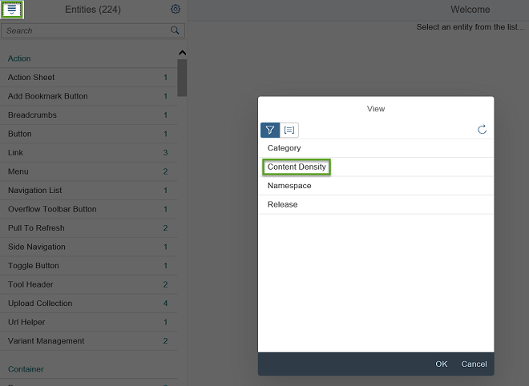

<!-- loioe54f729da8e3405fae5e4fe8ae7784c1 -->

# Content Densities

The devices used to run apps that are developed with SAPUI5 run on various different operating systems and have very different screen sizes. SAPUI5 contains different content densities for certain controls that allow your app to adapt to the device in question, allowing you to display larger controls for touch-enabled devices and a smaller, more compact design for devices that are operated by mouse.

## Available Content Densities

The table below shows the content densities that are available for the Quartz Light, Belize, Blue Crystal, and high-contrast themes:

<table>
<tr>
<th valign="top">

Content Density

</th>
<th valign="top">

CSS Class

</th>
<th valign="top">

Explanation

</th>
</tr>
<tr>
<td valign="top">

 *Cozy* 

</td>
<td valign="top">

 `sapUiSizeCozy` 

</td>
<td valign="top">

'Large' design: Dimensions of the controls are optimized for touch-enabled devices, such as smartphones, to allow users to interact with controls more easily.

This is the default density for most controls, particularly those in the `sap.m` library.

</td>
</tr>
<tr>
<td valign="top">

 *Compact* 

</td>
<td valign="top">

 `sapUiSizeCompact` 

</td>
<td valign="top">

Reduced-size design: The font size is the same as for the cozy density, but the dimensions of the controls and the spacing between them are reduced. This density is more suitable for mouse-operated devices, such as desktops.

For some controls, this is the default density.

</td>
</tr>
<tr>
<td valign="top">

 *Condensed* 

</td>
<td valign="top">

 `sapUiSizeCondensed` 

</td>
<td valign="top">

Size even further reduced compared to *Compact* \(in particular, row heights smaller\).

This density can be used for all tables of the `sap.ui.table` library.

</td>
</tr>
</table>

The following two screenshots show the difference between the *Cozy* and *Compact* densities, using a simple `sap.ui.table.Table` example:

   
  
**Cozy Density: Mainly for Touch Devices \(such as Smartphones\)**

 ") 

   
  
**Compact Density: Mainly for Mouse-Operated Devices \(such as Desktops\)**

 ") 

## Checking Which Content Densities Are Supported for a Control

If you need to know which content densities are supported for a particular control, the best place to look is the [Samples](https://ui5.sap.com/explored.html) section in the Demo Kit. After choosing a control from the list, look at the details in the Object Header area to see which density is supported. In the example shown below, the control supports both the *Compact* and *Cozy* content densities:

  

Alternatively, you can also use the filter function in the *Samples* in the Demo Kit to filter the controls according to their content densities. Simply choose the filter selection icon in the upper left corner of the screen and then select *Content Density*, as shown below:

  

## Setting Densities

You set the corresponding content density CSS class on the **container** for the part that you need to switch to the content density in question, not on the control itself. This is usually done within the administration settings of the SAP Fiori launchpad, but for a standalone scenario we recommend that you set it at a high level, such as `<body>`, as in most cases you will want to set it for the whole app.

> ### Note:  
> Be aware that you can only set **one** density within a hierarchy: Once you have set a CSS class at a high level, such as the one described above, it cascades all the way down, meaning you cannot revoke or overwrite it in the lower levels of your coding.

Thus, when using densities, you cannot mix them: You must not combine *Cozy* and *Compact* or *Cozy* and *Condensed* within the same hierarchy.

You can use densities in the following way:

-   *Cozy*

    Make sure you always only use the *Cozy* density within a hierarchy.

-   *Compact*

    Make sure you always only use the *Compact* density within a hierarchy.

-   *Condensed*

     *Condensed* is a special case and can only be used in combination with the *Compact* density.

    Also, keep in mind that the *Condensed* density has an effect on controls in the `sap.ui.table` library and their content only. If the density is set for controls outside of these tables, it will not have any effect on them.

