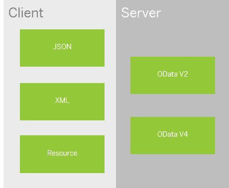

<!-- loioe1b625940c104b558e52f47afe5ddb4f -->

# Models

A model in the Model View Controller concept holds the data and provides methods to retrieve the data from the database and to set and update data.

SAPUI5 provides the following predefined models. For an overview of the binding modes supported by them, see [One-time Binding, One-way Binding, and Two-way Binding](data-binding-68b9644.md#loio68b9644a253741e8a4b9e4279a35c247__section_BindingModes).

-   **OData model**: Enables binding of controls to data from OData services. The OData model supports two-way, one-way and one-time binding modes. However, two-way binding is currently only supported for properties, and not for aggregations.

    > ### Note:  
    > The OData model currently supports the following OData versions:
    > 
    > -   OData V2
    > 
    > -   OData V4 \(limited feature scope\)

-   **JSON model**: Can be used to bind controls to JavaScript object data, which is usually serialized in the JSON format. The JSON model is a client-side model and, therefore, intended for small data sets, which are completely available on the client. The JSON model supports two-way \(default\), one-way and one-time binding modes.

-   **XML model**: A client-side model intended for small data sets, which are completely available on the client. The XML model does not contain mechanisms for server-based paging or loading of deltas. The XML model supports two-way \(default\), one-way and one-time binding modes.

-   **Resource model**: Designed to handle data in resource bundles, mainly to provide texts in different languages. The resource model only supports one-time binding mode because it deals with static texts only.

The JSON model, XML model, and the resource model are **client-side models**, meaning that the model data is loaded completely and is available on the client. Operations such as sorting and filtering are executed on the client without further server requests.

The OData \(V2 or V4\) model is a **server-side model** and only loads the data requested by the user interface from the server.

You can not only define one model for your applications, but define different areas in your application with different models and assign single controls to a model. You can also define nested models, for example, a JSON model defined for the application and an OData model for a table control contained in the application.

A Web application should support several data sources, such as JSON, XML, Atom, or OData. However, the way in which data binding is defined and implemented within the UI controls should be independent of the respective data source. It is also possible to create a custom model implementation for data sources that are not yet covered by the framework or are domain-specific.

**Related Information**  

[API Reference: `sap.ui.model`](https://ui5.sap.com/#/api/sap.ui.model)

