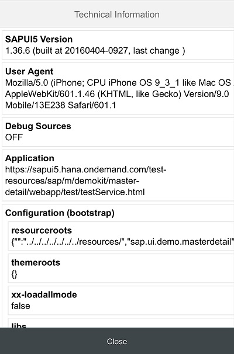
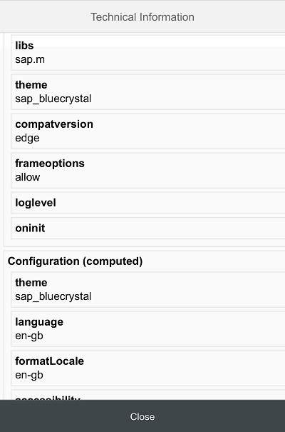
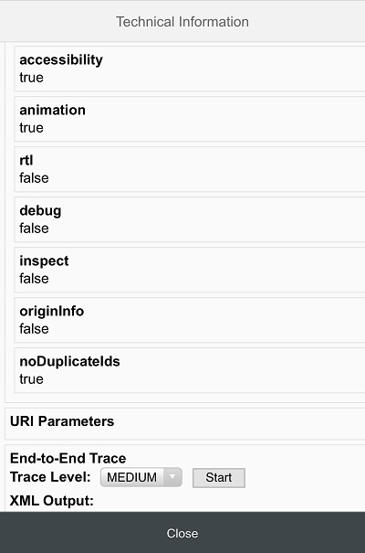
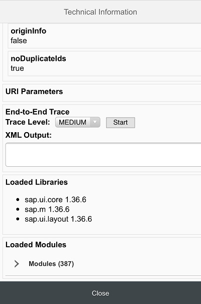

<!-- loio616a3ef07f554e20a3adf749c11f64e9 -->

# Technical Information Dialog

The *Technical Information* dialog shows details of the SAPUI5 version currently being used in an app built with SAPUI5. You can use the *Technical Information* dialog to enable debug resources and open additional support tools to debug your app.

To open the technical information dialog from within a supported desktop browser, use the following [shortcut](../02_Read-Me-First/keyboard-shortcuts-for-sapui5-tools-154844c.md):

  [Ctrl\] + [Shift\] + [Alt\] / [Option\] + [P\] 

The dialog contains the following information:

-   The **version number** of the currently loaded SAPUI5 distribution and the underlying OpenUI5 version that represent the core libraries of the framework and their build timestamps

    For more information, see [Versioning and Maintenance of SAPUI5](../02_Read-Me-First/versioning-and-maintenance-of-sapui5-91f0214.md) and [SAPUI5 vs. OpenUI5](../02_Read-Me-First/sapui5-vs-openui5-5982a97.md)

-   The **user agent** that is used for detecting the device's capabilities and device adaption

-   The root **URL** of the currently loaded app

You can download the technical information, so that you can attach it to a ticket for example, by clicking *Copy*.

 <a name="copyda1306a437244116b156c4428b3c5b5f"/>

<!-- copyda1306a437244116b156c4428b3c5b5f -->

## Loading Debug Sources

For performance reasons, the SAPUI5 files are loaded in a minified version, this means that all possible variable names are shortened and comments are removed. This makes debugging harder because the code is less readable.

For debugging, you first have to load the *Debug Sources*. You have the following options:

-   URL parameter `sap-ui-debug=true`

-   Select the *Use Debug Sources* in the *Technical Information Dialog*

    For more information, see [Technical Information Dialog](technical-information-dialog-616a3ef.md#loio616a3ef07f554e20a3adf749c11f64e9).

If you only want to load the debug sources for **specific packages**, you have the following options:

-   Add the module names to the `sap-ui-debug` URL parameter, separated by a comma. For example, `sap-ui-debug=sap/ui/core/Core.js,sap/m/InputType.js` loads the debug sources for the `sap.ui.core.Core` and `sap.m.InputType` libraries.

-   Choose the *Select specific modules* link in the *Technical Information Dialog*.

    For more information, see [Technical Information Dialog](technical-information-dialog-616a3ef.md#loio616a3ef07f554e20a3adf749c11f64e9).

After reloading the page, in the *Network* tab of the browser’s developer tools you can see that the controls and framework assets are now loaded individually and have a `-dbg` suffix. These are the source code files that include comments, the uncompressed code of the app, and the SAPUI5 artifacts.

Choose  [Ctrl\] + [O\]  \(Windows\) or  [Command\] + [O\]  \(macOS\) and type the name of an SAPUI5 artifact to view its source code in debug mode.

> ### Note:  
> Turning on debug sources also increases the log level. For more information, see [Logging and Tracing](logging-and-tracing-9f4d62c.md).
> 
> To improve performance, you must deactivate the debug sources once you're done with debugging.

 <a name="loiob5dcf47c7d4a4228ab40d77f835648e3"/>

<!-- loiob5dcf47c7d4a4228ab40d77f835648e3 -->

## Technical Information Dialog on Mobile Devices

On mobile devices, the *Technical Information* dialog provides some additional features.

-   *Configurations \(bootstrap\)* - Displays a list of bootstrap parameters.
-   *Configurations \(computed\)* - Displays a list of computed parameters.
-   *URI parameters* - Displays the variables passed from the URI query string.
-   *End-to-End Trace* - A function that traces communication to a different part of the app.
-   *Loaded Libraries* - Displays a list of the currently loaded libraries.
-   *Loaded Modules* - Displays a collapsible list of the currently loaded modules.

<a name="loiob5dcf47c7d4a4228ab40d77f835648e3__table_mr1_wbn_tv"/>Technical Information Dialog on Mobile Devices

<table>
<tr>
<td valign="top">

</td>
<td valign="top">

</td>
</tr>
<tr>
<td valign="top">

</td>
<td valign="top">

</td>
</tr>
</table>

### Accessing the Technical Information Dialog on Mobile Devices

To open the *Technical Information* dialog on your mobile device, proceed as follows:

1.  Press two fingers on a noninteractive screen area \(for example, a blank area\) for at least 3 seconds.
2.  Tap with a third finger while holding the other two on the screen.

> ### Restriction:  
> -   The *Technical Information* dialog can only be opened on mobile devices that support multi-touch.

  
  
<a name="loiob5dcf47c7d4a4228ab40d77f835648e3__fig_rlq_rlj_b1b"/>Gesture for opening the technical information dialog

### Using the End-to-End \(E2E\) Trace Function

The *E2E Trace* is used to create an XML file that traces the communication to a different part of your app.

To start the *E2E Trace*, proceed as follows:

1.  Select the detail level from the *Trace Level* dropdown list.
2.  Choose *Start*.
3.  Navigate to a different part of the application.

As a result, a dialog box opens indicating that your transaction has finished. Choose *OK* to continue running the current trace. Choose *Cancel* to stop the trace and display the result in a new window.

After stopping the trace, you can view the result and \(optionally\) upload it to a server by entering a `host name` and a `port number`, and then choosing *Submit*.

> ### Note:  
> The result of the last completed trace is also visible in the *XML Output* field when you open the *Technical Information* dialog again.

