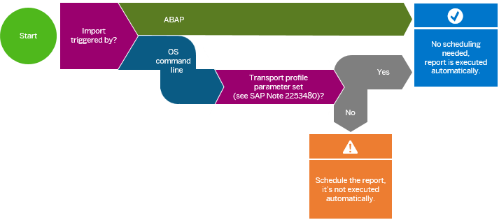

<!-- loiofbce0ba7a31f4073959efd705924af45 -->

# Calculation Report - Automatic Run vs. Manual Scheduling

Changes to the content of the SAPUI5 ABAP repository require the index to be updated using the calculation report `/UI5/APP_INDEX_CALCULATE`. Depending on how the content of the repository is changed, the report is executed automatically or you have to run it manually.

## Changes to Content in the Repository

This scenario usually happens in development systems. The content is changed, for example, by uploads from development tools like SAP Business Application Studio, the available SAPUI5 repository upload and download reports, the implementation of an SAP Note, or manual changes using transaction `SE80` \(the latter is not supported and therefore not recommended at all\).

The execution of the report to update the index is in most cases triggered automatically. Exceptions: implementation of SAP Notes, support package updates, release upgrades, changes to texts in the text repository with ABAP translation tools, and manual changes using transaction `SE80` \(not supported and therefore not recommended\). In these cases, you have to trigger an update for the applications in question manually or schedule a calculation of the index with a reasonable time interval. Here’s an overview:

<table>
<tr>
<th valign="top">

Type of Change to the SAPUI5 ABAP Repository

</th>
<th valign="top">

Manual Execution of the Calculation Report Required?

</th>
</tr>
<tr>
<td valign="top">

Deployment with SAP Business Application Studio 

</td>
<td valign="top" rowspan="3">

No, the report is executed automatically.

</td>
</tr>
<tr>
<td valign="top">

Upload with report `/UI5/UI5_REPOSITORY_LOAD` 

</td>
</tr>
<tr>
<td valign="top">

Installation of a new version of the SAPUI5 distribution layer

</td>
</tr>
<tr>
<td valign="top">

Implementation of an SAP Note containing changes for an SAPUI5 app

</td>
<td valign="top" rowspan="3">

Yes, run the report manually to update the index for the app or distribution layer in question.

</td>
</tr>
<tr>
<td valign="top">

Support package updates and release upgrades

</td>
</tr>
<tr>
<td valign="top">

Manual changes using transaction `SE80` \(not supported and therefore not recommended\)

</td>
</tr>
</table>

> ### Note:  
> If you run the report manually, it is strongly recommended to use the *Depending on Expiry Period of Transport Requests* option with reasonable values. This option calculates the SAPUI5 application index for affected content only. A full calculation should only be used in exceptional cases.

## Import of Content to the Repository

This scenario usually happens in test and production systems. The system automatically updates the index after transports which have been imported under certain conditions, for example, which version of the user interface add-on for SAP NetWeaver is installed and whether the Business Add-In \(BAdI\) CTS\_IMPORT\_FEEDBACK is called after an import. For more information, see SAP Note [2253480](https://me.sap.com/notes/2253480).

If you are unsure whether the BAdI is called, you can verify this in the import log of a transport. The BAdI is called if the import log contains a *Feedback after import or export* entry \(there might be one after import and one after export entry\) and the after import entry contains the following logs:

-   *Start: Executing method FEEDBACK\_AFTER\_IMPORT for business add-on CTS\_IMPORT\_FEEDBACK*

-   *Scheduled index update after finished import of transports*

You can access the job `/UI5/APP_IDX_UPD_AFTER_IMPORT` that is automatically scheduled by the BAdI in transaction `SM37`.

Here’s how you can decide whether you need to schedule the report after transports:

If the import is triggered by ABAP, report `/UI5/APP_INDEX_CALCULATE` is executed automatically. If the import is triggered by OS command line and the transport profile parameter `FEEDBACK_IMPORT` is set \(see SAP Note [2253480](https://me.sap.com/notes/2253480)\), the report is also executed automatically. If the transport profile parameter is not set, the report is not executed automatically.

If you have to schedule the report, there are three options for this:

-   With a periodic time interval

    This is the easiest way. However, it has the small disadvantage that some time might elapse between the import of a transport and the start of the update depending on the interval you choose.

-   Starting after event `SAP_IMPORT_STO`

    This triggers the report automatically after all transports of the import queue have been imported. However it doesn’t trigger the report in cases where you perform a special import of a single transport.

-   Schedule the report in both ways

    This is the most secure and fast way to ensure the index is up-to-date. The report ensures that no problems occur in cases where multiple executions are triggered in parallel.

