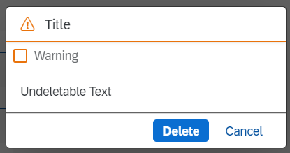

<!-- loio25885b6f62ec4f61bf9271553ef369cd -->

# Adapting Texts in the Delete Dialog Box Using Extensions \(List Report\)

You can adapt the text of the *Delete* dialog box that is displayed when you delete list report items.


## Context

> ### Note:  
> This topic is currently only applicable to SAP Fiori elements for OData V2.

> ### Caution:  
> Use app extensions with caution and only if you cannot produce the required behavior by other means, such as manifest settings or annotations. To correctly integrate your app extension coding with SAP Fiori elements, use only the extensionAPI of SAP Fiori elements. For more information, see [Using the extensionAPI](using-the-extensionapi-bd2994b.md).
> 
> After you've created an app extension, its display \(for example, control placing, CSS\) and system behavior \(for example, model and binding usage, busy handling\) of the app extension lies within the application's responsibility. SAP Fiori elements provides support only for the official extensionAPI functions. Don't access or manipulate SAP Fiori elements' internal coding.

The *Delete* dialog looks as follows:

  

It contains the following text:

-   *title*: always appears

-   *text*: always appears

-   *unsavedChanges*: appears except in the following cases:

    -   If only list report items with the editing status `unsavedChanges` are selected

    -   If only list report items with the editing status `unsavedChanges` and `locked` are selected

    -   If only list report items with the editing status `unsavedChanges` and items that cannot be deleted using the `deletablePath` feature are selected

    -   If only list report items with the editing status `unsavedChanges`, locked and items that cannot be deleted using the `deletablePath` feature are selected

    -   If only list report items selected with the editing status `unsavedChanges` are also items that cannot be deleted using the `deletablePath` feature


-   *undeletableText*: appears only if one or more selected items cannot be deleted using the `deletablePath` feature and the application has explicitly added `undeletableText` as part of extension.


> ### Note:  
> For information about how to adapt texts on the object page, see [Adapting Texts in the Delete Dialog Box \(Object Page Header\)](adapting-texts-in-the-delete-dialog-box-object-page-header-1fd8e52.md) and [Adapting Texts in the Delete Dialog Box \(Object Page with Nested Smart Table\)](adapting-texts-in-the-delete-dialog-box-object-page-with-nested-smart-table-b95adf3.md).


## Procedure

1.  Register your extension at the app descriptor \(manifest.json\) for the list report.

    > ### Sample Code:  
    > ```
    > 
    > "extends": {
    >     "extensions": {
    >         ...
    >          "sap.ui.controllerExtensions": {
    >             ...
    >             "sap.suite.ui.generic.template.ListReport.view.ListReport": { 
    >                 ...
    >                 "controllerName": "MY_APP.ext.controller.ListReportExtension",
    >                 ...
    >             }
    >         } 
    >         ...
    > 
    > ```

2.  Maintain the controller extension files in your app.

      

3.  Implement the function `'beforeDeleteExtension'` in the controller extension file of the list report. You have several options to determine the delete dialog box:

    -   The easy way

        > ### Sample Code:  
        > ```
        > 
        > beforeDeleteExtension: function(oBeforeDeleteProperties) {
        >     var oMessageText = {
        >         title: "My title";
        >         text: "My text",
        >         unsavedChanges: "My unsaved changes",
        >         undeletableText: "My undeletable text"
        >     };
        >     return oMessageText;
        > }
        > 
        > ```

    -   Using promises

        > ### Sample Code:  
        > ```
        > 
        > beforeDeleteExtension: function(oBeforeDeleteProperties) {
        >     var oMessageText = {
        >         title: "My title";
        >         text: "My text",
        >         unsavedChanges: "My unsaved changes",
        >         undeletableText: "My undeletable text"
        >     };
        >     return Promise.resolve(oMessageText);
        > }
        > 
        > ```

    -   Using the `extensionAPI.SecuredExecution` \(see also [Using the SecuredExecution Method](using-the-securedexecution-method-6a39150.md)\)

        > ### Sample Code:  
        > ```
        > 
        > beforeDeleteExtension: function(oBeforeDeleteProperties) {
        >     var oMessageText = {
        >         title: "My title";
        >         text: "My text",
        >         unsavedChanges: "My unsaved changes",
        >         undeletableText: "My undeletable text"
        >     };
        >     return this.extenionAPI.securedExecution(function() {
        >         return new Promise(function(resolve) {
        >             ...
        >             resolve(oMessageText);
        >             ...
        >         });
        >     });
        > }
        > 
        > ```


    > ### Note:  
    > The property `oBeforeDeleteProperties` contains information about the selected items for deletion of the list report.


