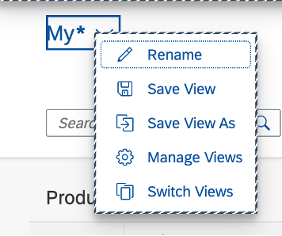
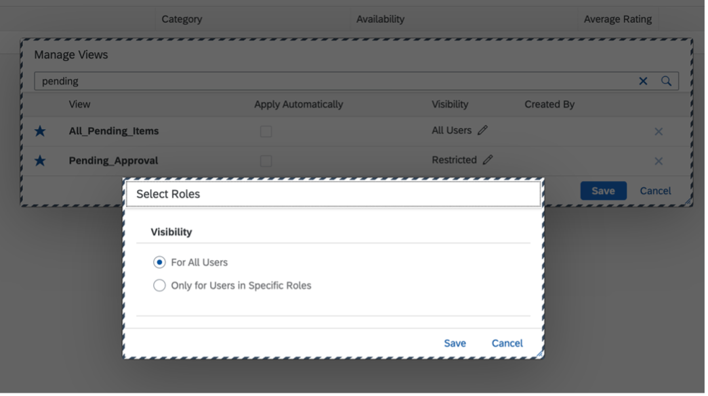

<!-- loio59bfd317ed5d4af3b490abbe7a9731d8 -->

# Adapting the UI

Both application developers and key users can extend and customize SAP Fiori applications.

For information about how application developers can enable an app for key user adaptation in SAP Fiori elements for OData V4, see [Enabling an App for Key User Adaptation](enabling-an-app-for-key-user-adaptation-ccd45ba.md).

<a name="loio59bfd317ed5d4af3b490abbe7a9731d8__section_tdl_vvp_jpb"/>

## Adaptation by Application Developers

App developers can adapt the UI at design time.

For information about the features that application developers can adapt in SAP Fiori elements for OData V2, see [Adapting the UI: List Report and Object Page](adapting-the-ui-list-report-and-object-page-0d2f1a9.md).

In SAP Fiori elements for OData V4, app developers adapt the UI via manifest settings. You can search for features and navigate to the related documentation for further details using the [SAP Fiori Elements Feature Map](sap-fiori-elements-feature-map-62d3f7c.md).

<a name="loio59bfd317ed5d4af3b490abbe7a9731d8__section_awd_b1q_jpb"/>

## Key User Adaptation

Key users can adapt the application at runtime by changing the UI from the initial state of the app to a personalized view for end users. In the *User Actions Menu*, key users can then choose *Adapt UI* and change the user interface of SAP Fiori apps directly. For more information about what you have to consider when developing apps that support key user adaptation, see [SAPUI5 Flexibility: Enable Your App for UI Adaptation](../05_Developing_Apps/sapui5-flexibility-enable-your-app-for-ui-adaptation-f1430c0.md). For more information about key user adaptation, refer to [SAPUI5 Flexibility: Adapting UIs Made Easy](../04_Essentials/sapui5-flexibility-adapting-uis-made-easy-a8e55aa.md).

> ### Note:  
> In SAP Fiori elements for OData V2, application developers should only allow key user adaptation for the use cases described in the section Additional Features in SAP Fiori elements for OData V2 below.

<a name="loio59bfd317ed5d4af3b490abbe7a9731d8__section_g15_g2n_gnb"/>

## Additional Features in SAP Fiori Elements for OData V2

### Variant Management

Key users can create public variants and deliver to all users or to users with specific roles. This is supported for page variants in list pages and table variants in list report and object pages.

Key users can also perform the following:

-   Modify existing public variants

-   Rename variants

-   Manage views by adding or removing favorites and modifying the visibility

   

You can extend and customize SAP Fiori applications using the SAPUI5 Visual Editor in SAP Web IDE.

> ### Caution:  
> SAP Web IDE is no longer available via SAP Business Technology Platform trial accounts. Any references to SAP Web IDE in this documentation are only relevant for you if you have access to SAP Web IDE through a productive SAP BTP account. Please consider SAP Business Application Studio as an alternative. See [App Development Using SAP Business Application Studio](../05_Developing_Apps/app-development-using-sap-business-application-studio-6bbad66.md).

For information about the features that you can adapt, see:

-   [Creating a Binding Change](creating-a-binding-change-4754094.md)

-   [Adapting the UI: Analytical List Page](adapting-the-ui-analytical-list-page-2c5fa29.md)

For more information about SAP Web IDE, see the documentation for SAP Web IDE on the SAP Help Portal at [https://help.sap.com/viewer/p/SAP\_Web\_IDE](https://help.sap.com/viewer/p/SAP_Web_IDE).

