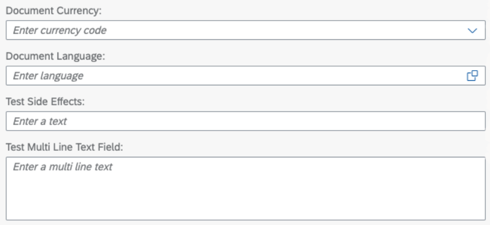

<!-- loio4b50f214f2444de7b092684f4529f29a -->

# Configuring Fields

A field can be represented in several ways.

> ### Note:  
> This topic is currently only applicable to SAP Fiori elements for OData V4.

A field can react to many different annotations and render additional artifacts or information, such as showing a value help to allow users to choose a value, or showing semantic coloring to help indicate the criticality of the value it displays. A field can be rendered in many different forms and its rendering can be controlled via annotations. As for input fields, application developers can control the field editability, field help representations, and field validations ‒ to name only a few options. The subsequent topics provide detailed information about field configuration.


<a name="loio4b50f214f2444de7b092684f4529f29a__section_z5p_ml5_knb"/>

## Setting Placeholder Texts for Input Fields

Input fields, like `sap.m.Input` or `sap.m.ComboBox`, have a property placeholder that defines which value is shown to users in edit mode before the users actively make any entries in these fields. You can use the `UI.Placeholder` annotation to define the value that is shown as a placeholder:

```xml
<Annotations Target="sap.fe.manageitems.TechnicalTestingService.LineItems/multiLineTextField">
    <Annotation Term="Common.Label" String="Test Multi Line Text Field"/>
    <Annotation Term="UI.MultiLineText" Bool="true"/>
    <Annotation Term="UI.Placeholder" String="Enter a multi line text"/>
</Annotations>
```

  


<a name="loio4b50f214f2444de7b092684f4529f29a__section_fsx_vll_4rb"/>

## Validating Currency and UoM Fields

To validate currency fields without a related "value" field, use the `isCurrency` annotation:

> ### Sample Code:  
> XML Annotation
> 
> ```xml
> <Annotations Target="com.c_salesordermanage_sd.SalesOrderManage/TransactionCurrency">
>     <Annotation Term="Common.isCurrency" Bool="true"/>
>     ...some more definition of property and/or value help...
> </Annotations>
> ```

> ### Sample Code:  
> ABAP CDS Annotation
> 
> No ABAP CDS annotation sample is available. Please use the local XML annotation.

> ### Sample Code:  
> CAP CDS Annotation
> 
> ```
> TransactionCurrency @(
>         Common         : {
>                IsCurrency : true
>         }
>   );
> 
> ```

To validate unit of measurement fields without a related "value" field, use the `isUnit` annotation:

> ### Sample Code:  
> XML Annotation
> 
> ```xml
> <Annotations Target="com.c_salesordermanage_sd.SalesOrderManage/DocumentUnit">
>     <Annotation Term="Common.isUnit" Bool="true"/>
>     ...some more definition of property and/or value help...
> </Annotations>
> 
> ```

> ### Sample Code:  
> ABAP CDS Annotation
> 
> No ABAP CDS annotation sample is available. Please use the local XML annotation.

> ### Sample Code:  
> CAP CDS Annotation
> 
> ```
> DocumentUnit @(
>         Common         : {
>                IsUnit : true
>         }
> );
> 
> ```

-   **[Different Representations of a Field](different-representations-of-a-field-c18ada4.md "Applications can control how the field is represented by using annotations or metadata.")**  
Applications can control how the field is represented by using annotations or metadata.
-   **[Field Help](field-help-a5608ea.md "A field can be associated with a helper control, depending on how the field is configured.")**  
A field can be associated with a helper control, depending on how the field is configured.
-   **[Grouping of Fields](grouping-of-fields-cb1748e.md "Application developers can group fields that should be shown together, such as various address fields (street name, house number, and
        postal code).")**  
Application developers can group fields that should be shown together, such as various address fields \(street name, house number, and postal code\).
-   **[Further Features of the Field](further-features-of-the-field-f49a0f7.md "Application developers can control important features of the field.")**  
Application developers can control important features of the field.

