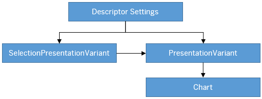
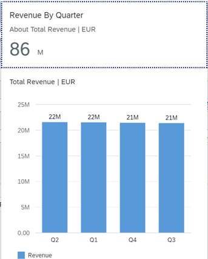

<!-- loio8e6e88513abe45e6b107d9400dd641df -->

# Configuring the Chart-Only View as the Default Option

Uses a chart that provides visual representation of analytical data.


Select the chart context to navigate to other applications. A chart provides:

-   Semantic object-based navigation
-   Easy changing of chart types
-   Customization of chart settings

The chart-only view provides a way to analyze data from different perspectives. It uses a step-by-step method to investigate a root cause, without direct access to transactional content. The chart control is used to provide the chart visualization.

You use this features to deal with analytical data that can be visually represented using charts, without needing to link them to the transactional data set.




### Descriptor Settings: Table-only view

**Configuration Sample for SAP Fiori elements for OData V2:**

> ### Sample Code:  
> ```
> "sap.ui.generic.app":{  
>    "pages":[  
>       {  
>          "entitySet":"SEPMRA_C_ALP_SlsOrdItemCube",
>          "component":{  
>             "name":"sap.suite.ui.generic.template.AnalyticalListPage",
>             "list":true,
>             "settings":{  
>                   "qualifier":"DefaultVariant",
>                   }
>             }
>       }
> },
> ```

**Configuration Sample for SAP Fiori elements for OData V4:**

> ### Sample Code:  
> ```
> "views": {
>     "paths": [{
>         "primary": [
>             {
>                 "annotationPath": "com.sap.vocabularies.UI.v1.PresentationVariant"
>             }
>         ],
>         "secondary": [
>             {
>                 "annotationPath": "com.sap.vocabularies.UI.v1.LineItem"
>             }
>         ],
>         "defaultPath": "primary"
>     }]
> },
> ```


### Annotation: SelectionPresentationVariant with Qualifier="DefaultVariant"

**Configuration Sample:**

> ### Sample Code:  
> XML Annotation
> 
> ```
> <Annotation Term="UI.SelectionPresentationVariant" Qualifier="DefaultVariant">
>   <Record>
>     <PropertyValue Property="Text" String="Product Financial Analysis"/>
>     <PropertyValue Property="SelectionVariant" Path="@UI.SelectionVariant#DefaultSelectionVariant"/>
>     <PropertyValue Property="PresentationVariant" Path="@UI.PresentationVariant#DefaultPresentationVariant"/>
>   </Record>
> </Annotation>
> ```

> ### Sample Code:  
> ABAP CDS Annotation
> 
> ```
> @UI.SelectionPresentationVariant: [
>   {
>     text: 'Product Financial Analysis',
>     selectionvariantqualifier: 'DefaultSelectionVariant',
>     presentationvariantqualifier: 'DefaultPresentationVariant',
>     qualifier: 'DefaultVariant'
>   }
> ]
> annotate view VIEWNAME with {
> 
> }
> ```

> ### Sample Code:  
> CAP CDS Annotation
> 
> ```
> UI.SelectionPresentationVariant #DefaultVariant : {
>     Text : 'Product Financial Analysis',
>     SelectionVariant : ![@UI.SelectionVariant#DefaultSelectionVariant],
>     PresentationVariant : ![@UI.PresentationVariant#DefaultPresentationVariant]
> }
> ```


### Annotation: Presentation Variant

> ### Sample Code:  
> XML Annotation
> 
> ```
> <Annotation Term="UI.PresentationVariant" Qualifier="DefaultPresentationVariant">
>   <Record>
>     <PropertyValue Property="Text" String="Default"/>
>     <PropertyValue Property="SortOrder">
>       <Collection>
>         <Record Type="Common.SortOrderType">
>           <PropertyValue Property="Property" PropertyPath="NetAmount"/>
>           <PropertyValue Property="Descending" Bool="true"/>
>         </Record>
>       </Collection>
>     </PropertyValue>
>     <PropertyValue Property="Visualizations">
>       <Collection>
>          <AnnotationPath>@UI.Chart#Default</AnnotationPath>
>       </Collection>
>    </PropertyValue>
>   </Record>
> </Annotation>
> ```

> ### Sample Code:  
> ABAP CDS Annotation
> 
> ```
> @UI.PresentationVariant: [
>   {
>     text: 'Default',
>     sortOrder: [
>       {
>         by: 'NETAMOUNT',
>         direction: #DESC
>       }
>     ],
>     visualizations: [
>       {
>         type: #AS_CHART,
>         qualifier: 'Default'
>       }
>     ],
>     qualifier: 'DefaultPresentationVariant'
>   }
> ]
> annotate view VIEWNAME with {
> 
> }
> 
> ```

> ### Sample Code:  
> CAP CDS Annotation
> 
> ```
> UI.PresentationVariant #DefaultPresentationVariant : {
>     Text : 'Default',
>     SortOrder : [
>         {
>             $Type : 'Common.SortOrderType',
>             Property : NetAmount,
>             Descending : true
>         },
>     ],
>     Visualizations : [
>         '@UI.Chart#Default'
>     ]
> }
> ```

Use the app-descriptor `chartPresentationQualifier` setting to render a chart based on a specific `PresentationVariant` annotation configuration.

```
"settings": { 
"chartPresentationQualifier": “qualifier”}
```


### Annotation: Chart

> ### Sample Code:  
> XML Annotation
> 
> ```
> <Annotation Term="UI.Chart" Qualifier="Default">
>   <Record Type="UI.ChartDefinitionType">
>     <PropertyValue Property="Title" String="Revenue by Customer"/>
>     <PropertyValue Property="Description" String="Net Revenue by Customer"/>
>     <PropertyValue Property="ChartType" EnumMember="UI.ChartType/Column"/>
>     <PropertyValue Property="Dimensions">
>       <Collection>
>         <PropertyPath>SoldToParty</PropertyPath>
>         <PropertyPath>DeliveryCalendarYear</PropertyPath>
>       </Collection>
>      </PropertyValue>
>      <PropertyValue Property="DimensionAttributes">
>        <Collection>
>           <Record Type="UI.ChartDimensionAttributeType">
>              <PropertyValue Property="Dimension" PropertyPath="SoldToParty"/>
>              <PropertyValue Property="Role" EnumMember="UI.ChartDimensionRoleType/Category"/>
>           </Record>
>           <Record Type="UI.ChartDimensionAttributeType">
>              <PropertyValue Property="Dimension" PropertyPath="DeliveryCalendarYear"/>
>              <PropertyValue Property="Role" EnumMember="UI.ChartDimensionRoleType/Series"/>
>           </Record>
>        </Collection>
>      </PropertyValue>
>      <PropertyValue Property="Measures">
>        <Collection>
>          <PropertyPath>NetAmount</PropertyPath>
>        </Collection>
>      </PropertyValue>
>      <PropertyValue Property="MeasureAttributes">
>        <Collection>
>           <Record Type="UI.ChartMeasureAttributeType">
>              <PropertyValue Property="Measure" PropertyPath="NetAmount"/>
>              <PropertyValue Property="Role" EnumMember="UI.ChartMeasureRoleType/Axis1"/>
>              <PropertyValue Property="DataPoint" AnnotationPath="@UI.DataPoint#NetAmount"/>
>           </Record>
>        </Collection>
>      </PropertyValue>
>    </Record>
> </Annotation>
> ```

> ### Sample Code:  
> ABAP CDS Annotation
> 
> ```
> @UI.Chart: [
>   {
>     title: 'Revenue by Customer',
>     description: 'Net Revenue by Customer',
>     chartType: #COLUMN,
>     dimensions: [
>       'SOLDTOPARTY',
>       'DELIVERYCALENDARYEAR'
>     ],
>     dimensionAttributes: [
>       {
>         dimension: 'SoldToParty',
>         role: #CATEGORY
>       },
>       {
>         dimension: 'DeliveryCalendarYear',
>         role: #SERIES
>       }
>     ],
>     measures: [
>       'NETAMOUNT'
>     ],
>     measureAttributes: [
>       {
>         measure: 'NetAmount',
>         role: #AXIS_1,
> 		asDataPoint: true
>       }
>     ],
>     qualifier: 'Default'
>   }
> ]
> annotate view VIEWNAME with {
> 
> }
> 
> ```

> ### Sample Code:  
> CAP CDS Annotation
> 
> ```
> UI.Chart #Default : {
>     $Type : 'UI.ChartDefinitionType',
>     Title : 'Revenue by Customer',
>     Description : 'Net Revenue by Customer',
>     ChartType : #Column,
>     Dimensions : [
>         SoldToParty,
>         DeliveryCalendarYear
>     ],
>     DimensionAttributes : [
>         {
>             $Type : 'UI.ChartDimensionAttributeType',
>             Dimension : SoldToParty,
>             Role : #Category
>         },
>         {
>             $Type : 'UI.ChartDimensionAttributeType',
>             Dimension : DeliveryCalendarYear,
>             Role : #Series
>         },
>     ],
>     Measures : [
>         NetAmount
>     ],
>     MeasureAttributes : [
>         {
>             $Type : 'UI.ChartMeasureAttributeType',
>             Measure : NetAmount,
>             Role : #Axis1,
>             DataPoint : '@UI.DataPoint#NetAmount'
>         }
>     ]
> }
> 
> ```


## Chart Operations

You can perform several chart-level operations on the toolbar. The *Settings* option on the chart toolbar enables you to include additional filters on the chart, or to change:

-   Dimensions and measures bound to a chart
-   Roles for dimensions and measures
-   Sort order in charts

The *View By* option lets you change the chart grouping dimension. If you have already made a chart selection before by selecting the *View By* option and changing the grouping dimension, analytical list page use the earlier chart dimension selection as a filter context.


<a name="loio8e6e88513abe45e6b107d9400dd641df__section_vvw_xd2_hqb"/>

## Additional Features in SAP Fiori Elements for OData V2


### Semantic Navigation

If you select a data point or segment from a chart, the smart chart checks the annotation of any semantic object definition for these dimensions and uses it as a base to render the navigation links. For example:

**Cost Center dimension**

> ### Sample Code:  
> XML Annotation
> 
> ```xml
> <Annotations xmlns=http://docs.oasis-open.org/odata/ns/edm Target=”Emp_Line_Item.Item/Cost_Center”>
> 	<Annotation Term=”com.sap.vocabularies.Common.v1.SemanticObject” String=”CostCenter”/>
> </Annotations>
> 
> ```

> ### Sample Code:  
> ABAP CDS Annotation
> 
> ```
> 
> annotate view ITEM with {
>   @Consumption.semanticObject: 'CostCenter'
>   cost_center;
> }
> 
> ```

In the preceding example, the smart charts retrieve all of the navigation parameters for which you have authorization and that are defined for the `CostCenter` semantic object. The selected chart and filter context is passed to the target application through the navigation context.

Choose *Details* on the toolbar to view navigation links that define actions associated with semantic objects.


### Enabling Data Label in Smart Charts and KPI Cards

You can show data labels in smart charts and KPI cards.

To do this, set the `showDataLabel` property to `True` in the manifest settings. The default value is `False`.

> ### Sample Code:  
> ```
> 
> "pages": [{
>             "entitySet": "SEPMRA_C_ALP_SlsOrdItemCubeALPResults",
>             "component": {
>                 "name": "sap.suite.ui.generic.template.AnalyticalListPage",
>                 "list": true,
>                 "settings": {
>                     "chartSettings": {
>                         "showDataLabel": true
>                     },
> ```

  
  
**Data Label in Smart Charts**


  
  
**Data Label in KPI Cards**





### Enabling Stable Colors for Chart on Dimension Values

You can configure the chart to map the dimension values to specific colors. In the absence of stable coloring, a default color is used for a value of dimension. Legends are displayed as `dimensionValues` as per the configuration in the manifest. You can configure this as follows:

1.  Set the `enableStableColors` to true within the `chartSettings` manifest.

2.  Define colors and `LegendIndex` for dimensions.


> ### Sample Code:  
> `manifest.json`
> 
> ```
> 
> "chartSettings": {
>      "showDataLabel": true,
>      "enableStableColors": true,
>      "dimensionSettings": {
>           "CostElement": {  // Dimension Name
>               "400020": { //  Dimension Value
>                    "color":"red",
>                    "legendIndex":0
>                         },
>               "421000": {
>                    "color":"sapUiChartPaletteSemanticNeutral",
>                    "legendIndex":1
>                         },
>               "417900": {
>                    "color":"blue",
>                    "legendIndex":2
>                         }
>                          },
>           “Customer”: {
>                "C000013": {
>                     "color": "red",
>                     "legendIndex": 0
>                           },
>                "C000085": {
>                     "color": "blue",
>                     "legendIndex": 0
>                           },
>                       },
>           "default" : {
>                "color": "green"
>                       }
>             }
>   }
> 
> ```

  
  
**Bar Chart**


  
  
**Donut Chart**


If a color isn't specified for a dimension value, and the default color is applied:

  
  
**Default Color Appearance in the Absence of a Specified Color**


### Defining Determining Actions

For more information, see [Defining Determining Actions in List Reports](defining-determining-actions-in-list-reports-d719982.md).

> ### Recommendation:  
> Please note that this feature is deprecated. SAP Fiori elements supports this feature only for compatibility reasons. We recommend that you avoid using determining buttons.


<a name="loio8e6e88513abe45e6b107d9400dd641df__section_alr_322_hqb"/>

## Additional Features in SAP Fiori Elements for OData V4


### ALP Configuration

Make the following entries in the manifest:

> ### Sample Code:  
> ```
> "views": {
>     "paths": [{
> ...
>         "defaultPath": "primary"
>     }]
> },
> ```

Setting the `"defaultPath"` to `"primary"` ensures that the default view that is loaded is the chart-only view.

For more information about options that can be provided for the annotation path, see [Descriptor Configuration for the Analytical List Page](descriptor-configuration-for-the-analytical-list-page-2a9df06.md).


### Additional Chart Features

For more information about additional chart features, see the [Additional Features in SAP Fiori Elements for OData V4](configuring-charts-653ed0f.md#loio653ed0f4f0d743dbb33ace4f68886c4e__section_ymw_bdc_4nb) section in [Configuring Charts](configuring-charts-653ed0f.md).

**Related Information**  


[Configuring the Content Area](configuring-the-content-area-fc7d73c.md "Visualize data from the main entity set and seamlessly navigate to an application. Define a valid UI.Chart or UI.LineItem annotation to render content for the chart area and table area. For more information, see Descriptor Configuration for the Analytical List Page.")

[Defining Actions in the Chart Toolbar](defining-actions-in-the-chart-toolbar-7d1fa83.md "You can add action buttons to the chart toolbar by defining the Actions property in the annotation term UI.Chart.")

