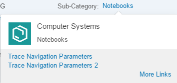
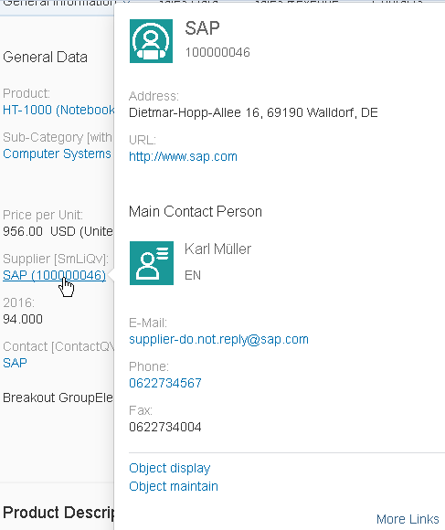
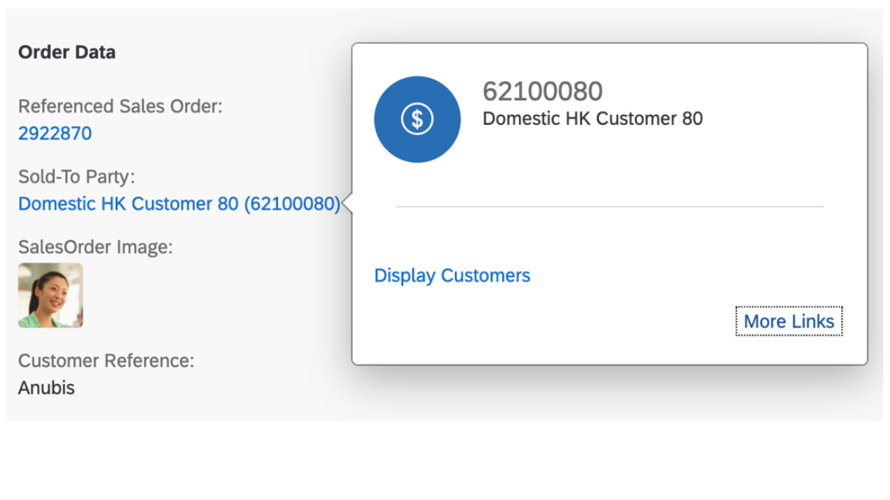
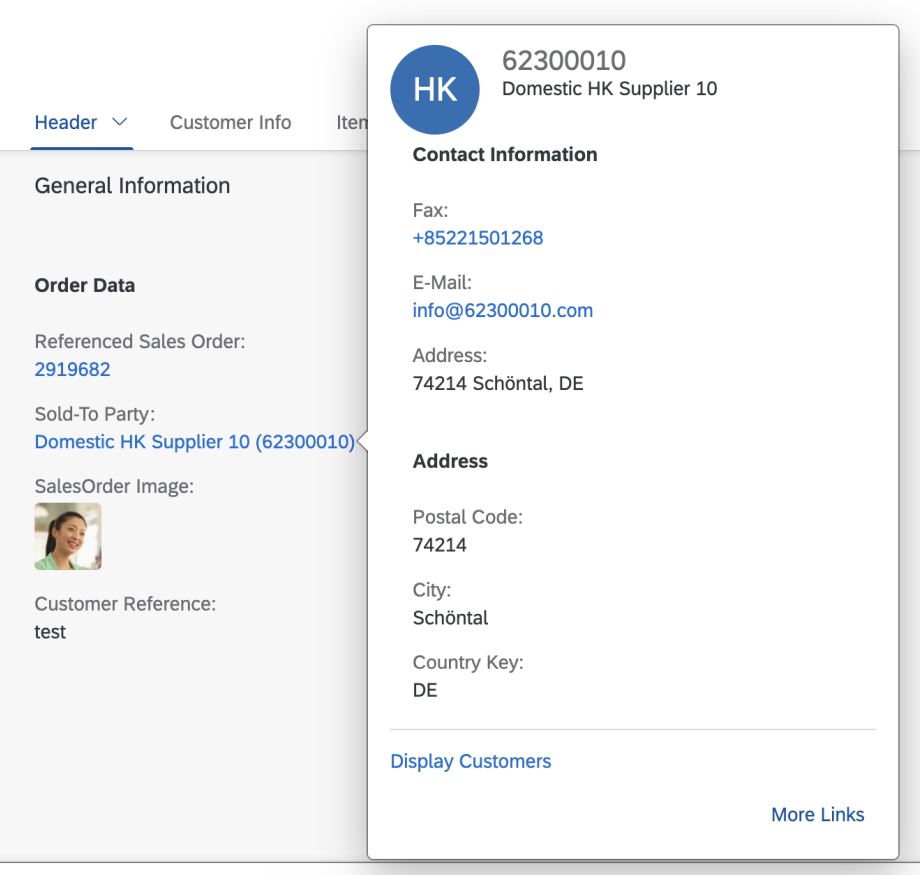
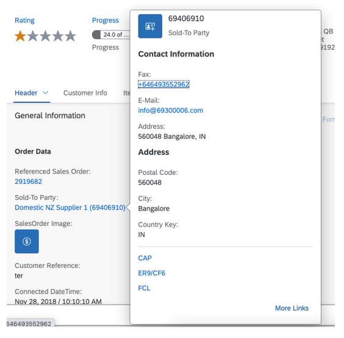
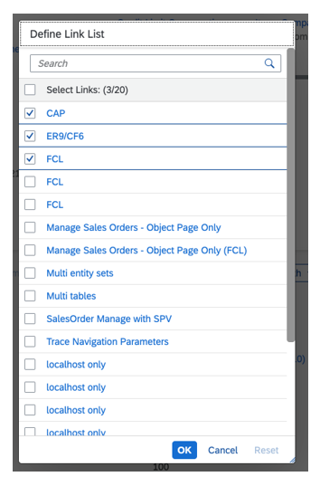

<!-- loioc245ad757dc64694842e00c40e677cd8 -->

# Configuring the Content of Quick Views

You can configure the content area of the quick views to display specific data.

The content area, consisting of a title and additional information, for example, a field group, has a default behavior and can be adapted to your needs.


<a name="loioc245ad757dc64694842e00c40e677cd8__section_i3t_ny2_3mb"/>

## Additional Features in SAP Fiori Elements for OData V2


### Title Area

-   Images

    -   To display an image, annotate `HeaderInfo.ImageUrl` or `HeaderInfo.TypeImageUrl`. If you don't, no image is displayed.

    -   If you annotate `HeaderInfo.ImageUrl` and `HeaderInfo.TypeImageUrl`, `ImageUrl` is evaluated first, and `TypeImageUrl` second. The `ImageUrl/TypeImageUrl` string and path including navigation properties are evaluated.


-   Title

    -   Enter the title according to the `TextArrangement` annotation. See the figure below: `TextArrangementType/TextLast`. Note that *Computer Systems* is declared as `TextLast` here.

          

    -   If a main navigation has been defined, the title is displayed as a link. In the example below, see the <code><i>Asia High tech</i></code> link:

          


-   Description
    -   The description is always displayed beneath the title and must be filled according to the `TextArrangement` annotation.

    -   If the description is not filled, the title size is increased automatically and the description field remains empty, as shown below \(`TextArrangementType/TextOnly`\).

          


### Content Area

The content area can contain field groups, contacts, and DataPoints.


### Field Groups

-   You can include any number of field groups or none at all. The example below shows a quick view with no reference facet, however, a header image included:

      

-   A field group can have a label. It is taken from within the `<Record Type="UI.ReferenceFacet">`.

-   For fields, the path including navigation properties is evaluated.

-   Fields support annotations such as `IsEmailAddress`, `IsUrl`, and `IsPhoneNumber`. Note that any links that would create a popover on the quick view are ignored by the system.

-   There are different types of content for field groups:

    -   Interpreted by `SmartField`: `DataField` including criticality, `DataFieldWithUrl`

    -   Interpreted by SAP Fiori elements: `DataFieldWithIntentBasedNavigation`


### Contacts

You can display any number of contacts or none at all. See the example below:

  

The following applies:

-   You can place the contact anywhere. It is specified by the position of the reference facet in the collection.

-   If the picture, title, and description belonging to a contact \(contact title area\) correspond with the content of the title area , the contact title area is not displayed.

-   The reference facet must point to a `com.sap.vocabularies.Communication.v1.Contact`.


### DataPoints

-   You can place an existing DataPoint in your annotation.

-   You can place the DataPoint anywhere. It is specified by the position of the reference facet in the collection.

-   A DataPoint can have a label. It is taken from within the `<Record Type="UI.ReferenceFacet">`.


  

The sample codes show a quick view facet containing field group, contact and DataPoint:

> ### Sample Code:  
> XML Annotation
> 
> ```xml
> <Annotations Target="STTA_PROD_MAN.STTA_C_MP_SupplierType"> 
>    <Annotation Term="UI.QuickViewFacets">
>       <Collection>
>          <Record Type="UI.ReferenceFacet">
>             <PropertyValue Property="Target" AnnotationPath="@UI.FieldGroup#SupplierQuickViewPOC_FieldGroup_1" />
>          </Record>                        
>          <Record Type="UI.ReferenceFacet">
>             <PropertyValue Property="Label" String="Main Contact Person" />
>             <PropertyValue Property="Target" AnnotationPath="@Communication.Contact#KeyAccount"/>
>          </Record>
>          <Record Type="UI.ReferenceFacet">
>             <PropertyValue Property="Label" String="DataPoint in QV"/>
>             <PropertyValue Property="Target" AnnotationPath="@UI.DataPoint#Product"/>
>          </Record> 
>       </Collection>
>    </Annotation>
> </Annotations>
> 
> ```

> ### Sample Code:  
> ABAP CDS Annotation
> 
> ```
> 
> annotate view STTA_C_MP_SUPPLIER with {
> @UI.Facet: [
>   {
>     targetQualifier: 'SupplierQuickViewPOC_FieldGroup_1',
>     type: #FIELDGROUP_REFERENCE,
>     purpose: #QUICK_VIEW
>   },
>   {
>     label: 'Main Contact Person',
>     targetQualifier: 'KeyAccount',
>     type: #CONTACT_REFERENCE,
>     purpose: #QUICK_VIEW
>   },
>   {
>     label: 'DataPoint in QV',
>     targetQualifier: 'Product',
>     type: #DATAPOINT_REFERENCE,
>     purpose: #QUICK_VIEW
>   }
> ]
> supplier;
> }
> ```

> ### Sample Code:  
> CAP CDS Annotation
> 
> ```
> 
> annotate STTA_PROD_MAN.STTA_C_MP_SupplierType with @(
>     UI.QuickViewFacets : [
>         {
>             $Type : 'UI.ReferenceFacet',
>             Target : '@UI.FieldGroup#SupplierQuickViewPOC_FieldGroup_1'
>         },
>         {
>             $Type : 'UI.ReferenceFacet',
>             Label : 'Main Contact Person',
>             Target : '@Communication.Contact#KeyAccount'
>         },
>         {
>             $Type : 'UI.ReferenceFacet',
>             Label : 'DataPoint in QV',
>             Target : '@UI.DataPoint#Product'
>         }
>     ]
> );
> ```


<a name="loioc245ad757dc64694842e00c40e677cd8__section_spl_mz2_3mb"/>

## Additional Features in SAP Fiori Elements for OData V4


### Title Area

-   Images

    -   If you don’t provide `HeaderInfo.ImageUrl` or `HeaderInfo.TypeImageUrl`, you can provide initials in the `HeaderInfo.Initials` annotation. The initials are displayed if no `HeaderInfo.ImageUrl` or `HeaderInfo.TypeImageUrl` is provided.

    -   If no `HeaderInfo.ImageUrl`, `HeaderInfo.TypeImageUrl`, or `HeaderInfo.Initials` is provided, no image is displayed.


-   Title

    -   The title is taken from `HeaderInfo.Title`.

          

    -   If a main navigation has been defined using the `sap-tag` parameter `primaryAction`, the title is displayed as a link. For more information about how to define a primary action, see [Enabling the Flexible Column Layout](enabling-the-flexible-column-layout-e762257.md).

        In the example below, see the <code><i>Asia High tech</i></code> link:

          


    > ### Restriction:  
    > Navigation from the title link using the browser option *Open link in new tab* is not possible. Instead, the navigation links to SAP Fiori launchpad.

-   Subtitle

    -   The description is taken from the `HeaderInfo.Description` annotation of the target entity.

    -   If the `HeaderInfo.Description` is not maintained in the annotation, the subtitle displays the label of the source property.


-   Description
    -   The description is taken from the `HeaderInfo.Description` annotation.

          


### Content Area

The content area can contain field groups, contacts, and `DataPoints`.

**Field Groups**

-   You can include any number of field groups or none at all. The example below shows a quick view with no reference facet, however, a header image included:

      

-   A field group can have a label. It is taken from within the `<Record Type="UI.ReferenceFacet">`.

-   For fields, the path including navigation properties is evaluated.

-   Fields support annotations such as `IsEmailAddress`, `IsUrl`, and `IsPhoneNumber`. Note that any links that create a popover on the quick view are ignored by the system.

-   There are different types of content for field groups:

    -   Interpreted by `SmartField`: `DataField` including criticality, `DataFieldWithUrl`

    -   Interpreted by SAP Fiori elements: `DataFieldWithIntentBasedNavigation`


### Contacts

You can display any number of contacts or none at all. See the example below:

  

The following applies:

-   You can place the contact anywhere. It is specified by the position of the reference facet in the collection.

-   If the picture, title, and description belonging to a contact \(contact title area\) correspond with the content of the title area , the contact title area is not displayed.

-   The reference facet must point to a `com.sap.vocabularies.Communication.v1.Contact`.


### `DataPoints`

-   You can place an existing `DataPoint` in your annotation.

-   You can place the `DataPoint` anywhere. It is specified by the position of the reference facet in the collection.

-   A `DataPoint` can have a label. It is taken from within the `<Record Type="UI.ReferenceFacet">`.


  

The sample codes show a quick view facet containing field group, contact and `DataPoint`:

> ### Sample Code:  
> XML Annotation
> 
> ```xml
> <Annotations Target="STTA_PROD_MAN.STTA_C_MP_SupplierType"> 
>    <Annotation Term="UI.QuickViewFacets">
>       <Collection>
>          <Record Type="UI.ReferenceFacet">
>             <PropertyValue Property="Target" AnnotationPath="@UI.FieldGroup#SupplierQuickViewPOC_FieldGroup_1" />
>          </Record>                        
>          <Record Type="UI.ReferenceFacet">
>             <PropertyValue Property="Label" String="Main Contact Person" />
>             <PropertyValue Property="Target" AnnotationPath="@Communication.Contact#KeyAccount"/>
>          </Record>
>          <Record Type="UI.ReferenceFacet">
>             <PropertyValue Property="Label" String="DataPoint in QV"/>
>             <PropertyValue Property="Target" AnnotationPath="@UI.DataPoint#Product"/>
>          </Record> 
>       </Collection>
>    </Annotation>
> </Annotations>
> 
> ```

> ### Sample Code:  
> ABAP CDS Annotation
> 
> ```
> 
> annotate view STTA_C_MP_SUPPLIER with {
> @UI.Facet: [
>   {
>     targetQualifier: 'SupplierQuickViewPOC_FieldGroup_1',
>     type: #FIELDGROUP_REFERENCE,
>     purpose: #QUICK_VIEW
>   },
>   {
>     label: 'Main Contact Person',
>     targetQualifier: 'KeyAccount',
>     type: #CONTACT_REFERENCE,
>     purpose: #QUICK_VIEW
>   },
>   {
>     label: 'DataPoint in QV',
>     targetQualifier: 'Product',
>     type: #DATAPOINT_REFERENCE,
>     purpose: #QUICK_VIEW
>   }
> ]
> supplier;
> }
> ```

> ### Sample Code:  
> CAP CDS Annotation
> 
> ```
> 
> annotate STTA_PROD_MAN.STTA_C_MP_SupplierType with @(
>     UI.QuickViewFacets : [
>         {
>             $Type : 'UI.ReferenceFacet',
>             Target : '@UI.FieldGroup#SupplierQuickViewPOC_FieldGroup_1'
>         },
>         {
>             $Type : 'UI.ReferenceFacet',
>             Label : 'Main Contact Person',
>             Target : '@Communication.Contact#KeyAccount'
>         },
>         {
>             $Type : 'UI.ReferenceFacet',
>             Label : 'DataPoint in QV',
>             Target : '@UI.DataPoint#Product'
>         }
>     ]
> );
> ```


### Footer Section

To enable navigation from a quick view facet, use the `SemanticObject` annotation as follows:

-   With a `ReferentialConstraint`

    In the metadata document, you can find the reference to the association end type. Check for a referential constraint that includes the identified property as `Dependent`. For the `Supplier` property in the entity type `STTA_C_MP_ProductType`, which has a set of navigation properties, only `to_Supplier` includes the `Supplier` property as `Dependent`.

    > ### Sample Code:  
    > XML Annotation
    > 
    > ```xml
    > <Association Name="assoc_2CCAF987BA334B3BD1DF2404F50BC9C5" sap:content-version="1">
    >     <End Type="STTA_PROD_MAN.STTA_C_MP_ProductType" Multiplicity="1" Role="FromRole_assoc_2CCAF987BA334B3BD1DF2404F50BC9C5"/>
    >     <End Type="STTA_PROD_MAN.STTA_C_MP_SupplierType" Multiplicity="0..1" Role="ToRole_assoc_2CCAF987BA334B3BD1DF2404F50BC9C5"/>
    >     <ReferentialConstraint>
    >         <Principal Role="ToRole_assoc_2CCAF987BA334B3BD1DF2404F50BC9C5">
    >             <PropertyRef Name="Supplier"/>
    >         </Principal>
    >         <Dependent Role="FromRole_assoc_2CCAF987BA334B3BD1DF2404F50BC9C5">
    >             <PropertyRef Name="Supplier"/>
    >         </Dependent>
    >     </ReferentialConstraint>
    > </Association>
    > 
    > ```

    > ### Sample Code:  
    > ABAP CDS Annotation
    > 
    > ```
    > annotate STTA_PROD_MAN.STTA_C_MP_ProductType with {
    >   @Consumption.SemanticObject : 'EPMProduct'
    >   Supplier
    > }
    > 
    > ```

    > ### Sample Code:  
    > CAP CDS Annotation
    > 
    > ```
    > annotate STTA_PROD_MAN.STTA_C_MP_ProductType with {
    >   @Common.SemanticObject : 'EPMProduct'
    >   Supplier
    > };
    > 
    > ```

-   Without a `ReferentialConstraint`

    In the `STTA_C_MP_ProductType` entity, create an association to the target entity. Annotate this navigation property with a `SemanticObject`.

    > ### Sample Code:  
    > CAP CDS Annotation
    > 
    > ```
    > entity STTA_C_MP_ProductType {
    >      _Supplier    : Association to STTA_C_MP_SupplierType
    >           on _Supplier.Supplier = Supplier @(Common : {
    >                                              Label          : 'Supplier with semantic in navigation',
    >                                              SemanticObject : 'Customer'
    >                                              });
    > }
    > ```

    The property on the target entity \(`STTA_C_MP_SupplierType`\) must be a semantic key or an entity key.

    > ### Sample Code:  
    > XML Annotation
    > 
    > ```xml
    > <EntityType Name="STTA_C_MP_SupplierType">
    >      <Key>
    >           <PropertyRef Name="SupplierID"/>
    >      </Key>
    >      <Property Name="SupplierID" Type="Edm.String" MaxLength="10" Nullable="false"/>
    >      <Property Name="SupplierName" Type="Edm.String" MaxLength="80"/>
    > </EntityType>
    > 
    > <Annotations Target="myservice.STTA_C_MP_SupplierType">
    >      <Annotation Term="Common.SemanticKey">
    >           <Collection>
    >                <PropertyPath>SupplierName</PropertyPath>
    >           </Collection>
    >      </Annotation>
    > </Annotations>
    > 
    > <Annotations Target="myservice.STTA_C_MP_SupplierType/SupplierID">
    >      <Annotation Term="Common.Text" Path="SupplierName"/>
    > </Annotations>
    > <Annotations Target="myservice.STTA_C_MP_SupplierType/SupplierName">
    >      <Annotation Term="Common.Label" String="Name"/>
    > </Annotations>
    > ```

    > ### Sample Code:  
    > CAP CDS Annotation
    > 
    > ```
    > entity STTA_C_MP_SupplierType @(
    >      //…
    >      title  : 'Supplier type',
    >      Common : {SemanticKey : [SupplierName]},
    >      //…
    > 
    > ){
    >      key SupplierID     : String(10) not null @(Common : {
    >           Label : 'Supplier ID',
    >           Text  : SupplierName
    >      });
    >      SupplierName : String(10)          @(Common : {
    >           Label                 : 'Name'        
    >      });
    > }
    > ```

    To display the `QuickView`, use either the property `Supplier` or `SupplierID`:

    > ### Sample Code:  
    > XML Annotation
    > 
    > ```xml
    > <Annotation Term="UI.FieldGroup">
    >      <Record Type="UI.FieldGroupType">
    >        <PropertyValue Property="Data">
    >          <Collection>
    >            <Record Type="UI.DataField">
    >              <PropertyValue Property="SupplierName" Path="_Supplier"/>
    >              <PropertyValue Property="Label" String="My QuickView"/>
    >            </Record>
    >            <Record Type="UI.DataField">
    >              <PropertyValue Property="SupplierID" Path="_Supplier"/>
    >              <PropertyValue Property="Label" String="My QuickView2"/>
    >            </Record>
    >          </Collection>
    >        </PropertyValue>
    >      </Record>
    > </Annotation>
    > ```

    > ### Sample Code:  
    > ABAP CDS Annotation
    > 
    > ```
    > @UI.fieldGroup: [
    >   {
    >     label: 'Dummy Button'
    >     type: #STANDARD,
    >     position: 1 ,
    >     qualifier: 'My QuickView'
    >   }
    > ]
    > _Supplier.supplier;
    > 
    > @UI.fieldGroup: [
    >   {
    >     label: 'Dummy Button',
    >     type: #STANDARD,
    >     position: 2 ,
    >     qualifier: 'My QuickView2'
    >   }
    > ]
    > _Supplier.supplierID;
    > ```

    > ### Sample Code:  
    > CAP CDS Annotation
    > 
    > ```
    > annotate STTA_C_MP_ProductType with @(UI: 
    > {
    > 
    >     //…
    >     FieldGroup #MyQuickViews: {Data: 
    >     [{
    >          $Type : 'UI.DataField',
    >          Value : _Supplier.SupplierName,
    >          Label : 'My QuickView'
    >     },
    >     {
    >          $Type : 'UI.DataField',
    >          Value : _Supplier.SupplierID,  
    >          Label : 'My QuickView2'
    >     }]  
    >     }
    >     //…
    > })
    > ```


The following image shows a quick view popover displaying the most important links in the footer:

  

The following image shows a *More Links* popover. Users can select actions to be displayed in the quick view footer:

  

-   The footer section gathers the most important navigation targets. Users can see the full list of available actions by choosing the *More Links* button.

-   Important navigation targets are defined using the `sap-tag` parameter `superiorAction`. All actions with this definition are displayed by default in the quick view footer.

-   If no action was defined using the `sap-tag` parameter `superiorAction`, the first three actions in the list of actions are shown by default.

-   Users can personalize the actions shown in the footer by selecting actions in the *More Links* popover.


