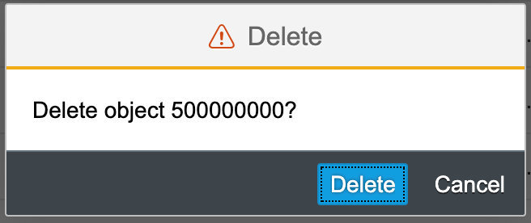
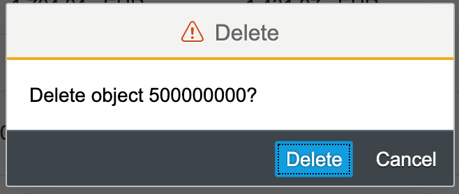
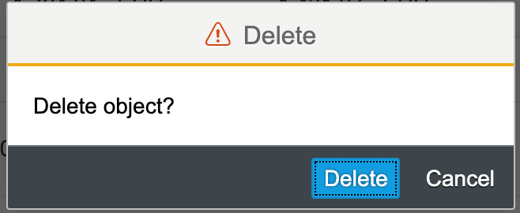

<!-- loio84e4f8967bf643c9b81d4d84cefdf367 -->

# Configuring the Delete Confirmation Dialog Box

You can adapt the text in the *Delete* dialog box to match your requirements while deleting an object or an item from the list report and object page tables.


<a name="loio84e4f8967bf643c9b81d4d84cefdf367__section_jls_dyr_cnb"/>

## Additional Features in SAP Fiori Elements for OData V2

The context displayed in the dialog box is taken from the `Title` and `Description` properties of the `UI.HeaderInfo` annotation \(defined in the `entitySet` bound to the table\).

Depending on the `UI.HeaderInfo` annotation, there can be three different types of text that can appear in the dialog box:

-   **When the `UI.HeaderInfo` annotation has both `Title` and `Description` properties defined**:

    **Flexible Column Layout mode**: In this scenario, when you delete a single item from the table, the dialog confirmation would show the message such as the one displayed below.

    

    **Fullscreen mode**: In this scenario, when you delete a single item from the table, the dialog confirmation would show the message such as the one displayed below.

    


> ### Sample Code:  
> XML Annotation
> 
> ```xml
> <Annotation Term="UI.HeaderInfo"> 
>   <Record> 
>     <PropertyValue Property="TypeName" String="Sales Order" /> 
>     <PropertyValue Property="TypeNamePlural" String="Sales Orders" /> 
>     <PropertyValue Property="Title"> 
>       <Record Type="UI.DataField"> 
>         <PropertyValue Property="Value" Path="so_id" /> 
>        </Record> 
>     </PropertyValue> 
>     <PropertyValue Property="Description"> 
>       <Record Type="UI.DataField"> 
>         <PropertyValue Property="Value" String="Sales Order" /> 
>       </Record>   
>     </PropertyValue> 
>   </Record> 
> </Annotation>
> 
> ```

> ### Sample Code:  
> ABAP CDS Annotation
> 
> ```
> 
> @UI.headerInfo: {
>   typeName: 'Sales Order',
>   typeNamePlural: 'Sales Orders',
>   title: {
>     value: 'SO_ID',
>     type: #STANDARD
>   },
>   description: {
>     type: #STANDARD
>   }
> }
> annotate view SALESORDERMANAGE with {
> 
> }
> 
> ```

-   **When the `UI.HeaderInfo` annotation has only the `Title` property defined**:

    In this scenario, when you delete a single item from the table, the dialog confirmation would show the message such as the one displayed below.

    


> ### Sample Code:  
> XML Annotation
> 
> ```xml
> <Annotation Term="UI.HeaderInfo"> 
>   <Record> 
>     <PropertyValue Property="TypeName" String="Sales Order" /> 
>     <PropertyValue Property="TypeNamePlural" String="Sales Orders" /> 
>     <PropertyValue Property="Title"> 
>       <Record Type="UI.DataField"> 
>         <PropertyValue Property="Value" Path="so_id" /> 
>        </Record> 
>     </PropertyValue> 
>   </Record> 
> </Annotation>
> 
> ```

> ### Sample Code:  
> ABAP CDS Annotation
> 
> ```
> 
> @UI.headerInfo: {
>   typeName: 'Sales Order',
>   typeNamePlural: 'Sales Orders',
>   title: {
>     value: 'SO_ID',
>     type: #STANDARD
>   }
> }
> annotate view SALESORDERMANAGE with {
> 
> }
> ```

-   **When the `UI.HeaderInfo` annotation has neither the `Title` nor the `Description` property defined:**

    In this scenario, when you delete a single item from the table, the dialog confirmation would show the message like the one displayed below.

    


The applications can override the default text by using the i18n keys mentioned below:

-   Main Object: These are applicable when a deletion is triggered from the list report and the main object page

    -   `UI.HeaderInfo` annotation has both `Title` and `Description` defined

        Flexible Column Layout mode: The i18n key to be used is `DELETE_WITH_OBJECTINFO`

        Fullscreen mode: The i18n key to be used is `DELETE_WITH_OBJECTTITLE`

    -   `UI.HeaderInfo` annotation has only `Title` defined:

        The i18n key to be used is `DELETE_WITH_OBJECTTITLE`

    -   `UI.HeaderInfo` annotation has neither `Title` nor `Description` defined:

        The i18n key to be used is `ST_GENERIC_DELETE_SELECTED`.


-   Sub Entity: These are applicable when a deletion is triggered from object page tables or the subobject.

    -   `UI.HeaderInfo` annotation has both `Title` and `Description` defined

        Flexible Column Layout mode: The i18n key to be used is `DELETE_SELECTED_ITEM_WITH_OBJECTINFO`

        Fullscreen mode: The i18n key to be used is `DELETE_SELECTED_ITEM_WITH_OBJECTTITLE`

    -   `UI.HeaderInfo` annotation has only `Title` defined

        The i18n key to be used is `DELETE_SELECTED_ITEM_WITH_OBJECTTITLE`

    -   `UI.HeaderInfo` annotation has neither `Title` nor `Description` defined:

        The i18n key to be used is `DELETE_SELECTED_ITEM`


<a name="loio84e4f8967bf643c9b81d4d84cefdf367__section_uql_5yr_cnb"/>

## Additional Features in SAP Fiori Elements for OData V4

The delete message for the main object \(list report\) does not yet consider the `UI.HeaderInfo` annotation. This is also true for a deletion from any table.

The applications can override the default text by the mechanism described in [Localization of UI Texts](localization-of-ui-texts-b8cb649.md) using the i18n keys mentioned below:

-   Delete from List Report:

    The generic delete confirmation message via the i18n key `C_TRANSACTION_HELPER_OBJECT_PAGE_CONFIRM_DELETE_WITH_OBJECTTITLE_SINGULAR` is displayed. This can be overridden by the applications.

    

-   Delete from Object Page \(or Subobject Page\) Header:

    The i18n key to be used is `C_TRANSACTION_HELPER_OBJECT_PAGE_CONFIRM_DELETE_WITH_OBJECTINFO`

    Only in this case is the `UI.HeaderInfo.Title` \(**2915717** in the above screenshot\) considered along with the `UI.HeaderInfo.Description` \(**Standard Order** in the above screenshot\).

-   Delete from Object or Subobject Page Table:

    The i18n key to be used is `C_TRANSACTION_HELPER_OBJECT_PAGE_CONFIRM_DELETE_WITH_OBJECTTITLE_SINGULAR`


> ### Note:  
> Applications that override the delete message when a single entry is being deleted from the table should revisit the `UI.HeaderInfo` annotation's configuration and adapt the texts accordingly.

