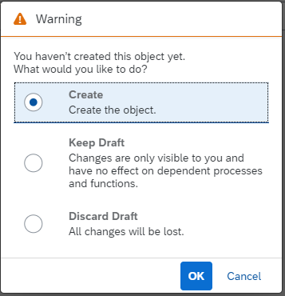
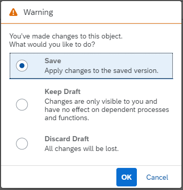

<!-- loio9a536627a6a94de084b0605eb164d2c8 -->

# Confirmation Popups

You can configure confirmation popups for various use cases in list reports and object pages.


<a name="loio9a536627a6a94de084b0605eb164d2c8__section_vsd_ckr_vsb"/>

## Confirmation Popup for Critical Actions

Applications can configure actions as critical and when such actions are triggered, a confirmation popup is displayed for end users before the action is executed. For more information, see [Adding Confirmation Popovers for Actions](adding-confirmation-popovers-for-actions-87130de.md).


<a name="loio9a536627a6a94de084b0605eb164d2c8__section_yms_cz4_wpb"/>

## Confirmation Popup for Activating a Draft

When you create or edit an object page in a draft-enabled application and decide to leave the page without saving, you get the following popup:

  
  
**Create Mode**



  
  
**Edit Mode**



> ### Tip:  
> The popup is enabled by default in SAP Fiori elements for OData V2 and SAP Fiori elements for OData V4. You can disable it for external navigation using the manifest settings.


<a name="loio9a536627a6a94de084b0605eb164d2c8__section_n3z_htm_vsb"/>

## Confirmation Popup for Actions that Fail with 412 Warnings

Applications can configure a confirmation popup for the following actions by sending an HTTP response 412 from the back end:

-   Standard SAP Fiori elements actions, such as *Save*, *Activate* and *Create*

-   Application-specific actions \(function import actions in SAP Fiori elements for OData V2\)


The flow is as follows:

-   When an action is triggered, the app sends the request with the header `Prefer:handling=strict`.

-   Depending on the settings of the back end, there are two options:

    -   If the preference is unknown, it's ignored and the action is executed as usual.

    -   If the preference is known, application developers can configure the back end to send a 412 message \("Precondition Failed" message\).


-   For SAP Fiori elements, the 412 message indicates that there are warnings that block the processing of the action, but users can still be trigger the action if they choose to ignore the warnings and continue.

-   The app displays a confirmation popup containing the message from the back end.

-   If users choose *Confirm* to go ahead with the action, the app sends the request again, this time **without** `Prefer:handling=strict` in the header.

-   The back end executes the action and responds with either a success or a failure message.

-   If users choose *Cancel* the operation is terminated.


The following image shows an example of such a popup:


> ### Note:  
> A 412 message that doesn't indicate a warning severity is considered as a regular message. This means, if this is the only message, then an automatic retry of the action isn't offered, for example.


<a name="loio9a536627a6a94de084b0605eb164d2c8__section_glf_hy4_wpb"/>

## Additional Features in SAP Fiori Elements for OData V2


### Turn Off *Draft Activation* Confirmation Popup for External Navigation

Applications can turn off the confirmation popup for draft activation in the case of external navigation using the `draftDiscardConfirmationSettings` manifest setting as follows:

> ### Sample Code:  
> ```
> "sap.ui.generic.app": {
>               "_version": "1.3.0",
>               "settings": {
>                              "draftDiscardConfirmationSettings": {
>                                            "enabled": "restricted"
>                              }
>               }
> }
> .
> .
> .
> ```


### Handling of 412 Messages

The following additional scenarios are supported:

-   Create, update or delete actions in non-draft applications

-   Deletion of an object


> ### Note:  
> -   You can configure a `state` message or transition from the back end for the 412 handling during `activation`.
> 
> -   You must configure a `transition` message from the back end for the 412 handling during `save`, `delete`, and `function import` actions.

> ### Restriction:  
> You can't configure 412 confirmation popups for a deletion triggered from a table in an object page.

If a user wants to perform an action on multiple selected items, some of the selected items can result in a warning message. In such cases, the action processing fails and the user is asked to perform the action on individual objects.


### Configuring an Additional Confirmation Popup for Save/Activation on Object Pages

> ### Note:  
> This is a legacy feature and it is recommended to use the 412 confirmation popup instead.

In draft scenarios, applications can configure a UI confirmation popup before proceeding with activation, if there are any warnings available at the front end.

To enable this popup, in the `manifest.json` under the object page settings, set the `showConfirmationOnDraftActivate` indicator to `true`.

> ### Sample Code:  
> ```
> "pages": {
>               "ObjectPage|STTA_C_MP_Product": {
>                              "entitySet": "STTA_C_MP_Product",
>                              "component": {
>                                            "name": "sap.suite.ui.generic.template.ObjectPage",
>                                            "settings": {
>                                                           "showRelatedApps": true,
>                                                           "tableType": "ResponsiveTable",
>                                                           "editableHeaderContent": true,
>                                                           "showConfirmationOnDraftActivate": true,
>                                                           "sections": {
>                                                                         "to_ProductText::com.sap.vocabularies.UI.v1.LineItem": {
>                                                                                       "navigationProperty": "to_ProductText",
>                                                                                       "entitySet": "STTA_C_MP_ProductText",
>                                                                                       "multiSelect": true,
>                                                                                       "createMode": "inline",
>                                                                                       "tableType": "ResponsiveTable"
>                                                                         }
>                                                           }
>                                            }
>                              }
>               }
> }
> .
> .
> .
> ```


### Customizing Title Text for the Confirmation Popups

You can override the title text and provide application specific dialog title using the following keys in the i18n files:

-   For the title text of a dialog:

    -   `"ST_KEEP_DRAFT_MESSAGE_CREATE"` in the create scenario

    -   `"ST_KEEP_DRAFT_MESSAGE_EDIT"` in the edit scenario


-   For saving and creating text:

    -   `"CREATE"` in the create mode

    -   `"SAVE"` in the save mode


<a name="loio9a536627a6a94de084b0605eb164d2c8__section_nky_zzn_vsb"/>

## Additional Features in SAP Fiori Elements for OData V4


### Turn Off *Draft Activation* Confirmation Popup for External Navigation

Applications can turn off the confirmation popup for draft activation in the case of external navigation using the `silentlyKeepDraftOnForwardNavigation` manifest setting as follows:

> ### Sample Code:  
> ```
> "sap.fe": {
>      "app": {
>           "silentlyKeepDraftOnForwardNavigation": true
>      }
> }
> .
> .
> .
> ```


### Handling of 412 Messages

> ### Note:  
> You must configure 412 messages from the back end as `transition` messages, not as `state` messages.

> ### Restriction:  
> -   For back ends based on CAP, the handling of 412 "Precondition Failed" messages don’t work correctly if the action is executed by setting the `InvocationGrouping` annotation property to `UI.OperationGroupingType/Isolated`. Here, the action invoked for the selected contexts are triggered within the same changeset. So, either the action is executed successfully or not executed for any of the selected context.
> 
> -   The handling of 412 messages \("Precondition Failed" messages\) is not applied when a record is deleted.

