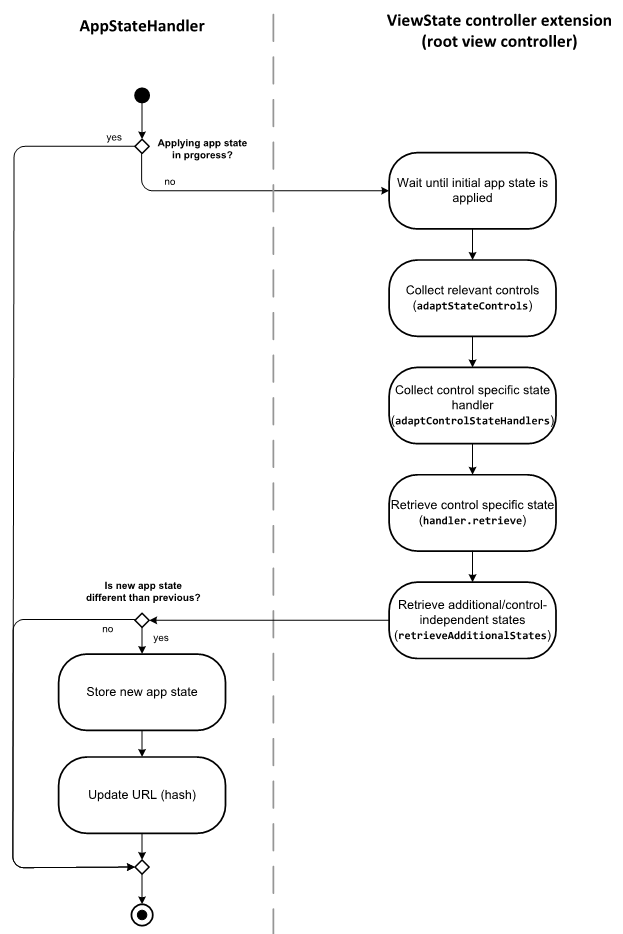
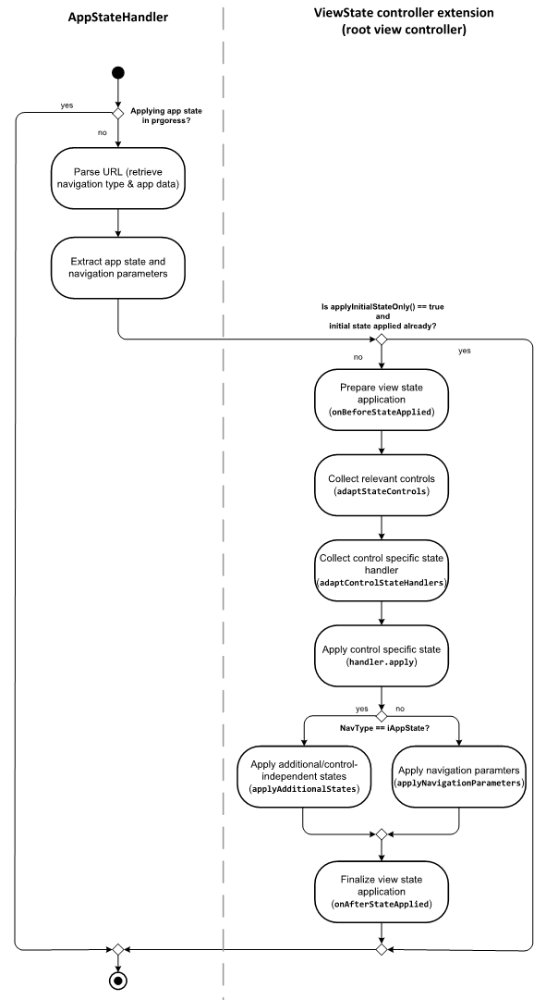

<!-- loio89fa878945294931b15a581a99043005 -->

# Custom State Handling for Extended Apps

You can perform inner app-state handling for custom UI elements.


<a name="loio89fa878945294931b15a581a99043005__section_ipz_xzj_tnb"/>

## Additional Features in SAP Fiori Elements for OData V2

To perform inner app-state handling for custom UI elements, three methods need to be adapted by the relevant implementation:

-   <code><b>onCustomStateChange</b></code>

    Method of the `extensionAPI` of the object page. This method should be called whenever the \(persistable\) state of the custom UI changes. The method does not have any parameters. For more information, see the *API Reference* for [`ExtensionAPI`](https://ui5.sap.com/#/api/sap.suite.ui.generic.template.ObjectPage.extensionAPI.ExtensionAPI) for object page extensions.

-   <code><b>provideCustomStateExtension</b></code>

    Method of the object page controller you need to override if you want to handle custom states.

    An empty java-script object `oState` is passed to this method. The method adds any state information to this object.

    You can add properties to the object. Note that the value of the properties needs to have a predefined structure. This means that the corresponding value for each property has to be an object containing two properties, like this:

    -   First property: data

        The value of this property can be any java-script object. The only restriction is that method `JSON.stringify` must be applicable to this object and the state of the object must be restorable from the result of this operation.

    -   Second property: lifecycle

        The value of this property must be an object specifying the lifecycle of the corresponding state. For more information, see the section Lifecycle below.


-   <code><b>applyCustomStateExtension(oState, bIsSameAsLast)</b></code> 

    Method of the object page controller which must be overridden if you want to perform custom state handling.

    The object `oState` passed to this method contains properties according to the applicable states that have been added to the state object in a suitable `provideCustomStateExtension` call. Note that the value of this property is the value of the corresponding `data` property and the information may have been serialized and deserialized in the meantime.

    The content of the `lifecycle` property is not passed to the `applyCustomStateExtension` method. The lifecycle information determines only which information is passed to the `applyCustomStateExtension` method.

    You have to evaluate the state and apply it to the custom UI elements accordingly.

    > ### Note:  
    > If parameter `bIsSameAsLast` is `truthy`, users reach the page for the same instance they visited the last time. In this case, you do not need to adapt the UI state, since the whole page should still be in the same state as when the users left it.
    > 
    > In draft scenarios, the parameter `bIsSameAsLast` is also `truthy` if the instance that is currently displayed and the instance that was visited previously are semantically the same but differ in their draft status \(for example, one is the active version, the other one the draft\). However, due to technical restrictions, this might fail in some cases \(which means that `bIsSameAsLast` would be `faulty`, although the two instances are semantically identical\).


### Lifecycle

When overriding the `provideCustomStateExtension` method, you need to define the lifecycle attached to the different parts of the state.

The lifecycle object has the following potential properties. Each of them has Boolean values, with standard JavaScript logic for truthful and faulty values.

-   `session`: Setting this property to `true` indicates that the lifecycle of this state should correspond to the whole session.

    The exact definition of a session's lifetime depends on the underlying SAP Fiori launchpad \(FLP\) infrastructure.

    These boundary conditions apply:

    -   The session survives any FLP cross-app navigation.

    -   The session ends when the user closes the browser.


    In particular, the lifetime is sufficient to ensure that the state can be restored after navigating to another SAP Fiori application \(via cross-app navigation\) and returning by back navigation.

    Note that a hash of this information is stored in the URL.

-   `permanent`: Setting this property to `true` indicates that the lifecycle of this state survives the session.

    A hash of the state is stored in the URL. You can store the mapping information needed to resolve the hash to the real state on the front-end server.

    Note that you need to make specific configuration settings to allow this persistence.

    If persistence is enabled, the state is part of the URL, even if the user bookmarks it or sends it with e-mail. Otherwise, it corresponds to the session.

    > ### Note:  
    > Choose this lifecycle only if the corresponding state is also relevant for other user sessions. For example, it is not relevant for a scroll position.

-   `page`: Setting this property to `true` indicates that the state should also be applied when the user navigates to the same page for a different instance.

    Handle this property with care since some time might have passed since the user visited this page for another instance. The user might be surprised to find the page for the new instance in the given state.

-   `pagination`: This property has the same semantics as the `page` property. However, the state is preserved only when you use pagination to change instances . Pagination means that the content of one instance is immediately replaced by another instance on the UI. Typical examples: Using paginator buttons or browsing through different instances in a flexible column layout scenario.


> ### Note:  
> The `session` and `permanent` properties can be used to define a lifecycle that extends the lifetime of the current application. In this case, the state is stored as a hash within the URL. This means that the state can only be recovered if the same URL is called again. This happens if the user navigates to the corresponding page with backward or forward navigation in the history, uses a bookmark, or a URL received by other means, for example, e-mail.

The state information is not available if the user navigates to the same app using normal forward navigation. Example: The user chooses the FLP home button to navigate to the FLP and then selects the tile representing the app a second time.


### Reuse Components

Reuse components may also want to keep a specific state. However, they cannot override the controller's extension functions.

For a reuse component to keep a state, you need to implement the methods `stGetCurrentState(),` and `stApplyState(oState, bIsSameAsLast)`.

Note that the signature of `stGetCurrentState()` differs from the signature of the corresponding extension method `provideCustomStateExtension(oState)`. While `stGetCurrentState()` is only responsible for providing a state object with the structure defined above, `provideCustomStateExtension(oState)` enters the state into a given empty state object.


<a name="loio89fa878945294931b15a581a99043005__section_ew4_5zj_tnb"/>

## Additional Features in SAP Fiori Elements for OData V4

An app state reflects the state of its views. Each view takes care of its own view-state handling - supported by the `ViewState` controller extension. To create an app state, the view state of the app components root view is requested.


### `ViewState` Controller Extension

The `ViewState` controller extension supports the retrieval and utilization of a view state. If a view is to be considered for app-state handling, its controller has to use this extension. You can override the following functions to customize the state of the implementing view \(its controller, respectively\):

-   `adaptControlStateHandler: function(oControl, aControlHandler):`

-   `adaptStateControls: function(aCollectedControls);`

-   `retrieveAdditionalStates: function(mAdditionalStates);`

-   `applyInitialStateOnly: function();`

-   `onBeforeStateApplied: function(aPromises);`

-   `onAfterStateApplied: function(aPromises);`

-   `applyAdditionalStates: function(oViewState, aPromises);`

-   `applyNavigationParameters: function(oNavParameter, aPromises)`


### Execution Plans

The following activity diagram shows the steps taken to retrieve and store an app state:

  

For applying an app state, the following steps are executed:

  


### Adapting the Controller Extension

When a controller makes use of this controller extension, you usually only need to override the `adaptStateControls` method to add the state-relevant controls. If a view contains other views that should benefit from the app state, you can also add those views to the list of collected controls, and the call is propagated to its controller's `ViewState` controller extension.

If required, control-independent view states can be handled via `retrieveAdditionalStates` and `applyAdditionalStates`. The key of a control's state is its local control ID, while keys for additional states can be freely chosen. Therefore, additional states are stored in a deeper level and have a special key \(transparent to the developer\) to prevent key clash with control IDs.

To prevent unwanted side effects during the phase when a new state is applied, you can use the `onBeforeStateApplied` and `onAfterStateApplied` functions, for example to suspend events. Both functions get a list of promises, meant to be extended for asynchronous handling. The controller extension resolves all promises in this list first before proceeding.

You can use the `ViewState` controller extension for custom views as well as custom controls. For supporting additional control states, you can override the `adaptControlStateHandler` to return control-specific retrieve and apply functions.

The control state handler functions must have the following signature:

`retrieve: function(oControl);`

`apply: function(oControl, oControlState, oNavParameters);`

> ### Note:  
> While the first parameter `oControl` is always available, the parameters `oControlState` and `oNavParameters` of the apply function can be null or undefined. Add an according check to the implementation.

The code sample below shows a control state handler object taking care of a `sap.uxap.ObjectPageLayout`:

> ### Sample Code:  
> ```
> {
>   retrieve: function(oOPLayout) {
>     return {
>       selectedSection: oOPLayout.getSelectedSection()
>     };
>   },
>   apply: function(oOPLayout, oControlState, oNavParameters) {
>     oControlState && oOPLayout.setSelectedSection(oControlState.selectedSection);
>   }
> }
> ```


### Overriding the Default `ViewState` Extension

To further extend the already defined `ViewState` controller extension, you must provide a separate controller extension which defines the corresponding overrides, as shown in the sample code below:

> ### Sample Code:  
> ```
> return ControllerExtension.extend("Custom.LRControllerExtension", {
> 	override: {
> 		viewState: {
> 			adaptControlStateHandler: function(oControl, aControlHandlers) {
> 				if (oControl.isA("sap.f.DynamicPage")) {
> 					aControlHandlers.push({
> 						retrieve: function(oControl) {
> 							return {
> 								headerExpanded: oControl.getHeaderExpanded()
> 							};
> 						},
> 						apply: function(oControl, mControlState) {
> 							if ("headerExpanded" in mControlState) {
> 								oControl.setHeaderExpanded(mControlState.headerExpanded);
> 							}
> 						}
> 					});
> 				}
> 			},
> 			adaptStateControls: function(aControls) {
> 				aControls.push(this.getView().byId("My::DynamicePage::Control"));
> 			},
> 			retrieveAdditionalStates: function(mAdditionalStates) {
> 				mAdditionalStates.lastVisit = new Date().toString();
> 			},
> 			applyAdditionalStates: function(mAdditionalStates) {
> 				if (mAdditionalStates.lastVisit) {
> 					MessageToast.show("Applying view state from " + mAdditionalStates.lastVisit);
> 				}
> 			}
> 		}
> 	}
> });
> ```

You must register the controller extension in the manifest as follows:

> ### Sample Code:  
> ```
> {
>     ...
>     "sap.ui5": {
>         "extends": {
>             "extensions": {
>                 "sap.ui.controllerExtensions": {
>                     "sap.fe.templates.ListReport.ListReportController": {
>                         "controllerName": "Custom.LRControllerExtension"
>                     }
>                 }
>             }
>         }
>     },
>     ...
> }
> ```

For a sample implementation, see [https://sapui5.hana.ondemand.com/test-resources/sap/fe/core/fpmExplorer/index.html\#/controllerExtensions/controllerExtensionsOverview/viewState](https://sapui5.hana.ondemand.com/test-resources/sap/fe/core/fpmExplorer/index.html#/controllerExtensions/controllerExtensionsOverview/viewState),


### Triggering an Update of the App State

If you have added custom view state handling, ensure that the overall app state is updated in case the state of the custom control changes. To do so, use the `ExtensionAPI`, which provides the function `updateAppState`.

