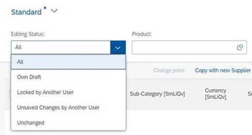

<!-- loio8eb695ac473b4ab0a726e4021ce35cf4 -->

# Disabling the Editing Status Filter

The editing status filter is enabled by default in the list report page of draft enabled applications.

  
  
**Editing status filter**



If required, you can disable this filter for your app. To do so, you can add the following sample code to your annotation file:

> ### Sample Code:  
> XML Annotation
> 
> ```xml
> <AnnotationsTarget="TravelService.EntityContainer/Travel">
>    <AnnotationTerm="Capabilities.NavigationRestrictions">
>       <RecordType="Capabilities.NavigationRestrictionsType">
>          <PropertyValueProperty="RestrictedProperties">
>             <Collection>
>                <RecordType="Capabilities.NavigationPropertyRestriction">
>                   <PropertyValueProperty="NavigationProperty" NavigationPropertyPath="DraftAdministrativeData"/>
>                   <PropertyValueProperty="FilterRestrictions">
>                      <RecordType="Capabilities.FilterRestrictionsType">
>                         <PropertyValueProperty="Filterable" Bool="false"/>
>                      </Record>
>                   </PropertyValue>
>                </Record>
>            </Collection>
>         </PropertyValue>
>       </Record>
>    </Annotation>
> </Annotations>
> ```

> ### Sample Code:  
> CAP CDS Annotation
> 
> ```
> annotate TravelService.Travel with @(
> Capabilities: {
>    NavigationRestrictions : {
>        $Type : 'Capabilities.NavigationRestrictionsType',
>        RestrictedProperties : [
>            {
>                $Type : 'Capabilities.NavigationPropertyRestriction',
>                NavigationProperty : DraftAdministrativeData,
>                FilterRestrictions : {
>                    $Type : 'Capabilities.FilterRestrictionsType',
>                    Filterable : false,
>                },
>            },
>        ],
>    },
> });
> ```

> ### Sample Code:  
> ABAP CDS Annotation
> 
> ```
> No ABAP CDS annotation sample is available. Please use the local XML annotation.
> ```

