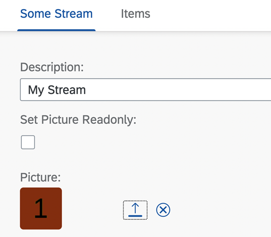
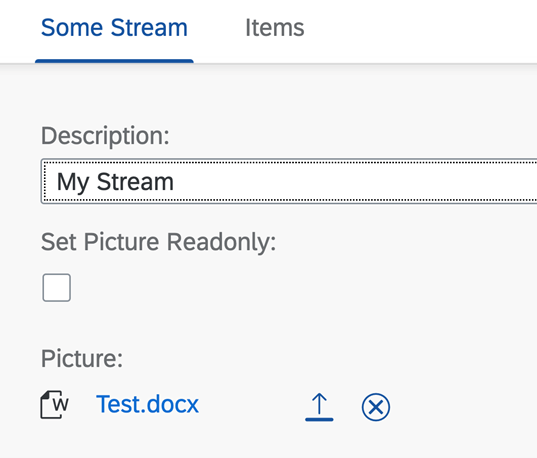
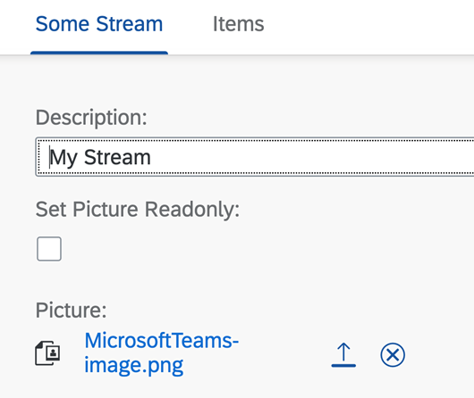
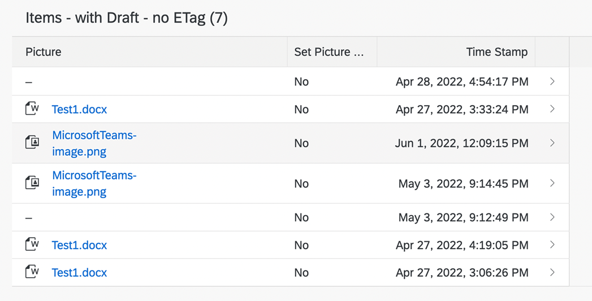
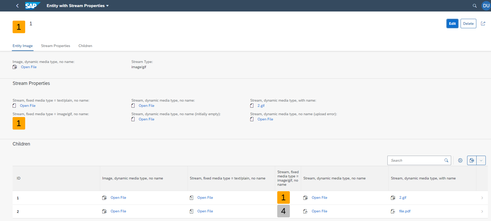

<!-- loiob236d32d48b74304887b3dd5163548c1 -->

# Enabling Stream Support

End users of SAP Fiori elements can upload, download, and delete files.

> ### Note:  
> Application developers must define `@Core.AcceptableMediaTypes`. This avoids security issues by enabling SAP Fiori elements to check for allowed file types. The back-end service framework must ensure a virus scan and other security measures, such as maximum file size limitations and MIME-type restrictions, are in place.


<a name="loiob236d32d48b74304887b3dd5163548c1__section_kqw_x3n_psb"/>

## Additional Features in SAP Fiori Elements for OData V2

You can upload or download different `MediaType` files from an object page using stream support.


### Prerequisites

The `Edm.Stream` type is not supported in SAP Fiori elements for OData V2, so the service must have an entity that is stream enabled:

> ### Sample Code:  
> ```
> 
> <EntityType Name="MyStreamType" m:HasStream="true" sap:label="Stream Test" sap:content-version="1">
>   <Key>
>     <PropertyRef Name="Streamuuid" />
>     <PropertyRef Name="IsActiveEntity" />
>   </Key>
> <Property Name="Edit_ac" Type="Edm.Boolean" sap:label="Dyn. Action Control" sap:creatable="false" sap:updatable="false" sap:sortable="false" sap:filterable="false" />
> 
> ```


### Enabling Stream Support

To make stream support available on the object page, annotate the following in the `UI.FieldGroup` or `UI.Identification` annotation:

> ### Sample Code:  
> ```
> 
> <Record Type="UI.DataField">
>      <PropertyValue Property="Value" Path="$value"/>
> </Record>
> 
> ```

> ### Note:  
> `$value` is a reserved text, and it is used only to support stream.

The following `MediaType` annotation represents the stream type that displays each record. This annotation is mandatory and exists on the entity level.

> ### Sample Code:  
> ```
> <Annotation Term="Org.OData.Core.V1.MediaType" Path="ThisMimeType"></Annotation>
> ```

The following annotation must be set on the `entitylevel` if the stream is displayed as image.

> ### Sample Code:  
> ```
> <Annotation Term="UI.IsImage"/>
> ```

If the entity is annotated with `UI.IsImage`, then both the images and the media files are displayed on the UI as thumbnails.



If the entity is not annotated with `UI.IsImage`, then both the images and the media files are displayed on the UI with icon and hyperlink.





Label for the file uploader is picked from the `dataFiled` annotation.

Based on the `MediaType`, the icon for the non-image media type is shown differently in the UI.

The following annotation must exist on the `entitylevel` to set the text for the file name. If the annotations are not included, the hyperlink displays the text *Open File*.

> ### Sample Code:  
> ```
> 
> <Annotation Term="SAP__core.ContentDisposition">
>     <Record>
>         <PropertyValue Property="Filename" Path="ThisFileName" />
>     </Record>
> </Annotation>
> 
> ```

You can restrict the `MediaType` from being uploaded by using the following annotation:

> ### Sample Code:  
> ```
> <Annotation Term="Core.AcceptableMediaTypes">
>     <Collection>
>         <String>text/plain</String>
>     </Collection>
> </Annotation>
> 
> ```

In the draft apps, you can only upload or delete a stream when the UI is editable. However, in the non-draft apps, the upload and delete is supported only in display mode.

If no file is present, a placeholder is displayed:


> ### Note:  
> An uploaded file cannot be viewed in the list report or the object page table. But that cannot be edited from the table. To upload a file you have to navigate to the corresponding object page. You cannot upload multiple files.
> 
> 


<a name="loiob236d32d48b74304887b3dd5163548c1__section_dn4_zkn_psb"/>

## Additional Features in SAP Fiori Elements for OData V4

App developers can define fields based on `Edm.Stream` properties and add them to forms or tables, for example.

Fields based on `Edm.Stream` have the following features:

-   In display mode the stream content is represented either as a preview \(image\) or as a link to download the file.

    If the field is represented as a download link, it also contains a media-type icon, and the display text for the link is the file name \(for example *1.gif*\), if available. Otherwise the display text is *Open File*.

-   In edit mode there are additional buttons to upload or delete the stream content.


The following image shows an example of a list report from which end users can download a file:


The following image shows an example of an object page in display mode:



The following image shows the object page containing file upload fields in edit mode:


To get the file upload elements, proceed as follows:


### Step 1: Provide a property of type `Edm.Stream`

> ### Sample Code:  
> ```
> <EntityType Name="MainEntities">
>     ...
>     <Property Name="myStreamProperty" Type="Edm.Stream" />
>     <Property Name="myStreamPropertyType" Type="Edm.String" />
>     <Property Name="myRestrictedStreamProperty" Type="Edm.Stream" MaxLength=”100000”/>
>     ...
> </EntityType>
> <Annotations Target="sap.fe.stream.StreamsService.MainEntities/myStreamProperty">
>     <Annotation Term="Core.MediaType" Path="myStreamPropertyType" />
> </Annotations>
> <Annotations Target="sap.fe.stream.StreamsService.MainEntities/myStreamPropertyType">
>     <Annotation Term="Core.IsMediaType" Bool="true" />
> </Annotations>
> <Annotations Target="sap.fe.stream.StreamsService.MainEntities/myRestrictedStreamProperty">
>     <Annotation Term="Core.MediaType" String="text/plain"/>
> <Annotation Term="Core.AcceptableMediaTypes" />
>     <Collection>
>         <String>text/plain</String>
>     </Collection>
> </Annotation>
> </Annotations>
> ```

To restrict the file size, add the attribute `MaxLength` to the `Property`. `MaxLength` is the maximum file size in bytes. To define the allowed media types, use the annotation `Core.AcceptableMediaTypes`. Without these annotations, there is no restriction regarding file size and media types that can be uploaded. App developers must define these restrictions.

> ### Note:  
> The `odata.mediaEditLink` annotation is currently not supported.

For more information, see [https://cap.cloud.sap/docs/guides/providing-services\#annotating-media-elements](https://cap.cloud.sap/docs/guides/providing-services#annotating-media-elements).


### Step 2: Maintain and annotate the UI field as a `DataField`

> ### Sample Code:  
> ```
> <Annotations Target="sap.fe.stream.StreamsService.MainEntities">
>     <Annotation Term="UI.FieldGroup" Qualifier="streams">
>         <Record Type="UI.FieldGroupType">
>             <PropertyValue Property="Label" String="Streams" />
>             <PropertyValue Property="Data">
>                 <Collection>
>                     <Record Type="UI.DataField">
>                         <PropertyValue Property="Label" String="Stream" />
>                         <PropertyValue Property="Value" Path="myStreamProperty" />
>                     </Record>
>                 </Collection>
>             </PropertyValue>
>         </Record>
>     </Annotation>
> </Annotations>
> ```


### UI Representation

The representation of the document icon and the link depend on the `odata.mediaContentType` and `Core.ContentDisposition/Filename` annotations.

– Document Icon –

If the back end returns an `odata.mediaContentType` annotation for the stream property, SAP Fiori elements renders a specific document icon based on the content type. If the back end doesn’t return an `odata.mediaContentType` annotation \(or if the content type can be mapped to a specific document icon\), SAP Fiori elements renders a generic document icon.

– Document Link –

You can click on the document link to open the content of the stream property. SAP Fiori elements distinguishes the following three cases for rendering the document link:

-   The link text shows the file name. Two conditions must be fulfilled:

    -   For the stream property, there’s a `Core.ContentDisposition/Filename` annotation pointing to a non-empty file name that is empty.

    -   The stream property is not empty. This means the back end either returns an `odata.mediaContentType` annotation with a value that is not null, or does not return an `odata.mediaContentType` annotation.


-   The link text is "Open File". Two conditions must be fulfilled:

    -   For the stream property, there’s either no `Core.ContentDisposition/Filename` annotation, or a `Core.ContentDisposition/Filename` annotation pointing to an empty file name.

    -   The stream property is not empty. This means the back end either returns an `odata.mediaContentType` annotation with a value that is not null, or does not return an `odata.mediaContentType` annotation.

-   There’s an empty indicator instead of a link. The following condition must be fulfilled:

    -   The stream property is empty. This means the back end returns an `odata.mediaContentType` annotation with the value null.


> ### Sample Code:  
> XML Annotation
> 
> ```xml
> <Annotations Target="sap.fe.streams.StreamsService.MainEntities/streamWithFilename_content">
>      <Annotation Term="Core.MediaType" Path="streamWithFilename_type"/>
>           <Annotation Term="Core.ContentDisposition">
>                <Record Type="Core.ContentDispositionType">
>                     <PropertyValue Property="Filename" Path="streamWithFilename_name"/>
>                </Record>
>           </Annotation>
>      <Annotation Term="Common.Label" String="Stream, dynamic media type, with name"/>
> </Annotations>
> 
> ```

> ### Sample Code:  
> CAP CDS Annotation
> 
> ```
> @title : 'Stream with file name'
> @Core.MediaType : streamWithFilename_type
> @Core.ContentDisposition.Filename : streamWithFilename_name
>                                     streamWithFilename_content : Stream;
>                                     streamWithFilename_type : MediaType;
>                                     streamWithFilename_name : StreamName;
> ```

– Avatar –

An avatar is rendered instead of the icon and link representation when one of the following two conditions is fulfilled:

-   The `Edm.Stream` property is annotated with `UI.IsImage` which, in turn, is annotated with `Common.IsNaturalPerson`.

-   The `Core.MediaType` annotation starts with 'image/', as in 'image/gif'


– Edit Mode –

In Edit mode, an upload and a delete button are available so that users can upload a different file or delete the file. If the back-end response provides a new value for `odata.mediaContentType` after uploading a new file, the icon and link change their representation according to the new value.

