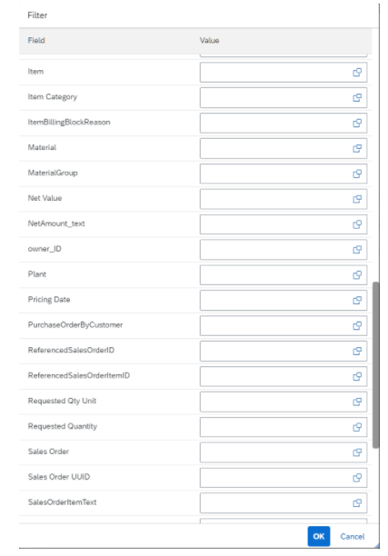
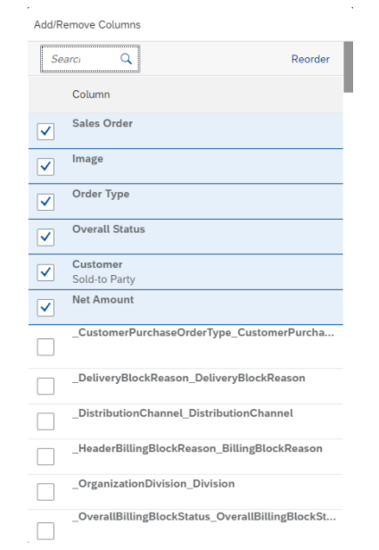

<!-- loio3e2b4d212b66481a829ccef1dc0ca16b -->

# Enabling Table Personalization

You can use table personalization to modify the settings of a table.

Application developers can control the table personalization options that end users see.


<a name="loio3e2b4d212b66481a829ccef1dc0ca16b__section_jpy_ctx_gqb"/>

## Filter Option

By default, filtering is:

-   Disabled in the page-level variant

-   Enabled in the control-level variant


> ### Note:  
> The filter option is available via table personalization settings for responsive tables. For other table types, the filter option, when enabled, is also available after selecting the column header in addition to the personalization settings.


<a name="loio3e2b4d212b66481a829ccef1dc0ca16b__section_a2h_ntx_gqb"/>

## Additional Features in SAP Fiori Elements for OData V2


### Enabling Table Filters

In harmonized variant management, by default, you cannot set a filter in the table personalization settings. To enable filtering, set the `enableTableFilterInPageVariant` property in the manifest. If `smartVariantManagement` is set to `false`, then table filter is enabled by default.

> ### Sample Code:  
> ```
> 
> "sap.ui.generic.app": {
>         "_version": "1.3.0",
>         "settings": {
>         "forceGlobalRefresh": true
>         },
>         "pages": {
>             "ListReport|STTA_C_MP_Product": {
>                 "entitySet": "STTA_C_MP_Product",
>                 "component": {
>                     "name": "sap.suite.ui.generic.template.ListReport",
>                     "list": true,
>                     "settings": {
>                         "smartVariantManagement": true,
>                         "enableTableFilterInPageVariant": true
>                     }
>                 },
> 
> ```


<a name="loio3e2b4d212b66481a829ccef1dc0ca16b__section_hgz_b5x_gqb"/>

## Additional Features in SAP Fiori Elements for OData V4


### Enabling and Disabling Table Personalization

The `"variantManagement"` setting in the manifest allows you to enable or disable the table personalization.

> ### Sample Code:  
> Enable or disable table personalization
> 
> ```
> "BusinessPartnersList": {
>    "type": "Component",
>    "id": "BusinessPartnersList",
>    "name": "sap.fe.templates.ListReport",
>    "options": {
>       "settings": {
>          "contextPath": "/BusinessPartners",
>          "variantManagement": "Control"
>       }
>    }
> },
> 
> ```

In the list report, you can set the variant management to `"Page"` level or to `"Control"` level. On an object page, you can set the variant management to `"Control"` level or to `"None"`.

-   `"Page"` level \(list report\): With this setting, filtering using the table personalization settings is disabled and users can filter the table from the `filterBar`. The filters applied in the `filterBar` can be saved as a page variant.

-   `"None"` \(object page\): With this setting, variant management is disabled.

-   `"Control"` level: With this setting, table personalization is enabled. Four settings are available:

    -   Filtering

        Users can filter table data choosing one or multiple column values \(unless filtering is disabled\). You can use the `@com.sap.vocabularies.UI.v1.HiddenFilter` annotation to exclude those columns you don't want to be filterable.

        

    -   Sorting

        

        You can use the `@.OData.Capabilities.V1.SortRestrictions` annotation to exclude those columns you don’t want to be sortable. You can use the `@.OData.Capabilities.V1.NavigationRestrictions` annotation to exclude navigation properties.

        > ### Note:  
        > Defining sort restrictions is currently only possible for first-level navigation entities.

        You can use `SortRestrictions` to define your desired `RestrictedProperty` in the `NavigationRestrictions`. Use `SortRestrictions` to either restrict all properties of an entity by setting `Sortable` to `false`, or to disable sorting of individual properties using `NonSortableProperties`. To add sort retrictions for navigation properties, the list of `NonSortableProperties` must be prefixed with the `NavigationPropertyPath`.

        > ### Sample Code:  
        > XML Annotation for `SortRestrictions` in `NavigationRestrictions`
        > 
        > ```xml
        > <Annotation Term="Capabilities.NavigationRestrictions">
        >     <Record Type="Capabilities.NavigationRestrictionsType">
        >         <PropertyValue Property="RestrictedProperties">
        >             <Collection>
        >                 <Record Type="Capabilities.NavigationPropertyRestriction">
        >                     <PropertyValue Property="NavigationProperty" NavigationPropertyPath="_OverallSDProcessStatus"/>
        >                     <PropertyValue Property="SortRestrictions">
        >                         <Record Type="Capabilities.SortRestrictionsType">
        >                             <PropertyValue Property="NonSortableProperties">
        >                                 <Collection>
        >                                     <PropertyPath>_OverallSDProcessStatus/OverallSDProcessStatus_Text</PropertyPath>
        >                                 </Collection>
        >                             </PropertyValue>
        >                         </Record>
        >                     </PropertyValue>
        >                 </Record>
        >                 <Record Type="Capabilities.NavigationPropertyRestriction">
        >                     <PropertyValue Property="NavigationProperty" NavigationPropertyPath="_SalesOrderType"/>
        >                     <PropertyValue Property="SortRestrictions">
        >                         <Record Type="Capabilities.SortRestrictionsType">
        >                             <PropertyValue Property="NonSortableProperties">
        >                                 <PropertyValue Property="Sortable" Bool="false"/>
        >                             </PropertyValue>
        >                         </Record>
        >                     </PropertyValue>
        >                 </Record>
        >             </Collection>
        >         </PropertyValue>
        >     </Record>
        > </Annotation>
        > ```

        > ### Sample Code:  
        > ABAP CDS Annotation for `SortRestrictions` 
        > 
        > ```
        > @ObjectModel.sort.enabled: false
        > ```

        > ### Sample Code:  
        > CAP CDS Annotation for `SortRestrictions` in `NavigationRestrictions`
        > 
        > ```
        > NavigationRestrictions : {
        >     RestrictedProperties : [
        >         {
        >             NavigationProperty: _OverallSDProcessStatus,
        >             SortRestrictions: {NonSortableProperties: [_OverallSDProcessStatus.OverallSDProcessStatus_Text]}
        >         },
        >         {
        >             NavigationProperty: _SalesOrderType,
        >             SortRestrictions: {Sortable: false}
        >         }
        >     ]
        > }
        > ```

        > ### Note:  
        > Sorting on navigation properties can currently lead to issues in CAP NodeJS when using an SQLite DB.

    -   Adding or removing columns

        Users can add or remove all properties of the root entity of a given table and its 1:1 navigation entities. Selected properties are shown at the top of the list. For all properties of navigation entities, the name of the navigation entity is shown below the name of the property using a gray font, as shown in the following screenshot:Users can sort tables by choosing individual columns or multiple columns \(unless sorting is disabled\). Users can sort each column in ascending or descending order.

        

    -   Grouping \(available only for analytical tables\)


    By default, the control variant management enables all settings, but you can enable or disable each of these separately using the `"personalization"` setting in the manifest.

    For more information, see [Managing Variants](managing-variants-8ce658e.md) and [Enabling Variant Management on the Object Page](enabling-variant-management-on-the-object-page-f26d42b.md).


### Choosing Personalization Settings

Variant management on control level enables filtering, sorting, adding/removing columns, and grouping by default. Use the `"personalization"` setting in the manifest to change the default behavior.

> ### Sample Code:  
> Using the `"personalization"` setting
> 
> ```
> Users can sort tables by choosing individual columns or"BusinessPartnersList": {
>    "type": "Component",
>    "id": "BusinessPartnersList",
>    "name": "sap.fe.templates.ListReport",
>    "options": {
>       "settings": {
>          "contextPath": "/BusinessPartners",
>          "variantManagement": "Control",
>          "controlConfiguration": {
>             "@com.sap.vocabularies.UI.v1.LineItem": {
>                "tableSettings": {
>                   "type": "AnalyticalTable",
>                   "personalization": {
>    	"column" : true,
>   	 "sort" : false,
>   	 "filter" : true, 
>  	"group": true
>  	}
>                }
>             }
>          }
>       }
>    }
> },
> 
> ```

You can use the following values for the `"personalization"` setting:

-   true \(default\): Every table setting is enabled. If you add a new feature, like grouping, this is enabled as well.

-   false: Every table setting is disabled.

-   object: If you use the value 'object', you must also define the values `"column"`, `"sort"` and `"filter"`. If the table is an analytical table, you can also configure the `"group"`. In this case omitting a setting is treated as false, which prevents apps from getting new features in upcoming releases. You can see this in the sample code above, where the object is used as a value for an analytical table.


> ### Note:  
> -   Sorting, grouping, and filtering applies to the properties visible in a column. For example, for properties with text arrangement set as `#TextFirst`, the property itself or its text can be sorted, grouped, or filtered. For properties with text arrangement set as `#TextOnly`, sorting and grouping applies to the text. .
> 
> -   If a label is defined for a column within the `LineItem`, then the label is used in the Sort, Group, and Filter menus if the column displays a single property. For example, a property with a text annotation `#TextOnly`,
> 
> -   For properties with text arrangement set as `#TextOnly`, if its text is annotated as `UI.Hidden = true`, then the annotation is ignored. This text property can still be sorted and grouped.
> 
> -   If a `sortOrder` is set via a presentation variant on a property with text arrangement set as `#TextOnly`, the sorting is applied on the property and not the text. The sort indicator will not appear in the header column containing the property as the property is not visible on the table. This also applies for the sort and group tabs on the table personalisation dialog.

