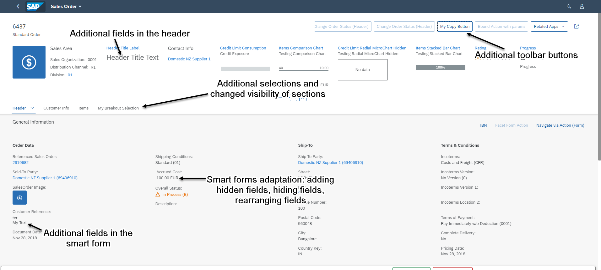

<!-- loio52fc48b479314d0688be24f699778c47 -->

# Extending Delivered Apps Using Adaptation Extensions

You can extend delivered apps based on SAP Fiori elements by using the Visual Editor on SAP Business Application Studio. It allows you to create adaptation projects on top of delivered apps.


## Context

> ### Note:  
> This topic is currently only applicable to SAP Fiori elements for OData V2.

You can implement extension functions as part of a UI adaptation project by using the Visual Editor on SAP Business Application Studio. The adaptation project references the applications delivered by SAP as base or parent applications.

> ### Note:  
> This procedure is relevant only for list reports, object pages, overview pages, and analytical list pages.
> 
> The flexible column layout is not supported by the SAP Business Application Studio.

You can try the adaptation extensions by creating an adaptation projects described in [Extending an SAP Fiori Application](https://help.sap.com/docs/bas/developing-sap-fiori-app-in-sap-business-application-studio/extending-sap-fiori-application).

You can use adaptation extensions for these extension points:

-   List report and analytical list page

    -   Add additional fields to the smart filter bar

    -   Add additional columns to tables

    -   Add additional table toolbar buttons and extension controller logic. For an example, see [Adaptation Extension Example: Adding a Button to the Table Toolbar in the List Report](adaptation-extension-example-adding-a-button-to-the-table-toolbar-in-the-list-report-a269671.md)

           
          
        **Adaptation Extension Options in the List Report**

          

    -   Override extension functions

        -   `onInitSmartFilterBar`

        -   `provideExtensionAppStateData`

        -   `restoreExtensionAppStateData`

        -   `ensureFieldsForSelect`

        -   `addFilters`


    These extension functions can be consumed as a part of `ControllerExtension`, by overriding the `templateBasedExtension` points.

    > ### Sample Code:  
    > Overriding `addFilters` extension function
    > 
    > ```
    > override: {	
    >                   // 	override public method of the ListReport controller 
    >                   templateBaseExtension: {	
    > 				          addFilters: function(fnAddFilter, sControlId){							
    >                               // custom logic
    >                 				}
    > 		}
    > 
    > ```

-   Object page

    -   Toolbar actions

    -   Additional sections

    -   Add additional fields to the header facet

    -   Add additional fields and field groups to forms

           
          
        **Adaptation Extension Options on the Object Page**

          

    -   Override extension functions

        -   `provideExtensionStateData`

        -   `restoreExtensionStateData`

        -   `ensureFieldsForSelect`

        -   `addFilters`


        These extension functions can be consumed as part of the `ControllerExtension`, by overriding the `templateBasedExtension` points.


    > ### Note:  
    > The extension points mentioned in the [API Reference](https://ui5.sap.com/#/api/sap.suite.ui.generic.template.ListReport.controllerFrameworkExtensions%23overview) cannot be consumed as a part of the adaptation project.

-   Overview page

    -   Add additional fields to the smart filter bar

    -   Add global actions to the filter bar

    -   Add additional extension controller logic

    -   Add cards

    -   Clone cards

    -   Edit cards

    -   Override extension functions

        -   `provideExtensionAppStateData`

        -   `restoreExtensionAppStateData`

        -   `addFilters`

        -   `provideStartupExtension`

        -   `provideExtensionNavigation`

        -   `provideCustomActionPress`

        -   `provideCustomParameter`


**Related Information**  


[Details of Extension Functions for Extending Delivered Apps Using Adaptation Extensions](details-of-extension-functions-used-for-extending-delivered-apps-82630e5.md "In this document, you can find the details of all the extension functions that can be used for extending delivered apps using adaptation extensions.")

