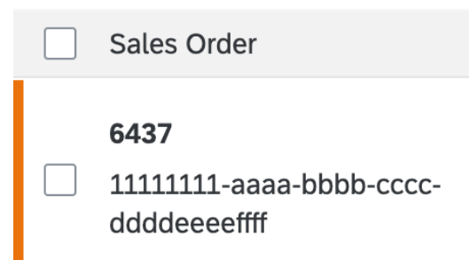

<!-- loioaa2793cd877a4ecebc35d335920ee145 -->

# Handling Semantic Key Fields

Semantic key fields in tables are displayed with a special logic.

You can add the semantic key in the list report tables as shown in the following sample code:

> ### Sample Code:  
> XML Annotation
> 
> ```xml
> <Annotations xmlns="http://docs.oasis-open.org/odata/ns/edm" Target="STTA_PROD_MAN.STTA_C_MP_ProductType">
>     <Annotation Term="Common.SemanticKey">
>         <Collection>
>             <PropertyPath>ProductForEdit</PropertyPath>
>         </Collection>
>     </Annotation>
> </Annotations>
> 
> ```

> ### Sample Code:  
> ABAP CDS Annotation
> 
> ```
> 
> @ObjectModel: {
>   semanticKey: [ 'ProductForEdit' ]
> }
> 
> define view C_MP_PRODUCT {
> 
> }
> ```

> ### Sample Code:  
> CAP CDS Annotation
> 
> ```
> 
> annotate STTA_PROD_MAN.STTA_C_MP_ProductType @(
>   Common.SemanticKey : [ ProductForEdit ]
> );
> ```

> ### Note:  
> This setting is only available for the default `DataField`.

In list reports, semantic key fields are displayed in tables using the following logic:

-   For responsive tables, SAP Fiori elements uses `ObjectIdentifier`. The content in bold is the text followed by the ID in the next line. If there is no text, the ID is shown in bold in the first line. In this case, there will be no second line. The following screenshot shows the use case for both a text and an ID in a responsive table:

    

-   For other tables, SAP Fiori elements uses a label and renders the entire content in bold. SAP Fiori elements also reads the associated text and combines the information in accordance with how the `TextArrangement` is configured. The behavior is as follows:

    -   If no `TextArrangement` is configured, SAP Fiori elements for OData V2 displays the ID along with the text in parenthesis if text is available.If no text is available, we display only the ID.

    -   If no `TextArrangement` is configured, SAP Fiori elements for OData V4 displays only the text. If no text is available, we display only the ID.


    The following screenshot shows the use case for `TextFirst` arrangement in a grid table:

    


> ### Note:  
> In responsive tables, if a semantic object is linked to the field, the `ObjectIdentifier` is not used. Instead, the ID is displayed as a link. In other tables, the entire content \(that is, the ID and the text\) is displayed as a link with no wrapping.


<a name="loioaa2793cd877a4ecebc35d335920ee145__section_pvt_y54_npb"/>

## Additional Features in SAP Fiori Elements for OData V4

The logic for handling semantic key fields is applicable to object pages and subobject pages as well.

**Related Information**  


[Settings for List Report Tables](settings-for-list-report-tables-4c2d17a.md "You can set up various aspects of the list report table through annotations and in the manifest.json file.")

