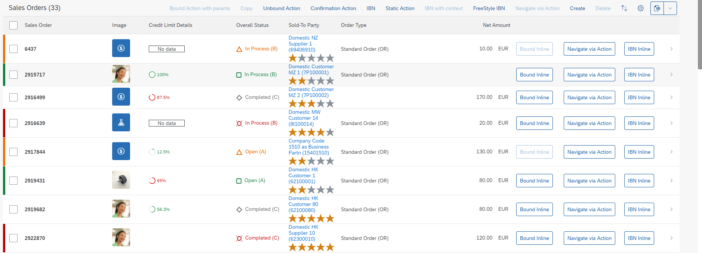

<!-- loio0d501b16e43d45d0a19ae54a3be883d3 -->

# Highlighting Line Items Based on Criticality

You can add semantic highlights to line items in tables, based on their criticality.

The figure below shows an example of this:

  

The property containing the criticality can have the following values \(derived from the complex type `CriticalityType` of the vocabulary `com.sap.vocabularies.UI.v1`\):

-   0 - Neutral

-   1 - Negative \(red\)

-   2 - Critical \(orange\)

-   3 - Positive \(green\)

-   5 - New Item \(blue\): Used to highlight new items which were created outside of the app \(for example, through an API in the back-end, or as a side effect\), and need the user's attention

    > ### Note:  
    > -   By default, SAP Fiori elements assumes that the `DataField` is also marked with "CriticalityRepresentationType/WithIcon" and sets the icon of the `ObjectStatus` appropriately \(for example, for fields marked with "com.sap.vocabularies.UI.v1.CriticalityType/Negative", SAP Fiori elements sets the 'sap-icon://status-negative'\).
    > 
    > -   If the field is marked with "CriticalityRepresentationType/WithoutIcon", then the `` is rendered without the icon.


<a name="loio0d501b16e43d45d0a19ae54a3be883d3__section_k1y_5xx_gqb"/>

## Annotations

Add a `LineItem` criticality annotation for the line items of the entity type that is used by a table, as follows:

> ### Sample Code:  
> ```
>               
> <Annotation Term="UI.LineItem">
>   <Annotation Term="UI.Criticality" Path="Element_transporting_criticality_of_complete_LineItem" />         //LineItem Criticality annotation
>   <Collection>
>     <Record Type="UI.DataField">
>       ...
>     </Record>
>   </Collection>
> </Annotation>
> 
> ```

> ### Sample Code:  
> XML Annotation
> 
> ```xml
> <Annotation Term="UI.LineItem">
>   <Annotation Term="UI.Criticality" Path="Element_transporting_criticality_of_complete_LineItem" />         //LineItem Criticality annotation
>   <Collection>
>     <Record Type="UI.DataField">
>       ...
>     </Record>
>   </Collection>
> </Annotation>
> ```

> ### Sample Code:  
> ABAP CDS Annotation
> 
> ```
> 
> @UI.lineItem: [{criticality: 'Element_transporting_criticality_of_complete_LineItem'}] 
> annotate view VIEWNAME with {
> 
> }
> 
> ```

> ### Sample Code:  
> CAP CDS Annotation
> 
> ```
> 
> UI.LineItem : {
>     $value : [
>         {
>             $Type : 'UI.DataField'
>         },
>     ],
>     ![@UI.Criticality] : Element_transporting_criticality_of_complete_LineItem
> }
> 
> ```

> ### Note:  
> In SAP Fiori elements for OData V2, the field that returns the criticality for analytical tables must be a property and not a dimension.

