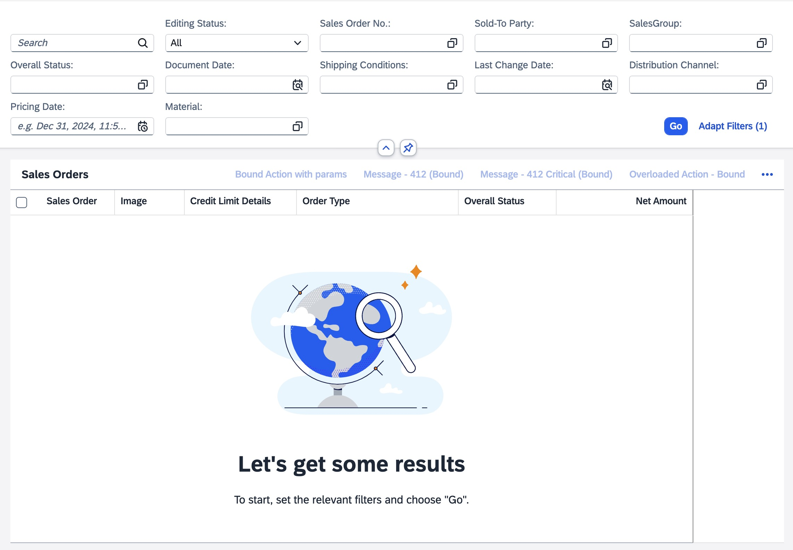

<!-- loiof9925b63da5443afb7d3b50abb932cf2 -->

# Illustrated Message When No Data Is Found

SAP Fiori elements for OData V4 displays an illustrated message when no data is found for a table.

> ### Note:  
> This topic is only applicable to SAP Fiori elements for OData V4.

The illustration, the title of the message and its description depend on the situation in which they are displayed: no items created within the table, applied filters, or search query. You can adapt the description to suit the use case of your application as described in [Maintaining Standard Texts for Tables](maintaining-standard-texts-for-tables-aacfac5.md).

In the list report, the size of the illustrated message adapts to the available space for the table, as shown in the following screenshot:



On the object page, the size of the illustrated message is reduced to keep optimal information density, as shown in the following screenshot:


You can use the manifest setting `useTextForNoDataMessages` to display a text instead of an illustrated message on the object page, as shown in the following code sample:

> ### Sample Code:  
> `manifest.json`
> 
> ```
> "SalesOrderManageObjectPage": {
>     "type": "Component",
>     "id": "SalesOrderManageObjectPage",
>     "name": "sap.fe.templates.ObjectPage",
>     "options": {
>         "settings": {
>             "contextPath": "/SalesOrderManage",
>             "enhanceI18n": "i18n/SalesOrderObjectPage.properties",
>             "variantManagement": "Control",
>             "showRelatedApps": true,
>             "sectionLayout": "Tabs",
>             "useTextForNoDataMessages": true,
>             "controlConfiguration": {
> ...
>             }
>         }
>     }
> },
> ```

This option is applied to all tables within the page.

When using this option, the default texts must be overridden by the application as described in [Maintaining Standard Texts for Tables](maintaining-standard-texts-for-tables-aacfac5.md).


<a name="loiof9925b63da5443afb7d3b50abb932cf2__section_rqr_4qm_vcc"/>

## Adding Actions to an Illustrated Message

You can add additional actions to illustrated messages to guide the end user when no data is displayed within a table. To do so, use the `beforeRebindTable` extension point.

> ### Sample Code:  
> `manifest.json`
> 
> ```
> "targets": {
>     "sample": {
>         "type": "Component",
>         "id": "Default",
>         "name": "sap.fe.templates.ObjectPage",
>         "viewLevel": 1,
>         "options": {
>             "settings": {
>                 "contextPath": "/RootEntity",
>                 "editableHeaderContent": false,
>                 "variantManagement": "Control",
>                 "controlConfiguration": {
>                     "_Child/@com.sap.vocabularies.UI.v1.LineItem": {
>                         "tableSettings": {
>                             "beforeRebindTable": ".extension.sap.fe.core.fpmExplorer.OPExtend.onTableRefresh"
>                         }
>                     }
>                 }
>             }
>         }
>     }
> }
> ```

Within the callback function, you can define the illustrated message to include actions to be proposed to the end user. The illustrated message is applied to the table using the `setNoData` method of the table, as shown in the following sample code:

> ### Sample Code:  
> ```
> sap.ui.define(
>     [
>         "sap/ui/core/mvc/ControllerExtension",
>         "sap/ui/model/Filter",
>         "sap/ui/model/FilterOperator",
>         "sap/m/IllustratedMessage",
>         "sap/m/IllustratedMessageType",
>         "sap/m/Button",
>         "sap/m/MessageToast",
>         "sap/m/IllustratedMessageSize"
>     ],
>     function (
>         ControllerExtension,
>         Filter,
>         FilterOperator,
>         IllustratedMessage,
>         IllustratedMessageType,
>         Button,
>         MessageToast,
>         IllustratedMessageSize
>     ) {
>         "use strict";
> 
>         return ControllerExtension.extend("sap.fe.core.fpmExplorer.OPExtend", {
>             onTableRefresh: function (event) {
>                 var collectionBindingInfoAPI = event.getParameter("collectionBindingInfo");
>                 var table = this.getView().byId("fe::table::_Child::LineItem::Table");
>                 var illustratedMessage = new IllustratedMessage();
>                 var showDialogNoData = function () {
>                     return MessageToast.show("Action when No Data in edit mode");
>                 };
>                 var showDialogFilterSearch = function () {
>                     return MessageToast.show("Action when No Data with filter or search");
>                 };
> 
>                 //Filters or Search applied
>                 if (
>                     (collectionBindingInfoAPI.getFilters() && collectionBindingInfoAPI.getFilters().aFilters.length > 0) ||
>                     collectionBindingInfoAPI.collectionBindingInfo.parameters.$search
>                 ) {
>                     illustratedMessage.setTitle("No Data");
>                     illustratedMessage.setDescription("Change Search or filter criteria.");
>                     illustratedMessage.setIllustrationType(IllustratedMessageType.NoSearchResults);
>                     illustratedMessage.setIllustrationSize(sap.m.IllustratedMessageSize.Dot);
>                     illustratedMessage.addAdditionalContent(new Button({ text: "My Action", press: showDialogFilterSearch }));
>                     table.setNoData(illustratedMessage);
>                 } else {
>                     //No filter or search and table in edit mode
>                     illustratedMessage.setTitle("No Item found");
>                     illustratedMessage.setDescription("Please create some.");
>                     illustratedMessage.setIllustrationType(IllustratedMessageType.NoSearchResults);
>                     illustratedMessage.setIllustrationSize(sap.m.IllustratedMessageSize.Dot);
>                     illustratedMessage.addAdditionalContent(
>                         new Button({ text: "Create New Item", visible: "{ui>/isEditable}", press: showDialogNoData })
>                     );
>                     table.setNoData(illustratedMessage);
>                 }
>             }
>         });
>     }
> );
> ```

Check out our live example in the flexible programming model explorer at [Building Blocks - Table - Table No Data](https://ui5.sap.com/test-resources/sap/fe/core/fpmExplorer/index.html#/buildingBlocks/table/tableNoData).

