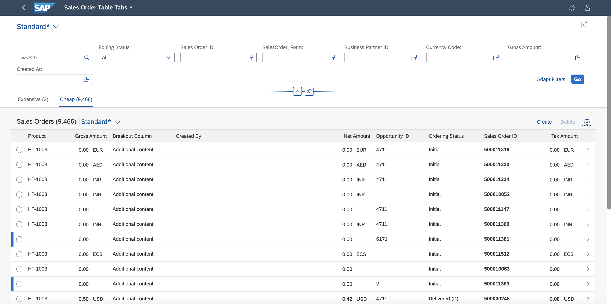
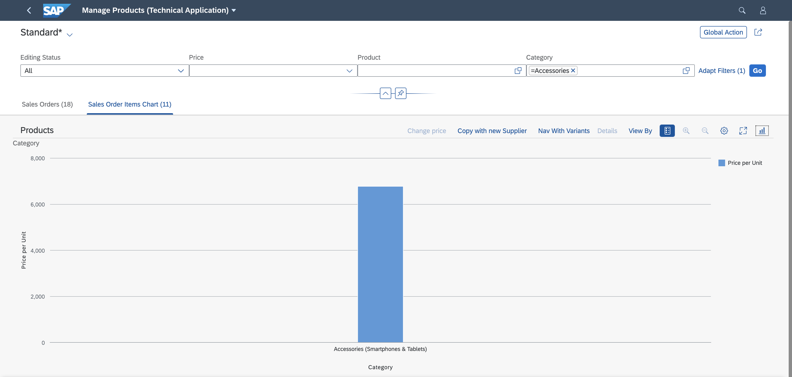

<!-- loioa37df408044e41ef84e67207c8658d4f -->

# Multiple Views on List Report Tables

By default, the list report displays only one table. You can define multiple views of a table, and add a chart, if required.


> ### Note:  
> We've removed videos showing step-by-step procedures using SAP Web IDE, which SAP no longer actively supports. You can still access the video using an older version of this document.

> ### Note:  
> You can define variants for specific selections of data on the user interface, for example, based on filter settings. In the definition dialog, these variants are called views, however, the feature is called variant management. Therefore, for clarity, we use the term variant management in this section.

You have the following options:

-   **A single table for all views \("single table mode"\)**: The UI contains a single table instance, one table toolbar, and \(if activated\) one table variant management. To switch between the views, a segmented button is rendered in the table toolbar. If there are more than three views, a select control is rendered instead of a segmented button.

       
      
    **Single Table Mode**

      

-   **A separate table for each view \("multiple table mode"\)**: If there are n views, the UI contains n table instances. This results in n separate table toolbars and n separate table variant managements. An icon tab bar is rendered above the table for switching between the views \(table instances\). Only the table on the currently selected tab is visible.

       
      
    **Multiple Table Mode**

      


<a name="loioa37df408044e41ef84e67207c8658d4f__section_djj_44x_cmb"/>

## Which Annotations Should I Use?

-   If you only want to describe **which** data should be displayed in a view, you can define a `SelectionVariant` containing filter criteria for the data. See [Defining Multiple Views on a List Report Table - Single Table Mode](defining-multiple-views-on-a-list-report-table-single-table-mode-0d390fe.md).

-   If you also want to describe **how** the data should be displayed \(for example, different sort orders in a table or a different visualization in a table\), you can define a `SelectionPresentationVariant`. Note that you can use this annotation only for multiple table mode and multiple table mode with charts. See [Defining Multiple Views on a List Report Table - Multiple Table Mode](defining-multiple-views-on-a-list-report-table-multiple-table-mode-37aeed7.md).

-   If all you want to do is use a different visualization, you can define a `PresentationVariant`.

-   In multiple table mode, in addition to tables, you can also display charts on specific tab pages.

       
      
    **Multiple Table Mode with Charts**

      


> ### Note:  
> For information about `SelectionVariants`, `PresentationVariants`, and `SelectionPresentationVariants`, see the OData vocabulary at [https://github.com/SAP/odata-vocabularies/blob/main/vocabularies/UI.md](https://github.com/SAP/odata-vocabularies/blob/main/vocabularies/UI.md).


<a name="loioa37df408044e41ef84e67207c8658d4f__section_m4r_vpx_cmb"/>

## Additional Features in SAP Fiori Elements for OData V2

-   Tables are displayed by default.


-   On each tab, you can also display data for different entity sets, for example, a sales order or a supplier. To do so, add the entity set to the corresponding tab in the manifest.

       
      
    **Multiple views on a list report with different entity sets**

      


<a name="loioa37df408044e41ef84e67207c8658d4f__section_kyf_rqb_jqb"/>

## Additional Features in SAP Fiori Elements for OData V4

By default, the icon tab bar for multiple views remains visible while scrolling. You can hide it by setting `stickyMultiTabHeader` to `false`.

Additionally, you can control the visibility of the view by setting the `"visibile"` property, which can be one of the following:

-   a Boolean value

-   a path \(either to a singleton or a specific record\)

-   a binding expression


For more information about the syntax of a binding expression, see [Expression Binding](../04_Essentials/expression-binding-daf6852.md).

Make the settings as shown in the following sample code:

> ### Sample Code:  
> `manifest.json`
> 
> ```json
> "targets": {
>      "DraftList": { 
>           "type": "Component",
>           "id": "DraftList",
>           "name": "sap.fe.templates.ListReport",
>           "options": {
>                "settings": {
>                     "entitySet": "FirstDraft",
>                     "variantManagement": "Control",
>                     "initialLoad": "Enabled",
>                     "stickyMultiTabHeader": false,
>                     "views": {
>                          "paths": [
>                               {
>                                    "key": "tab1",
>                                    "annotationPath": "com.sap.vocabularies.UI.v1.SelectionVariant#One",
>                                    "visible": "{= ${/MySingleton/IsViewAvailable} === true}"
>                               },
>                               {
>                                    "key": "tab2",
>                                    "entitySet": "SecondDraft",
>                                    "annotationPath": "com.sap.vocabularies.UI.v1.SelectionVariant#Two"
>                               }
>                          ]
>                     }
>                }
>                …
>           }
>      }
> }
> …
> ```

You can also define and configure custom views for a list report using a controller extension. For more information, see [Extension Points for Views in the List Report](extension-points-for-views-in-the-list-report-eb37203.md).

**Related Information**  


[Defining Multiple Views on a List Report Table - Single Table Mode](defining-multiple-views-on-a-list-report-table-single-table-mode-0d390fe.md "You can define multiple views of a table and display them in single table mode. Users can switch between views using a segmented button.")

[Defining Multiple Views on a List Report Table - Multiple Table Mode](defining-multiple-views-on-a-list-report-table-multiple-table-mode-37aeed7.md "You can define multiple views of a table and display them in multiple table mode. Users can switch between views using an icon tab bar.")

[Defining Multiple Views on a List Report with Different Entity Sets and Table Settings](defining-multiple-views-on-a-list-report-with-different-entity-sets-and-table-settings-b6b59e4.md "You can configure your app to display data for different entity sets and table settings, for example, sales orders or suppliers.")

[Extension Points for Views in the List Report](extension-points-for-views-in-the-list-report-eb37203.md "You can use extension points to enhance views in the list report in SAP Fiori elements apps.")

