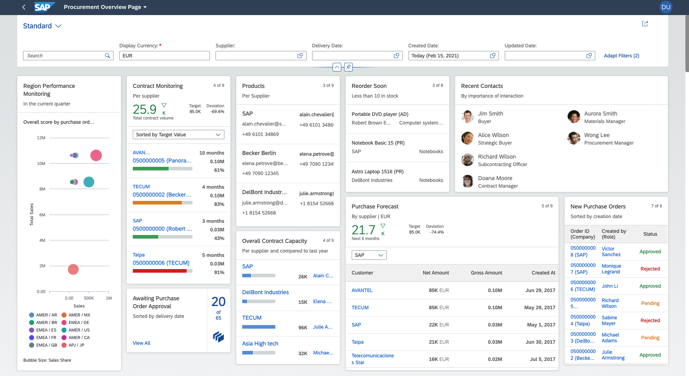

<!-- loioc64ef8c6c65d4effbfd512e9c9aa5044 -->

# Overview Pages

An overview page is a data-driven SAP Fiori application built using SAPUI5 technology, OData services, and annotations for organizing large amounts of information.

Overview pages provide quick access to vital business information at a glance, in the form of visual, actionable cards. The user-friendly experience makes viewing, filtering, and acting upon data quick and simple. Business users can see the big picture at a glance, and also focus on the most important tasks, enabling faster decision making as well as immediate action.

The application lets you create several cards for different types of content that helps in visualizing information in an attractive and efficient way. You can create overview pages and add cards to the page using the overview page wizard in SAP Web IDE.

The displayed data is fully interactive, with clickable areas for easy navigation to relevant applications. Based on SAP Fiori, overview pages organize action items with a fully responsive user interface. Users can access overview pages from SAP Fiori launchpad and narrow down the information displayed, or opt to hide cards to focus on a particular topic.

The overview page application contains the following main components:

-   Application header: Provides a description of the area for which this application provides an overview \(for example, procurement or sales\). From the header area, users can change user account settings and manage cards.

-   Smart filter: Provides application-level filters for changing the level of data displayed in the cards. For example, you could use the filter to display only transactions larger than $10,000, only items lighter than 50kg, and so on. .

-   Cards: A card is a smart component that uses UI annotation to render its content. Each card is bound to a single entity set in a data source. A card may display a donut or bar chart, or a table. Stack cards contain a set of quick view cards, which can be viewed in an object stream. Cards are displayed on the overview page in up to five responsive columns and can be rearranged by dragging and dropping.

Overview page application instances consist of a UI component that extends the overview page application component and a manifest file that contains the application configuration.

> ### Note:  
> When you are using more than one overview page application with the `sap-keep-alive` mode, it is recommended to upgrade the UI5 version to 1.96 or above.

## More Information

For more information about the overview page plugin, see [Building an App](building-an-app-9834a0a.md). 

