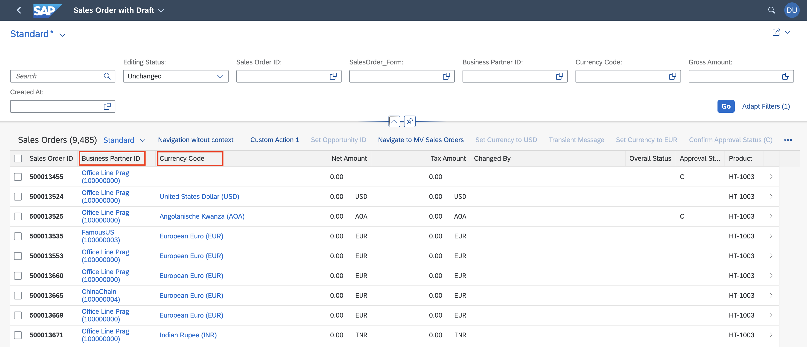

<!-- loioa76525362b754354a85981a7389ca7af -->

# Setting the Default Column Width

You can customize the width of a column defined in a line item via the `com.sap.vocabularies.HTML5.v1.CssDefaults` UI annotation.

SAP Fiori elements automatically calculates the default width of columns containing texts based on the `MaxLength` property of the field defined in the metadata. The lower limit is set to 3 rem and the upper limit is set to 20 rem.

The default width of columns containing different controls/UI elements is as follows:

****


<table>
<tr>
<th valign="top">

Columns with Controls/UI Elements


</th>
<th valign="top">

Default Width


</th>
</tr>
<tr>
<td valign="top">

Images


</td>
<td valign="top">

5 rem


</td>
</tr>
<tr>
<td valign="top">

Rating indicator


</td>
<td valign="top">

6.875 rem


</td>
</tr>
<tr>
<td valign="top">

Progress indicator


</td>
<td valign="top">

6.875 rem


</td>
</tr>
<tr>
<td valign="top">

Charts


</td>
<td valign="top">

20 rem


</td>
</tr>
</table>

-   Using the `CssDefaults` annotation

    The sample code below shows how to set the column width via the `com.sap.vocabularies.HTML5.v1.CssDefaults` annotation.

    ```
    
    			<Annotation Term="UI.LineItem">
                        <Collection>
                           <Record Type="UI.DataFieldWithIntentBasedNavigation">
                              <PropertyValue Property="SemanticObject" String="EPMSalesOrder" />
                              <PropertyValue Property="Action" String="display_sttabupa" />
                              <PropertyValue Property="Value" Path="bp_id" />
                                <Annotation Term="com.sap.vocabularies.HTML5.v1.CssDefaults">
                                    <Record>
                                        <PropertyValue Property="width" String="10rem"/>
                                    </Record>
                              </Annotation>
    
                           </Record>
                           <Record Type="UI.DataField">
                              <PropertyValue Property="Value" Path="currency_code" />
                              <Annotation Term="com.sap.vocabularies.HTML5.v1.CssDefaults">
                                    <Record>
                                        <PropertyValue Property="width" String="15rem"/>
                                    </Record>
                              </Annotation>
    
                           </Record>
                        </Collection>
                     </Annotation>
    ```

    > ### Sample Code:  
    > CAP CDS Annotation
    > 
    > ```
    > LineItem : {
    > 	{
    > 		$Type : 'UI.DataFieldForIntentBasedNavigation',
    > 		SemanticObject : 'EPMSalesOrder',
    > 		Action : 'display_sttabupa',
    > 		Value: 'bp_id',
    > 		Label : 'IBN',
    > 		![@HTML5.CssDefaults] : {width : '10rem'}
    > 	},
    > 	{
    > 		$Type : 'UI.DataField',
    > 		Value : currency_code,
    > 		![@HTML5.CssDefaults] : {width : '15rem'}
    > 	},
    > }
    > 
    > ```

-   Using the `manifest.json` configuration

    You can also configure the width of a column in the manifest:

    > ### Sample Code:  
    > ```
    > "controlConfiguration": {
    > 	"_Item/@com.sap.vocabularies.UI.v1.LineItem": {
    > 		"columns": {
    > 			"DataField::SalesOrderItemCategory": {
    > 				"width": "10em"
    > 			}
    > 		}
    > 	}
    > }
    > 
    > ```

    The column key \(`"DataField::SalesOrderItemCategory"` in our sample code above\) is used to identify the column for which you want to set the width.




> ### Note:  
> -   When the application is rendered in mobile phones, the table column width is adjusted automatically so that the displayed columns can occupy the complete available width.
> 
> -   You can use em, rem, or % \(relative to the table width\) to specify the width of a column using a `CssDefaults` annotation or settings in the `manifest.json`.


<a name="loioa76525362b754354a85981a7389ca7af__section_pgy_jcd_gsb"/>

## More Information

For more information about how to find the right key for a column, see [Finding the Right Key for the Anchor](finding-the-right-key-for-the-anchor-6ffb084.md).

For information about custom columns in list reports and object pages, see [Extension Points for Tables](extension-points-for-tables-d525522.md).

