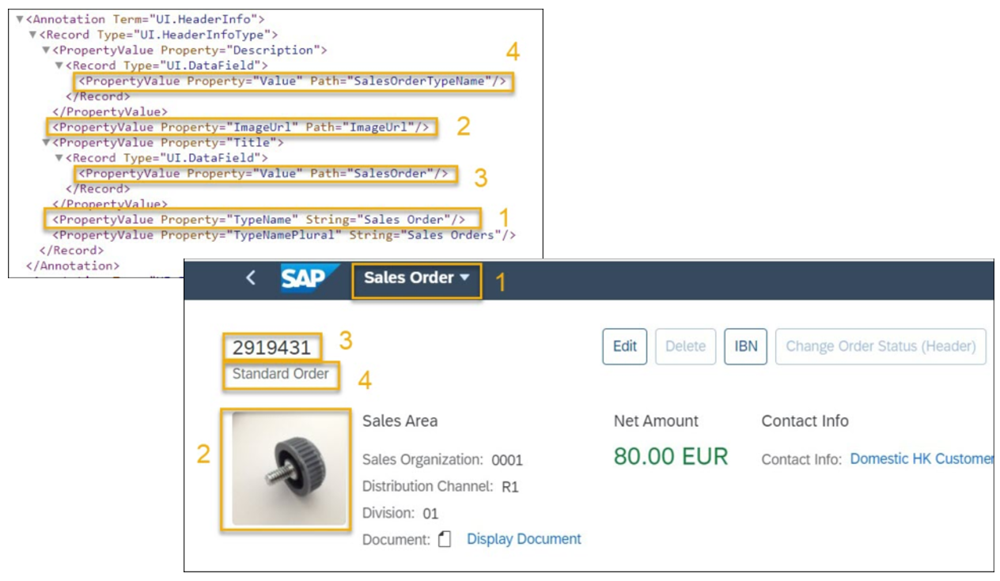

<!-- loiocce93e6f067a4133a8430c4f5d7b8fc7 -->

# Setting Up the Object Page Header

You have various options for defining the object page header.

The object page supports the standard header and the dynamic header. See also [Object Page Headers](../10_More_About_Controls/object-page-headers-d2ef009.md).

The object page header display is determined by the following vocabularies:

-   `com.sap.vocabularies.UI.v1.HeaderInfo/Title/Value` determines the object title.

-   `com.sap.vocabularies.UI.v1.HeaderInfo/Description/Value` determines the subtitle.

-   `com.sap.vocabularies.UI.v1.HeaderInfo/ImageUrl` determines the image.

-   `com.sap.vocabularies.UI.v1.HeaderInfo/TypeName` is used as the text for the link that navigates back to the list report.

-   `com.sap.vocabularies.UI.v1.HeaderInfo/TypeImageUrl` determines the icon.

-   `com.sap.vocabularies.UI.v1.HeaderInfo/Initials` determines the initials


## Main Elements

This figure shows how to set up the following basic elements for your object page header in your annotations:


<table>
<tr>
<th valign="top">

Label in Figure


</th>
<th valign="top">

Element


</th>
</tr>
<tr>
<td valign="top">

*1*


</td>
<td valign="top">

Title \(Object Type\)


</td>
</tr>
<tr>
<td valign="top">

 *2* 


</td>
<td valign="top">

Image of the object instance


</td>
</tr>
<tr>
<td valign="top">

*3*


</td>
<td valign="top">

Language-dependent product text in SAP back-end systems


</td>
</tr>
<tr>
<td valign="top">

*4*


</td>
<td valign="top">

Product title in SAP back-end systems


</td>
</tr>
</table>

  
  
<a name="loiocce93e6f067a4133a8430c4f5d7b8fc7__fig_dfk_44j_55"/>Object Page Header

  


## Sample Code

This sample code is a selectable version of the code shown above for setting up the main elements on the object page header.

> ### Sample Code:  
> XML Annotation
> 
> ```xml
> <Annotation Term="UI.HeaderInfo">
>      <Record Type="UI.HeaderInfoType">
>           <PropertyValue Property="Description">
>                <Record Type="UI.DataField">
>                     <PropertyValue Property="Value" Path="SalesOrderTypeName"/>
>                </Record>
>           </PropertyValue>
>           <PropertyValue Property="ImageUrl" Path="ImageUrl"/>
>           <PropertyValue Property="Title">
>                <Record Type="UI.DataField">
>                     <PropertyValue Property="Value" Path="SalesOrder"/>
>                </Record>
>           </PropertyValue>
>           <PropertyValue Property="TypeName" String="Sales Order"/>
>           <PropertyValue Property="TypeNamePlural" String="Sales Orders"/>
>      </Record>
> </Annotation>
> ```

> ### Sample Code:  
> ABAP CDS Annotation
> 
> ```
> 
> @UI.headerInfo: {
>   typeName: 'Product',
>   typeNamePlural: 'Products',
>   imageUrl: 'PRODUCTPICTUREURL',
>   title: {
>     value: '_PRODUCTTEXTINCURRENTLANG.NAME',
>     type: #STANDARD
>   },
>   description: {
>     value: 'PRODUCT',
>     type: #STANDARD
>   }
> }
> annotate view STTA_C_MP_PRODUCT with {
> 
> }
> ```

> ### Sample Code:  
> CAP CDS Annotation
> 
> ```
> 
> UI.HeaderInfo : {
>     TypeName : 'Product',
>     TypeNamePlural : 'Products',
>     ImageUrl : ProductPictureURL,
>     Title : {
>         $Type : 'UI.DataField',
>         Value : to_ProductTextInCurrentLang.Name
>     },
>     Description : {
>         $Type : 'UI.DataField',
>         Value : Product
>     }
> }
> 
> ```


For information on display options for a object, see [Using Images, Initials, and Icons](using-images-initials-and-icons-5760b63.md).

-   **[Adapting the Object Page Header Title and Description](adapting-the-object-page-header-title-and-description-333f850.md "You can use annotations to adapt the object page header title and
		description.")**  
You can use annotations to adapt the object page header title and description.
-   **[Header Facets](header-facets-17dbd5b.md "You can include various types of header facets in your object page header, for example to display contact data or a rating
        indicator.")**  
You can include various types of header facets in your object page header, for example to display contact data or a rating indicator.
-   **[Enabling Actions in the Object Page Header](enabling-actions-in-the-object-page-header-5fe4396.md "You can enable generic actions in your object header.")**  
You can enable generic actions in your object header.
-   **[Navigation from Header Facet Title](navigation-from-header-facet-title-fa0ca22.md "Applications can configure header facets so that end users can perform both in-page navigation and the navigation to an external
		application.")**  
Applications can configure header facets so that end users can perform both in-page navigation and the navigation to an external application.
-   **[UI Controls in Object Page Header](ui-controls-in-object-page-header-9297054.md "You can use various UI controls within the object page header.")**  
You can use various UI controls within the object page header.
-   **[Toggling the Editability of Header Fields](toggling-the-editability-of-header-fields-c8a9a40.md "You can enable an option to make fields in the object page header editable.")**  
You can enable an option to make fields in the object page header editable.
-   **[Adding Subpages](adding-subpages-5d49e31.md "You can add additional subpages based on the object page template to your app, and, if required, remove them again.")**  
You can add additional subpages based on the object page template to your app, and, if required, remove them again.
-   **[Enabling the Related Apps Button](enabling-the-related-apps-button-8dcfe2e.md "By default, the Related Apps button is disabled on object pages
		created with the object page template. If you want, you can enable this button, which allows
		you to provide a link to any of the semantic object's navigation targets.")**  
By default, the *Related Apps* button is disabled on object pages created with the object page template. If you want, you can enable this button, which allows you to provide a link to any of the semantic object's navigation targets.

