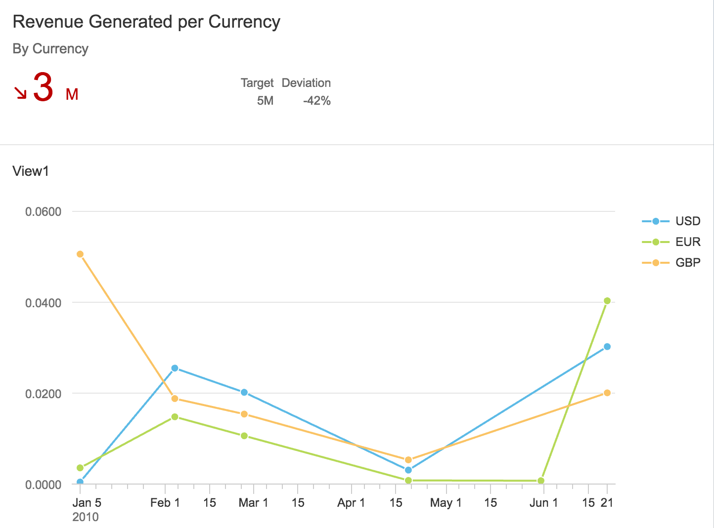

<!-- loio784d317546c54c85b5fc0b2a4dd4e5c6 -->

# Time Series Chart Card

A time series chart contains a time axis instead of a categorical axis.

This chart type represents a time-based dimension that is more responsive to a change in card size. Analytical cards use the time axis automatically if these conditions apply:

-   The chart type must be either vertical bullet, stacked column, scatter, line, bubble, column, waterfall, combination, or dual combination.

-   The chart is configured with only one dimension for bubble, column, waterfall, and combination charts. However, you can use two dimensions for line charts. The second dimension can be the color dimension. The dimension with the `uid` color has to have the **Series** role assigned to it.

-   The data type of the dimension is either `edm.datetime` or `edm.string`. If the data type is `edm.string`, then it needs to have the additional annotation in the OData metadata annotation: `sap:semantics:"year (YYYY) or yearweek (YYYYWW) or yearmonth (YYYYMM) or yearquarter (YYYYQ)"`.
-   If it is a bubble chart, it needs to have two measures. If the chart is a combination chart, it needs to have at least two measures.

-   Vertical bullet, stacked column, and scatter charts need at least one measure and one dimension. Extra color and shape dimensions are suppored only in scatter charts.


> ### Sample Code:  
> Metadata Sample
> 
> ```
> <Property Name="Date" Type="Edm.DateTime" sap:display-format="Date" sap:label="Date" sap:aggregation-role="dimension"/>
> ```


> ### Sample Code:  
> XML Annotation
> 
> ```xml
> <Annotation Term="UI.Chart" Qualifier="Line-Time_-Currency">
>     <Record Type="UI.ChartDefinitionType">
>         <PropertyValue Property="Title" String="View1" />
>         <PropertyValue Property="ChartType" EnumMember="UI.ChartType/Line"/>
>         <PropertyValue Property="MeasureAttributes">
>             <Collection>
>                 <Record Type="UI.ChartMeasureAttributeType">
>                     <PropertyValue Property="Measure" PropertyPath="SalesShare" />
>                     <PropertyValue Property="Role"
>                                    EnumMember="UI.ChartMeasureRoleType/Axis1" />
>                     <PropertyValue Property="DataPoint" AnnotationPath="@UI.DataPoint#Eval_by_CtryCurr_-SalesShare"/>
>                 </Record>
>             </Collection>
>         </PropertyValue>
>         <PropertyValue Property="DimensionAttributes">
>             <Collection>
>                 <Record Type="UI.ChartDimensionAttributeType">
>                     <PropertyValue Property="Dimension" PropertyPath="Date" />
>                     <PropertyValue Property="Role"
>                                    EnumMember="UI.ChartDimensionRoleType/Category" />
>                 </Record>
>                 <Record Type="UI.ChartDimensionAttributeType">
>                     <PropertyValue Property="Dimension" PropertyPath="Sales_CURRENCY"/>
>                     <PropertyValue Property="Role"
>                                    EnumMember="UI.ChartDimensionRoleType/Series"/>
>                 </Record>
>             </Collection>
>         </PropertyValue>
>     </Record>
> </Annotation>
> ```

> ### Sample Code:  
> ABAP CDS Annotation
> 
> ```
> 
> @UI.Chart: [
>   {
>     title: 'View1',
>     chartType: #LINE,
>     measureAttributes: [
>       {
>         measure: 'SalesShare',
>         role: #AXIS_1,
> 		asDataPoint: true
>       }
>     ],
>     dimensionAttributes: [
>       {
>         dimension: 'Date',
>         role: #CATEGORY
>       },
>       {
>         dimension: 'Sales_CURRENCY',
>         role: #SERIES
>       }
>     ],
>     qualifier: 'Line-Time-Currency'
>   }
> ]
> annotate view VIEWNAME with { }
> 
> ```

> ### Sample Code:  
> CAP CDS Annotation
> 
> ```
> 
> UI.Chart #Line-Time-Currency : {
>     $Type : 'UI.ChartDefinitionType',
>     Title : 'View1',
>     ChartType : #Line,
>     MeasureAttributes : [
>         {
>             $Type : 'UI.ChartMeasureAttributeType',
>             Measure : SalesShare,
>             Role : #Axis1,
>             DataPoint : '@UI.DataPoint#Eval_by_CtryCurr-SalesShare'
>         }
>     ],
>     DimensionAttributes : [
>         {
>             $Type : 'UI.ChartDimensionAttributeType',
>             Dimension : Date,
>             Role : #Category
>         },
>         {
>             $Type : 'UI.ChartDimensionAttributeType',
>             Dimension : Sales_CURRENCY,
>             Role : #Series
>         }
>     ]
> }
> 
> ```

  
  
**Example of a Time Series Chart Card**



