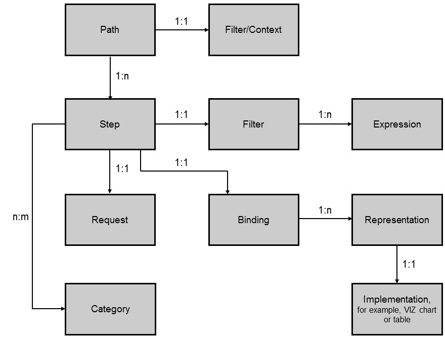

<!-- loiof7da7d53b5c19456e10000000a423f68 -->

# Analysis Path Processing

The main purpose of the core module \(`sap.apf.core`\) is to handle and process analysis paths. A path and its steps are created, accessed, and processed using the APF API. During path processing, the following tasks are executed going through all steps in the order of their positions in the analysis path:

1.  Execute the OData requests of the steps

2.  Supply the representations of the steps with the response data

3.  Notify the application UI using a callback function

In addition, the path logic accumulates filters that are derived from selections made in representations, and applies those filters in subsequent OData requests.

An analysis path contains an ordered sequence of one or more analysis steps.

A step is created using the APF API method <code>createStep(<i class="varname">&lt;id&gt;</i>,<i class="varname">&lt;callback&gt;</i>)</code>. It is inserted at the end of the path. The first method parameter is a unique identifier, which refers to the configuration entity that defines the step. The second parameter supplies a callback function, which is called once after the step has been created and processed.

Path processing is triggered using the APF API method <code>updatePath(<i class="varname">&lt;callback&gt;</i>)</code>. The callback function is called each time after a step has been processed.

## Runtime Objects

The following runtime objects exist:

-   A `step` object consists of a `request` object and a `binding` object.

-   A `request` object defines an OData server request. It creates and processes the OData request, processes the response, and sends the response data to the corresponding step.

-   The `binding` object sends the response data to the selected `representation` object. A `binding` object associates a step with one or more `representation` objects and identifies and handles the `representation` object that is currently selected. The `binding` object also defines how the selected representation translates its selection into a filter object.

-   A `representation` object wraps a chart, a table, or any other representation of data. When the user switches the representation, a different `representation` object is selected and supplied with data.

-   A `filter` object represents the selections made on the charts.

The relation between the objects described above is depicted in the following figure:

   
  
<a name="loiof7da7d53b5c19456e10000000a423f68__fig_v4k_v3x_l4"/>Runtime Objects of a Path

  

## Processing of Runtime Objects

The steps are processed in the order of their positions in the path. The first step is processed first. The filter resulting from the first step is used to process the second step, and so on.

To describe the processing of an analysis path in more details, the following variables are relevant:

<table>
<tr>
<th valign="top">

Variable

</th>
<th valign="top">

Description

</th>
</tr>
<tr>
<td valign="top">

`S_1,..,S_n` 

</td>
<td valign="top">

Path of length n

</td>
</tr>
<tr>
<td valign="top">

`S_i` 

</td>
<td valign="top">

Step

</td>
</tr>
<tr>
<td valign="top">

`R_i` 

</td>
<td valign="top">

Request for step `S_i` 

</td>
</tr>
<tr>
<td valign="top">

`B_i` 

</td>
<td valign="top">

Binding for step `S_i` 

</td>
</tr>
<tr>
<td valign="top">

`RO_i_s` 

</td>
<td valign="top">

Selected representation object for step `S_i` 

</td>
</tr>
<tr>
<td valign="top">

`F_i` 

</td>
<td valign="top">

Filter object associated to step `S_i` 

</td>
</tr>
<tr>
<td valign="top">

`F_0` 

</td>
<td valign="top">

Filter for the entire path. This filter is either empty or it is the filter set by the APF API method `addPathFilter())`. This filter defines the OData filter for request `R_1` of step `S_1`.

</td>
</tr>
</table>

The processing of step `S_i` begins with requesting the filter `F_(i-1)` of the previous step. Note that for step `S_1`, this is filter `F_0`.

Step `S_i` is further processed by sending an OData request `R_i` to the server. The filter expression of request `R_i` is defined by the previous filter `F_(i-1)`.

When request `R_i` returns successfully, it sends its response data to the selected representation object `RO_i_s`. This representation object then creates its own filter based on this data and its own UI selections. This filter can be requested by the subsequent step.

The filter `F_i` is defined as a conjunctive accumulation of the previous filter `F_(i-1)` and the filter defined by the selected representation object `(RO_i_s)`. The filter `F_i` is used for processing step `S_(i+1)`.

Filter F\_0 is defined by URL parameters passed to the application, such as SAPCLIENT, and by filters. In the figure above, F\_0 is represented as the “Filter/Context” object directly associated to the path object.

