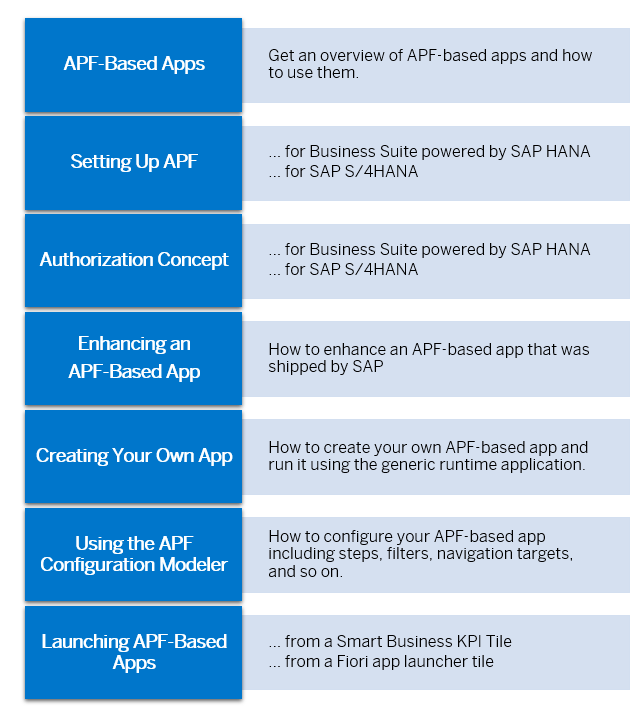
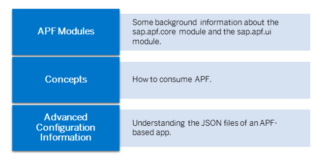

<!-- loio1c457c53595a6655e10000000a423f68 -->

# Developing Apps with Analysis Path Framework \(APF\)

Analysis Path Framework \(APF\) provides reuse components that allow you to build and enhance interactive analytical Web applications.

You can use APF-based applications to explore KPIs and their influencing factors by drilling down into multidimensional representations of data, such as charts or tables.

APF is available with:

-   SAP Business Suite powered by SAP HANA

-   SAP S/4HANA

## Key Features

The key features of APF include the following:

-   APF-based applications:

    -   SAP Fiori applications for a data driven, chart-based drill-down analysis targeted at business users

    -   Step-by-step analysis of data by building analysis paths using a set of preconfigured analysis steps
    -   Select data to filter the information provided in subsequent steps

    -   Save, retrieve, and print analysis paths

    -   Use of OData services to expose the data on the UI. Each step can have its own OData service so that you can define cross-scenarios that use data from different application areas or systems.

    -   Supported data sources for the OData services:

        -   Calculation views

        -   ABAP CDS views
        -   BW OData queries

-   APF Configuration Modeler:

    -   Enables you to create your own APF-based applications in a very quick and easy way and to enhance shipped applications.

    -   Configure an APF-based app without having to code:

        -   Choose from predefined UI elements, such as chart types, tables, and filters. APF takes care of the interaction between these UI elements.

        -   Assign OData services to analysis steps or filters, for example. APF then takes care of the OData request handling, such as when a request is triggered and how it is parameterized.

    -   Execute APF-based applications directly from the APF Configuration Modeler using the generic runtime application provided by APF.

    -   In SAP S/4HANA, the APF Configuration Modeler provides in-app help to get context-sensitive user assistance for individual entry fields.

-   Integration

    -   Integration with SAP Fiori and SAP Smart Business, which allows you to launch APF-based applications from different tiles or other apps, handing over filters and parameters to the APF-based application.
    -   Navigation from APF-based applications to other apps, for example, to view additional information or to take action in a transactional app, handing over filters and parameters of the APF-based application to the target application.

To learn more about APF-based apps and how to configure them, see the following sections:

If you need more technical background information, see the following sections:

-   **[Analytical Applications Based on APF](analytical-applications-based-on-apf-46467c5.md)**  

-   **[Setting Up APF and the APF Configuration Modeler](setting-up-apf-and-the-apf-configuration-modeler-d7b8e9e.md "")**  

-   **[Authorization Concept](authorization-concept-0a9e1a9.md "")**  

-   **[Enhancing an APF-Based Application](enhancing-an-apf-based-application-b247999.md "")**  

-   **[Creating Your Own Application](creating-your-own-application-efbc995.md "")**  

-   **[APF Configuration Modeler](apf-configuration-modeler-b57224b.md "")**  

-   **[Launching APF-Based Applications](launching-apf-based-applications-32a479d.md "")**  

-   **[Data Protection and Privacy](data-protection-and-privacy-36f3943.md "")**  

-   **[APF Modules](apf-modules-4b467c5.md)**  

-   **[Concepts](concepts-50467c5.md)**  

-   **[Configuration Files and Their Structure](configuration-files-and-their-structure-56467c5.md)**  

-   **[API Reference](api-reference-10bf855.md)**  

**Related Information**  

[https://wiki.scn.sap.com/wiki/x/lCe7Gg](https://wiki.scn.sap.com/wiki/x/lCe7Gg)

