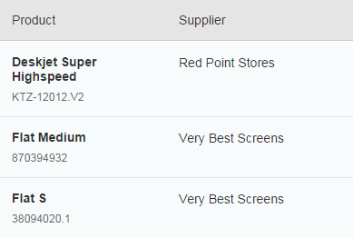

<!-- loio5eb6f63e0cc547d0bdc934d3652fdc9b -->

# Creating Tables

A Table basically consists of columns \(`sap.m.Column`\) and rows. The rows, defines as `sap.m.ColumnListItems` consist of cells.


## Procedure

1.  To build a table, we first need to define columns. For this purpose you can define the Column control with the following properties or aggregations:


    <table>
    <tr>
    <th valign="top">

    Property or Aggregation


    
    </th>
    <th valign="top">

    Description


    
    </th>
    </tr>
    <tr>
    <td valign="top">
    
    **header**


    
    </td>
    <td valign="top">
    
    Defines column header. Any control can be used but most likely **Label** or **Text** control. If any column has header definition then header line gets visible for all columns.


    
    </td>
    </tr>
    <tr>
    <td valign="top">
    
    **footer**


    
    </td>
    <td valign="top">
    
    Any control can be assigned to be displayed in the column footer. If at least one column has a footer definition, then the footer line is displayed for all columns.


    
    </td>
    </tr>
    <tr>
    <td valign="top">
    
    **width**


    
    </td>
    <td valign="top">
    
    Defines the width of the column. If you leave it empty then this column covers the remaining space.


    
    </td>
    </tr>
    <tr>
    <td valign="top">
    
    **hAlign**


    
    </td>
    <td valign="top">
    
    Defines the horizontal alignment\(*Begin*, *Center*, *End*, *Left*, *Right*\) of the column content. Controls with a textAlign property inherit the horizontal alignment from Column hAlign property.


    
    </td>
    </tr>
    <tr>
    <td valign="top">
    
    **vAlign**


    
    </td>
    <td valign="top">
    
    Defines the vertical alignment of column cells. Possible values are *Top*, *Middle*, and *Bottom*. This property does not affect the vertical alignment of header and footer.


    
    </td>
    </tr>
    <tr>
    <td valign="top">
    
    **visible**


    
    </td>
    <td valign="top">
    
    Specifies whether the column is visible. Invisible columns are not rendered.


    
    </td>
    </tr>
    </table>
    
2.  Sure, we have more properties to make it responsive and to change the design of a column, but we will explain this later. Now, let's see how we can define a right aligned column header:

    ```js
    
    <Table>
        <columns>
          <Column
            width="12em">
            <Text text="Product" />
          </Column>
           <Column
            minScreenWidth="Tablet"
            demandPopin="true">
            <Text text="Supplier" />
          </Column>
        </columns>
    </Table>
    ```

3.  To build a Table, you have to define table rows. For this purpose you use `ColumnListItems`. `ColumnListItems` have a cell aggregation \(one to many\) which defines cells in one row according to the column definition. Let's build a real table example to understand it better. Here is the implementation:

    ```js
    
    <Table>
        <columns>
          <Column
            width="12em">
            <Text text="Product" />
          </Column>
           <Column
            minScreenWidth="Tablet"
            demandPopin="true">
            <Text text="Supplier" />
          </Column>
        </columns>
    
    
    <items>
          <ColumnListItem>
            <cells>
              <ObjectIdentifier
                title="{Name}"
                text="{ProductId}"
                class="sapUiTinyMarginTopBottom" />
              <Text
                text="{SupplierName}" />
            </cells>
          </ColumnListItem>
        </items>
      </Table>
    
    ```

    And that is what we have built:

    

    The `mergeFunctionName` property holds the function that the column merge functionality uses to pull the property value to compare for duplicates. The default of `getText` can be used for the most common use cases, where an `sap.m.Label` or `sap.m.Text` control is used, but if you have another control with a different function to pull the comparison property value from, you can specify it as the `mergeFunctionName`. For example, the `sap.m.Icon` control has a `getSrc` getter function that returns the `src` property value - the icon's URI, which is a good candidate for comparison.


## Next Steps

**API References**

-   [sap.m.Column](https://ui5.sap.com/#/api/sap.m.Column)
-   [sap.m.ColumnListItem](https://ui5.sap.com/#/api/sap.m.ColumnListItem)

