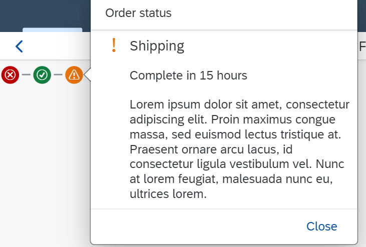

<!-- loio28977b298cb140c0baa681b48314237b -->

# Micro Process Flow

`MicroProcessFlow` is a linear process flow with circular nodes that serve as progress indicators.

For more information about this control, see the [API Reference](https://ui5.sap.com/#/api/sap.suite.ui.commons.MicroProcessFlow) and the [Samples](https://ui5.sap.com/#/entity/sap.suite.ui.commons.MicroProcessFlow) in the Demo Kit.


<a name="loio28977b298cb140c0baa681b48314237b__section_f1k_fd5_qcb"/>

## Overview

The `MicroProcessFlow` control can be used to display the progress of linear workflows, such as order flows, document flows, and approval flows. It can be embedded into tiles, tables, and other types of parent containers.

It is best used for simple linear workflows that include up to seven progress steps. For more complex processes and workflows, consider using the [`ProcessFlow`](process-flow-70307d4.md) control instead.




<a name="loio28977b298cb140c0baa681b48314237b__section_cnq_fd5_qcb"/>

## Details

**Layout and Content**

-   The `MicroProcessFlow` control consists of progress indicator nodes that are laid out horizontally and connected by connector lines.

    -   The nodes can be defined using `MicroProcessFlowItem` controls that are added to the `content` aggregation in the `MicroProcessFlow` control.

    -   The connector line that appears right after each node can be hidden using the `showSeparator` property of the `MicroProcessFlowItem` control that defines this node.

    -   If you want to display additional objects between nodes, you can define them using the `intermediary` aggregation in the `MicroProcessFlowItem` control and use the `showIntermediary` property to make them visible.

        If you enable the `showIntermediary` property without defining the objects, the nodes are separated by red vertical bars.


-   Default nodes use semantic colors that correspond to their `status` property values. Available statuses include: `Standard` \(neutral\), `Error` \(negative\), `Success` \(positive\), and `Warning` \(critical\).

-   To display a custom control instead of a default node, you can use the `customControl` aggregation in the `MicroProcessFlowItem` control defining this node.

    For example, if you want to use a rectangular [status indicator](status-indicator-8d5664a.md) instead of a node, you can add the following to your [view](../03_Get-Started/step-4-xml-views-1409791.md):

    ```xml
    <mvc:View
    ...
    xmlns:si="sap.suite.ui.commons.statusindicator">
    ...
    
    <MicroProcessFlow>
    	<content>
    	...
    		<MicroProcessFlowItem>
    					<customControl>
    				<si:StatusIndicator id="indicator1" width="20px" 
    							height="40px" viewBox="-1 -1 52 102" value="50">
    					<si:ShapeGroup>
    						<si:Rectangle x="0" y="0" width="50" height="100" 
    								  fullAnimationDuration="2000" fillColor="blue" 
    								  strokeWidth="1" animationOnStartup="true" 
    								  fillingType="Linear"/>
    					</si:ShapeGroup>
    				</si:StatusIndicator>
    			</customControl>
    		</MicroProcessFlowItem>
    	...
    	</content>	
    </MicroProcessFlow>
    
    ...
    </mvc:View>
    ```

    For more ideas and examples, see the [Samples](https://ui5.sap.com/#/entity/sap.suite.ui.commons.MicroProcessFlow) in the Demo Kit.


**Click Events**

-   You can specify click events for each of the nodes in the micro process flow using the `press` event.

    For example, to display a [popover](https://ui5.sap.com/#/api/sap.m.Popover) element when the user clicks the node, consider adding the following \(or similar\) code to your [view](../03_Get-Started/step-4-xml-views-1409791.md) and its [controller](../03_Get-Started/step-5-controllers-50579dd.md).

    **View**

    ```xml
    <MicroProcessFlowItem state="Success" press="itemPress">
    	<customData>
    		<core:CustomData key="title" value="Payment"/>
    		<core:CustomData key="icon" value="sap-icon://accept"/>
    		<core:CustomData key="subTitle" value="Payment successful"/>
    	</customData>
    </MicroProcessFlowItem>
    ```

    **Controller**

    ```js
    itemPress: function (oEvent) {
    	var oItem = oEvent.getSource(),
    		aCustomData = oItem.getCustomData(),
    		sTitle = aCustomData[0].getValue(),
    		sIcon = aCustomData[1].getValue(),
    		sSubTitle = aCustomData[2].getValue();
    
    	var oPopover = new sap.m.Popover({
    		contentWidth: "300px",
    		title: "Order status",
    		content: [
    			new sap.m.HBox({
    				items: [
    					new sap.ui.core.Icon({
    						src: sIcon,
    						color: this._getColorByState(oItem)
    					}).addStyleClass("sapUiSmallMarginBegin sapUiSmallMarginEnd"),
    					new sap.m.FlexBox({
    						width: "100%",
    						renderType: "Bare",
    						direction: "Column",
    						items: [new sap.m.Title({
    							level: sap.ui.core.TitleLevel.H1,
    							text: sTitle
    						}), new sap.m.Text({
    							text: sSubTitle
    						}).addStyleClass("sapUiSmallMarginBottom sapUiSmallMarginTop"),
    							new sap.m.Text({
    								text: sDescription
    							})
    						]
    					})
    				]
    			}).addStyleClass("sapUiTinyMargin")
    		],
    		footer: [
    			new sap.m.Toolbar({
    				content: [
    					new sap.m.ToolbarSpacer(),
    					new sap.m.Button({
    						text: "Close",
    						press: function() {
    							oPopover.close();
    						}
    					})]
    			})
    		]
    	});
    
    	oPopover.openBy(oEvent.getParameter("item"));
    }
    ```

    For more ideas and examples, see the [Samples](https://ui5.sap.com/#/entity/sap.suite.ui.commons.MicroProcessFlow) in the Demo Kit.


