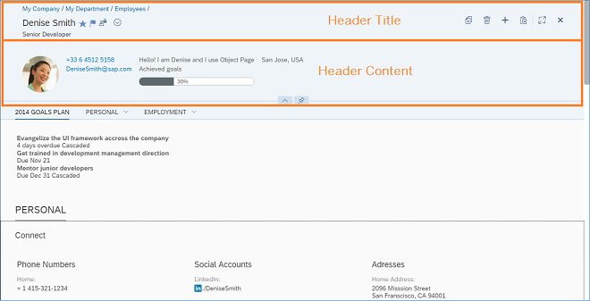

<!-- loiod2ef0099542d44dc868719d908e576d0 -->

# Object Page Headers

The `sap.uxap.ObjectPageLayout` control has two types of header - classic header and dynamic header.

<a name="loiod2ef0099542d44dc868719d908e576d0__section_qj3_tpk_sbb"/>

## Overview

The `sap.uxap.ObjectPageLayout` control implements the snapping header concept. This means that the upper part of the header \(Header Title\) always stays visible, while the lower part \(Header Content\) can scroll out of view.

The common pattern is that the most important information describing the object, such as title, subtitle, and image is in the Header Content area when the header is expanded, and moves to the Header Title area when the header is collapsed \(snapped - its lower part scrolled out of view\).

   
  
<a name="loiod2ef0099542d44dc868719d908e576d0__fig_odn_ypk_sbb"/>`sap.uxap.ObjectPageLayout` header in expanded state

  

The following image shows the collapsed \(snapped\) header is where the Header Content area is scrolled out and not visible, and the main information is visible in the Header Title area.

   
  
<a name="loiod2ef0099542d44dc868719d908e576d0__fig_odw_ypk_sbb"/>`sap.uxap.ObjectPageLayout` Header in Collapsed \(snapped\) State

 
					State") 

<a name="loiod2ef0099542d44dc868719d908e576d0__section_chx_wpk_sbb"/>

## The Classic Header

Up to version 1.52, only `sap.uxap.ObjectPageHeader` could have been used to build up the `sap.uxap.ObjectPageLayout` header.

<table>
<tr>
<th valign="top">

Header area

</th>
<th valign="top">

 `sap.uxap.ObjectPageLayout` aggregation

</th>
<th valign="top">

App must provide:

</th>
</tr>
<tr>
<td valign="top">

Header Title

</td>
<td valign="top">

 `headerTitle` \(0..1\)

</td>
<td valign="top">

An instance of the `sap.uxap.ObjectPageHeader` control

</td>
</tr>
<tr>
<td valign="top">

Header Content

</td>
<td valign="top">

 `headerContent` \(0..n\)

</td>
<td valign="top">

An array of arbitrary controls.

> ### Note:  
> `sap.uxap.ObjectPageHeaderContent` control is used internally to display the controls.

</td>
</tr>
</table>

The app provides an instance of `sap.uxap.ObjectPageHeader` as the value of the `headerTitle` aggregation, and arbitrary controls as the value of the `headerContent` aggregation \(which are internally added to an instance of the `sap.uxap.ObjectPageHeaderContent` control\).

<a name="loiod2ef0099542d44dc868719d908e576d0__section_sxg_s5k_sbb"/>

## The Dynamic Header \(Since Version 1.52\)

As of version 1.52, a new `sap.uxap.ObjectPageDynamicHeaderTitle` control can be used to build a dynamic header for `sap.uxap.ObjectPageLayout`.

<table>
<tr>
<th valign="top">

Header Area

</th>
<th valign="top">

 `sap.uxap.ObjectPageLayout` aggregation

</th>
<th valign="top">

App Must Provide:

</th>
</tr>
<tr>
<td valign="top">

Header Title

</td>
<td valign="top">

 `headerTitle` \(0..1\)

</td>
<td valign="top">

An instance of the `sap.uxap.ObjectPageDynamicHeaderTitle` control

</td>
</tr>
<tr>
<td valign="top">

Header Content

</td>
<td valign="top">

 `headerContent` \(0..n\)

</td>
<td valign="top">

An array of arbitrary controls.

> ### Note:  
> `sap.uxap.ObjectPageDynamicHeaderContent` control is used internally to display the controls.

</td>
</tr>
</table>

Again, the app provides an instance of `sap.uxap.ObjectPageDynamicHeaderTitle` as the value of the `headerTitle` aggregation and a list of controls for the `headerContent` aggregation \(`sap.uxap.ObjectPageLayout` uses internally `sap.uxap.ObjectPageDynamicHeaderContent` to lay out the controls\).

**Related Information**  

[API Reference: `sap.uxap.ObjectPageLayout`](https://ui5.sap.com/#/api/sap.uxap.ObjectPageLayout)

[API Reference: `sap.uxap.ObjectPageHeader`](https://ui5.sap.com/#/api/sap.uxap.sap.uxap.ObjectPageHeader)

[API Reference: `sap.uxap.ObjectPageDynamicHeaderTitle`](https://ui5.sap.com/#/api/sap.uxap.ObjectPageDynamicHeaderTitle)

