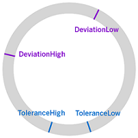

<!-- loiof8b31037ea284ef6a5a85c55762461b2 -->

# Smart Radial Micro Chart

The `sap.ui.comp.smartmicrochart.SmartRadialMicroChart` control creates an `sap.suite.ui.microchart.RadialMicroChart` control based on OData metadata.

For more information about this control, see the [API Reference](https://ui5.sap.com/#/api/sap.ui.comp.smartmicrochart.SmartRadialMicroChart) and the [Samples](https://ui5.sap.com/#/entity/sap.ui.comp.smartmicrochart.SmartRadialMicroChart) in the Demo Kit.

By using the `chartType` property *Donut* of the *UI.Chart* annotation the corresponding `SmartRadialMicroChart` control is rendered. The `entitySet` attribute needs to be specified to use the control. The attribute is used to fetch metadata and annotation information from the given default OData model. Based on this, the RadialMicroChart UI is created. As the other SmartMicroCharts, the `sap.ui.comp.smartmicrochart.SmartRadialMicroChart` control also uses the OData metadata annotations to determine the binding paths and values inside the chart.

> ### Note:  
> The control can also be used directly \(without creating a SmartMicroChart\).


<a name="loiof8b31037ea284ef6a5a85c55762461b2__section_j1r_hp1_mz"/>

## Associated Labels


For information on how the control provides *Title*, *Description* and *UnitOfMeasure* values retrieved from the annotations, see the *Title*, *Description* and *UnitOfMeasure* values in the [Smart Area Micro Chart](smart-area-micro-chart-283cdca.md) documentation.

In addition, the Smart Radial Micro Chart supports a *FreeText* value. This can be annotated by the term [Label](https://wiki.scn.sap.com/wiki/display/EmTech/OData+4.0+Vocabularies+-+SAP+Common). For more information, see the [API Reference](https://ui5.sap.com/#/api/sap.ui.comp.smartmicrochart.SmartRadialMicroChart).


## Binding

The `SmartRadialMicroChart` control should be bound to **one** entity and not to a collection of entities \(entitySet\). It supports both `enableAutoBinding` = ***false*** \(no binding is done inside the control\) and `enableAutoBinding` = ***true*** :

-   If the `chartBindingPath` is provided, the control will be bound relatively to it. For example, the `chartBindingPath` can be a navigation property.

-   If `chartBindingPath` is not provided, the control will be bound absolutely to the entitySet.


> ### Note:  
> If `enableAutoBinding` = ***true*** and `chartBindingPath` is set then the `bindingContext` for the *Title*, *Description*, *UnitOfMeasure* and *FreeText* is set to the value as well.


## Criticality

The color of the chart can be controlled by the *Criticality* property either directly or by criticality calculation. For the `sap.ui.comp.smartmicrochart.SmartRadialMicroChart` control, there are two options for setting the color of the RadialMicroChart by using its `valueColor` property:

-   by setting it directly via the *Criticality* property of the *UI.DataPoint* annotation
-   with the criticality calculation using the *CriticalityCalculation* property of the *UI.DataPoint* annotation

Using the first option, the user can bind the property to a path in the application's model. The criticality is then mapped to a valueColor:

```xml
<PropertyValue Property="Criticality" Path="Criticality"/>
```

The mapping is done as follows:

**Criticality mapped to valueColor**


<table>
<tr>
<th valign="top">

Criticality


</th>
<th valign="top">

ValueColor


</th>
</tr>
<tr>
<td valign="top">

Neutral


</td>
<td valign="top">

Neutral


</td>
</tr>
<tr>
<td valign="top">

Positive


</td>
<td valign="top">

Good


</td>
</tr>
<tr>
<td valign="top">

Critical


</td>
<td valign="top">

Critical


</td>
</tr>
<tr>
<td valign="top">

Negative


</td>
<td valign="top">

Error


</td>
</tr>
</table>

In the second option, the criticality can be calculated using customer-defined thresholds.

  

> ### Note:  
> The thresholds are not renderd in SmartRadialMicroChart.

**Thresholds**


<table>
<tr>
<th valign="top">

Property


</th>
<th valign="top">

Type


</th>
<th valign="top">

Sample Values


</th>
</tr>
<tr>
<td valign="top">

DeviationLowValue


</td>
<td valign="top">

Negative


</td>
<td valign="top">

10


</td>
</tr>
<tr>
<td valign="top">

ToleranceLowValue


</td>
<td valign="top">

Critical


</td>
<td valign="top">

45


</td>
</tr>
<tr>
<td valign="top">

ToleranceHighValue


</td>
<td valign="top">

Critical


</td>
<td valign="top">

55


</td>
</tr>
<tr>
<td valign="top">

DeviationHighValue


</td>
<td valign="top">

Negative


</td>
<td valign="top">

80


</td>
</tr>
</table>

With the `ImprovementDirection` property the thresholds can determine the `valueColor`. For `sap.ui.comp.smartmicrochart.SmartRadialMicroChart` the *Maximize* and *Minimize* directions are supported:

-   **ImprovementDirection: Maximize**

    With the Maximize direction, it is calculated the higher the value the more the circle color trends to green or the more positive is its status. Depending on the relevant thresholds \(`DeviationLowValue` and `ToleranceLowValue`\), there are appropriate certain points where the color changes. Reflecting the sample data above, values lower than 10 will be shown in red color, values lower than 45 but higher than 10 are displayed in orange color and all values bigger than 45 are shown in green color.

      

-   **ImprovementDirection: Minimize**

    With theMinimize direction, it is calculated the lower the value the more the circle color trends to green or the higher the value the more negative is its status. This direction uses the `ToleranceHighValue` and `DeviationHighValue` thresholds. Reflecting the sample data above, values higher than 80 will be shown in red color, values lower than 80 but higher than 55 are displayed in orange color and all values lower than 55 are shown in green color.

      


