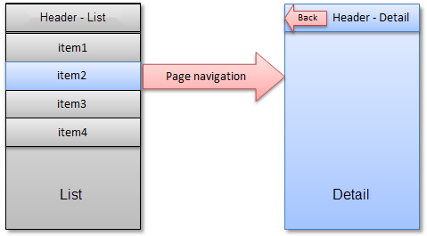

<!-- loioeedfe79e4c19462eafe8780aeab16a3c -->

# Split App

You can use the `sap.m.SplitApp` control to ensure that your UI automatically adapts to the size available on the respective device.

As tablets such as iPad or Google Nexus7 provide more space compared to smartphones, porting existing mobile apps to tablets leads to a lot of unused space.

A common pattern to address this is called list-detail, and is often used in native iOS and Android development. Good examples are the native *Settings* and *E-Mail* applications of iOS and Android tablets. This pattern can be used with the `SplitApp` control.

The figure shows the basic idea of the pattern. The app is divided into two views, the list and the detail view. The list view presents a list of items and is used as the main navigation within the application. The detail view shows detail information for the selected item.

  

Whereas the selection of an item on a mobile devices navigates the user to the detail page, the user can see the list of items and the detail view at the same time on a tablet device.

If the tablet device is used in portrait mode it has less available width space. For this, the `SplitApp` control provides three different modes for displaying the list and detail view in portrait mode:

-   **ShowHideMode**

    This is the default mode. This mode hides the list view automatically when the user turns the device into portrait mode. To display the list view, the user swipes right on the detail view or uses the button which is placed on the header of the detail view.

    The List view slides in from the left hand side. The user can choose another list item which will update the detail view and automatically hides the list view again.

-   **PopoverMode**

    This mode places the list view inside a popover which can be opened via the button in the header of the detail view.

-   **StretchCompressMode**

    This mode displays the list view in both, the portrait and the landscape mode. In portrait mode, the detail view has less space available.

In landscape mode, all three modes described above display the list view.

If you run a `SplitApp` on a mobile device, it automatically behaves like a standard mobile application. The following figure shows the difference:

  

As only one page per screen can be displayed, the list and detail view are automatically displayed on separate pages and the standard page navigation is applied.

