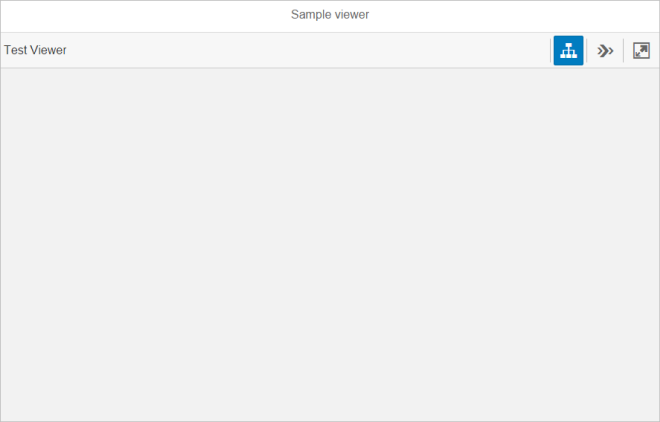
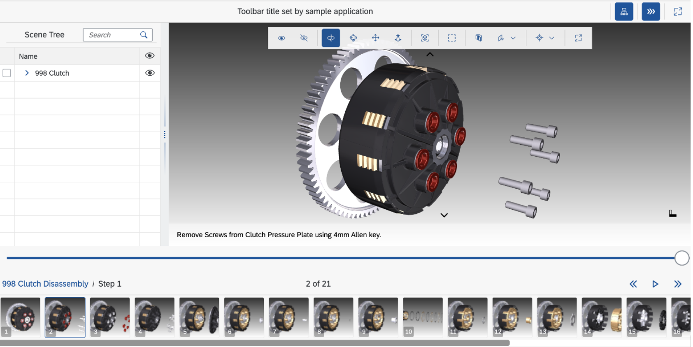

<!-- loio7f7d55d9f29a43fb8bd782c86998a47d -->

# Viewer

This control is intended to help application developers include simple 3D visualisation capability in their application by connecting, configuring and presenting the essential Visualisation Toolkit controls as a single composite control.

<a name="loio7f7d55d9f29a43fb8bd782c86998a47d__section_ehp_gx1_qz"/>

## API Reference / Sample

Here's where you can find the Viewer control in the Demo Kit:

-   [`sap.ui.vk.Viewer`](https://ui5.sap.com/#/api/sap.ui.vk.Viewer)
-   [3D Viewer - Step 1 - 3D Viewer With Single File Loading](https://ui5.sap.com/#/entity/sap.ui.vk.tutorial.VIT/sample/sap.ui.vk.tutorial.VIT.01)
-   [3D Viewer - Step 2 - 3D Viewer With Multiple File Loading](https://ui5.sap.com/#/entity/sap.ui.vk.tutorial.VIT/sample/sap.ui.vk.tutorial.VIT.02)

## Overview

The Viewer \(`sap.ui.vk.Viewer`\) control is intended to help application developers include simple 3D visualisation capability in their application by connecting, configuring and presenting the essential Visual Interaction toolkit \(`sap.ui.vk`\) controls into a single, composite control.

Most applications require the simplest possible visualisation capability, which includes the loading of a single file into the application, and the initialisation of a 3D Viewport. Consumers of such an application also expect to be able to pan, zoom, or rotate \(if applicable\) the scene, as well as receive visual cues when they select an object in the 3D Viewport. The Viewer control aims to make it as easy as possible for an application developer to include 3D visualisation capability by connecting, configuring and presenting some of the core Visual Interaction toolkit controls into a single, composite control.

## Prerequisites

You must be able to create or obtain files in the SAP VDS \(`.vds`\) format to be able to display them in the Viewer.

## Details / Features

### Default Layout

The following figure shows the default Viewer layout after it is initialized:

The following figure shows the Viewer layout with a file loaded and all available controls enabled and visible:

### Enabling or Disabling Features

By default, instances of the Toolbar, Scene Tree, and View Gallery controls are created after a Viewer is initialized. You can change the following Viewer properties so that instances of these features are not created/dislayed:

-   `enableSceneTree`
-   `enableStepNavigation`
-   `enableToolbar`

'Disabling' the Toolbar resulst in no Toolbar being shown in the application.

If the Toolbar feature is enabled, 'disabling' the Scene Tree or View Gallery feature will result in their respective toolbar buttons being inactive \(grayed out\).

## Constraints

The following restrictions apply:

-   The Viewer control is only capable of loading the SAP VDS file \(`.vds`\) format and limited image formats supported by browsers.
-   The Viewer control is designed for simple consumption scenarios. If an application demands more control of the elements in the Viewer or extended functionality, then the developer may need to compose their own 'Viewer' from the various Visual Interaction toolkit controls.

**Related Information**  

[Step 1: 3D Viewer With Single File Loading](../03_Get-Started/step-1-3d-viewer-with-single-file-loading-0e21912.md "In this step, you will be creating a 3D Viewer application that allows a user to load a single 2D image or 3D model that is stored locally or remotely.")

[Step 2: 3D Viewer With Multiple File Loading](../03_Get-Started/step-2-3d-viewer-with-multiple-file-loading-80b0b57.md "In this step, you will be creating a Viewer application that allows a user to load multiple 3D resources stored locally.")

